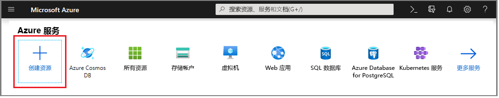
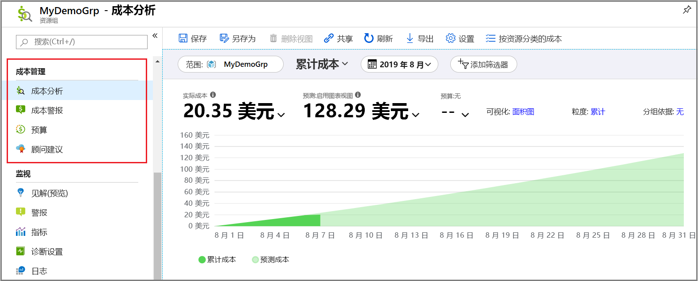
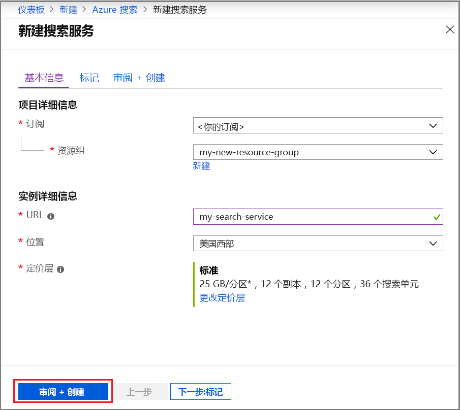
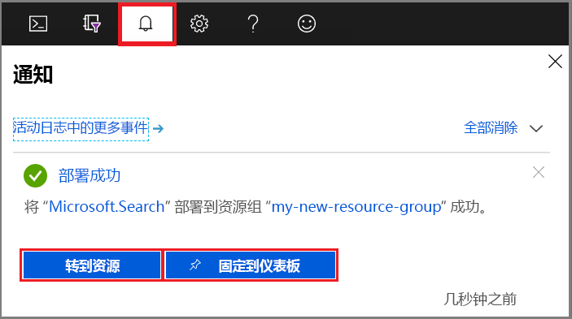
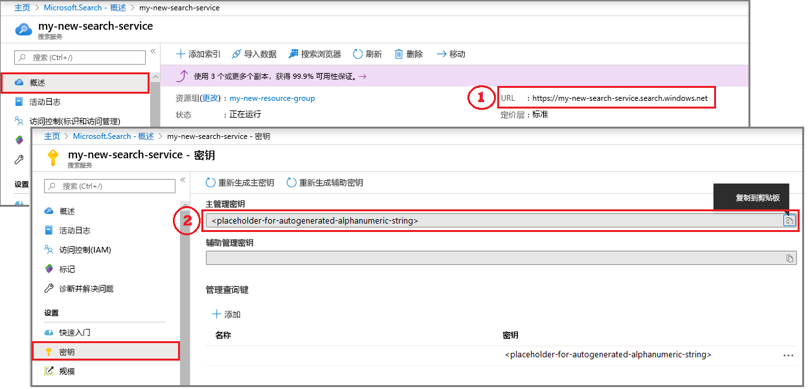

# 在门户中创建 Azure 搜索服务

Azure 搜索是用于在自定义应用中插入搜索体验的独立资源。 虽然 Azure 搜索可以与其他 Azure 服务轻松集成，但它也可以作为单独的组件使用，或与网络服务器上的应用或在其他云平台上运行的软件集成。

本文介绍如何在 [Azure 门户](https://portal.azure.com/)中创建 Azure 搜索资源。

更喜欢 PowerShell？ 使用 Azure 资源管理器[服务模板](https://azure.microsoft.com/resources/templates/101-azure-search-create/)。 有关如何入门的帮助，请参阅[使用 PowerShell 管理 Azure 搜索](search-manage-powershell.md)。

## 订阅（免费或付费）

[打开免费的 Azure 帐户](https://azure.microsoft.com/pricing/free-trial/?WT.mc_id=A261C142F)并使用免费信用额度试用付费 Azure 服务。 信用额度用完后，请保留帐户并继续使用免费的 Azure 服务，如网站。 除非显式更改设置并要求付费，否则不会对信用卡收取任何费用。

还可以[激活 MSDN 订户权益](https://azure.microsoft.com/pricing/member-offers/msdn-benefits-details/?WT.mc_id=A261C142F)。 MSDN 订阅每月提供可用来试用付费版 Azure 服务的信用额度。 

## 查找 Azure 搜索

1. 登录到 [Azure 门户](https://portal.azure.com/)。
2. 单击左上角的加号（“+ 创建资源”）。
3. 使用搜索栏查找“Azure 搜索”，或通过“Web” > “Azure 搜索”导航到资源   。

## 选择一个订阅

如果有多个订阅，则选择一个同样具有数据或文件存储服务的订阅。 Azure 搜索可以自动检测 Azure 表和 Blob 存储、SQL 数据库和 Azure Cosmos DB，以通过[*索引器*](search-indexer-overview.md)编制索引，但仅限于同一订阅中的服务。

## 设置资源组

资源组是必需的，它用于全方面地管理所有资源，包括成本管理。 一个资源组可以包含一个服务，也可以包含同时使用的多个服务。 例如，如果使用 Azure 搜索为 Azure Cosmos DB 数据库编制索引，则可以将这两个服务纳入同一个资源组进行管理。 

若不将资源合并到单个组中，或现有资源组中包含的资源用于不相关的解决方案，请新建一个仅用于 Azure 搜索资源的资源组。 

使用该服务时，可以跟踪当前成本和预计的汇总成本（如屏幕截图中所示），或者向下滚动以查看各个资源的费用。

> [!TIP]
> 删除资源组也会删除其中的服务。 对于使用多个服务项目的原型，将它们放在同一资源组中可在项目结束后更加轻松地进行清理。

## 为服务命名

在“实例详细信息”中的“URL”字段内提供服务名称。  该名称是 URL 终结点的一部分，API 调用针对此终结点发出：`https://your-service-name.search.windows.net`。 例如，如果希望终结点为 `https://myservice.search.windows.net`，则输入 `myservice`。

服务名称要求：

* 它必须在 search.windows.net 命名空间中唯一
* 2 到 60 个字符长度
* 使用小写字母、数字或短划线（“-”）
* 前两个字符或最后一个字符不能为短划线（“-”）
* 任何位置都不能有连续的短划线（“--”）

> [!TIP]
> 如果你认为今后会用到多个服务，我们建议根据命名约定在服务名称中包含区域（或位置）。 同一区域中的服务可以免费交换数据，因此，如果 Azure 搜索位于美国西部，而你在美国西部还有其他服务，则在决定如何合并或附加资源时，使用类似于 `mysearchservice-westus` 的名称就无需导航到属性页。

## 选择位置

作为 Azure 服务，Azure 搜索可托管在世界各地的数据中心中。 支持的区域列表可在[定价页](https://azure.microsoft.com/pricing/details/search/)中找到。 

为多个服务选择同一位置可以最大程度地减少或避免带宽费用。 例如，在为另一 Azure 服务（Azure 存储、Azure Cosmos DB、Azure SQL 数据库）提供的数据编制索引时，在同一区域中创建 Azure 搜索服务可以避免带宽费用（当服务位于同一区域时，出站数据不会产生费用）。

此外，如果你使用的是认知搜索 AI 扩充，请在认知服务资源所在的区域中创建服务。 *将 Azure 搜索和认知服务归置在同一区域中是 AI 扩充的必要条件*。

> [!Note]
> 印度中部目前无法提供新服务。 对于已在印度中部的服务，你可以无限制地纵向扩展，并且你的服务在该区域是完全受支持的。 对此区域的限制是临时的，仅限于新服务。 如果该限制不再适用，我们将删除此说明。

## 选择定价层 (SKU)

[Azure 搜索当前以多个定价层提供](https://azure.microsoft.com/pricing/details/search/)：免费、基本或标准。 每个层都有自己的[容量和限制](search-limits-quotas-capacity.md)。 有关相关指南，请参阅[选择定价层或 SKU](search-sku-tier.md)。

“基本”和“标准”是生产工作负荷的最常用选项，但大多数客户会从“免费”服务开始。 各个层之间的主要差别在于分区大小和速度，以及可创建的对象数限制。

请记住，创建服务后无法更改定价层。 如果以后需要更高或较低的层，则需要重新创建该服务。

## 创建服务

提供所需的输入后，继续创建服务。 

服务将在几分钟内部署，你可以通过 Azure 通知对其进行监视。 考虑将该服务固定到仪表板，以方便将来访问。

## 获取密钥和 URL 终结点。

除非使用门户访问新服务，否则以编程方式访问新服务需要提供 URL 终结点和身份验证 API 密钥。

1. 在服务概览页的右侧找到并复制 URL 终结点。

2. 在左侧导航窗格中，选择“密钥”  ，然后复制任一管理员密钥（它们是相同的）。 在服务上创建、更新和删除对象需要管理员 API 密钥。

   

基于门户的任务不需终结点和密钥。 门户已链接到具有管理员权限的 Azure 搜索资源。 有关门户演练，请从[快速入门：在门户中创建 Azure 搜索索引](search-get-started-portal.md)入手。

## 扩展服务

预配服务后，可以对其进行扩展以满足需求。 如果为 Azure 搜索服务选择了“标准”层，则可以采用两个维度扩展服务：副本和分区。 如果已选择基本层，仅可以添加副本。 如果预配了免费服务，则扩展不可用。

***分区***允许服务存储和搜索更多文档。

***副本***允许服务处理负载更高的搜索查询。

添加资源会增加每月账单费用。 可以通过[定价计算器](https://azure.microsoft.com/pricing/calculator/)来了解添加资源对账单明细的影响。 请记住，可以根据负载来调整资源。 例如，可以通过增加资源来创建完整的初始索引，在以后再将资源减少到与增量索引编制相适应的某个程度。

> [!Important]
> 一个服务必须具有[2 个用于只读 SLA 的副本和 3 个用于读/写 SLA 的副本](https://azure.microsoft.com/support/legal/sla/search/v1_0/)。

1. 在 Azure 门户中转到“搜索服务”页。
2. 在左侧导航窗格中，选择“设置”   > “缩放”  。
3. 使用滑块添加任一类型的资源。

> [!Note]
> 所在的层级越高，每个分区的存储大小和速度就越高。 有关详细信息，请参阅[容量和限制](search-limits-quotas-capacity.md)。

## 何时添加第二个服务

大多数客户只使用定价层上预配的一个服务，以提供[适当的资源平衡](search-sku-tier.md)。 一个服务可以托管多个索引（但受制于[所选层的最大限制](search-capacity-planning.md)），各索引之间相互隔离。 在 Azure 搜索中，请求只能定向到一个索引，从而将从同一服务中的其他索引意外或故意检索数据的可能性降至最低。

尽管大多数客户只使用一个服务，但若有以下操作要求，则可能需要提供服务冗余：

* 灾难恢复（数据中心服务中断）。 Azure 搜索在发生服务中断时不提供即时故障转移。 请参阅[服务管理](search-manage.md)获取相关建议和指南。
* 通过调查多租户建模，确定附加服务是最佳设计。 有关详细信息，请参阅[多租户设计](search-modeling-multitenant-saas-applications.md)。
* 对于在全球部署的应用程序，可能需要在多个区域运行 Azure 搜索实例，以尽量减少应用程序国际流量的延迟。

> [!NOTE]
> 在 Azure 搜索中，无法分离索引操作和查询操作；因此永远无需为分离的工作负荷创建多个服务。 查询索引时，始终是在创建该索引时所在的服务中查询（不能在一个服务中创建索引，然后将其复制到另一个服务）。

无需为实现高可用性添加第二个服务。 在同一服务中使用 2 个或更多个副本，便可实现查询的高可用性。 副本更新是连续的，这意味着当服务更新推出时，至少有一个副本能正常工作。有关运行时间的详细信息，请参阅[服务级别协议](https://azure.microsoft.com/support/legal/sla/search/v1_0/)。

## 后续步骤

预配 Azure 搜索服务后，可以继续在门户中创建第一个索引。

> [!div class="nextstepaction"]
> [快速入门：在门户中创建 Azure 搜索索引](search-get-started-portal.md)
