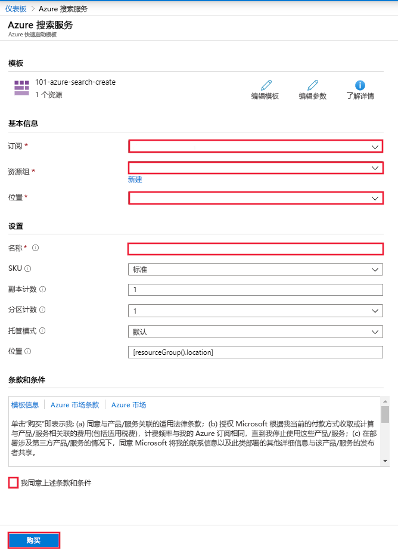

# 快速入门：使用 ARM 模板部署认知搜索

本文引导你完成在 Azure 门户中使用 Azure 资源管理器模板（ARM 模板）部署 Azure 认知搜索资源的过程。

[!INCLUDE [About Azure Resource Manager](../../includes/resource-manager-quickstart-introduction.md)]

如果你的环境满足先决条件，并且你熟悉如何使用 ARM 模板，请选择“部署到 Azure”按钮。 Azure 门户中会打开模板。

## 先决条件

如果没有 Azure 订阅，请在开始之前创建一个[免费帐户](https://azure.microsoft.com/free/?WT.mc_id=A261C142F)。

## 查看模板

本快速入门中使用的模板来自 [Azure 快速启动模板](https://azure.microsoft.com/resources/templates/101-azure-search-create/)。

:::code language="json"source="~/quickstart-templates/101-azure-search-create/azuredeploy.json" range="1-86" highlight="4-50,70-85":::

此模板中定义的 Azure 资源：

- [Microsoft.Search/searchServices](/azure/templates/Microsoft.Search/searchServices)：创建 Azure 认知搜索服务

## 部署模板

选择下图登录到 Azure 并打开一个模板。 该模板将创建一个 Azure 认知搜索资源。

门户将显示一个窗体，可在其中轻松提供参数值。 某些参数已由模板中的默认值预先填充。 需要提供自己的订阅、资源组、位置和服务名称。 若要在 [AI 扩充](cognitive-search-concept-intro.md)管道中使用认知服务（例如，要分析文本的二进制图像文件），请选择同时提供认知搜索和认知服务的位置。 对于 AI 扩充工作负载，这两个服务必须位于同一区域。 填写窗体后，需要同意条款和条件，然后选择“购买”按钮以完成部署。

> [!div class="mx-imgBorder"]
> 

## 查看已部署的资源

部署完成后，可以在门户中访问新的资源组和新的搜索服务。

## 清理资源

其他认知搜索快速入门和教程都是在本快速入门的基础上编写的。 如果你打算继续学习后续快速入门和教程，可能需要保留这些资源。 如果不再需要，可以删除资源组，这会删除认知搜索服务和相关资源。

## 后续步骤

在本快速入门中，你已使用 ARM 模板创建了认知搜索服务，并验证了部署。 若要详细了解认知搜索和 Azure 资源管理器，请继续阅读以下文章。

- 阅读 [Azure 认知搜索概述](search-what-is-azure-search.md)。
- 为搜索服务[创建索引](search-get-started-portal.md)。
- 使用门户向导[创建演示应用](search-create-app-portal.md)。
- [创建技能集](cognitive-search-quickstart-blob.md)，以从数据中提取信息。
