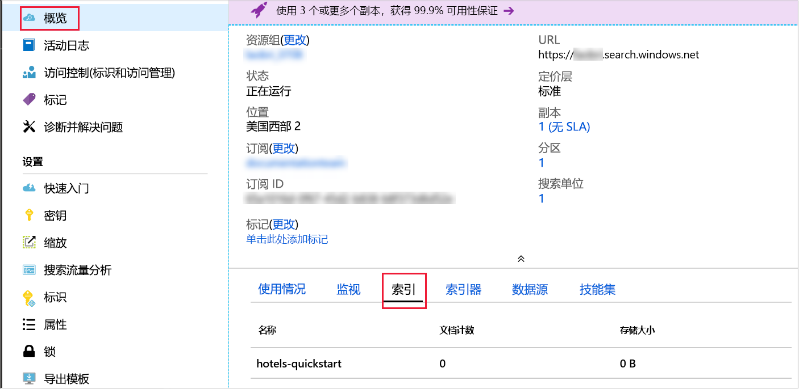

# <a name="quickstart-create-an-azure-search-index-in-nodejs"></a>快速入门：在 Node.js 中创建 Azure 搜索索引
> [!div class="op_single_selector"]
> * [JavaScript](search-get-started-nodejs.md)
> * [C#](search-get-started-dotnet.md)
> * [门户](search-get-started-portal.md)
> * [PowerShell](search-create-index-rest-api.md)
> * [Python](search-get-started-python.md)
> * [Postman](search-get-started-postman.md)

创建一个可以创建、加载和查询 Azure 搜索索引的 Node.js 应用程序。 本文演示如何逐步创建应用程序。 或者，可以[下载源代码和数据](https://github.com/Azure-Samples/azure-search-javascript-samples/tree/master/quickstart/)，并从命令行运行应用程序。

如果没有 Azure 订阅，请在开始之前创建一个[免费帐户](https://azure.microsoft.com/free/?WT.mc_id=A261C142F)。

## <a name="prerequisites"></a>先决条件

本快速入门使用以下服务、工具和数据。

+ [Node.js](https://nodejs.org)。
+ [NPM](https://www.npmjs.com) 应由 Node.js 安装。
+ 本文或[存储库中的 **quickstart** 目录](https://github.com/Azure-Samples/azure-search-javascript-samples/)提供了示例索引结构和匹配的文档。
+ [创建 Azure 搜索服务](search-create-service-portal.md)或在当前订阅下[查找现有服务](https://ms.portal.azure.com/#blade/HubsExtension/BrowseResourceBlade/resourceType/Microsoft.Search%2FsearchServices)。 可以使用本快速入门的免费服务。

建议：

* [Visual Studio Code](https://code.visualstudio.com)。
* VSCode 的 [Prettier](https://marketplace.visualstudio.com/items?itemName=esbenp.prettier-vscode) 和 [ESLint](https://marketplace.visualstudio.com/items?itemName=dbaeumer.vscode-eslint) 扩展。

<a name="get-service-info"></a>
## <a name="get-keys-and-urls"></a>获取密钥和 URL

对服务的调用要求每个请求都有一个 URL 终结点和一个访问密钥。 搜索服务是使用这二者创建的，因此，如果向订阅添加了 Azure 搜索，则请按以下步骤获取必需信息：

1. [登录到 Azure 门户](https://portal.azure.com/)，在搜索服务的“概述”页中获取搜索服务的名称。  可以通过查看终结点 URL 来确认服务名称。 如果终结点 URL 为 `https://mydemo.search.windows.net`，则服务名称为 `mydemo`。

2. 在“设置” > “密钥”中，获取有关该服务的完全权限的管理员密钥   。 有两个可交换的管理员密钥，为保证业务连续性而提供，以防需要滚动一个密钥。 可以在请求中使用主要或辅助密钥来添加、修改和删除对象。

    此外，获取查询密钥。 最好使用只读权限发出查询请求。


所有请求要求在发送到服务的每个请求的标头中指定 API 密钥。 具有有效的密钥可以在发送请求的应用程序与处理请求的服务之间建立信任关系，这种信任关系以每个请求为基础。

## <a name="set-up-your-environment"></a>设置环境

首先打开 Powershell 控制台或者安装了 Node.js 的其他环境。

1. 创建一个开发目录并将其命名为 `quickstart`：

    ```powershell
    mkdir quickstart
    cd quickstart
    ```

2. 运行 `npm init`，使用 NPM 初始化一个空项目。 接受默认值，但“许可证”除外，其值应设置为“MIT”。 

1. 添加代码所依赖的并有助于开发的包：

    ```powershell
    npm install nconf node-fetch
    npm install --save-dev eslint eslint-config-prettier eslint-config-airbnb-base eslint-plugin-import prettier
    ```

4. 检查如下所示的 **package.json** 文件，确认已配置项目及其依赖项：

    ```json
    {
      "name": "quickstart",
      "version": "1.0.0",
      "description": "Azure Search Quickstart",
      "main": "index.js",
      "scripts": {
        "test": "echo \"Error: no test specified\" && exit 1"
      },
      "keywords": [
        "Azure",
        "Azure_Search"
      ],
      "author": "Your Name",
      "license": "MIT",
      "dependencies": {
        "nconf": "^0.10.0",
        "node-fetch": "^2.6.0"
      },
      "devDependencies": {
        "eslint": "^6.1.0",
        "eslint-config-airbnb-base": "^13.2.0",
        "eslint-config-prettier": "^6.0.0",
        "eslint-plugin-import": "^2.18.2",
        "prettier": "^1.18.2"
      }
    }
    ```
创建用于保存搜索服务数据的 **azure_search_config.json** 文件：

```json
{
    "serviceName" : "[SERVICE_NAME]",
    "adminKey" : "[ADMIN_KEY]",
    "queryKey" : "[QUERY_KEY]",
    "indexName" : "hotels-quickstart"
}
```

请将 `[SERVICE_NAME]` 值替换为搜索服务的名称。 将 `[ADMIN_KEY]` 和 `[QUERY_KEY]` 替换为前面记下的密钥值。 

## <a name="1---create-index"></a>1 - 创建索引 

创建文件 **hotels_quickstart_index.json**。  此文件定义 Azure 搜索如何处理要在下一步骤中加载的文档。 每个字段由 `name` 标识，采用指定的 `type`。 每个字段还包含一系列索引属性，这些属性指定 Azure 搜索是否可以根据字段进行搜索、筛选、排序和分面。 大多数字段采用简单数据类型，但有些字段（例如 `AddressType`）采用复杂类型，可让你在索引中创建丰富的数据结构。  可以详细了解[支持的数据类型](https://docs.microsoft.com/rest/api/searchservice/supported-data-types)和[索引属性](https://docs.microsoft.com/azure/search/search-what-is-an-index#index-attributes)。 

将以下内容添加到 **hotels_quickstart_index.json** 或[下载文件](https://github.com/Azure-Samples/azure-search-javascript-samples/blob/master/quickstart/hotels_quickstart_index.json)。 

```json
{
    "name": "hotels-quickstart",
    "fields": [
        {
            "name": "HotelId",
            "type": "Edm.String",
            "key": true,
            "filterable": true
        },
        {
            "name": "HotelName",
            "type": "Edm.String",
            "searchable": true,
            "filterable": false,
            "sortable": true,
            "facetable": false
        },
        {
            "name": "Description",
            "type": "Edm.String",
            "searchable": true,
            "filterable": false,
            "sortable": false,
            "facetable": false,
            "analyzer": "en.lucene"
        },
        {
            "name": "Description_fr",
            "type": "Edm.String",
            "searchable": true,
            "filterable": false,
            "sortable": false,
            "facetable": false,
            "analyzer": "fr.lucene"
        },
        {
            "name": "Category",
            "type": "Edm.String",
            "searchable": true,
            "filterable": true,
            "sortable": true,
            "facetable": true
        },
        {
            "name": "Tags",
            "type": "Collection(Edm.String)",
            "searchable": true,
            "filterable": true,
            "sortable": false,
            "facetable": true
        },
        {
            "name": "ParkingIncluded",
            "type": "Edm.Boolean",
            "filterable": true,
            "sortable": true,
            "facetable": true
        },
        {
            "name": "LastRenovationDate",
            "type": "Edm.DateTimeOffset",
            "filterable": true,
            "sortable": true,
            "facetable": true
        },
        {
            "name": "Rating",
            "type": "Edm.Double",
            "filterable": true,
            "sortable": true,
            "facetable": true
        },
        {
            "name": "Address",
            "type": "Edm.ComplexType",
            "fields": [
                {
                    "name": "StreetAddress",
                    "type": "Edm.String",
                    "filterable": false,
                    "sortable": false,
                    "facetable": false,
                    "searchable": true
                },
                {
                    "name": "City",
                    "type": "Edm.String",
                    "searchable": true,
                    "filterable": true,
                    "sortable": true,
                    "facetable": true
                },
                {
                    "name": "StateProvince",
                    "type": "Edm.String",
                    "searchable": true,
                    "filterable": true,
                    "sortable": true,
                    "facetable": true
                },
                {
                    "name": "PostalCode",
                    "type": "Edm.String",
                    "searchable": true,
                    "filterable": true,
                    "sortable": true,
                    "facetable": true
                },
                {
                    "name": "Country",
                    "type": "Edm.String",
                    "searchable": true,
                    "filterable": true,
                    "sortable": true,
                    "facetable": true
                }
            ]
        }
    ],
    "suggesters": [
        {
            "name": "sg",
            "searchMode": "analyzingInfixMatching",
            "sourceFields": [
                "HotelName"
            ]
        }
    ]
}
```
    

最好是将特定方案的细节与广泛适用的代码区分开来。 **AzureSearchClient.js** 文件中定义的 `AzureSearchClient` 类知道如何构造请求 URL、使用提取 API 发出请求，并对响应的状态代码做出反应。

开始处理 **AzureSearchClient.js**：导入 **node-fetch** 包并创建一个简单类。 将各个配置值传递给 `AzureSearchClient` 的构造函数，以隔离该类的可更改部分：

```javascript
const fetch = require('node-fetch');

class AzureSearchClient {
    constructor(searchServiceName, adminKey, queryKey, indexName) {
        this.searchServiceName = searchServiceName;
        this.adminKey = adminKey;
        // The query key is used for read-only requests and so can be distributed with less risk of abuse.
        this.queryKey = queryKey;
        this.indexName = indexName;
        this.apiVersion = '2019-05-06';
    }

    // All methods go inside class body here!
}

module.exports = AzureSearchClient;
```

该类的第一项责任是了解如何构造要将各种请求发送到的 URL。 通过使用传递给类构造函数的配置数据的实例方法生成这些 URL。 请注意，这些方法构造的 URL 与特定的 API 版本相关，必须包含一个用于指定该版本（在此应用程序中为 `2019-05-06`）的参数。 

这些方法中的第一个方法将返回索引本身的 URL。 将以下方法添加到类正文中：

```javascript
getIndexUrl() { return `https://${this.searchServiceName}.search.windows.net/indexes/${this.indexName}?api-version=${this.apiVersion}`; }

```

`AzureSearchClient` 的第二项责任是使用提取 API 发出异步请求。 异步静态方法 `request` 采用一个 URL、一个指定 HTTP 方法的字符串（“GET”、“PUT”、“POST”、“DELETE”）、要在请求中使用的密钥，以及一个可选的 JSON 对象。 `headers` 变量将 `queryKey`（无论是管理密钥还是只读的查询密钥）映射到“api-key”HTTP 请求标头。 请求选项始终包含要使用的 `method`，以及 `headers`。 如果 `bodyJson` 不是 `null`，则 HTTP 请求的正文将设置为 `bodyJson` 的字符串表示形式。 `request` 方法返回用于执行 HTTP 请求的提取 API 约定。

```javascript
static async request(url, method, apiKey, bodyJson = null) {
    // Uncomment the following for request details:
    /*
    console.log(`\n${method} ${url}`);
    console.log(`\nKey ${apiKey}`);
    if (bodyJson !== null) {
        console.log(`\ncontent: ${JSON.stringify(bodyJson, null, 4)}`);
    }
    */

    const headers = {
        'content-type' : 'application/json',
        'api-key' : apiKey
    };
    const init = bodyJson === null ?
        { 
            method, 
            headers
        }
        : 
        {
            method, 
            headers,
            body : JSON.stringify(bodyJson)
        };
    return fetch(url, init);
}
```

为方便演示，当 HTTP 请求未成功时，只会引发异常。 在实际应用程序中，你也许会对搜索服务请求的 `response` 中的 HTTP 状态代码进行一些日志记录和诊断。 
    
```javascript
static throwOnHttpError(response) {
    const statusCode = response.status;
    if (statusCode >= 300){
        console.log(`Request failed: ${JSON.stringify(response, null, 4)}`);
        throw new Error(`Failure in request. HTTP Status was ${statusCode}`);
    }
}
```

最后，添加用于检测、删除和创建 Azure 搜索索引的方法。 这些方法全部采用相同的结构：

* 获取要对其发出请求的终结点。
* 使用相应的终结点、HTTP 谓词、API 密钥和 JSON 正文（如果适当）生成该请求。 `indexExistsAsync()` 和 `deleteIndexAsync()` 没有 JSON 正文，但 `createIndexAsync(definition)` 有。
* 执行 `await` 以等待返回请求的响应。  
* 处理响应的状态代码。
* 返回某个适当值（布尔值、`this` 或查询结果）的约定。 

```javascript
async indexExistsAsync() { 
    console.log("\n Checking if index exists...");
    const endpoint = this.getIndexUrl();
    const response = await AzureSearchClient.request(endpoint, "GET", this.adminKey);
    // Success has a few likely status codes: 200 or 204 (No Content), but accept all in 200 range...
    const exists = response.status >= 200 && response.status < 300;
    return exists;
}

async deleteIndexAsync() {
    console.log("\n Deleting existing index...");
    const endpoint = this.getIndexUrl();
    const response = await AzureSearchClient.request(endpoint, "DELETE", this.adminKey);
    AzureSearchClient.throwOnHttpError(response);
    return this;
}

async createIndexAsync(definition) {
    console.log("\n Creating index...");
    const endpoint = this.getIndexUrl();
    const response = await AzureSearchClient.request(endpoint, "PUT", this.adminKey, definition);
    AzureSearchClient.throwOnHttpError(response);
    return this;
}
```

确认你的方法位于该类中，并且你正在导出该类。 **AzureSearchClient.js** 的最外层范围应是：

```javascript
const fetch = require('node-fetch');

class AzureSearchClient {
    // ... code here ...
}

module.exports = AzureSearchClient;
```

面向对象的类非常适合用于潜在可重用的 **AzureSearchClient.js** 模块，但不一定适合用于要放入名为 **index.js** 的文件中的主程序。 

创建 **index.js**，然后，先引入：

* **nconf** 包：可让你灵活使用 JSON、环境变量或命令行参数指定配置。
* **hotels_quickstart_index.json** 文件中的数据。
* `AzureSearchClient` 模块。

```javascript
const nconf = require('nconf');

const indexDefinition = require('./hotels_quickstart_index.json');
const AzureSearchClient = require('./AzureSearchClient.js');
```

[**nconf** 包](https://github.com/indexzero/nconf)可让你以多种格式（例如环境变量或命令行）指定配置数据。 本示例以基本方式使用 **nconf**，以读取文件 **azure_search_config.json** 并以字典形式返回该文件的内容。 使用 **nconf** 的 `get(key)` 函数可以快速检查配置信息是否已正确自定义。 最后，函数将返回配置：

```javascript
function getAzureConfiguration() {
    const config = nconf.file({ file: 'azure_search_config.json' });
    if (config.get('serviceName') === '[SEARCH_SERVICE_NAME' ) {
        throw new Error("You have not set the values in your azure_search_config.json file. Change them to match your search service's values.");
    }
    return config;
}
```

`sleep` 函数创建一个在指定的时间后得到解决的 `Promise`。 应用可以使用此函数暂停，同时等待异步索引操作完成并可用。 通常，仅在演示、测试和示例应用程序中才有必要添加此类延迟。

```javascript
function sleep(ms) {
    return(
        new Promise(function(resolve, reject) {
            setTimeout(function() { resolve(); }, ms);
        })
    );
}
```

最后，指定并调用主异步 `run` 函数。 此函数按顺序调用其他函数，并根据需要等待解决 `Promise`。

* 使用前面编写的 `getAzureConfiguration()` 检索配置
* 创建一个新的 `AzureSearchClient` 实例，并传入配置中的值
* 检查索引是否存在，如果存在，请将其删除
* 使用从 **hotels_quickstart_index.json** 加载的 `indexDefinition` 创建索引

```javascript
const run = async () => {
    try {
        const cfg = getAzureConfiguration();
        const client = new AzureSearchClient(cfg.get("serviceName"), cfg.get("adminKey"), cfg.get("queryKey"), cfg.get["serviceName"]);
        
        const exists = await client.indexExistsAsync();
        await exists ? client.deleteIndexAsync() : Promise.resolve();
        // Deleting index can take a few seconds
        await sleep(2000);
        await client.createIndexAsync(indexDefinition);
    } catch (x) {
        console.log(x);
    }
}

run();
```

最后，请不要忘记调用 `run()`！ 在下一步骤中运行 `node index.js` 时，该函数是程序的入口点。

请注意，`AzureSearchClient.indexExistsAsync()` 和 `AzureSearchClient.deleteIndexAsync()` 不采用参数。 这些函数调用不带 `bodyJson` 参数的 `AzureSearchClient.request()`。 在 `AzureSearchClient.request()` 中，由于 `bodyJson === null` 是 `true`，因此 `init` 结构仅设置为 HTTP 谓词（对于 `indexExistsAsync()`，为“GET”；对于 `deleteIndexAsync()`，则为“DELETE”）和指定请求密钥的标头。  

相反，`AzureSearchClient.createIndexAsync(indexDefinition)` 方法采用一个参数。  `index.js` 中的 `run` 函数将文件 **hotels_quickstart_index.json** 的内容传递给 `AzureSearchClient.createIndexAsync(indexDefinition)` 方法。 `createIndexAsync()` 方法将此定义传递给 `AzureSearchClient.request()`。 在 `AzureSearchClient.request()` 中，由于 `bodyJson === null` 现在为 `false`，`init` 结构不仅包含 HTTP 谓词（“PUT”）和标头，而且还将 `body` 设置为索引定义数据。

### <a name="prepare-and-run-the-sample"></a>准备并运行示例

使用终端窗口运行以下命令。

1. 导航到包含 **package.json** 文件和剩余代码的文件夹。
1. 使用 `npm install` 安装示例的包。  此命令将下载代码所依赖的包。
1. 使用 `node index.js` 运行程序。

你应会看到一系列消息，其中描述了程序正在执行的操作。 若要查看请求的更多详细信息，可以取消注释 **AzureSearchClient.js** 中的 [`AzureSearchClient.request()` 方法开头的行]https://github.com/Azure-Samples/azure-search-javascript-samples/blob/master/quickstart/AzureSearchClient.js#L21-L27) 。 

在 Azure 门户中打开搜索服务的“概述”。  选择“索引”选项卡。  会看到下面这样的内容：



在下一步骤中，你要向索引添加数据。 

## <a name="2---load-documents"></a>2 - 加载文档 

在 Azure 搜索中，文档这一数据结构既是索引输入，也是查询输出。 需要将此类数据发布到索引。 这会使用不同的终结点，而不是上一步骤中执行操作时使用的终结点。 打开 **AzureSearchClient.js**，并在 `getIndexUrl()` 后面添加以下方法：

```javascript
 getPostDataUrl() { return `https://${this.searchServiceName}.search.windows.net/indexes/${this.indexName}/docs/index?api-version=${this.apiVersion}`;  }
```

与 `AzureSearchClient.createIndexAsync(definition)` 一样，需要使用一个调用 `AzureSearchClient.request()` 的函数，并传入酒店数据作为其正文。 在 **AzureSearchClient.js** 中的 `createIndexAsync(definition)` 后面添加 `postDataAsync(hotelsData)`：

```javascript
async postDataAsync(hotelsData) {
    console.log("\n Adding hotel data...");
    const endpoint = this.getPostDataUrl();
    const response = await AzureSearchClient.request(endpoint,"POST", this.adminKey, hotelsData);
    AzureSearchClient.throwOnHttpError(response);
    return this;
}
```

 文档输入可以是数据库中的行、Blob 存储中的 Blob，或磁盘上的 JSON 文档（在本示例中为 JSON 文档）。 可以下载 [hotels.json](https://github.com/Azure-Samples/azure-search-javascript-samples/blob/master/quickstart/hotels.json)，或创建包含以下内容的 **hotels.json** 文件：

```json
{
    "value": [
        {
            "HotelId": "1",
            "HotelName": "Secret Point Motel",
            "Description": "The hotel is ideally located on the main commercial artery of the city in the heart of New York. A few minutes away is Time's Square and the historic centre of the city, as well as other places of interest that make New York one of America's most attractive and cosmopolitan cities.",
            "Description_fr": "L'hôtel est idéalement situé sur la principale artère commerciale de la ville en plein cœur de New York. A quelques minutes se trouve la place du temps et le centre historique de la ville, ainsi que d'autres lieux d'intérêt qui font de New York l'une des villes les plus attractives et cosmopolites de l'Amérique.",
            "Category": "Boutique",
            "Tags": ["pool", "air conditioning", "concierge"],
            "ParkingIncluded": false,
            "LastRenovationDate": "1970-01-18T00:00:00Z",
            "Rating": 3.6,
            "Address": {
                "StreetAddress": "677 5th Ave",
                "City": "New York",
                "StateProvince": "NY",
                "PostalCode": "10022"
            }
        },
        {
            "HotelId": "2",
            "HotelName": "Twin Dome Motel",
            "Description": "The hotel is situated in a  nineteenth century plaza, which has been expanded and renovated to the highest architectural standards to create a modern, functional and first-class hotel in which art and unique historical elements coexist with the most modern comforts.",
            "Description_fr": "L'hôtel est situé dans une place du XIXe siècle, qui a été agrandie et rénovée aux plus hautes normes architecturales pour créer un hôtel moderne, fonctionnel et de première classe dans lequel l'art et les éléments historiques uniques coexistent avec le confort le plus moderne.",
            "Category": "Boutique",
            "Tags": ["pool", "free wifi", "concierge"],
            "ParkingIncluded": "false",
            "LastRenovationDate": "1979-02-18T00:00:00Z",
            "Rating": 3.6,
            "Address": {
                "StreetAddress": "140 University Town Center Dr",
                "City": "Sarasota",
                "StateProvince": "FL",
                "PostalCode": "34243"
            }
        },
        {
            "HotelId": "3",
            "HotelName": "Triple Landscape Hotel",
            "Description": "The Hotel stands out for its gastronomic excellence under the management of William Dough, who advises on and oversees all of the Hotel’s restaurant services.",
            "Description_fr": "L'hôtel est situé dans une place du XIXe siècle, qui a été agrandie et rénovée aux plus hautes normes architecturales pour créer un hôtel moderne, fonctionnel et de première classe dans lequel l'art et les éléments historiques uniques coexistent avec le confort le plus moderne.",
            "Category": "Resort and Spa",
            "Tags": ["air conditioning", "bar", "continental breakfast"],
            "ParkingIncluded": "true",
            "LastRenovationDate": "2015-09-20T00:00:00Z",
            "Rating": 4.8,
            "Address": {
                "StreetAddress": "3393 Peachtree Rd",
                "City": "Atlanta",
                "StateProvince": "GA",
                "PostalCode": "30326"
            }
        },
        {
            "HotelId": "4",
            "HotelName": "Sublime Cliff Hotel",
            "Description": "Sublime Cliff Hotel is located in the heart of the historic center of Sublime in an extremely vibrant and lively area within short walking distance to the sites and landmarks of the city and is surrounded by the extraordinary beauty of churches, buildings, shops and monuments. Sublime Cliff is part of a lovingly restored 1800 palace.",
            "Description_fr": "Le sublime Cliff Hotel est situé au coeur du centre historique de sublime dans un quartier extrêmement animé et vivant, à courte distance de marche des sites et monuments de la ville et est entouré par l'extraordinaire beauté des églises, des bâtiments, des commerces et Monuments. Sublime Cliff fait partie d'un Palace 1800 restauré avec amour.",
            "Category": "Boutique",
            "Tags": ["concierge", "view", "24-hour front desk service"],
            "ParkingIncluded": true,
            "LastRenovationDate": "1960-02-06T00:00:00Z",
            "Rating": 4.6,
            "Address": {
                "StreetAddress": "7400 San Pedro Ave",
                "City": "San Antonio",
                "StateProvince": "TX",
                "PostalCode": "78216"
            }
        }
    ]
}

```

若要将此数据载入程序，请修改 **index.js**：在顶部附近添加引用 `hotelData` 的行：

```javascript
const nconf = require('nconf');

const hotelData = require('./hotels.json');
const indexDefinition = require('./hotels_quickstart_index.json');
```

现在，修改 **index.js** 中的 `run()` 函数。 索引在几秒钟后才可用，因此，在调用 `AzureSearchClient.postDataAsync(hotelData)` 之前请添加 2 秒暂停：

```javascript
const run = async () => {
    try {
        const cfg = getAzureConfiguration();
        const client = new AzureSearchClient(cfg.get("serviceName"), cfg.get("adminKey"), cfg.get("queryKey"), cfg.get("indexName"));
        
        const exists = await client.indexExistsAsync();
        await exists ? client.deleteIndexAsync() : Promise.resolve();
        // Deleting index can take a few seconds
        await sleep(2000);
        await client.createIndexAsync(indexDefinition);
        // Index availability can take a few seconds
        await sleep(2000);
        await client.postDataAsync(hotelData);
    } catch (x) {
        console.log(x);
    }
}
```

使用 `node index.js` 再次运行程序。 应会看到与步骤 1 中显示的消息略有不同的一系列消息。 这一次，索引确实存在，并且你会看到有关应用创建新索引并向其发布数据之前删除此索引的消息。  

## <a name="3---search-an-index"></a>3 - 搜索索引

返回 Azure 门户上搜索服务“概述”中的“索引”选项卡。   索引现在包含四个文档并消耗了一定的存储量（UI 可能需要在几分钟后才能正确反映索引的基础状态）。 单击索引名称转到“搜索资源管理器”。  在此页中可以体验数据查询。 尝试搜索 `*&$count=true` 的查询字符串，应会返回所有文档和结果数。 尝试使用查询字符串 `historic&highlight=Description&$filter=Rating gt 4`，应会返回单个文档，其 `<em></em>` 标记中包装了“historic”一词。 详细了解[如何在 Azure 搜索中撰写查询](https://docs.microsoft.com/azure/search/search-query-overview)。 

打开 **index.js** 并在顶部附近添加以下代码，以在代码中重新生成这些查询：

```javascript
const queries = [
    "*&$count=true",
    "historic&highlight=Description&$filter=Rating gt 4&"
];
```

在同一 **index.js** 文件中，按如下所示编写 `doQueriesAsync()` 函数。 此函数采用 `AzureSearchClient` 对象，并将 `AzureSearchClient.queryAsync` 方法应用到 `queries` 数组中的每个值。 它使用 `Promise.all()` 函数返回仅在所有查询均已解决时才得到解决的单个 `Promise`。 对 `JSON.stringify(body, null, 4)` 的调用将设置查询结果的格式以提高可读性。

```javascript
async function doQueriesAsync(client) {
    return Promise.all(
        queries.map( async query => {
            const result = await client.queryAsync(query);
            const body = await result.json();
            const str = JSON.stringify( body, null, 4);
            console.log(`Query: ${query} \n ${str}`);
        })
    );
}
```

修改 `run()` 函数以暂停足够长的时间，使索引器正常工作，然后调用 `doQueriesAsync(client)` 函数：

```javascript
const run = async () => {
    try {
        const cfg = getAzureConfiguration();
        const client = new AzureSearchClient(cfg.get("serviceName"), cfg.get("adminKey"), cfg.get("queryKey"), cfg.get("indexName"));
        
        const exists = await client.indexExistsAsync();
        await exists ? client.deleteIndexAsync() : Promise.resolve();
        // Deleting index can take a few seconds
        await sleep(2000);
        await client.createIndexAsync(indexDefinition);
        // Index availability can take a few seconds
        await sleep(2000);
        await client.postDataAsync(hotelData);
        // Data availability can take a few seconds
        await sleep(5000);
        await doQueriesAsync(client);
    } catch (x) {
        console.log(x);
    }
}
```

若要实现 `AzureSearchClient.queryAsync(query)`，请编辑文件 **AzureSearchClient.js**。 搜索操作需要使用不同的终结点，搜索词将变为 URL 参数，因此，请结合已编写的 `getIndexUrl()` 和 `getPostDataUrl()` 方法一起添加函数 `getSearchUrl(searchTerm)`。

```javascript
getSearchUrl(searchTerm) { return `https://${this.searchServiceName}.search.windows.net/indexes/${this.indexName}/docs?api-version=${this.apiVersion}&search=${searchTerm}&searchMode=all`; }
 ```

`queryAsync(searchTerm)` 函数还会访问 **AzureSearchClient.js**，并遵循与 `postDataAsync(data)` 和其他查询函数相同的结构： 

```javascript
async queryAsync(searchTerm) {
    console.log("\n Querying...")
    const endpoint = this.getSearchUrl(searchTerm);
    const response = await AzureSearchClient.request(endpoint, "GET", this.queryKey);
    AzureSearchClient.throwOnHttpError(response);
    return response;
}
```

搜索是使用“GET”谓词（不使用正文）完成的，因为搜索词是 URL 的一部分。 请注意，`queryAsync(searchTerm)` 使用 `this.queryKey`，这与使用管理密钥的其他函数不同。 顾名思义，查询密钥只可用于查询索引，而不可用于以任何方式修改索引。 因此，可以更安全地将查询密钥分发到客户端应用程序。

使用 `node index.js` 运行程序。 现在，除上述步骤以外，还会发送查询并将结果写入控制台。

### <a name="about-the-sample"></a>关于本示例

该示例使用少量的酒店数据，但足以演示有关创建和查询 Azure 搜索索引的基础知识。

**AzureSearchClient** 类封装搜索服务的配置、URL 和基本 HTTP 请求。 **index.js** 文件加载 Azure 搜索服务的配置数据、要上传的用于编制索引的酒店数据、要在其 `run` 函数中指定的订单，并执行各种操作。

`run` 函数的总体行为是删除 Azure 搜索索引（如果存在）、创建索引、添加一些数据，并执行一些查询。  

## <a name="clean-up"></a>清理 

在自己的订阅中操作时，最好在项目结束时确定是否仍需要已创建的资源。 持续运行资源可能会产生费用。 可以逐个删除资源，也可以删除资源组以删除整个资源集。

可以使用左侧导航窗格中的“所有资源”或“资源组”链接   ，在门户中查找和管理资源。
如果使用的是免费服务，请记住只能设置三个索引、索引器和数据源。 可以在门户中删除单个项目，以不超出此限制。 

## <a name="next-steps"></a>后续步骤

在本 Node.js 快速入门中，我们已完成一系列任务，包括创建索引、使用文档加载索引并运行查询。 我们以尽量简单的方法执行了一些步骤，例如读取配置和定义查询。 在实际的应用程序中，你可能会在提供灵活性和封装功能的单独模块中解决这些问题。 
 
如果已对 Azure 搜索有一定的了解，可以将此教程用作尝试使用建议器（提前键入或自动完成查询）、筛选器和分面导航的跳板。 如果你是 Azure 搜索的新手，我们建议尝试阅读其他教程，深入了解可以创建哪些内容。 请访问 [文档页](https://azure.microsoft.com/documentation/services/search/) 查找更多资源。 

> [!div class="nextstepaction"]
> [使用 Javascript 从网页调用 Azure 搜索](https://github.com/liamca/azure-search-javascript-samples)
