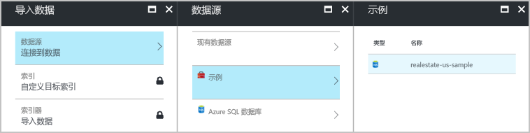
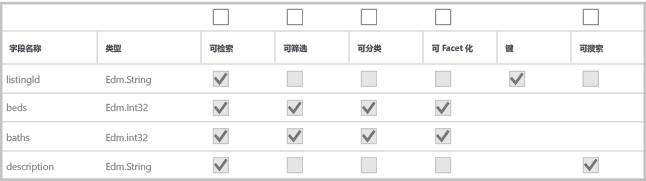
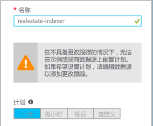
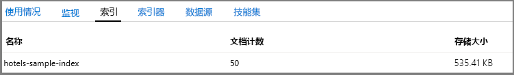
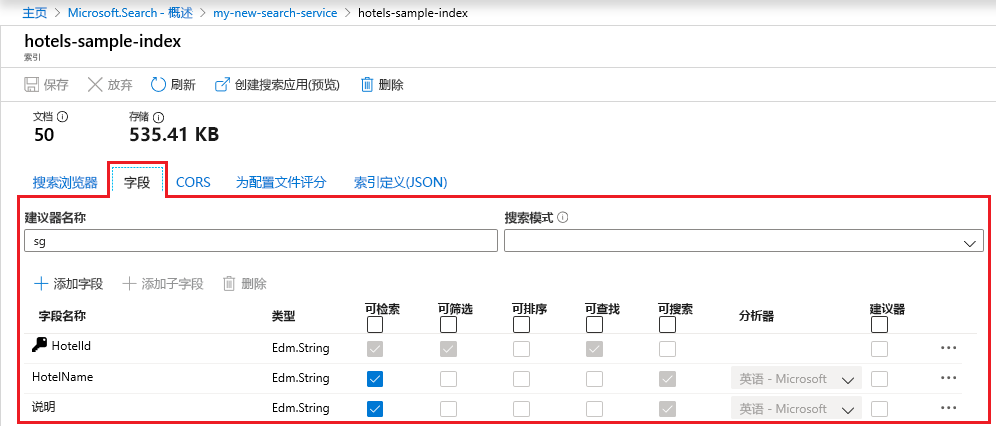
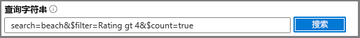

# 快速入门：使用内置门户工具在 Azure 搜索中进行导入、索引编制和查询
> [!div class="op_single_selector"]
> * [门户](search-get-started-portal.md)
> * [PowerShell](search-howto-dotnet-sdk.md)
> * [Postman](search-fiddler.md)
> * [C#](search-create-index-dotnet.md)
>*

若要快速提升 Azure 搜索概念，请尝试 Azure 门户中的内置工具。 向导和编辑器不提供与 .NET 和 REST API 完全相同的功能，但你可以快速开始使用无代码的介绍，在几分钟内针对示例数据编写感兴趣的查询。

> [!div class="checklist"]
> * 从 Azure 上托管的免费公共示例数据集开始
> * 在 Azure 搜索中运行“导入数据”向导以加载数据并生成索引
> * 监视门户中的索引进度
> * 查看现有索引和修改索引的选项
> * 使用“搜索浏览器”探索全文搜索、筛选器、分面、模糊搜索和地域搜索

如果这些工具限制过多，则可考虑参阅[在 .NET 中进行基于代码的 Azure 搜索编程简介](search-howto-dotnet-sdk.md)，或使用[进行 REST API 调用的 Postman 或 Fiddler](search-fiddler.md)。

如果没有 Azure 订阅，请在开始之前创建一个[免费帐户](https://azure.microsoft.com/free/?WT.mc_id=A261C142F)。 也可以花费 3 分钟时间观看这部 [Azure 搜索概述视频](https://channel9.msdn.com/Events/Connect/2016/138)，其中对本教程所述的步骤做了 6 分钟的演示。

## 先决条件

[创建 Azure 搜索服务](search-create-service-portal.md)或在当前订阅下[查找现有服务](https://ms.portal.azure.com/#blade/HubsExtension/BrowseResourceBlade/resourceType/Microsoft.Search%2FsearchServices)。 可以使用本快速入门的免费服务。 

### 检查空间

很多客户开始使用免费服务。 此版本限制为三个索引、三个数据源和三个索引器。 在开始之前，请确保有空间存储额外的项目。 本教程会创建每个对象的一个实例。

服务仪表板上的部分显示你已有多少个索引、索引器和数据源。 

##  创建索引并加载数据

搜索查询可循环访问[索引](search-what-is-an-index.md)，索引中包含可搜索数据、元数据，以及其他用于优化某些搜索行为的构造。

在本教程中，请使用可通过“导入数据”向导利用[索引器](search-indexer-overview.md)对其进行爬网的内置示例数据集。 索引器是特定于源的爬网程序，可以从支持的 Azure 数据源中读取元数据和内容。 通常，索引器以编程方式使用，但在门户中，你可以通过“导入数据”向导来访问。 

### 步骤 1 - 启动“导入数据”向导和创建数据源

1. 在 Azure 搜索服务仪表板的命令栏中单击“导入数据”，以创建和填充搜索索引。

   

2. 在向导中，单击“连接到数据” > “示例” > “realestate-us-sample”。 此数据源是内置的。 如果要创建自己的数据源，则需要指定名称、类型和连接信息。 创建后，它将成为可在其他导入操作中重复使用的“现有数据源”。

   

3. 继续转到下一页。

   

### 步骤 2 - 跳过认知技能

该向导支持创建[认知技能管道](cognitive-search-concept-intro.md)，用于将认知服务 AI 算法合并到索引中。 

我们将暂时跳过此步骤，转到“自定义目标索引”。

   

> [!TIP]
> 若要尝试 Azure 搜索的全新认知搜索预览版功能，可以阅读[认知搜索快速入门](cognitive-search-quickstart-blob.md)或[教程](cognitive-search-tutorial-blob.md)。

### 步骤 3 - 配置索引

通常情况下，索引创建是基于代码的练习，在加载数据之前完成。 但是，如本教程所示，向导可以针对它能够爬网的任何数据源生成基本索引。 索引至少需要一个名称和一个字段集合；其中一个字段应该标记为文档键，用于唯一标识每个文档。 此外，如果需要自动完成或建议查询，可以指定语言分析器或建议器。

字段包含数据类型和属性。 顶部的复选框为*索引属性*，用于控制如何使用字段。

* **可检索**意味着该字段将显示在搜索结果列表中。 清除此复选框即可将单个字段标记为关闭搜索结果限制，例如当字段仅用于筛选器表达式时。
* “密钥”是唯一的文档标识符。 它始终是一个字符串，而且是必需的字符串。
* “可筛选”、“可排序”和“可查找”确定字段是否可用于筛选器、排序或方面导航结构。
* **可搜索**意味着该字段将包括在全文搜索中。 字符串可搜索。 数值字段和布尔字段通常标记为不可搜索。

存储要求不会因你的选择而发生更改。 例如，如果你在多个字段上设置“可检索”属性，则存储需求不会增加。

默认情况下，向导会在数据源中扫描用作键字段基础的唯一标识符。 字符串经过属性化，**可检索**且**可搜索**。 整数经过属性化，**可检索**、**可筛选**、**可排序**且**可分面**。

1. 接受默认值。 

   如果使用现有的 realestate 数据源再次重新运行向导，则不会使用默认属性配置索引。 以后导入时，你必须手动选择属性。

   

2. 继续转到下一页。

   

### 步骤 4 - 配置索引器

仍在“导入数据”向导中，单击“索引器” > “名称”，并键入索引器的名称。

此对象定义一个可执行过程。 可将该对象放入定期计划，但我们现在使用默认选项立即运行索引器一次。

单击“提交”以创建并同时运行索引器。

  

## 监视进度

该向导应转到索引器列表，你可在其中监视进度。 若要进行自导航，请转到“概述”页，然后单击“索引器”。

门户网站可能需要几分钟才能更新页面，但列表中应会出现新建的索引器，其状态指示“正在进行”或“成功”，此外还会列出已编制索引的文档数。

   

## 查看索引

主服务页提供指向 Azure 搜索服务中创建的资源的链接。  若要查看刚刚创建的索引，请单击链接列表中的**索引**。 

   

从此列表中，可以单击刚刚创建的 *realestate-us-sample* 索引，查看索引架构， 并可以选择添加新字段。 

“字段”选项卡显示索引架构。 滚动到列表底部可输入新字段。 在大多数情况下，不能更改现有字段。 现有字段在 Azure 搜索中具有实际的表示形式，因此不可修改，即使在代码中也是如此。 若要从根本上更改现有字段，请创建新索引并丢弃原始索引。

   

随时可以添加其他构造，例如评分配置文件和 CORS 选项。

若要清楚地了解在索引设计过程中可以和不可以编辑哪些内容，请花点时间查看索引定义选项。 灰显的选项表示对应的值不可修改或删除。 

## 使用搜索浏览器查询

我们继续。现在应已创建了一个可以使用内置[**搜索资源管理器**](search-explorer.md)查询页查询的搜索索引。 该页提供了一个搜索框，用于测试任意查询字符串。

**搜索浏览器**仅用于处理 [REST API 请求](https://docs.microsoft.com/rest/api/searchservice/search-documents)，但它接受[简单查询语法](https://docs.microsoft.com/rest/api/searchservice/simple-query-syntax-in-azure-search)和[完整 Lucene 查询分析器](https://docs.microsoft.com/rest/api/searchservice/lucene-query-syntax-in-azure-search)的语法，加上可在[搜索文档 REST API](https://docs.microsoft.com/rest/api/searchservice/search-documents#bkmk_examples) 操作中使用的所有搜索参数。

> [!TIP]
> 以下步骤在 [Azure 搜索概述视频](https://channel9.msdn.com/Events/Connect/2016/138)第 6 分 8 秒处开始演示。
>

1. 单击命令栏上的“搜索浏览器”  。

   

2. 在命令栏中单击“更改索引”切换到 *realestate-us-sample*。 在命令栏中单击“设置 API 版本”，查看有哪些 REST API 可用。 对于以下查询，请使用正式版 (2017-11-11)。

   

3. 在搜索栏中粘贴以下查询字符串，并单击“搜索”。

   

## 查询示例

你可以输入术语和短语，类似于在必应或 Google 搜索中可能执行的操作，或输入完全指定的查询表达式。 结果以详细的 JSON 文档形式返回。

### 提供 top N 结果的简单查询

#### 示例（字符串查询）：`search=seattle`

* **search** 参数用于输入关键字来执行全文搜索，在本例中，将返回华盛顿州金县的结果列表，其中包含文档中任何可搜索字段内的 *Seattle*。

* **搜索浏览器**以 JSON 格式返回结果，如果文档采用密集结构，这种结果将很冗长且难以阅读。 这是有意而为的；整个文档的可见性对于开发来说很重要，尤其是在测试期间。 为了改善用户体验，需要编写代码用于[处理搜索结果](search-pagination-page-layout.md)，以提供重要元素。

* 文档由标记为在索引中“可检索”的所有字段构成。 若要在门户中查看索引属性，请在“索引”列表中单击“realestate-us-sample”。

#### 示例（参数化查询）：`search=seattle&$count=true&$top=100`

* **&** 符号用于追加可以按任意顺序指定的搜索参数。

* **$count=true** 参数返回所有已返回文档的总计数。 此值显示在搜索结果顶部附近。 可以通过监视 **$count=true** 报告的更改来验证筛选器查询。 如果计数较小，则表示筛选器正在工作。

* **$top=100** 返回所有文档中排名最高的 100 个文档。 默认情况下，Azure 搜索返回前 50 个最佳匹配项。 可以通过 **$top** 增加或减少返回的结果。

###  筛选查询

追加 **$filter** 参数时，会将筛选器包括在搜索请求中。 

#### 示例（已筛选）：`search=seattle&$filter=beds gt 3`

* **$filter** 参数返回与提供的条件匹配的结果。 在本例中，条件为卧室数大于 3。

* 筛选器语法是一种 OData 构造。 有关详细信息，请参阅 [Filter OData syntax](https://docs.microsoft.com/rest/api/searchservice/odata-expression-syntax-for-azure-search)（筛选器 OData 语法）。

###  分面查询

分面筛选器包括在搜索请求中。 可以使用分面参数，返回与所提供分面值匹配的文档的聚合计数。

#### 示例（使用范围缩减进行分面）：`search=*&facet=city&$top=2`

* **search=*** 是空搜索。 空搜索会搜索所有内容。 提交空查询的原因之一是针对整个文档集进行筛选器或分面。 例如，你希望某个分面导航结构由索引中的所有城市组成。

* **facet** 返回可传递给 UI 控件的导航结构。 它将返回类别和计数。 在本例中，类别基于城市数目。 Azure 搜索中没有聚合，但可以通过 `facet` 进行近似聚合，提供每个类别中的文档计数。

* **$top=2** 返回两个文档，演示如何使用 `top` 来减少或增加结果。

#### 示例（包含数字值的分面）：`search=seattle&facet=beds`**

* 此查询针对 *Seattle* 执行文本搜索后返回的床位分面。 可将 beds 一词指定为分面，因为该字段已标记为可在索引中检索、筛选和分面，并且它包含的值（数字 1 到 5）适合用于将列表分类为组（包含 3 间卧室和 4 间卧室的房屋列表）。

* 只有可筛选的字段才可分面。 结果中只返回仅可检索的字段。

###  突出显示搜索结果

搜索词突出显示是对与关键字匹配的文本设置的格式，表示在特定字段中找到的匹配项。 如果搜索词深藏在说明中，可以添加搜索词突出显示来方便找到这些词。

#### 示例（突出显示）：`search=granite countertops&highlight=description`

* 在此示例中，格式化短语 granite countertops 更容易在说明字段中发现。

#### 示例（语言分析）：`search=mice&highlight=description`

* 全文搜索将查找具有类似语义的单词形式。 在本例中，搜索结果包含搜索“mice”关键字后，包含“mouse”的突出显示文本（针对老鼠泛滥的家庭执行的搜索）。 由于执行了语言分析，同一单词的不同形式可能会显示在结果中。

* Azure 搜索支持 Lucene 和 Microsoft 提供的 56 种分析器。 Azure 搜索使用的默认分析器是标准的 Lucene 分析器。

###  试用模糊搜索

默认情况下，执行典型的搜索时，如果拼错查询字词（例如，将西雅图区域的 Sammamish 高原拼写为 *samamish*），则无法返回匹配项。 以下示例不会返回任何结果。

#### 示例（拼错字词且未经处理）：`search=samamish`

若要处理拼写错误，可以使用模糊搜索。 使用完整的 Lucene 查询语法时，将启用模糊搜索：在查询中设置 **queryType=full**，以及将 **~** 追加到搜索字符串时，就会启用模糊搜索。

#### 示例（拼错字词且已经处理）：`search=samamish~&queryType=full`

现在，此示例会返回包含“Sammamish”匹配项的文档。

如果未指定 **queryType**，将使用默认的简单查询分析器。 简单查询分析器速度更快，但如果需要执行模糊搜索、正则表达式、近似搜索或其他高级查询类型，则需要使用完整语法。

模糊搜索和通配符搜索对搜索输出产生影响。 不会针对这些查询格式执行语言分析。 在使用模糊搜索和通配符搜索之前，请查看 [Azure 搜索中全文搜索的工作原理](search-lucene-query-architecture.md#stage-2-lexical-analysis)，并查找有关词法分析例外情况的部分。

有关完整查询分析器支持的查询方案的详细信息，请参阅 [Lucene query syntax in Azure Search](https://docs.microsoft.com/rest/api/searchservice/lucene-query-syntax-in-azure-search)（Azure 搜索中的 Lucene 查询语法）。

###  尝试地理空间搜索

对于包含坐标的字段，支持通过 [edm.GeographyPoint 数据类型](https://docs.microsoft.com/rest/api/searchservice/supported-data-types)执行地理空间搜索。 地域搜索是 [Filter OData syntax](https://docs.microsoft.com/rest/api/searchservice/odata-expression-syntax-for-azure-search)（筛选器 OData 语法）中指定的一种筛选器类型。

#### 示例（地理坐标筛选器）：`search=*&$count=true&$filter=geo.distance(location,geography'POINT(-122.121513 47.673988)') le 5`

该示例查询将筛选位置数据的所有结果，这些结果与给定地点（以纬度和经度坐标的形式指定）之间的距离小于 5 公里。 通过添加 **$count**，可以查看在更改距离或坐标时会返回多少个结果。

如果搜索应用程序具有“附近查找”功能或使用地图导航，地理空间搜索非常有用。 但它不属于全文搜索。 如果用户要求是按名称搜索城市或国家/地区，请添加包含该城市或国家/地区的名称的字段，并添加坐标。

## 要点

本教程快速介绍了如何在 Azure 门户中使用 Azure 搜索。

介绍了如何使用“导入数据”向导创建搜索索引； 介绍了[索引器](search-indexer-overview.md)，以及索引设计的基本工作流，包括[对已发布索引进行的支持的修改](https://docs.microsoft.com/rest/api/searchservice/update-index)；

介绍了一些基本的查询语法，在 Azure 门户中使用**搜索浏览器**通过手动示例演示筛选器、搜索词突出显示、模糊搜索和地理搜索等重要功能；

还学习了如何在门户中查找索引、索引器和数据源。 如果将来有任何新的数据源，则可轻松地通过门户快速查看其定义或字段集合。

## 清理

如果本教程是你第一次使用 Azure 搜索服务，请删除包含 Azure 搜索服务的资源组。 否则，请在服务列表中查找正确的资源组名称，然后删除相应的资源组。

## 后续步骤

可以使用编程工具浏览 Azure 搜索的更多内容：

* [使用 .NET SDK 创建索引](https://docs.microsoft.com/azure/search/search-create-index-dotnet)
* [使用 REST API 创建索引](https://docs.microsoft.com/azure/search/search-create-index-rest-api)
* [使用 Postman/Fiddler 和 Azure 搜索 REST API 创建索引](search-fiddler.md)
