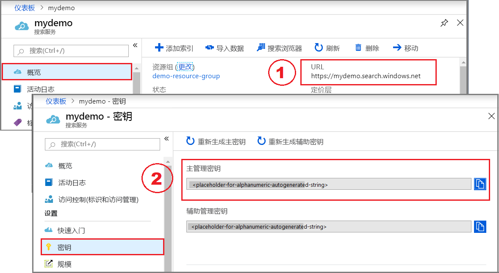

# <a name="tutorial-index-azure-sql-data-using-the-net-sdk"></a>教程：使用 .NET SDK 为 Azure SQL 数据编制索引

配置一个[索引器](search-indexer-overview.md)，用于从 Azure SQL 数据库提取可搜索的数据，并将其发送到 Azure 认知搜索中的搜索索引。 

本教程使用 C# 和 [.NET SDK](https://aka.ms/search-sdk) 执行以下任务：

> [!div class="checklist"]
> * 创建连接到 Azure SQL 数据库的数据源
> * 创建索引器
> * 运行索引器以将数据载入索引
> * 以验证步骤的形式查询索引

如果没有 Azure 订阅，请在开始之前创建一个[免费帐户](https://azure.microsoft.com/free/?WT.mc_id=A261C142F)。

## <a name="prerequisites"></a>先决条件

+ [Azure SQL 数据库](https://azure.microsoft.com/services/sql-database/)
+ [Visual Studio](https://visualstudio.microsoft.com/downloads/)
+ [创建](search-create-service-portal.md)或[查找现有搜索服务](https://ms.portal.azure.com/#blade/HubsExtension/BrowseResourceBlade/resourceType/Microsoft.Search%2FsearchServices) 

> [!Note]
> 可在本教程中使用免费服务。 免费搜索服务限制为三个索引、三个索引器和三个数据源。 本教程每样创建一个。 在开始之前，请确保服务中有足够的空间可接受新资源。

## <a name="download-files"></a>下载文件

本教程的源代码位于 [Azure-Samples/search-dotnet-getting-started](https://github.com/Azure-Samples/search-dotnet-getting-started) GitHub 存储库中的 [DotNetHowToIndexer](https://github.com/Azure-Samples/search-dotnet-getting-started/tree/master/DotNetHowToIndexers) 文件夹内。

## <a name="1---create-services"></a>1 - 创建服务

本教程使用 Azure 认知搜索进行索引编制和查询，使用 Azure SQL 数据库作为外部数据源。 如果可能，请在同一区域和资源组中创建这两个服务，使它们相互靠近并易于管理。 在实践中，Azure SQL 数据库可以位于任意区域中。

### <a name="start-with-azure-sql-database"></a>从 Azure SQL 数据库开始

此步骤在 Azure SQL 数据库中创建一个可供索引器爬网的外部数据源。 可以使用 Azure 门户和示例下载内容中的 *hotels.sql* 文件，在 Azure SQL 数据库中创建数据集。 Azure 认知搜索使用平展行集，例如从视图或查询生成的行集。 示例解决方案中的 SQL 文件创建并填充单个表。

如果你有现有的 Azure SQL 数据库资源，可在其中添加 hotels 表，从步骤 4 开始。

1. [登录到 Azure 门户](https://portal.azure.com/)。

1. 找到或创建一个 **SQL 数据库**。 可以使用默认设置和最低级别的定价层。 创建服务器的一大优势是可以指定管理员用户名和密码，这是在后面的步骤中创建和加载表所必需的。

   

1. 单击“查看 + 创建”以部署新的服务器和数据库。  等待服务器和数据库部署。

1. 在导航窗格中，单击“查询编辑器(预览版)”并输入服务器管理员的用户名和密码。  

   如果访问被拒绝，请复制错误消息中的客户端 IP 地址，然后单击“设置服务器防火墙”链接，以添加一条允许使用你的客户端 IP 范围从客户端计算机进行访问的规则。  该规则可能需要几分钟才能生效。

1. 在查询编辑器中单击“打开查询”，然后在本地计算机上导航到 *hotels.sql* 文件所在的位置。  

1. 选择该文件，然后单击“打开”。  此脚本应与以下屏幕截图类似：

   

1. 单击“运行”  以执行查询。 在“结果”窗格中，应看到一条 3 行内容的消息，指示查询成功。

1. 若要从此表返回一个行集，可执行以下充当验证步骤的查询：

    ```sql
    SELECT * FROM Hotels
    ```

1. 复制数据库的 ADO.NET 连接字符串 在“设置” > “连接字符串”下，复制类似于以下示例的 ADO.NET 连接字符串。  

    ```sql
    Server=tcp:{your_dbname}.database.windows.net,1433;Initial Catalog=hotels-db;Persist Security Info=False;User ID={your_username};Password={your_password};MultipleActiveResultSets=False;Encrypt=True;TrustServerCertificate=False;Connection Timeout=30;
    ```

在下一篇有关设置环境的练习中，需要用到此连接字符串。

### <a name="azure-cognitive-search"></a>Azure 认知搜索

下一个组件是可以[在门户中创建](search-create-service-portal.md)的 Azure 认知搜索。 可使用免费层完成本演练。 

### <a name="get-an-admin-api-key-and-url-for-azure-cognitive-search"></a>获取 Azure 认知搜索的管理 API 密钥和 URL

API 调用需要服务 URL 和访问密钥。 搜索服务是使用这二者创建的，因此，如果向订阅添加了 Azure 认知搜索，则请按以下步骤获取必需信息：

1. [登录到 Azure 门户](https://portal.azure.com/)，在搜索服务的“概述”页中获取 URL。  示例终结点可能类似于 `https://mydemo.search.windows.net`。

1. 在“设置” > “密钥”中，获取有关该服务的完全权限的管理员密钥   。 有两个可交换的管理员密钥，为保证业务连续性而提供，以防需要滚动一个密钥。 可以在请求中使用主要或辅助密钥来添加、修改和删除对象。

   

## <a name="2---set-up-your-environment"></a>2 - 设置环境

1. 启动 Visual Studio 并打开 **DotNetHowToIndexers.sln**。

1. 在解决方案资源管理器中，打开“appsettings.json”以提供连接信息。 

1. 对于 `searchServiceName`，如果完整 URL 为“https://my-demo-service.search.windows.net”，则要提供的服务名称为“my-demo-service”。

1. 对于 `AzureSqlConnectionString`，字符串格式如下所示：`"Server=tcp:{your_dbname}.database.windows.net,1433;Initial Catalog=hotels-db;Persist Security Info=False;User ID={your_username};Password={your_password};MultipleActiveResultSets=False;Encrypt=True;TrustServerCertificate=False;Connection Timeout=30;"`

    ```json
    {
      "SearchServiceName": "<placeholder-Azure-Search-service-name>",
      "SearchServiceAdminApiKey": "<placeholder-admin-key-for-Azure-Search>",
      "AzureSqlConnectionString": "<placeholder-ADO.NET-connection-string",
    }
    ```

1. 确保连接字符串包含有效的密码。 数据库名称和用户名可以复制，但密码必须手动输入。

## <a name="3---create-the-pipeline"></a>3 - 创建管道

索引器需要数据源对象和索引。 相关代码在两个文件中：

  + **hotel.cs**，包含定义索引的架构
  + **Program.cs**，包含用于创建和管理服务中的结构的函数

### <a name="in-hotelcs"></a>在 hotel.cs 中

索引架构定义字段集合，包含的属性用于指定允许的操作，例如字段是否可以进行全文搜索、筛选或排序，如以下针对 HotelName 的字段定义所示。 

```csharp
. . . 
[IsSearchable, IsFilterable, IsSortable]
public string HotelName { get; set; }
. . .
```

架构还可以包含其他元素，包括用于提高搜索得分的计分配置文件、自定义分析器和其他构造。 但对于我们来说，架构只需进行稀疏定义，只包含在示例数据集中发现的字段。

### <a name="in-programcs"></a>在 Program.cs 中

主程序包含用于创建客户端、索引、数据源和索引器的逻辑。 此代码检查是否存在同一名称的资源，如果存在则会将其删除，所依据的假设是此程序可能多次运行。

数据源对象配置了特定于 Azure SQL 数据库资源的设置，包括[部分或增量索引](search-howto-connecting-azure-sql-database-to-azure-search-using-indexers.md#capture-new-changed-and-deleted-rows)，以利用 Azure SQL 的内置[更改检测功能](https://docs.microsoft.com/sql/relational-databases/track-changes/about-change-tracking-sql-server)。 Azure SQL 中的 hotels 演示数据库包含一个名为 **IsDeleted** 的“软删除”列。 如果在数据库中将此列设置为 true，则索引器会从 Azure 认知搜索索引中删除相应的文档。

  ```csharp
  Console.WriteLine("Creating data source...");

  DataSource dataSource = DataSource.AzureSql(
      name: "azure-sql",
      sqlConnectionString: configuration["AzureSQLConnectionString"],
      tableOrViewName: "hotels",
      deletionDetectionPolicy: new SoftDeleteColumnDeletionDetectionPolicy(
          softDeleteColumnName: "IsDeleted",
          softDeleteMarkerValue: "true"));
  dataSource.DataChangeDetectionPolicy = new SqlIntegratedChangeTrackingPolicy();

  searchService.DataSources.CreateOrUpdateAsync(dataSource).Wait();
  ```

索引器对象与平台无关，无论源是什么，配置、计划和调用都是相同的。 此示例索引器包含一个计划和一个用于清除索引器历史记录的重置选项，并调用一个方法来创建和立即运行索引器。

  ```csharp
  Console.WriteLine("Creating Azure SQL indexer...");
  Indexer indexer = new Indexer(
      name: "azure-sql-indexer",
      dataSourceName: dataSource.Name,
      targetIndexName: index.Name,
      schedule: new IndexingSchedule(TimeSpan.FromDays(1)));
  // Indexers contain metadata about how much they have already indexed
  // If we already ran the sample, the indexer will remember that it already
  // indexed the sample data and not run again
  // To avoid this, reset the indexer if it exists
  exists = await searchService.Indexers.ExistsAsync(indexer.Name);
  if (exists)
  {
      await searchService.Indexers.ResetAsync(indexer.Name);
  }

  await searchService.Indexers.CreateOrUpdateAsync(indexer);

  // We created the indexer with a schedule, but we also
  // want to run it immediately
  Console.WriteLine("Running Azure SQL indexer...");

  try
  {
      await searchService.Indexers.RunAsync(indexer.Name);
  }
  catch (CloudException e) when (e.Response.StatusCode == (HttpStatusCode)429)
  {
      Console.WriteLine("Failed to run indexer: {0}", e.Response.Content);
  }
  ```

## <a name="4---build-the-solution"></a>4 - 生成解决方案

按 F5 生成并运行解决方案。 程序在调试模式下执行。 控制台窗口报告每项操作的状态。

   

代码将在 Visual Studio 本地运行，连接到 Azure 中的搜索服务，后者又会连接到 Azure SQL 数据库并检索数据集。 由于此处会发生多项操作，因此可能会造成多个故障点。 如果遇到错误，请先检查以下条件：

+ 在本教程中，提供的搜索服务连接信息只能使用服务名称。 如果输入了完整 URL，则操作会停在索引创建阶段，出现“无法连接”错误。

+ **appsettings.json** 中的数据库连接信息。 它应该是从门户获得的 ADO.NET 连接字符串，经修改后包括了适用于数据库的用户名和密码。 用户帐户必须有权检索数据。 必须允许本地客户端 IP 地址进行访问。

+ 资源限制。 回想一下，免费层仅限 3 个索引、索引器和数据源。 达到最大限制的服务不能创建新的对象。

## <a name="5---search"></a>5 - 搜索

使用 Azure 门户验证对象的创建，然后使用“搜索资源管理器”查询索引。 

1. [登录到 Azure 门户](https://portal.azure.com/)，在搜索服务的“概述”页中轮流打开每个列表，以验证是否已创建该对象。  “索引”、“索引器”和“数据源”分别包含“hotels”、“azure-sql-indexer”和“azure-sql”。   

   

1. 选择 hotels 索引。 在 hotels 页上，“搜索资源管理器”是第一个选项卡。  

1. 单击“搜索”发出空查询。  

   索引中的三个条目以 JSON 文档的形式返回。 搜索浏览器返回 JSON 格式的文档，方便你查看整个结构。

   
   
1. 接下来，输入搜索字符串：`search=river&$count=true`。 

   此查询调用 `river` 一词的全文搜索，结果包含匹配文档的计数。 在索引很大且文档成千上万甚至数百万的测试方案中，返回匹配文档的计数很有用。 在本示例中，只有一个文档与查询匹配。

1. 最后，输入一个搜索字符串，将 JSON 输出限制为感兴趣的字段：`search=river&$count=true&$select=hotelId, baseRate, description`。 

   查询响应范围缩小为选定字段，使输出更简洁。

## <a name="reset-and-rerun"></a>重置并重新运行

在开发的前期试验阶段，设计迭代的最实用方法是，删除 Azure 认知搜索中的对象，并允许代码重新生成它们。 资源名称是唯一的。 删除某个对象后，可以使用相同的名称重新创建它。

本教程的示例代码将检查现有对象并将其删除，使你能够重新运行代码。

也可以使用门户来删除索引、索引器和数据源。

## <a name="clean-up-resources"></a>清理资源

在自己的订阅中操作时，最好在项目结束时删除不再需要的资源。 持续运行资源可能会产生费用。 可以逐个删除资源，也可以删除资源组以删除整个资源集。

可以使用左侧导航窗格中的“所有资源”或“资源组”链接在门户中查找和管理资源。

## <a name="next-steps"></a>后续步骤

熟悉 SQL 数据库索引编制的基础知识后，接下来让我们更详细地了解索引器配置。

> [!div class="nextstepaction"]
> [配置 Azure SQL 数据库索引器](search-howto-connecting-azure-sql-database-to-azure-search-using-indexers.md)