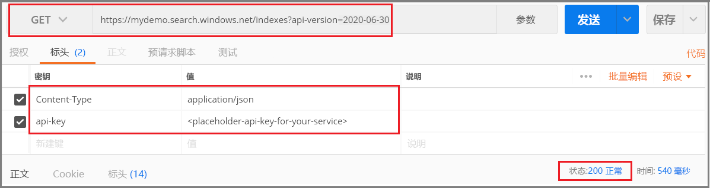

# <a name="tutorial-index-json-blobs-from-azure-storage-using-rest"></a>教程：使用 REST 为 Azure 存储中的 JSON Blob 编制索引

Azure 认知搜索可使用一个知晓如何读取半结构化数据的[索引器](search-indexer-overview.md)来编制 Azure blob 存储中 JSON 文档和数组的索引。 半结构化数据包含用于分隔数据中的内容的标记或标签。 它的本质是提供必须全面索引的非结构化数据和符合数据模型的正式结构化数据之间的一个折中，例如可以按字段编制索引的关系数据库架构。

本教程使用 Postman 和[搜索 REST API](https://docs.microsoft.com/rest/api/searchservice/) 执行以下任务：

> [!div class="checklist"]
> * 为 Azure blob 容器配置 Azure 认知搜索数据源
> * 创建 Azure 认知搜索索引以包含可搜索的内容
> * 配置和运行索引器以读取容器和从 Azure blob 存储中提取可搜索内容
> * 搜索刚刚创建的索引

如果没有 Azure 订阅，请在开始之前创建一个[免费帐户](https://azure.microsoft.com/free/?WT.mc_id=A261C142F)。

## <a name="prerequisites"></a>先决条件

+ [Azure 存储](https://docs.microsoft.com/azure/storage/common/storage-quickstart-create-account)
+ [Postman 桌面应用](https://www.getpostman.com/)
+ [创建](search-create-service-portal.md)或[查找现有搜索服务](https://ms.portal.azure.com/#blade/HubsExtension/BrowseResourceBlade/resourceType/Microsoft.Search%2FsearchServices) 

> [!Note]
> 可在本教程中使用免费服务。 免费搜索服务限制为三个索引、三个索引器和三个数据源。 本教程每样创建一个。 在开始之前，请确保服务中有足够的空间可接受新资源。

## <a name="download-files"></a>下载文件

[Clinical-trials-json.zip](https://github.com/Azure-Samples/storage-blob-integration-with-cdn-search-hdi/raw/master/clinical-trials-json.zip) 包含本教程使用的数据。 请下载此文件并将其解压缩到其自身的文件夹。 数据源自 [clinicaltrials.gov](https://clinicaltrials.gov/ct2/results)，已为本教程转换为 JSON。

## <a name="1---create-services"></a>1 - 创建服务

本教程使用 Azure 认知搜索进行索引编制和查询，并使用 Azure Blob 存储提供数据。 

如果可能，请在同一区域和资源组中创建这两个服务，使它们相互靠近并易于管理。 在实践中，Azure 存储帐户可位于任意区域。

### <a name="start-with-azure-storage"></a>从 Azure 存储开始

1. [登录到 Azure 门户](https://portal.azure.com/)并单击“+ 创建资源”。 

1. 搜索“存储帐户”，并选择“Microsoft 的存储帐户”产品/服务。 

   

1. 在“基本信息”选项卡中，必须填写以下项。 对于其他任何字段，请接受默认设置。

   + 资源组  。 选择现有的资源组或创建新资源组，但对于所有服务请使用相同的组，以便可以统一管理这些服务。

   + **存储帐户名称**。 如果你认为将来可能会用到相同类型的多个资源，请使用名称来区分类型和区域，例如 *blobstoragewestus*。 

   + **位置**。 如果可能，请选择 Azure 认知搜索和认知服务所用的相同位置。 使用一个位置可以避免带宽费用。

   + **帐户类型**。 选择默认设置“StorageV2 (常规用途 v2)”  。

1. 单击“查看 + 创建”以创建服务。 

1. 创建后，单击“转到资源”打开“概述”页。 

1. 单击“Blob”服务。 

1. [创建一个 Blob 容器](https://docs.microsoft.com/azure/storage/blobs/storage-quickstart-blobs-portal)用于包含示例数据。 可将“公共访问级别”设为任何有效值。

1. 创建容器后，将其打开，然后在命令栏中选择“上传”  。

   

1. 导航到包含示例文件的文件夹。 选择所有这些文件，然后单击“上传”  。

   

上传完成后，这些文件应会显示在数据容器内其自身的子文件夹中。

### <a name="azure-cognitive-search"></a>Azure 认知搜索

下一个资源是可以[在门户中创建](search-create-service-portal.md)的 Azure 认知搜索。 可使用免费层完成本演练。 

与处理 Azure Blob 存储时一样，请花片刻时间来收集访问密钥。 此外，在开始构建请求时，需要提供终结点和管理 API 密钥用于对每个请求进行身份验证。

### <a name="get-a-key-and-url"></a>获取密钥和 URL

REST 调用需要在每个请求中使用服务 URL 和访问密钥。 搜索服务是使用这二者创建的，因此，如果向订阅添加了 Azure 认知搜索，则请按以下步骤获取必需信息：

1. [登录到 Azure 门户](https://portal.azure.com/)，在搜索服务的“概述”页中获取 URL。  示例终结点可能类似于 `https://mydemo.search.windows.net`。

1. 在“设置” > “密钥”中，获取有关该服务的完全权限的管理员密钥   。 有两个可交换的管理员密钥，为保证业务连续性而提供，以防需要滚动一个密钥。 可以在请求中使用主要或辅助密钥来添加、修改和删除对象。


所有请求对发送到服务的每个请求都需要 API 密钥。 具有有效的密钥可以在发送请求的应用程序与处理请求的服务之间建立信任关系，这种信任关系以每个请求为基础。

## <a name="2---set-up-postman"></a>2 - 设置 Postman

启动 Postman 并设置 HTTP 请求。 如果不熟悉此工具，请参阅[使用 Postman 探索 Azure 认知搜索 REST API](search-get-started-postman.md) 了解详细信息。

本教程中每个调用的请求方法是 **POST** 和 **GET**。 你将向搜索服务发出三个 API 调用，以创建数据源、索引和索引器。 数据源包含指向存储帐户的指针以及 JSON 数据。 加载数据时，搜索服务会建立连接。

在标头中，将“Content-type”设置为 `application/json`，将 `api-key` 设置为 Azure 认知搜索服务的管理 API 密钥。 设置标头后，可将其用于本练习中的每个请求。

  

URI 必须指定 api-version，每个调用应返回 **201 Created**。 用于使用 JSON 数组的正式版 api-version 为 `2019-05-06`。

## <a name="3---create-a-data-source"></a>3 - 创建数据源

[创建数据源 API](https://docs.microsoft.com/rest/api/searchservice/create-data-source) 可创建一个 Azure 认知搜索对象，用于指定要编制索引的数据。

1. 请将此调用的终结点设置为 `https://[service name].search.windows.net/datasources?api-version=2019-05-06`。 请将 `[service name]` 替换为搜索服务的名称。 

1. 将以下 JSON 复制到请求正文中。

    ```json
    {
        "name" : "clinical-trials-json-ds",
        "type" : "azureblob",
        "credentials" : { "connectionString" : "DefaultEndpointsProtocol=https;AccountName=[storage account name];AccountKey=[storage account key];" },
        "container" : { "name" : "[blob container name]"}
    }
    ```

1. 将连接字符串替换为帐户的有效字符串。

1. 将“[blob container name]”替换成为示例数据创建的容器。 

1. 发送请求。 响应应如下所示：

    ```json
    {
        "@odata.context": "https://exampleurl.search.windows.net/$metadata#datasources/$entity",
        "@odata.etag": "\"0x8D505FBC3856C9E\"",
        "name": "clinical-trials-json-ds",
        "description": null,
        "type": "azureblob",
        "subtype": null,
        "credentials": {
            "connectionString": "DefaultEndpointsProtocol=https;AccountName=[mystorageaccounthere];AccountKey=[[myaccountkeyhere]]];"
        },
        "container": {
            "name": "[mycontainernamehere]",
            "query": null
        },
        "dataChangeDetectionPolicy": null,
        "dataDeletionDetectionPolicy": null
    }
    ```

## <a name="4---create-an-index"></a>4 - 创建索引
    
第二次调用的是[创建索引 API](https://docs.microsoft.com/rest/api/searchservice/create-index)，用于创建可存储所有可搜索数据的 Azure 认知搜索索引。 索引指定所有参数及其属性。

1. 请将此调用的终结点设置为 `https://[service name].search.windows.net/indexes?api-version=2019-05-06`。 请将 `[service name]` 替换为搜索服务的名称。

1. 将以下 JSON 复制到请求正文中。

    ```json
    {
      "name": "clinical-trials-json-index",  
      "fields": [
      {"name": "FileName", "type": "Edm.String", "searchable": false, "retrievable": true, "facetable": false, "filterable": false, "sortable": true},
      {"name": "Description", "type": "Edm.String", "searchable": true, "retrievable": false, "facetable": false, "filterable": false, "sortable": false},
      {"name": "MinimumAge", "type": "Edm.Int32", "searchable": false, "retrievable": true, "facetable": true, "filterable": true, "sortable": true},
      {"name": "Title", "type": "Edm.String", "searchable": true, "retrievable": true, "facetable": false, "filterable": true, "sortable": true},
      {"name": "URL", "type": "Edm.String", "searchable": false, "retrievable": false, "facetable": false, "filterable": false, "sortable": false},
      {"name": "MyURL", "type": "Edm.String", "searchable": false, "retrievable": true, "facetable": false, "filterable": false, "sortable": false},
      {"name": "Gender", "type": "Edm.String", "searchable": false, "retrievable": true, "facetable": true, "filterable": true, "sortable": false},
      {"name": "MaximumAge", "type": "Edm.Int32", "searchable": false, "retrievable": true, "facetable": true, "filterable": true, "sortable": true},
      {"name": "Summary", "type": "Edm.String", "searchable": true, "retrievable": true, "facetable": false, "filterable": false, "sortable": false},
      {"name": "NCTID", "type": "Edm.String", "key": true, "searchable": true, "retrievable": true, "facetable": false, "filterable": true, "sortable": true},
      {"name": "Phase", "type": "Edm.String", "searchable": false, "retrievable": true, "facetable": true, "filterable": true, "sortable": false},
      {"name": "Date", "type": "Edm.String", "searchable": false, "retrievable": true, "facetable": false, "filterable": false, "sortable": true},
      {"name": "OverallStatus", "type": "Edm.String", "searchable": false, "retrievable": true, "facetable": true, "filterable": true, "sortable": false},
      {"name": "OrgStudyId", "type": "Edm.String", "searchable": true, "retrievable": true, "facetable": false, "filterable": true, "sortable": false},
      {"name": "HealthyVolunteers", "type": "Edm.String", "searchable": false, "retrievable": true, "facetable": true, "filterable": true, "sortable": false},
      {"name": "Keywords", "type": "Collection(Edm.String)", "searchable": true, "retrievable": true, "facetable": true, "filterable": false, "sortable": false},
      {"name": "metadata_storage_last_modified", "type":"Edm.DateTimeOffset", "searchable": false, "retrievable": true, "filterable": true, "sortable": false},
      {"name": "metadata_storage_size", "type":"Edm.String", "searchable": false, "retrievable": true, "filterable": true, "sortable": false},
      {"name": "metadata_content_type", "type":"Edm.String", "searchable": true, "retrievable": true, "filterable": true, "sortable": false}
      ]
    }
   ```

1. 发送请求。 响应应如下所示：

    ```json
    {
        "@odata.context": "https://exampleurl.search.windows.net/$metadata#indexes/$entity",
        "@odata.etag": "\"0x8D505FC00EDD5FA\"",
        "name": "clinical-trials-json-index",
        "fields": [
            {
                "name": "FileName",
                "type": "Edm.String",
                "searchable": false,
                "filterable": false,
                "retrievable": true,
                "sortable": true,
                "facetable": false,
                "key": false,
                "indexAnalyzer": null,
                "searchAnalyzer": null,
                "analyzer": null,
                "synonymMaps": []
            },
            {
                "name": "Description",
                "type": "Edm.String",
                "searchable": true,
                "filterable": false,
                "retrievable": false,
                "sortable": false,
                "facetable": false,
                "key": false,
                "indexAnalyzer": null,
                "searchAnalyzer": null,
                "analyzer": null,
                "synonymMaps": []
            },
            ...
          }
    ```

## <a name="5---create-and-run-an-indexer"></a>5 - 创建并运行索引器

索引器连接到数据源，将数据导入目标搜索索引，并选择性地提供一个计划来自动执行数据刷新。 REST API 为[创建索引器](https://docs.microsoft.com/rest/api/searchservice/create-indexer)。

1. 请将此调用的 URI 设置为 `https://[service name].search.windows.net/indexers?api-version=2019-05-06`。 请将 `[service name]` 替换为搜索服务的名称。

1. 将以下 JSON 复制到请求正文中。

    ```json
    {
      "name" : "clinical-trials-json-indexer",
      "dataSourceName" : "clinical-trials-json-ds",
      "targetIndexName" : "clinical-trials-json-index",
      "parameters" : { "configuration" : { "parsingMode" : "jsonArray" } }
    }
    ```

1. 发送请求。 系统会立即处理该请求。 当响应返回时，便拥有了可进行全文搜索的索引。 响应应如下所示：

    ```json
    {
        "@odata.context": "https://exampleurl.search.windows.net/$metadata#indexers/$entity",
        "@odata.etag": "\"0x8D505FDE143D164\"",
        "name": "clinical-trials-json-indexer",
        "description": null,
        "dataSourceName": "clinical-trials-json-ds",
        "targetIndexName": "clinical-trials-json-index",
        "schedule": null,
        "parameters": {
            "batchSize": null,
            "maxFailedItems": null,
            "maxFailedItemsPerBatch": null,
            "base64EncodeKeys": null,
            "configuration": {
                "parsingMode": "jsonArray"
            }
        },
        "fieldMappings": [],
        "enrichers": [],
        "disabled": null
    }
    ```

## <a name="6---search-your-json-files"></a>6 - 搜索 JSON 文件

加载第一个文档后，可立即开始搜索。

1. 将谓词更改为 **GET**。

1. 请将此调用的 URI 设置为 `https://[service name].search.windows.net/indexes/clinical-trials-json-index/docs?search=*&api-version=2019-05-06&$count=true`。 请将 `[service name]` 替换为搜索服务的名称。

1. 发送请求。 这是一个未指定的全文搜索查询，它返回索引中标记为可检索的所有字段，以及文档计数。 响应应如下所示：

    ```json
    {
        "@odata.context": "https://exampleurl.search.windows.net/indexes('clinical-trials-json-index')/$metadata#docs(*)",
        "@odata.count": 100,
        "value": [
            {
                "@search.score": 1.0,
                "FileName": "NCT00000102.txt",
                "MinimumAge": 14,
                "Title": "Congenital Adrenal Hyperplasia: Calcium Channels as Therapeutic Targets",
                "MyURL": "https://azure.storagedemos.com/clinical-trials/NCT00000102.txt",
                "Gender": "Both",
                "MaximumAge": 35,
                "Summary": "This study will test the ability of extended release nifedipine (Procardia XL), a blood pressure medication, to permit a decrease in the dose of glucocorticoid medication children take to treat congenital adrenal hyperplasia (CAH).",
                "NCTID": "NCT00000102",
                "Phase": "Phase 1/Phase 2",
                "Date": "ClinicalTrials.gov processed this data on October 25, 2016",
                "OverallStatus": "Completed",
                "OrgStudyId": "NCRR-M01RR01070-0506",
                "HealthyVolunteers": "No",
                "Keywords": [],
                "metadata_storage_last_modified": "2019-04-09T18:16:24Z",
                "metadata_storage_size": "33060",
                "metadata_content_type": null
            },
            . . . 
    ```

1. 添加 `$select` 查询参数以将结果限制为更少的字段：`https://[service name].search.windows.net/indexes/clinical-trials-json-index/docs?search=*&$select=Gender,metadata_storage_size&api-version=2019-05-06&$count=true`。  对于此查询，有 100 个匹配的文档，但默认情况下，Azure 认知搜索仅在结果中返回 50 个文档。

   

1. 更复杂查询的示例包含 `$filter=MinimumAge ge 30 and MaximumAge lt 75`，它只返回参数 MinimumAge 大于或等于 30 且参数 MaximumAge 小于 75 的结果。 请将 `$select` 表达式替换为 `$filter` 表达式。

   

还可以使用逻辑运算符（and、or、not）和比较运算符（eq、ne、gt、lt、ge、le）。 字符串比较区分大小写。 有关详细信息和示例，请参阅[创建简单查询](search-query-simple-examples.md)。

> [!NOTE]
> `$filter` 参数只适用于在创建索引时标记为可筛选的元数据。

## <a name="reset-and-rerun"></a>重置并重新运行

在开发的前期试验阶段，设计迭代的最实用方法是，删除 Azure 认知搜索中的对象，并允许代码重新生成它们。 资源名称是唯一的。 删除某个对象后，可以使用相同的名称重新创建它。

可以使用门户来删除索引、索引器和数据源。 或者使用 **DELETE** 并提供每个对象的 URL。 以下命令删除一个索引器。

```http
DELETE https://[YOUR-SERVICE-NAME].search.windows.net/indexers/clinical-trials-json-indexer?api-version=2019-05-06
```

成功删除后会返回状态代码 204。

## <a name="clean-up-resources"></a>清理资源

在自己的订阅中操作时，最好在项目结束时删除不再需要的资源。 持续运行资源可能会产生费用。 可以逐个删除资源，也可以删除资源组以删除整个资源集。

可以使用左侧导航窗格中的“所有资源”或“资源组”链接在门户中查找和管理资源。

## <a name="next-steps"></a>后续步骤

熟悉 Azure Blob 索引编制的基础知识后，接下来让我们更详细地了解 Azure 存储中 JSON Blob 的索引器配置。

> [!div class="nextstepaction"]
> [配置 JSON Blob 索引](search-howto-index-json-blobs.md)