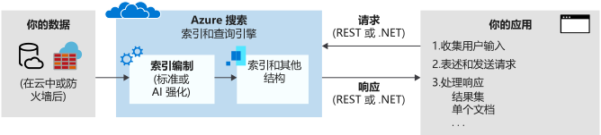

# Azure 认知搜索是什么？

Azure 认知搜索（[以前称为“Azure 搜索”](whats-new.md#new-service-name)）是一种搜索即服务云解决方案，它为开发人员提供 API 和工具，以便基于 Web、移动和企业应用程序中的专用异类内容添加丰富的搜索体验。 代码或工具调用数据引入（索引）来创建和加载索引。 或者，可以添加认知技能，以便在编制索引期间应用 AI 流程。 这样可以添加用于搜索和其他方案的新信息与结构。

在服务的另一端，应用程序代码发出查询请求并处理响应。 使用 Azure 认知搜索中的功能在客户端中定义搜索体验，通过在服务中创建，拥有并存储的持久索引执行查询。

功能通过简单的 [REST API](/rest/api/searchservice/) 或 [.NET SDK](search-howto-dotnet-sdk.md) 公开，消除了信息检索固有的复杂性。 除了 API，Azure 门户还通过原型制作和查询索引工具，提供管理和内容管理支持。 因为服务在云中运行，所以基础结构和可用性由 Microsoft 管理。

## 何时使用 Azure 认知搜索

Azure 认知搜索非常适合以下应用方案：

+ 将异构内容类型整合成单个专用的可搜索索引。 查询始终基于你创建并连同文档一起加载的索引，索引始终驻留在云中的 Azure 认知搜索服务上。 可以在索引中填充来自任何源或平台的 JSON 文档流。 或者，对于源自 Azure 的内容，可以使用索引器将数据提取到索引中。  索引定义和管理/所有权是使用 Azure 认知搜索的重要原因。

+ 原始内容是 Azure 数据源（例如 Azure Blob 存储或 Cosmos DB）中的大型无差别文本、图像文件或应用程序文件（例如 Office 内容类型）。 可以在编制索引期间应用认知技能，以添加结构，或者从图像和应用程序文件中提取含义。

+ 轻松实现搜索相关的功能。 Azure 认知搜索 API 简化了查询构造、分面导航、筛选器（包括地理空间搜索）、同义词映射、自动提示查询和相关性优化。 使用内置功能可以满足最终用户对搜索体验的预期，使其觉得该体验类似于商用 Web 搜索引擎。

+ 为非结构化文本编制索引，或者从图像文件中提取文本和信息。 Azure 认知搜索的 [AI 扩充](cognitive-search-concept-intro.md)功能将 AI 处理添加到索引管道。 一些常见用例包括对扫描的文档进行 OCR 识别、在大型文档中进行实体识别和关键短语提取、语言检测和文本翻译，以及情绪分析。

+ 使用 Azure 认知搜索的自定义和语言分析器可以满足语言要求。 如果你使用非英语内容，Azure 认知搜索支持 Lucene 分析器和 Microsoft 的自然语言处理器。 还可以配置分析器以实现原始内容的专业处理，例如筛选出标注字符。

## 功能说明

| 核心搜索&nbsp;&nbsp;&nbsp;&nbsp;&nbsp;&nbsp;&nbsp;&nbsp;&nbsp;&nbsp;&nbsp;&nbsp;&nbsp;&nbsp;&nbsp;&nbsp;&nbsp;&nbsp;&nbsp;&nbsp;&nbsp;&nbsp;&nbsp;&nbsp;&nbsp;  | 功能 |
|-------------------|----------|
|自由格式文本搜索 | [全文搜索  ](search-lucene-query-architecture.md)是大多数基于搜索的应用的主要用例。 查询可以使用支持的语法进行陈述。   [简单查询语法](query-simple-syntax.md)提供逻辑运算符、短语搜索运算符、后缀运算符和优先运算符  。  [Lucene 查询语法](query-lucene-syntax.md)包括简单语法中的所有操作，以及模糊搜索、邻近搜索、术语提升和正则表达式扩展  。|
| 相关性 | [**简单计分**](index-add-scoring-profiles.md)是 Azure 认知搜索的主要优势。 计分配置文件用于在文档中自行将相关性建模为值的函数。 例如，你可能希望较新产品或打折产品显示在搜索结果的顶部位置。 也可以基于已跟踪和单独存储的客户搜索首选项将标记用于个性化计分，来生成计分配置文件。 |
| 地理搜索 | Azure 认知搜索可以处理、筛选和显示地理位置。 它可以让用户基于搜索结果与物理位置的临近程度浏览数据。 [观看此视频](https://channel9.msdn.com/Shows/Data-Exposed/Azure-Search-and-Geospatial-Data)或[查看此示例](https://github.com/Azure-Samples/search-dotnet-asp-net-mvc-jobs)了解详细信息。 |
| 筛选器和分面导航 | 通过单个查询参数实现[**分面导航**](search-faceted-navigation.md)。 Azure 认知搜索返回一个分面导航结构，可以将该结构用作类别列表背后的代码，用于自定向筛选（例如，按价格范围或品牌来筛选目录项）。    可以使用[**筛选器**](query-odata-filter-orderby-syntax.md)将分面导航纳入到应用程序的 UI 中，改进查询表述，以及基于用户或开发人员指定的条件进行筛选。 可以使用 OData 语法创建筛选器。 |
| 用户体验功能 | 可以为搜索栏中预先键入的查询启用[自动完成  ](search-autocomplete-tutorial.md)。   [**搜索建议**](https://docs.microsoft.com/rest/api/searchservice/suggesters)也基于搜索栏中的部分文本输入开始工作，但结果是索引中的实际文档而不是查询术语。   [**同义词**](search-synonyms.md)功能无需用户提供替换术语，便可关联隐式扩展查询范围的等效术语。   [命中项突出显示](https://docs.microsoft.com/rest/api/searchservice/Search-Documents)向搜索结果中的匹配关键字应用文本格式设置。  可以选择哪些字段返回突出显示的片段。  [**排序**](https://docs.microsoft.com/rest/api/searchservice/Search-Documents)通过索引架构覆盖多个字段，可以使用一个搜索参数在查询时进行切换。   通过 Azure 认知搜索所提供的对搜索结果的优化控制，[**分页**](search-pagination-page-layout.md)和限制搜索结果将变得更简单。    |

| AI&nbsp;扩充&nbsp;&nbsp;&nbsp;&nbsp;&nbsp;&nbsp;&nbsp;&nbsp;&nbsp;&nbsp;&nbsp;       | 功能 |
|-------------------|----------|
|在编制索引期间进行 AI 处理 | 适用于图像和文本分析的 [**AI 扩充**](cognitive-search-concept-intro.md)可以应用于索引管道，以从原始内容中提取文本信息。 [内置技术](cognitive-search-predefined-skills.md)的一些示例包括：光学字符识别（使扫描的 JPEG 变得可搜索）、实体识别（标识组织、名称或位置）、关键短语识别。 也可[将自定义技术编码](cognitive-search-create-custom-skill-example.md)，以便将其附加到管道。 |
| 存储丰富的内容以供在非搜索场景中分析和使用 | [**知识存储（预览版）** ](knowledge-store-concept-intro.md)是基于 AI 的索引编制的一个扩展。 通过将 Azure 存储用作后端，可以保存在编制索引期间创建的扩充。 这些项目可用于帮助你设计更好的技能集，或创建不含无固定结构或不明确数据的形状和结构。 可以创建定目标到特定工作负荷或用户的这些结构的投影。 还可以直接分析已提取的数据，或将它加载到其他应用中。   |
| 缓存内容 | [**增量扩充（预览版）** ](cognitive-search-incremental-indexing-conceptual.md)将处理限制为仅处理通过对管道进行特定编辑而更改的文档，并对未更改的管道部分使用缓存内容。 |

| 数据导入/编制索引&nbsp; | 功能 |
|----------------------------------|----------|
| 数据源 | Azure 认知搜索索引接受来自任何源的数据，前提是以 JSON 数据结构提交这些数据。    [索引器  ](search-indexer-overview.md)自动引入受支持的 Azure 数据源中的数据，并处理 JSON 序列化。 连接到 [Azure SQL 数据库](search-howto-connecting-azure-sql-database-to-azure-search-using-indexers.md)、[Azure Cosmos DB](search-howto-index-cosmosdb.md) 或 [Azure Blob 存储](search-howto-indexing-azure-blob-storage.md)，以提取主要数据存储中的可搜索内容。 Azure Blob 索引器可以执行“文档破解”[从主要文件格式提取文本](search-howto-indexing-azure-blob-storage.md)，包括 Microsoft Office、PDF 和 HTML 文档。  |
| 分层的嵌套数据结构 | 借助[复杂类型  ](search-howto-complex-data-types.md)和集合，可以将几乎所有类型的 JSON 结构建模为 Azure 认知搜索索引。 可以通过集合、复杂类型和复杂类型集合，以本机方式表示一对多和多对多基数。|
| 语言分析 | 分析器是在编制索引和搜索操作期间用于处理文本的组件。 有两种类型。   [自定义词汇分析器](index-add-custom-analyzers.md)用于使用拼音匹配和正则表达式的复杂搜索查询  。   Lucene 或 Microsoft 的[语言分析器](index-add-language-analyzers.md)用于智能处理特定于语言的语言学，包括谓词时态、词性、不规则复数名词（例如“mouse”与“mice”）、词取消复合、词拆分（对于不带空格的语言）等  。   |

| 平台级别&nbsp;&nbsp;&nbsp;&nbsp;&nbsp;&nbsp;&nbsp;&nbsp;&nbsp;&nbsp;&nbsp;&nbsp;&nbsp;&nbsp;| 功能 |
|-------------------|----------|
| 用于原型制作和检查的工具 | 在门户中，可以使用[**导入数据向导**](search-import-data-portal.md)来配置索引器、索引设计器以建立索引，并可以使用[**搜索浏览器**](search-explorer.md)来测试查询并优化评分配置文件。 还可以打开任何索引来查看其架构。 |
| 监视和诊断 | [启用监视功能  ](search-monitor-usage.md)可查看除门户中始终可见的一目了然指标外的其他指标。 门户页面中会捕获并报告关于每秒查询数、延迟和限制的指标，无需额外进行配置。|
| 服务器端加密 | [Microsoft 托管的静态加密  ](search-security-overview.md#encrypted-transmission-and-storage)内置在内部存储层中，它是不可撤消的。 可以视需要使用[客户托管的加密密钥  ](search-security-manage-encryption-keys.md)来补充默认加密。 你在 Azure Key Vault 中创建和管理的密钥用于加密 Azure 认知搜索中的索引和同义词映射。 |
| 基础结构 | **高可用性平台**确保极其可靠的搜索服务体验。 正确缩放时，[Azure 认知搜索可提供 99.9% SLA](https://azure.microsoft.com/support/legal/sla/search/v1_0/)。   作为一种**完全托管且可缩放的**端到端解决方案，Azure 认知搜索绝对不需要基础结构管理。 通过在两个维度进行缩放以便处理更多文档存储和/或更高的查询负载，可以根据需求来定制服务。  |

## 如何使用 Azure 认知搜索
### 步骤 1：预配服务
可以通过 [Azure 门户](https://portal.azure.com/)或 [Azure 资源管理 API](/rest/api/searchmanagement/) 预配 Azure 认知搜索服务。 可以选择与其他订阅者共享的免费服务，或者服务专用的资源[付费层](https://azure.microsoft.com/pricing/details/search/)。 对于付费层，可朝两个维度缩放服务： 

- 添加副本以增长容量来处理重型查询负载。   
- 添加分区以便为更多文档增加存储。 

通过单独处理文档存储和查询吞吐量，可以根据生产要求进行资源调配。

### 步骤 2：创建索引
上传可搜索的内容之前，必须先定义 Azure 认知搜索索引。 索引类似于用于保存数据的数据库表，可接受搜索查询。 定义要映射的索引架构，以反映要搜索的文档结构，这类似于数据库中的字段。

架构可在 Azure 门户中创建，也可以[使用 .NET SDK](search-howto-dotnet-sdk.md) 或 [REST API](/rest/api/searchservice/) 以编程方式创建。

### 步骤 3：加载数据
定义索引后，便可以上传内容。 可以使用推送或提取模型。

提取模型从外部数据源检索数据。 支持通过*索引器*检索数据。索引器可以简化和自动数据引入的方方面面，例如，连接、读取和序列化数据。 [索引器](/rest/api/searchservice/Indexer-operations)适用于 Azure Cosmos DB、Azure SQL 数据库、Azure Blob 存储，以及 Azure VM 中托管的 SQL Server。 可以针对按需刷新或计划的数据刷新配置索引器。

推模型通过 SDK 或 REST API 进行提供，用于将更新的文档发送到索引。 可以从使用 JSON 格式的几乎任何数据集推送数据。 有关加载数据的指南，请参阅[添加、更新或删除文档](/rest/api/searchservice/addupdate-or-delete-documents)或[如何使用.NET SDK）](search-howto-dotnet-sdk.md)。

### 步骤 4：搜索
填充索引后，可以通过将简单的 HTTP 请求与 [REST API](/rest/api/searchservice/Search-Documents) 或 [.NET SDK](https://docs.microsoft.com/dotnet/api/microsoft.azure.search.idocumentsoperations) 结合使用，向服务终结点[发出搜索查询](search-query-overview.md)。

逐步完成[创建第一个搜索应用](tutorial-csharp-create-first-app.md)以进行构建，然后扩展用于收集用户输入并处理结果的网页。 还可以使用 [Postman 进行交互式 REST](search-get-started-postman.md) 调用，或使用 Azure 门户中内置的[搜索浏览器](search-explorer.md)来查询现有索引。

## 它如何进行比较

客户常常询问 Azure 认知搜索与其他搜索相关解决方案有何不同。 下表总结主要区别。

| 比较对象 | 主要区别 |
|-------------|-----------------|
|必应 | [必应 Web 搜索 API](https://docs.microsoft.com/azure/cognitive-services/bing-web-search/) 在 Bing.com 上搜索索引以匹配提交的搜索词。 索引从 HTML、XML 和公共网站上的其他 Web 内容生成。 [必应自定义搜索](https://docs.microsoft.com/azure/cognitive-services/bing-custom-search/)构建于同一基础之上，针对 Web 内容类型提供相同的爬网技术，范围覆盖单个网站。  Azure 认知搜索可搜索定义的索引，填充拥有的数据和文档，常常来自多个不同的源。 Azure 认知搜索通过[索引器](search-indexer-overview.md)具有一些数据源的爬网功能，但可以将符合索引架构的任何 JSON 文档推送到单个统一的可搜索资源。 |
|数据库搜索 | 许多数据库平台都包含内置的搜索体验。 SQL Server 具有[全文搜索](https://docs.microsoft.com/sql/relational-databases/search/full-text-search)。 Cosmos DB 及类似技术具有可查询的索引。 在评估结合使用搜索和存储的产品时，确定要采用哪种方式可能颇具挑战性。 许多解决方案同时使用两种：使用 DBMS 进行存储，使用 Azure 认知搜索获取专业搜索功能。  与 DBMS 搜索相比，Azure 认知搜索存储来自不同来源的内容，并提供专用文本处理功能，例如 [56 种语言](https://docs.microsoft.com/rest/api/searchservice/language-support)中的语言感知文本处理（词干化、词元化、词形式）。 它还支持拼写错误单词的自动更正、[同义词](https://docs.microsoft.com/rest/api/searchservice/synonym-map-operations)、[建议](https://docs.microsoft.com/rest/api/searchservice/suggestions)、[评分控制](https://docs.microsoft.com/rest/api/searchservice/add-scoring-profiles-to-a-search-index)，[Facet](https://docs.microsoft.com/azure/search/search-filters-facets) 和[自定义词汇切分](https://docs.microsoft.com/rest/api/searchservice/custom-analyzers-in-azure-search)。 Azure 认知搜索中的[全文搜索引擎](search-lucene-query-architecture.md)基于 Apache Lucene，它是信息检索方面的行业标准。 尽管 Azure 认知搜索以倒排索引的形式持久存储数据，但它很少能替代真正的数据存储。 有关详细信息，请参阅此[论坛帖子](https://stackoverflow.com/questions/40101159/can-azure-search-be-used-as-a-primary-database-for-some-data)。   资源利用是这个类别的另一个转折点。 索引和一些查询操作通常是计算密集型的。 将搜索从 DBMS 卸载到云中的专用解决方案可以节省用于事务处理的系统资源。 此外，通过将搜索外部化，可以根据查询量轻松调整规模。|
|专用搜索解决方案 | 假设已决定使用全频谱功能进行专用搜索，则需要在本地解决方案或云服务之间进行最终的分类比较。 许多搜索技术提供对索引和查询管道的控制、对更丰富查询和筛选语法的访问、对设置级别和相关性的控制以及自导智能搜索功能。   如果想要获得一个开销和维护工作量极少且规模可调的统包解决方案，则云服务是适当的选择。   在云的范式中，许多提供程序提供相当的基线功能，以及全文搜索、地理搜索，并且能够处理搜索输入中一定程度的模糊性。 通常，它是一项[专用功能](#feature-drilldown)，或者是 API、工具以及用于确定最匹配项的管理功能的易化和总体简化。 |

在所有云提供程序中，对于主要依赖于信息检索搜索和内容导航的应用，Azure 认知搜索在处理 Azure 上的内容存储和数据库的全文搜索工作负荷方面最为强大。 

主要优势包括：

+ 在索引层的 Azure 数据集成（爬网程序）
+ 用于集中管理的 Azure 门户
+ Azure 可伸缩性、可靠性和世界一流的可用性
+ 对原始数据进行 AI 处理，使其更易于搜索，包括识别图像中的文本，或查找非结构化内容中的模式。
+ 语言分析和自定义分析，提供分析器，用于支持以 56 种语言进行可靠的全文搜索
+ [对以搜索为中心的应用通用的核心功能](#feature-drilldown)：评分、分面、建议、同义词、地理搜索，等等。

> [!Note]
> 非 Azure 数据源完全受支持，但依赖于代码密集程度更高的推送方法而不是索引器。 使用 API 可以通过管道将任何 JSON 文档集合传输到 Azure 认知搜索索引。

在我们的所有客户中，能够利用 Azure 认知搜索中最广泛功能的客户包括在线目录、业务线程序以及文档发现应用程序。

## REST API | .NET SDK

虽然可以在门户中执行许多任务，但 Azure 认知搜索是为希望将搜索功能集成到现有应用程序中的开发人员打造的。 可以使用以下编程接口。

|平台 |说明 |
|-----|------------|
|[REST](/rest/api/searchservice/) | 任何编程平台和语言（包括 Xamarin、Java 和 JavaScript）支持的 HTTP 命令|
|[.NET SDK](search-howto-dotnet-sdk.md) | REST API 的 .NET 包装器以 C# 和其他针对 .NET Framework 的托管代码语言提供了有效编码。 |

## 免费试用
Azure 订户可以[在免费层中预配服务](search-create-service-portal.md)。

如果不是订户，可以[免费建立一个 Azure 帐户](https://azure.microsoft.com/pricing/free-trial/?WT.mc_id=A261C142F)。 将获得试用付费版 Azure 服务的信用额度。 额度用完后，可以保留该帐户并继续使用[免费的 Azure 服务](https://azure.microsoft.com/free/)。 除非显式更改设置并要求付费，否则不会对信用卡收取任何费用。

还可以[激活 MSDN 订户权益](https://azure.microsoft.com/pricing/member-offers/msdn-benefits-details/?WT.mc_id=A261C142F)：MSDN 订阅每月提供可用来试用付费版 Azure 服务的信用额度。 

## 如何入门

1. 创建[免费服务](search-create-service-portal.md)。 所有快速入门和教程都可以通过免费服务完成。

2. 逐步学习[有关使用内置工具进行索引和查询的教程](search-get-started-portal.md)。 学习重要概念并熟悉门户提供的信息。

3. 使用 .NET 或 REST API 继续编写代码：

   + [如何使用 .NET SDK](search-howto-dotnet-sdk.md) 演示了托管代码中的主要工作流。  
   + [REST API 入门](https://github.com/Azure-Samples/search-rest-api-getting-started)演示了使用 REST API 的相同步骤。 还可以使用本快速入门从 Postman 或 Fiddler 调用 REST API：[探索 Azure 认知搜索 REST API](search-get-started-postman.md)。

## 观看此视频

搜索引擎是在移动应用中、网站上和公司数据存储中检索信息时常用的驱动程序。 Azure 认知搜索提供了用于打造与大型商业网站上的搜索体验类似的搜索体验的工具。

在这个 15 分钟的视频中，项目经理 Luis Cabrera 介绍了 Azure 认知搜索。 

>[!VIDEO https://www.youtube.com/embed/kOJU0YZodVk?version=3]