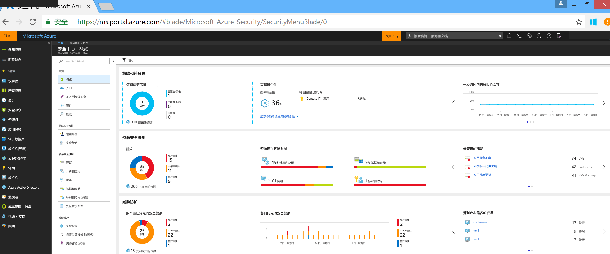
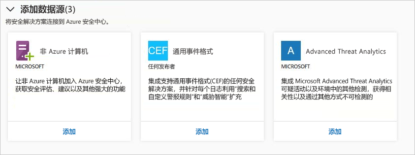
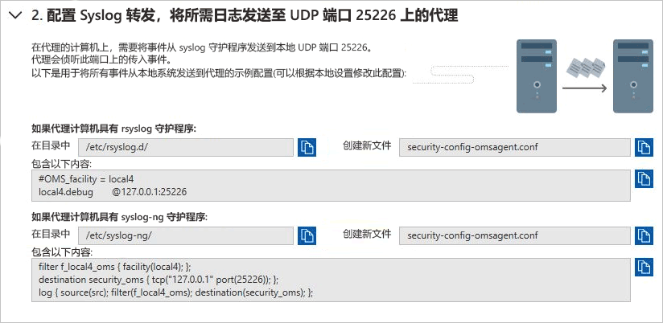
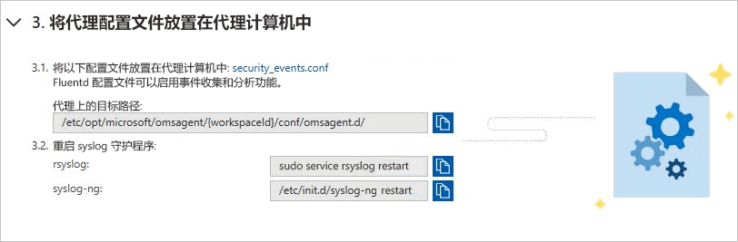
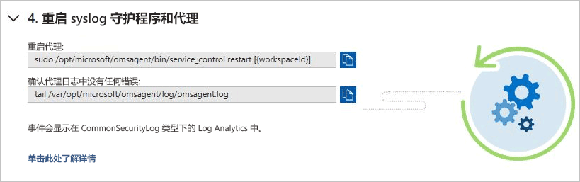
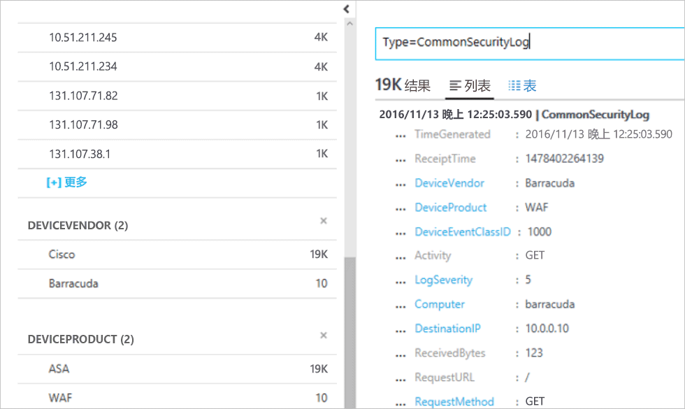

# 快速入门：将安全解决方案连接到安全中心

除了从计算机收集安全数据，还可以从各种其他的安全解决方案（包括支持通用事件格式 (CEF) 的解决方案）集成安全数据。 CEF 是基于 Syslog 消息的行业标准格式，许多安全产品供应商使用它在不同平台之间进行事件集成。

本快速入门演示如何：
- 使用 CEF 日志将安全解决方案连接到安全中心
- 验证与安全解决方案的连接

## 先决条件
若要开始使用安全中心，必须具有 Microsoft Azure 订阅。 如果尚无订阅，可注册[免费帐户](https://azure.microsoft.com/free/)。

若要逐步执行本快速入门，你必须位于安全中心的“标准”定价层。 可以尝试安全中心标准版，头 60 天免费。 快速入门教程“[将 Azure 订阅载入到安全中心标准版](security-center-get-started.md)”详细介绍了如何升级到标准版。

此外还需一台 [Linux 计算机](https://docs.microsoft.com/azure/log-analytics/log-analytics-agent-linux)，其 Syslog 服务已连接到安全中心。

## 使用 CEF 连接解决方案

1. 登录到 [Azure 门户](https://azure.microsoft.com/features/azure-portal/)。
2. 在 **Microsoft Azure** 菜单上选择“安全中心”。 此时会打开“安全中心 - 概览”。

      

3. 在安全中心主菜单下，选择“安全解决方案”。
4. 在“安全解决方案”页的“添加数据源(3)”下，单击“通用事件格式”下的“添加”。

    

5. 在“通用事件格式日志”页中展开第二步：**将 Syslog 转发配置为向 UDP 端口 25226 上的代理发送所需日志**，然后在 Linux 计算机中按以下说明操作：

    

6. 展开第三步：**将代理配置文件放置在代理计算机上**，然后在 Linux 计算机中按以下说明操作：

    

7. 展开第四步：**重启 syslog 守护程序和代理**，然后在 Linux 计算机中按以下说明操作：

    

## 验证连接

在执行以下步骤之前，需耐心等待，直到 syslog 开始向安全中心报告。 这可能需要一些时间，具体取决于环境大小。

1.  在“安全中心”仪表板的左窗格中，单击“搜索”。
2.  选择 Syslog（Linux 计算机）连接到的工作区。
3.  键入 *CommonSecurityLog* 并单击“搜索”按钮。

以下示例显示了这些步骤的结果：

## 清理资源
本系列中的其他快速入门和教程是在本快速入门的基础上制作的。 如果打算继续学习后续的快速入门和教程，请继续运行“标准”层并让自动预配保持启用状态。 如果不打算继续或想要返回到“免费”层，请执行以下操作：

1. 返回到安全中心主菜单，选择“安全策略”。
2. 选择要返回到“免费”层的订阅或策略。 此时会打开“安全策略”。
3. 在“策略组件”下选择“定价层”。
4. 选择“免费”，将订阅从“标准”层更改为“免费”层。
5. 选择“保存”。

如果希望禁用自动预配，请执行以下操作：

1. 返回到安全中心主菜单，选择“安全策略”。
2. 选择希望禁用自动设置的订阅。
3. 在“安全策略 - 数据收集”下的“载入”下选择“关闭”，禁用自动预配。
4. 选择“保存”。

>[!NOTE]
> 禁用自动设置不会从已预配代理的 Azure VM 中删除 Microsoft Monitoring Agent。 禁用自动设置会限制对资源的安全监视。
>

## 后续步骤
本快速入门介绍了如何使用 CEF 将 Linux Syslog 解决方案连接到安全中心。 将 CEF 日志连接到安全中心以后，即可充分利用搜索与自定义警报规则，以及适用于每个日志的威胁智能扩充。 若要详细了解如何使用安全中心，请继续阅读教程，了解如何配置安全策略和评估资源的安全性。

> [!div class="nextstepaction"]
> [教程：定义和评估安全策略](./tutorial-security-policy.md)
