# Azure 安全中心按类型划分的安全警报
本文有助于你了解 Azure 安全中心提供的各类安全警报。 有关如何管理警报的详细信息，请参阅[管理和响应 Azure 安全中心的安全警报](security-center-managing-and-responding-alerts.md)。

> [!NOTE]
> 若要设置高级检测，请升级到 Azure 安全中心标准版。 可免费试用 60 天。 若要升级，请选择“安全策略”中的“定价层”。 若要了解详细信息，请参阅[定价页](https://azure.microsoft.com/pricing/details/security-center/)。
>
>

## 提供了哪类警报？
Azure 安全中心按网络攻击链的不同阶段提供多种警报。 下图显示与部分阶段相关的各种警报。

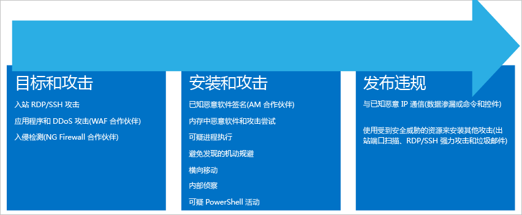

**目标和攻击**

* 入站 RDP/SSH 攻击
* 应用程序和 DDoS 攻击（WAF 合作伙伴）
* 入侵检测（NG 防火墙合作伙伴）

**安装和攻击**

* 已知的恶意软件特征（AM 合作伙伴）
* 内存中的恶意软件和利用漏洞攻击尝试
* 执行可疑进程
* 为了避免被发现而使用的花招
* 横向移动
* 内部侦测
* 可疑的 PowerShell 活动

**入侵后**  

* 与已知恶意 IP 通信（数据泄露或命令和控制）
* 利用受攻击的资源准备其他攻击（出站端口扫描 RDP/SSH 暴力破解攻击，以及垃圾邮件）

每个阶段都有不同类型的相关攻击，这些攻击针对不同的子系统。 为了应对这些阶段的攻击，安全中心设置了三类警报：

* 虚拟机行为分析 (VMBA)
* 网络分析
* 资源分析

## 虚拟机行为分析
Azure 安全中心可以使用行为分析，根据对虚拟机事件日志的分析确定受攻击的资源。 例如进程创建事件和登录事件。 此外，还可以通过与其他信号的关联性，查看是否存在某个广泛传播活动的支持证据。

> [!NOTE]
> 有关安全中心检测功能工作原理的详细信息，请参阅 [Azure 安全中心检测功能](security-center-detection-capabilities.md)。
>
>

### 故障分析
故障转储内存分析是一种用于检测复杂恶意软件的方法，此类恶意软件能够避开传统安全解决方案的检测。 很多形式的恶意软件从不向磁盘写入内容，或者会加密写入到磁盘中的软件组件，尝试减少被防病毒产品检测到的机会。 因此，使用传统的反恶意软件方法难以检测到恶意软件。 但是，此类恶意软件可以通过内存分析检测到，因为恶意软件一运行就必然会在内存中留下踪迹。

当软件故障时，故障转储可捕获故障时的部分内存。 故障可能由恶意软件、常规应用程序问题或系统问题引发。 通过分析故障转储中的内存，安全中心可以检测到用于利用软件漏洞、访问机密数据以及偷偷存留在受攻击计算机中的技术。 此类操作对主机的性能影响很小，因为分析是由安全中心后端执行的。

以下字段常见于本文后面出现的故障转储警报示例：

* DUMPFILE：故障转储文件的名称。
* PROCESSNAME：故障进程的名称。
* PROCESSVERSION：故障进程的版本。

### 发现 Shellcode
Shellcode 是在恶意软件利用软件漏洞之后运行的有效负载。 此警报指示故障转储分析检测到可执行代码表现出通常由恶意有效负载表现出的行为。 虽然非恶意软件可能会表现出此行为，但这在正常的软件开发实践中并不常见。

Shellcode 警报示例提供以下其他字段：

* ADDRESS：在 Shellcode 内存中的位置。

下面是此类警报的示例：

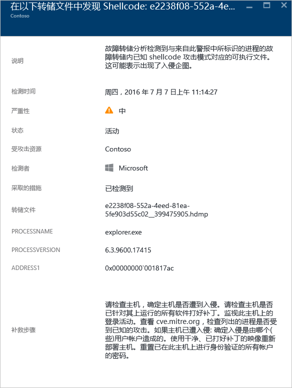

### 发现模块劫持
Windows 通过动态链接库 (DLL) 让软件能够利用常见的 Windows 系统功能。 DLL 劫持发生在恶意软件通过更改 DLL 加载顺序将恶意的有效负载加载到内存中时，可以在内存中执行任意代码。 此警报指示故障转储分析检测到一个名称类似的模块，该模块从两个不同的路径加载。 其中一个加载路径源自常见的 Windows 系统二进制文件位置。

合法的软件开发人员偶尔会因为非恶意的原因（例如进行检测、扩展 Windows OS 或 Windows 应用程序）而更改 DLL 加载顺序。 为了区分对 DLL 加载顺序的恶意更改和可能是善意的更改，Azure 安全中心会检查加载的模块是否跟可疑的配置文件相符。 该检查的结果由警报的“SIGNATURE”字段指示，并反映在警报严重性、警报描述和警报补救步骤中。 若要调查该模块是合法模块还是恶意模块，可分析劫持模块在磁盘上的副本。 例如，可以验证文件的数字签名，也可以运行防病毒扫描。

除了在前面的“发现 Shellcode”部分描述的常见字段，该警报还提供以下字段：

* SIGNATURE：指示劫持模块是否符合描述可疑行为配置文件。
* HIJACKEDMODULE：被劫持的 Windows 系统模块的名称。
* HIJACKEDMODULEPATH：被劫持的 Windows 系统模块的路径。
* HIJACKINGMODULEPATH：劫持模块的路径。

下面是此类警报的示例：

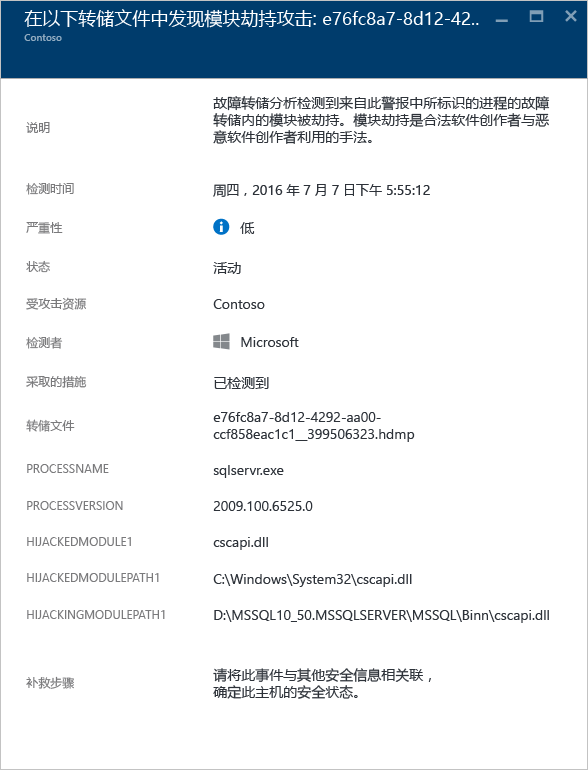

### 检测到伪装 Windows 模块
恶意软件可能会使用 Windows 系统二进制文件（例如 SVCHOST.EXE）或模块（例如 NTDLL.DLL）的常用名，目的是在系统管理员面前“蒙混过关”，避免暴露恶意软件的性质。 此警报指示故障转储分析检测到故障转储文件包含的模块使用 Windows 系统模块名称，但不满足 Windows 模块通常会有的其他标准。 分析伪装模块在磁盘上的副本也许可以进一步揭示该模块的性质，即到底是合法模块还是恶意模块。 分析可能包括：

* 确认相关文件是否为合法软件包随附的文件。
* 验证文件的数字签名。
* 在文件上运行防病毒扫描。

除了在前面的“发现 Shellcode”部分描述的常见字段，该警报还提供以下其他字段：

* DETAILS：描述模块元数据是否有效，以及模块是否是从系统路径加载的。
* NAME：伪装 Windows 模块的名称。
* PATH：伪装 Windows 模块的路径。

此警报还提取和显示模块的 PE 标头中的某些字段，例如“CHECKSUM”和“TIMESTAMP”。 仅当模块中存在这些字段时，才会显示这些字段。 有关这些字段的详细信息，请参阅 [Microsoft PE and COFF Specification](https://msdn.microsoft.com/windows/hardware/gg463119.aspx) （Microsoft PE 和 COFF 规范）。

下面是此类警报的示例：

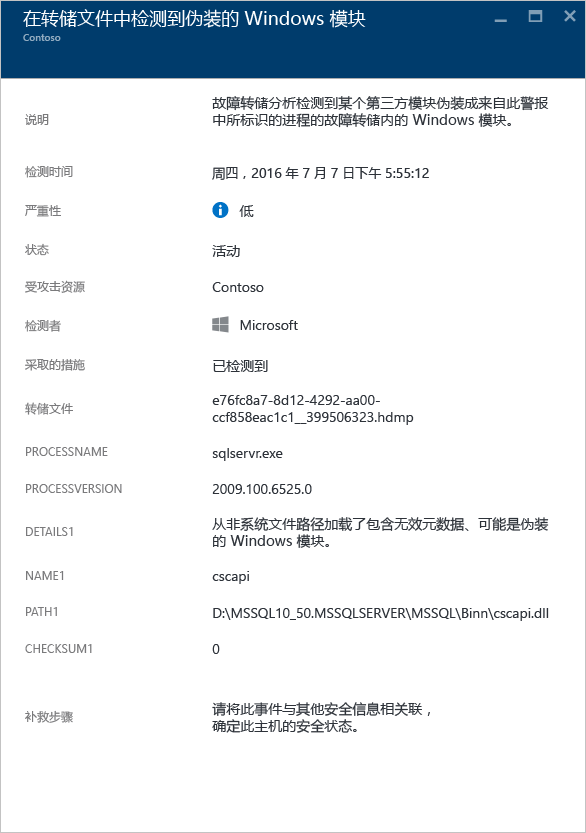

### 发现修改的系统二进制文件
恶意软件可能会修改核心的系统二进制文件，目的是偷偷访问数据或秘密存留在受攻击系统中。 此警报指示故障转储分析检测到核心的 Windows OS 二进制文件已在内存中或磁盘上被修改。

合法软件开发人员偶尔会出于非恶意原因（例如 Detour）或出于应用程序兼容性考虑而修改内存中的系统模块。 为了区分恶意模块和可能是合法的模块，Azure 安全中心会检查修改的模块是否跟可疑的配置文件相符。 该检查的结果表现在警报严重性、警报描述和警报补救步骤中。

除了在前面的“发现 Shellcode”部分描述的常见字段，该警报还提供以下其他字段：

* MODULENAME：已修改的系统二进制文件的名称。
* MODULEVERSION：已修改的系统二进制文件的版本。

下面是此类警报的示例：

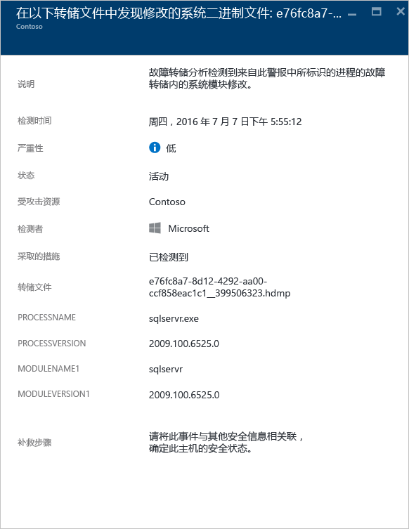

### 执行了可疑进程
安全中心在目标虚拟机中确定运行的可疑进程后，就会触发警报。 检测时，不会查找特定的名称，但会查找可执行文件的参数。 因此，即使攻击者重命名可执行文件，安全中心也能检测到可疑的进程。

下面是此类警报的示例：

### 已查询多个域帐户
安全中心可以检测到查询域帐户的多次尝试，此类尝试通常由攻击者在网络侦测期间完成。 攻击者可以利用此技术来查询域，确定用户、域管理员帐户、属于域控制器的计算机，以及与其他域之间存在的可能的域信任关系。

下面是此类警报的示例：

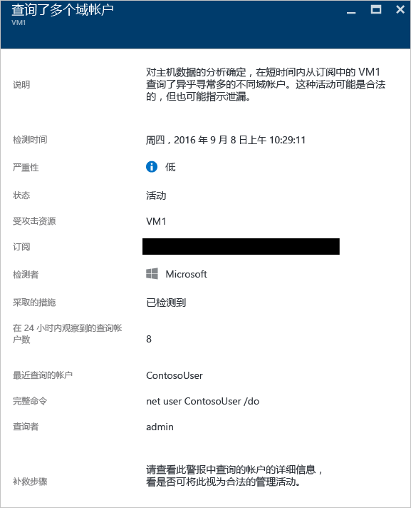

## 网络分析
安全中心进行网络威胁检测的机制是自动收集 Azure IPFIX (Internet Protocol Flow Information Export) 流量中的安全信息。 分析该信息（通常需将多个来源的信息关联起来）即可确定威胁。

### 检测到可疑的传出流量
网络设备的发现和分析方式大致与其他类型的系统相同。 攻击者一开始通常会进行端口扫描。 在下一示例中，你检测到来自 VM 的可疑的安全外壳 (SSH) 流量。 在这种情况下，可能会发生对外部资源的暴力破解攻击或端口扫描攻击。

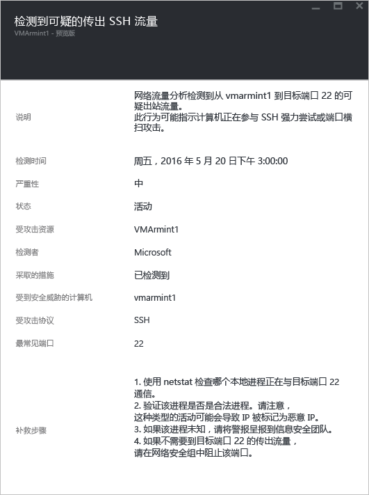

此警报提供的信息可以用来确定攻击者发起该攻击时所使用的资源。 此警报提供的信息还可以用来确定受攻击的计算机、检测时间，以及所使用的协议和端口。 此边栏选项卡还提供了一个列表，其中包含的补救步骤可以用来缓解此问题。

### 与恶意计算机进行网络通信
利用 Microsoft 威胁情报馈送，Azure 安全中心可以检测与恶意 IP 地址通信的受攻击计算机。 在许多情况下，恶意地址为命令和控制中心。 在本示例中，安全中心检测到通信是使用 Pony Loader 恶意软件（也称 [Fareit](https://www.microsoft.com/security/portal/threat/encyclopedia/entry.aspx?Name=PWS:Win32/Fareit.AF)）完成的。

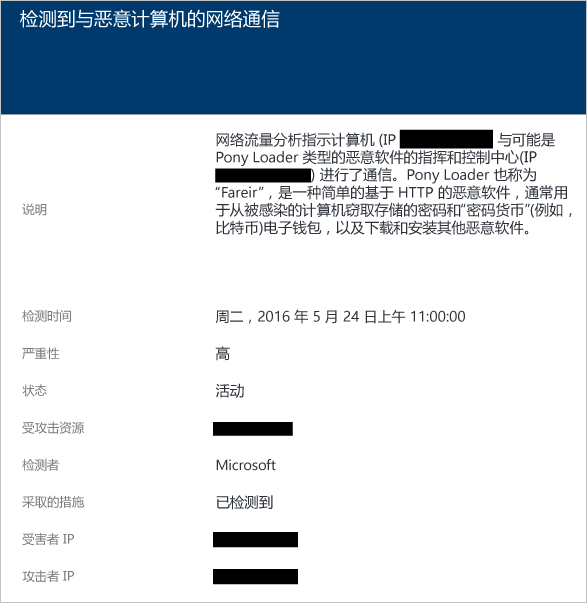

利用此警报提供的信息，你可以确定用于发起该攻击的资源、受攻击的资源、受害 IP、攻击者 IP 以及检测时间。

> [!NOTE]
> 出于隐私考虑，此屏幕截图删除了实时 IP 地址。
>
>

### 检测到可能的传出型拒绝服务攻击
源自某个虚拟机的异常网络流量可能导致安全中心触发潜在的拒绝服务类型的攻击。

下面是此类警报的示例：

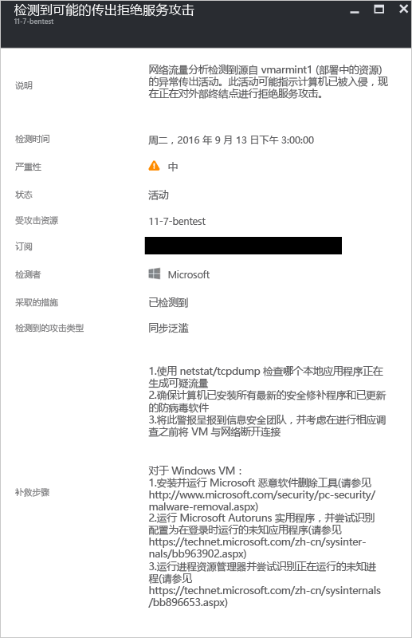

## 资源分析
安全中心资源分析专注于平台即服务 (PaaS) 服务，例如集成 [Azure SQL 数据库威胁检测](../sql-database/sql-database-threat-detection.md)的功能。 安全中心根据这些方面的分析结果触发资源相关警报。

### 潜在 SQL 注入
SQL 注入攻击会将恶意代码插入字符串中，这些字符串随后传递给 SQL Server 实例来完成分析和执行操作。 应该对构建 SQL 语句的任何过程进行检查，检查其中是否存在注入漏洞，因为 SQL Server 会执行其接收的所有在语法上有效的查询。 SQL 威胁检测通过机器学习、行为分析和异常检测确定可能在 Azure SQL 数据库中发生的可疑事件。 例如：

* 前员工尝试进行数据库访问
* SQL 注入攻击
* 用户在家对生产数据库进行异常访问

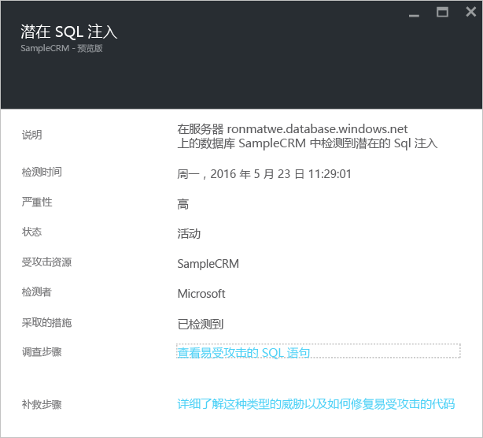

此警报中的信息可以用来确定受攻击的资源、检测时间以及攻击状态。 此警报还提供一个链接，方便你执行进一步的调查步骤。

### 存在易受 SQL 注入攻击的漏洞
在数据库中检测到应用程序错误时，将会触发此警报。 此警报会指示可能存在易受 SQL 注入攻击的漏洞。

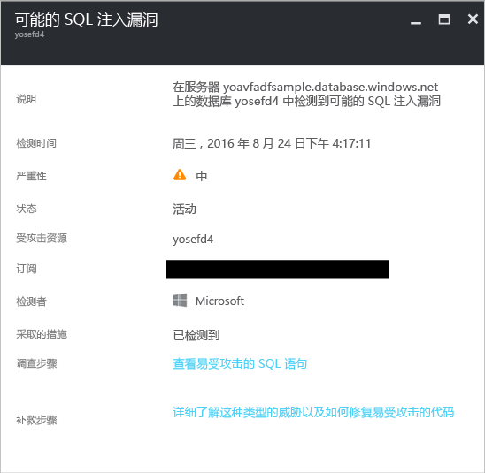

### 从不熟悉的位置进行异常访问
在服务器上检测到用户从某个不熟悉的 IP 地址进行访问，而该访问在上一时段并未见过时，会触发此警报。

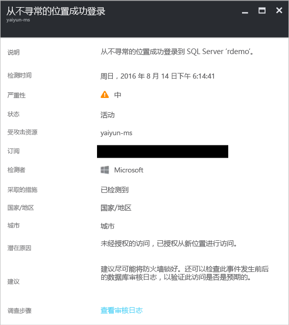

## 另请参阅
本文介绍了安全中心的各类安全警报。 若要了解有关安全中心的详细信息，请参阅以下文章：

* [处理 Azure 安全中心的安全事件](security-center-incident.md)
* [Azure 安全中心检测功能](security-center-detection-capabilities.md)
* [Azure 安全中心规划和操作指南](security-center-planning-and-operations-guide.md)
* [Azure 安全中心常见问题](security-center-faq.md)：查找有关使用服务的常见问题。
* [Azure 安全性博客](http://blogs.msdn.com/b/azuresecurity/) - 查找关于 Azure 安全性及符合性的博客文章。

