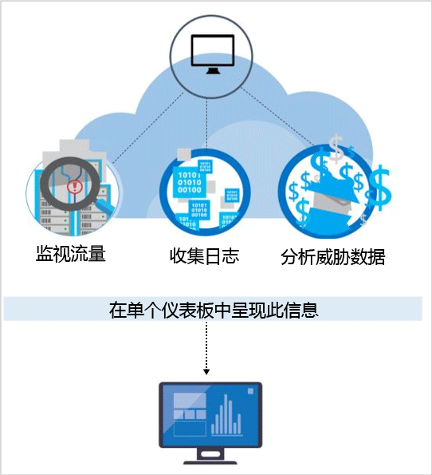

<properties
   pageTitle="Azure 安全中心的检测功能 | Microsoft Azure"
   description="本文档介绍 Azure 安全中心检测功能的机制。"
   services="security-center"
   documentationCenter="na"
   authors="YuriDio"
   manager="swadhwa"
   editor=""/>

<tags
   ms.service="security-center"
   ms.topic="hero-article"
   ms.devlang="na"
   ms.tgt_pltfrm="na"
   ms.workload="na"
   ms.date="08/25/2016"
   ms.author="yurid"/>

# Azure 安全中心检测功能
本文档讨论 Azure 安全中心的高级检测功能，帮助用户确定以 Microsoft Azure 资源为目标的活跃威胁，了解进行快速响应所需的知识。

> [AZURE.NOTE] Azure 安全中心的标准层提供高级检测功能。提供 90 天的免费试用期。可以在[安全策略](security-center-policies.md)中从选择定价层开始升级。访问[“安全中心”页](https://azure.microsoft.com/pricing/details/security-center/)，了解详细的定价情况。

## 应对当前的威胁
过去 20 年里，威胁态势有了很大的改变。在过去，公司通常只需担心网站被各个攻击者改头换面。许多情况下，这些攻击者感兴趣的是看看“自己能够做什么”。而现在，攻击者则更为复杂，更有组织性。他们通常有具体的经济和战略目标。他们的可用资源也更多，因为他们可能是由国家提供资金支持的，可能是有组织犯罪。

因此，攻击者的专业水准前所未有地高。他们不再对篡改网页感兴趣。他们现在感兴趣的是窃取信息、金融帐户和私人数据 – 所有这些都可以用来在公开市场上换钱；他们还感兴趣的是特定的有利用价值的商业、政治或军事职位。比这更引人关注的是，这些以财务为目标的攻击者在侵入网络后会破坏基础结构，对人们造成伤害。

作为响应，组织通常会部署各种点解决方案，查找已知的攻击特征，重点做好企业外围防护或终结点防护。这些解决方案会生成大量的低保真警报，需要安全分析师进行会审和调查。大多数组织缺乏必要的时间和专业技术来响应此类警报 – 许多警报被置之不理。同时，攻击者的攻击方法也在逐渐改进，可以突破许多基于攻击特征的防御，并且可以[适应云环境](https://azure.microsoft.com/blog/detecting-threats-with-azure-security-center/)。必须采用新方法更快地确定新出现的威胁，加快检测和应对速度。

## Azure 安全中心如何检测和应对威胁

Microsoft 安全研究人员始终在不断地寻找威胁。得益于 Microsoft 在云中和本地的广泛存在，他们可以访问大量的遥测数据。由于能够广泛访问和收集各种数据集，Microsoft 可以通过本地消费者产品和企业产品以及联机服务发现新的攻击模式和趋势。因此，当攻击者发布新的越来越复杂的漏斗利用方式时，安全中心就可以快速更新其检测算法。此方法可以让用户始终跟上变化莫测的威胁环境。

安全中心可以自动从 Azure 资源、网络以及连接的合作伙伴解决方案收集安全信息，对威胁进行检测。分析该信息（通常需将多个来源的信息关联起来）即可确定威胁。安全中心会对安全警报进行重要性分类，并提供威胁处置建议。

安全中心使用各种高级安全分析，远不止几种基于攻击特征的方法。可以充分利用大数据和[机器学习](https://azure.microsoft.com/blog/machine-learning-in-azure-security-center/)技术的突破跨整个云结构对事件进行评估，检测那些使用手动方式不可能发现的威胁，并预测攻击的发展方式。此类安全分析包括：

- **集成威胁情报**：充分利用 Microsoft 产品和服务、Microsoft 数字犯罪部门 (DCU)、Microsoft 安全响应中心 (MSRC) 以及外部源提供的全球威胁情报，搜寻已知的行为不端的攻击者。
- **行为分析**：运用已知模式发现恶意行为。
- **异常检测**：使用统计分析生成历史基线。如果出现与已知基线偏离的情况，并且这些情况符合潜在攻击载体的行为，则会发出警报。

### 威胁情报
Microsoft 提供大量的全球威胁情报。遥测数据的来源包括：Azure、Office 365、Microsoft CRM Online、Microsoft Dynamics AX、outlook.com、MSN.com、Microsoft 数字犯罪部门 (DCU)、Microsoft 安全响应中心 (MSRC)。研究人员也会收到在主要的云服务提供者之间共享的威胁情报信息，以及通过第三方的威胁情报源订阅的此类信息。Azure 安全中心可能会在分析该信息后发出警报，提醒用户注意来自行为不端攻击者的威胁。示例包括：

- **发往恶意 IP 地址的出站通信**：如果出站流量流向已知的僵尸网络或暗网，则很有可能用户的资源已受攻击，攻击者正尝试在该系统上执行命令或迫使数据泄露。Azure 安全中心会将网络流量与 Microsoft 的全球威胁数据库进行对比，如果检测到与恶意 IP 地址的通信，则会向用户发出警报。

## 行为分析

行为分析是一种技术，该技术会对数据进行分析并将数据与一系列已知模式对比。不过，这些模式不是简单的特征，需要对大型数据集运用复杂的机器学习算法来确定，或者由分析专家通过仔细分析恶意行为来确定。Azure 安全中心可以使用行为分析对虚拟机日志、虚拟网络设备日志、结构日志、故障转储和其他资源进行分析，确定受攻击的资源。

此外，还可以通过与其他信号的关联性，查看是否存在某个广泛传播活动的支持证据。此关联性也可用于确定那些符合已确定的攻击特征的事件。示例包括：

- **执行可疑进程**：为了执行恶意软件而不被检测到，攻击者会运用多种技巧。例如，攻击者可能会为恶意软件取一个与合法的系统文件相同的名称，但却将这些文件置于其他位置，可能会使用与正常文件非常类似的名称，或者会掩盖文件的实际扩展名。安全中心会对进程行为建模，监视进程的执行情况，检测此类异常行为。
- **隐藏恶意软件和漏洞利用尝试**：复杂的恶意软件从不向磁盘写入内容，或者会加密存储在磁盘上的软件组件，借此逃避传统的反恶意软件产品的检测。但是，此类恶意软件可以通过内存分析检测到，因为恶意软件一运行就必然会在内存中留下踪迹。当软件故障时，故障转储可捕获故障时的部分内存。通过分析故障转储中的内存，Azure 安全中心可以检测到用于利用软件漏洞、访问机密数据以及偷偷存留在受攻击计算机中而不影响计算机性能的技术。
- **横向移动和内部侦测**：为了留存在受攻击的网络中以及查找/获取有价值的数据，攻击者通常会尝试从受攻击的计算机横向移动到同一网络中的其他计算机。安全中心会监视进程和登录活动，目的是发现是否有人尝试在网络中扩大攻击者据点，例如是否存在远程执行命令式的网络探测、是否存在帐户枚举。
- **恶意 PowerShell 脚本**：攻击者出于各种目的，使用 PowerShell 在目标虚拟机上执行恶意代码。安全中心会检查 PowerShell 活动中是否存在可疑活动的证据。
- **传出攻击**：攻击者通常会以云资源为目标，目的是使用这些资源发起更多攻击。例如，可以通过受攻击的虚拟机对其他虚拟机发起暴力破解攻击，可以发送垃圾邮件，也可以扫描 Internet 上的开放端口和其他设备。将机器学习应用到网络流量以后，安全中心即可检测到出站网络通信何时超出标准。就垃圾邮件来说，安全中心也可将非正常的电子邮件流量与 Office 365 提供的情报信息关联起来，确定该邮件到底是恶意邮件，还是合法的电子邮件促销活动。

### 异常检测

Azure 安全中心也通过异常检测确定威胁。与行为分析（依赖于已知的从大型数据集派生的模式）相比，异常检测更“个性化”，注重特定于用户部署的基线。运用机器学习确定部署的正常活动，然后生成规则，定义可能表示安全事件的异常条件。下面是一个示例：

- **入站 RDP/SSH 暴力破解攻击**：部署中的有些虚拟机可能很忙，每天需要处理大量的登录，而其他虚拟机可能只有寥寥数个登录。Azure 安全中心可以确定这些虚拟机的基线登录活动，并通过机器学习定义异常登录活动。如果登录次数、一天中登录的时间、请求登录的位置或其他与登录相关的特征显著不同于基线，则可能会生成警报。同样，是否具有显著性由机器学习决定。

## 连续威胁情报监视

Azure 安全中心建立了安全研究和数据科学团队，持续监视威胁态势的变化情况。其中包括以下计划：

- **威胁情报监视**：威胁情报包括现有的或新出现的威胁的机制、指示器、影响和可操作建议。此信息在安全社区共享，Microsoft 会持续监视内部和外部源提供的威胁情报源。
- **信号共享**：安全团队的见解会跨 Microsoft 的一系列云服务和本地服务、服务器、客户端终结点设备进行共享和分析。
- **Microsoft 安全专家**：持续接触 Microsoft 的各个工作在专业安全领域（例如取证和 Web 攻击检测）的团队。
- **检测优化**：针对实际的客户数据集运行相关算法，安全研究人员与客户一起验证结果。通过检出率和误报率优化机器学习算法。

将这些措施结合起来，形成新的改进型检测方法，使用户能够即时受益，而用户不需采取任何措施。

## 另请参阅
本文档介绍了如何使用 Azure 安全中心的检测功能。若要了解有关安全中心的详细信息，请参阅以下文章：

- [Azure Security Center Planning and Operations Guide](security-center-planning-and-operations-guide.md)（Azure 安全中心规划和操作指南）
- [Managing and responding to security alerts in Azure Security Center](security-center-managing-and-responding-alerts.md)（管理和响应 Azure 安全中心的安全警报）
- [Security health monitoring in Azure Security Center](security-center-monitoring.md)（Azure 安全中心的安全运行状况监视）- 了解如何监视 Azure 资源的运行状况。
- [Monitoring partner solutions with Azure Security Center](security-center-partner-solutions.md)（通过 Azure 安全中心监视合作伙伴解决方案）- 了解如何监视合作伙伴解决方案的运行状况。
- [Azure Security Center FAQ](security-center-faq.md)（Azure 安全中心常见问题）- 查找有关如何使用服务的常见问题。
- [Azure 安全性博客](http://blogs.msdn.com/b/azuresecurity/) - 查找关于 Azure 安全性及合规性的博客文章。

<!---HONumber=AcomDC_0921_2016-->