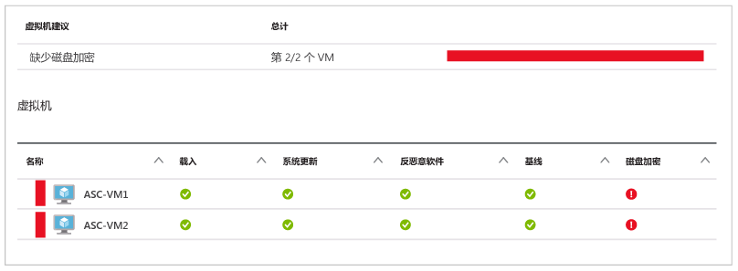
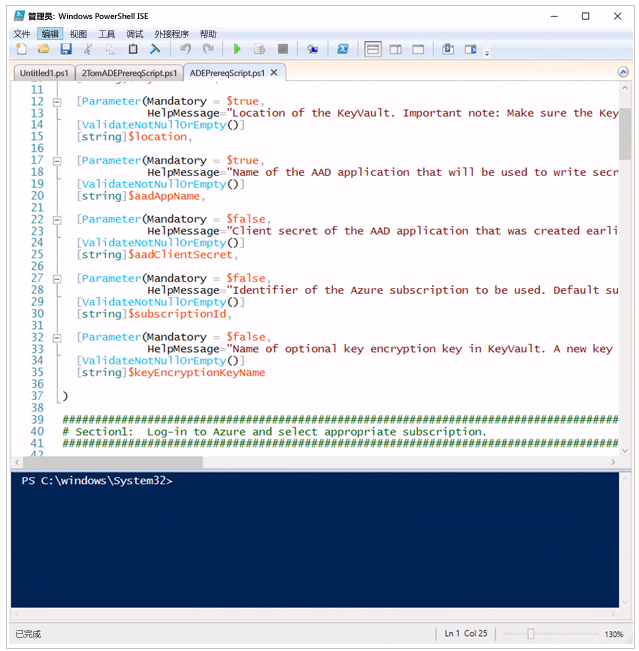
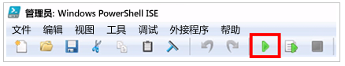
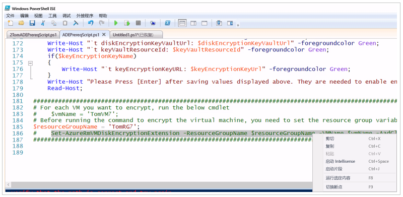
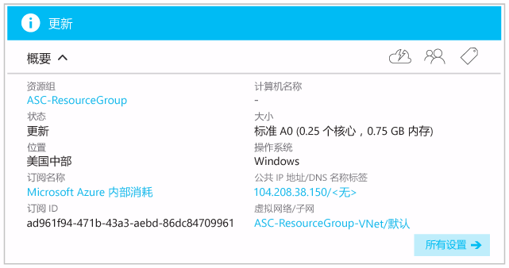
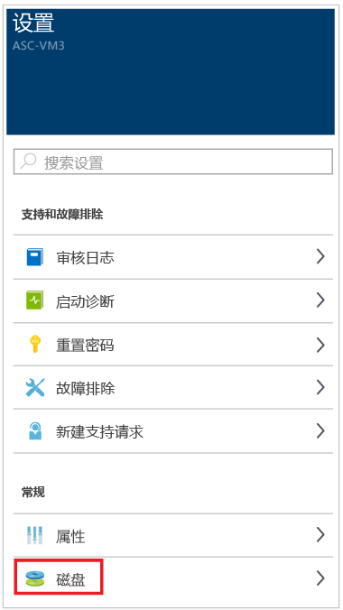
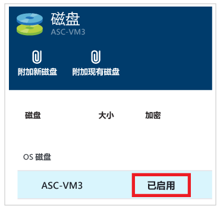

# 加密 Azure 虚拟机
如果用户的虚拟机未加密，Azure 安全中心会向用户发送警报。 这些警报会显示为“高严重级别”，建议加密这些虚拟机。

> [!NOTE]
> 本文档中的信息适用于在不使用密钥加密密钥（该密钥是使用“Azure 备份”备份虚拟机时必需的）的情况下对虚拟机进行加密。 有关如何使用密钥加密密钥支持将 Azure 备份用于已加密 Azure 虚拟机的信息，请参阅文章 [Windows 和 Linux Azure 虚拟机的 Azure 磁盘加密](https://docs.microsoft.com/en-us/azure/security/azure-security-disk-encryption)。
>
>

若要加密已被 Azure 安全中心标识为需要加密的 Azure 虚拟机，建议执行以下步骤：

* 安装和配置 Azure PowerShell。 此步骤用于运行设置先决条件所需的 PowerShell 命令，这些先决条件是加密 Azure 虚拟机所必需的。
* 获取并运行 Azure 磁盘加密先决条件 Azure PowerShell 脚本
* 加密虚拟机

本文档的目标是让用户能够加密虚拟机，即使用户的 Azure PowerShell 背景知识很少或根本没有。
本文档假定用户使用 Windows 10 作为客户端计算机并需要从客户端计算机配置 Azure 磁盘加密。

可以使用多种方式设置先决条件并为 Azure 虚拟机配置加密。 如果用户已熟知 Azure PowerShell 或 Azure CLI，则用户可能更愿意使用备用方式。

> [!NOTE]
> 若要详细了解为 Azure 虚拟机配置加密的备用方式，请参阅 [Azure Disk Encryption for Windows and Linux Azure Virtual Machines](https://gallery.technet.microsoft.com/Azure-Disk-Encryption-for-a0018eb0)（用于 Windows 和 Linux Azure 虚拟机的 Azure 磁盘加密）。
>
>

## 安装和配置 Azure PowerShell
需在计算机上安装 Azure PowerShell 1.2.1 或更高版本。 [How to install and configure Azure PowerShell](/powershell/azure/overview) （如何安装和配置 Azure PowerShell）一文包含预配计算机使之适用于 Azure PowerShell 的所有必需步骤。 最简单的方法是使用该文所述的 Web PI 安装方法。 即使已安装 Azure PowerShell，也请使用 Web PI 方法再次进行安装，确保安装 Azure PowerShell 的最新版本。

## 获取并运行 Azure 磁盘加密先决条件配置脚本
Azure 磁盘加密先决条件配置脚本将设置加密 Azure 虚拟机所需的所有先决条件。

1. 转到 GitHub 页，其中包含 [Azure Disk Encryption Prerequisite Setup Script](https://github.com/Azure/azure-powershell/blob/master/src/ResourceManager/Compute/Commands.Compute/Extension/AzureDiskEncryption/Scripts/AzureDiskEncryptionPreRequisiteSetup.ps1)（Azure 磁盘加密先决条件设置脚本）。
2. 在 GibHub 页上，单击“原始”按钮。
3. 使用 **CTRL-A** 选择页面上的所有文本，然后使用 **CTRL-C** 将页面上的所有文本复制到剪贴板。
4. 打开“记事本”，将复制的文本粘贴到记事本中。
5. 在 C: 驱动器上创建名为 **AzureADEScript**的新文件夹。
6. 保存记事本文件 – 单击“文件”，然后单击“另存为”。 在文件名称文本框中，输入 **"ADEPrereqScript.ps1"**，然后单击“保存”。 （确保对名称使用引号，否则会使用 .txt 文件扩展名保存文件）。

保存脚本内容以后，即可在 PowerShell ISE 中打开脚本：

1. 在“开始”菜单中，单击“Cortana”。 向 **Cortana** 询问“PowerShell”，只需在 Cortana 搜索文本框中键入 **PowerShell** 即可。
2. 右键单击“Windows PowerShell ISE”，然后单击“以管理员身份运行”。
3. 在“管理员: Windows PowerShell ISE”窗口中，单击“视图”，然后单击“显示脚本窗格”。
4. 如果在窗口右侧看到“命令”窗格，请单击窗格右上角的“x”将其关闭。 如果文本看起来太小，请使用“CTRL+加号”（加号即“+”符号）。 如果文本太大，请使用“CTRL+减号”（减号即“-”符号）。
5. 单击“文件”，然后单击“打开”。 导航到 **C:\AzureADEScript** 文件夹，然后双击“ADEPrereqScript”。
6. **ADEPrereqScript** 内容此时会显示在 PowerShell ISE 中并用颜色进行标记，更清楚地显示各种组件，例如命令、参数和变量。

此时会显示如下图所示的内容。

顶部窗格称为“脚本窗格”，底部窗格称为“控制台”。 本文后面部分将使用这些术语。

## 运行 Azure 磁盘加密先决条件 PowerShell 命令
Azure 磁盘加密先决条件脚本会要求用户在启动脚本后提供以下信息：

* **资源组名称** - 需将密钥保管库置于其中的资源组的名称。  将使用用户输入的名称创建一个新的资源组，前提是尚未使用该名称创建资源组。 如果已经有了一个需要用在此订阅中的资源组，则请输入该资源组的名称。
* **密钥保管库名称** - 需将加密密钥放在其中的密钥保管库的名称。 如果用户还没有使用此名称的密钥保管库，则会使用此名称创建新的密钥保管库。 如果用户已经有了一个需要使用的密钥保管库，则可输入现有密钥保管库的名称。
* **位置** - 密钥保管库的位置。 请确保密钥保管库和要加密的 VM 位于相同位置。 如果不知道该位置，可以参考本文后面的步骤，了解如何找到该位置。
* **Azure Active Directory 应用程序名称** - Azure Active Directory 应用程序的名称，用于向密钥保管库写入机密。 如果该应用程序不存在，则会使用此名称创建新的应用程序。 如果已经有一个需要使用的 Azure Active Directory 应用程序，请输入该 Azure Active Directory 应用程序的名称。

> [!NOTE]
> 如果想知道为何需要创建 Azure Active Directory 应用程序，请参阅 [Azure 密钥保管库入门](../key-vault/key-vault-get-started.md)一文的*将应用程序注册到 Azure Active Directory* 部分。
>
>

执行以下步骤，加密 Azure 虚拟机：

1. 如果关闭了 PowerShell ISE，可打开一个提升了权限的 PowerShell ISE 实例。 如果尚未打开 PowerShell ISE，可按本文中的前述说明操作。 如果关闭了脚本，则请打开 **ADEPrereqScript.ps1**，单击“文件”，然后单击“打开”并从 **c:\AzureADEScript** 文件夹选择脚本。 如果从一开始就遵循了本文的说明操作，则可直接转到下一步。
2. 在 PowerShell ISE 的控制台（PowerShell ISE 的底部窗格）中，键入 **cd c:\AzureADEScript** 再按 **ENTER**，将焦点变到脚本本地。
3. 在计算机上设置执行策略，以便运行脚本。 在控制台中键入 **Set-ExecutionPolicy Unrestricted**，然后按 ENTER。 如果看到一个对话框，其中说明了更改执行策略的效果，请单击“全部选是”或“是”（如果看到“全部选是”，则可选择该选项 – 如果没有看到“全部选是”，则单击“是”）。
4. 登录到 Azure 帐户。 在控制台中，键入 **Login-AzureRmAccount** 并按 **ENTER**。 此时会出现一个对话框，可在其中输入凭据（请确保有权更改虚拟机 – 如果没有相应的权限，将无法对虚拟机加密。 如果不确定是否有权限，请询问订阅所有者或管理员）。 此时会看到**环境**、**帐户**、**TenantId****SubscriptionId** 和 **CurrentStorageAccount** 的相关信息。 将 **SubscriptionId** 复制到记事本。 在步骤 6 中需用到此 ID。
5. 查找虚拟机所属的订阅及其位置。 转到 [https://portal.azure.com](ttps://portal.azure.com) 登录。  在页面左侧，单击“虚拟机”。 此时会看到虚拟机的列表及所属的订阅。

   
6. 回到 PowerShell ISE。 设置运行脚本所需的订阅上下文。 在控制台中，键入 **Select-AzureRmSubscription –SubscriptionId <your_subscription_Id>**（将 **< your_subscription_Id >** 替换为实际订阅 ID），然后按 **ENTER**。 此时会看到环境、**帐户**、**TenantId**、**SubscriptionId** 和 **CurrentStorageAccount** 的相关信息。
7. 现在可以运行脚本了。 单击“运行脚本”按钮或按键盘上的 **F5**。

   
8. 脚本要求提供 **resourceGroupName:** - 输入需要使用的*资源组*的名称，然后按 **ENTER**。 如果没有资源组，请输入需要用于新资源组的名称。 如果已经有需要使用的 *资源组* （例如包含虚拟机的资源组），请输入现有资源组的名称。
9. 脚本要求提供 **keyVaultName:** - 输入需要使用的 *密钥保管库* 的名称，然后按 ENTER。 如果没有资源组，请输入需要用于新资源组的名称。 如果用户已经有了一个需要使用的密钥保管库，则可输入现有 *密钥保管库*的名称。
10. 脚本要求提供**位置:** - 输入需要加密的 VM 所在位置的名称，然后按 **ENTER**。 如果不记得位置，请返回步骤 5。
11. 脚本要求提供 **aadAppName:** - 输入需要使用的 *Azure Active Directory* 应用程序的名称，然后按 **ENTER**。 如果没有资源组，请输入需要用于新资源组的名称。 如果已经有一个需要使用的 Azure Active Directory 应用程序，请输入现有 Azure Active Directory 应用程序的名称。
12. 此时会显示登录对话框。 提供凭据（是的，已登录过一次，但现在需再次登录）。
13. 脚本会运行，并会在完成时要求用户复制 **aadClientID****aadClientSecret****diskEncryptionKeyVaultUrl** 和 **keyVaultResourceId** 的值。 将这些值都复制到剪贴板，然后粘贴到记事本中。
14. 回到 PowerShell ISE，将光标置于最后一行末尾，然后按 **ENTER**。

脚本的输出看起来会与下面的屏幕类似：

## 加密 Azure 虚拟机
现在可以加密虚拟机了。 如果虚拟机与密钥保管库位于同一资源组中，则可转到加密步骤部分。 但是，如果虚拟机与密钥保管库不在同一资源组中，则需在 PowerShell ISE 的控制台中输入以下内容：

**$resourceGroupName = <’Virtual_Machine_RG’>**

将 **< Virtual_Machine_RG >** 替换为包含虚拟机的资源组的名称，使用单括号。 然后按 **ENTER**。
若要确认是否输入了正确的资源组名称，请在 PowerShell ISE 控制台中输入以下内容：

**$resourceGroupName**

按 **ENTER**。 此时会看到虚拟机所在的资源组的名称。 例如：

### 加密步骤
首先，需告知 PowerShell 要加密的虚拟机的名称。 在控制台中，键入：

**$vmName = <’your_vm_name’>**

将 **<’your_vm_name’>** 替换为 VM 的名称（确保名称使用单引号），然后按 **ENTER**。

若要确认是否输入了正确的 VM 名称，请键入：

**$vmName**

按 **ENTER**。 此时会看到需要加密的虚拟机的名称。 例如：

若要加密虚拟机上的所有驱动器，可通过两种方法运行加密命令。 第一种方法是在 PowerShell ISE 控制台中键入以下命令：

~~~
Set-AzureRmVMDiskEncryptionExtension -ResourceGroupName $resourceGroupName -VMName $vmName -AadClientID $aadClientID -AadClientSecret $aadClientSecret -DiskEncryptionKeyVaultUrl $diskEncryptionKeyVaultUrl -DiskEncryptionKeyVaultId $keyVaultResourceId -VolumeType All
~~~

键入该命令后，按 **ENTER**。

第二种方法是先单击脚本窗格（PowerShell ISE 的顶部窗格），然后向下滚动到脚本底部。 突出显示上面列出的命令，然后右键单击该命令，再单击“运行所选命令”或按键盘上的 **F8**。

无论使用哪种方法，都会出现一个对话框，告知用户操作需要 10-15 分钟才能完成。 单击 **“是”**。

在加密进程正在进行时，可回到 Azure 门户查看虚拟机的状态。 在页面左侧单击“虚拟机”，然后在“虚拟机”边栏选项卡中单击要加密的虚拟机的名称。 在显示的边栏选项卡中，会注意到“状态”为“正在更新”。 这说明加密正在进行。

回到 PowerShell ISE。 脚本完成后，会看到下图所显示的内容。

若要展示一下虚拟机现在已加密，可回到 Azure 门户，然后单击页面左侧的“虚拟机”。 单击已加密的虚拟机的名称。 在“设置”边栏选项卡中，单击“磁盘”。

在“磁盘”边栏选项卡中，会看到“加密”状态为“已启用”。

## 后续步骤
本文档介绍如何加密 Azure 虚拟机。 若要详细了解 Azure 安全中心，请参阅以下内容：

* [Security health monitoring in Azure Security Center](security-center-monitoring.md) （Azure 安全中心的安全运行状况监视）- 了解如何监视 Azure 资源的运行状况
* [Managing and responding to security alerts in Azure Security Center](security-center-managing-and-responding-alerts.md) （管理和响应 Azure 安全中心的安全警报）- 了解如何管理和响应安全警报
* [Azure Security Center FAQ](security-center-faq.md) （Azure 安全中心常见问题）- 查找有关如何使用服务的常见问题
* [Azure 安全性博客](http://blogs.msdn.com/b/azuresecurity/) - 查找关于 Azure 安全性及合规性的博客文章

