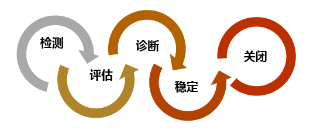
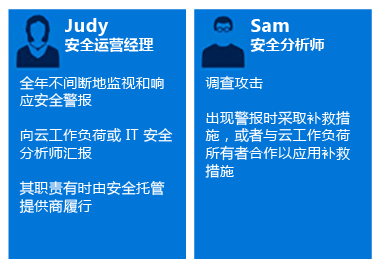
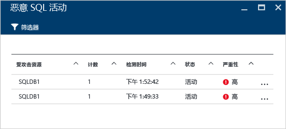
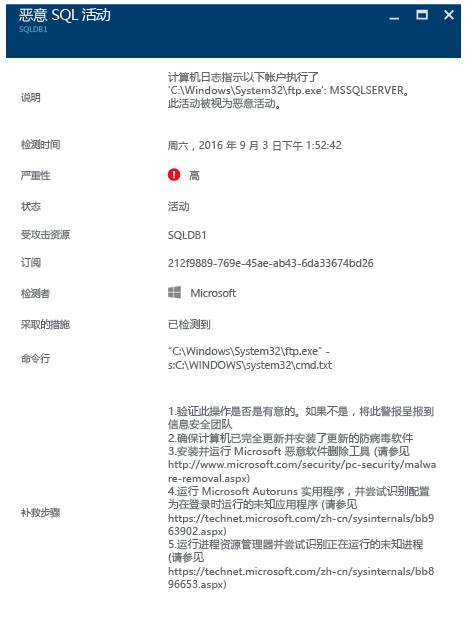

<properties
   pageTitle="利用 Azure 安全中心进行事件响应 | Microsoft Azure"
   description="本文档介绍在进行安全事件响应时如何发挥 Azure 安全中心的作用。"
   services="security-center"
   documentationCenter="na"
   authors="YuriDio"
   manager="swadhwa"
   editor=""/>

<tags
   ms.service="security-center"
   ms.topic="hero-article"
   ms.devlang="na"
   ms.tgt_pltfrm="na"
   ms.workload="na"
   ms.date="09/20/2016"
   ms.author="yurid"/>

# 利用 Azure 安全中心进行事件响应
许多组织只有在遭受攻击后才会去学习如何响应安全事件。为了降低成本和减少破坏，必须在攻击发生之前就制定事件响应计划。在事件响应的不同阶段均可让 Azure 安全中心发挥作用。

## 事件响应

计划是否有效取决于三大核心功能：保护功能、检测威胁的功能、响应威胁的功能。保护是指防止事件发生，检测是指早期确定威胁，而响应则是指将攻击者逐出并还原系统，降低侵入的影响。

本文所使用的安全事件响应阶段依据的是 [Microsoft Azure Security Response in the Cloud](https://gallery.technet.microsoft.com/Azure-Security-Response-in-dd18c678)（在云中进行 Microsoft Azure 安全响应）一文，如下图所示：

在检测、评估和诊断阶段均可发挥安全中心的作用。若要详细了解每个阶段，请参阅以下示例，了解在这三个初始事件响应阶段如何发挥安全中心的作用：

- **检测**：表示开始进行事件调查
	- 示例：开始确认在“安全中心”仪表板中发出了高优先级安全警报。
- **评估**：进行初始评估，了解可疑活动的详细信息。
	- 示例：了解安全警报的详细信息。
- **诊断**：进行技术性调查，确定抑制、缓解和解决威胁的各种策略。
	- 示例：按照安全中心在该特定安全警报中描述的补救步骤进行操作。

随后的方案说明了如何在安全事件的检测、评估和诊断/响应阶段充分发挥安全中心的作用。在安全中心，[安全事件](security-center-incident.md)是指某个资源所有符合[攻击链](https://blogs.technet.microsoft.com/office365security/addressing-your-cxos-top-five-cloud-security-concerns/)模式的警报的汇总。事件显示在[安全警报](security-center-managing-and-responding-alerts.md)磁贴和边栏选项卡中。事件会显示相关警报的列表，方便用户详细了解每个事件。安全中心还提供单独的安全警报，也可利用这些警报跟踪可疑活动。

## 方案

Contoso 最近将部分本地资源（包括一些基于虚拟机的业务线工作负荷和 SQL 数据库）迁移到了 Azure。目前情况下，Contoso 的核心计算机安全事件响应团队 (CSIRT) 无法调查安全问题，因为没有将安全情报集成到当前的事件响应工具中。由于缺乏集成，导致在检测阶段出现了问题（误报过多），评估和诊断阶段也不例外。在此次迁移过程中，他们决定加入安全中心计划，以便解决此问题。

在加载所有资源并遵循安全中心提供的所有安全建议进行操作以后，此迁移的第一阶段宣告完成。Contoso CSIRT 负责处理计算机安全事件。该团队由许多人员组成，负责处理安全事件。团队成员都有明确的任务，确保在响应时不遗漏任何领域。

就本方案来说，需重点介绍 Contoso CSIRT 中以下成员的角色：

Judy 负责安全操作，她的责任包括：
- 全天候监视和响应安全威胁
- 在需要的情况下将问题上报云工作负荷所有者或安全分析师

Sam 是安全分析师，他的责任包括：
- 调查各种攻击
- 根据警报进行补救
- 与工作负荷所有者合作，确定并应用补救措施

可以看到，Judy 和 Sam 的责任并不相同，他们必须通力合作，共享从安全中心获取的信息。

## 建议的解决方案

由于 Judy 和 Sam 的角色并不相同，他们需要在安全中心的不同领域获取日常活动的相关信息。Judy 需要在日常监视时使用安全警报。

Judy 需要在检测和评估阶段使用安全警报。在完成初始评估以后，如果需要进一步的调查，Judy 可能会将问题上报给 Sam。此时 Sam 会充分利用安全中心提供的信息，有时候会结合使用其他数据源提供的信息，这样就进入了诊断阶段。

## 如何实施该解决方案 

为了说明如何在响应威胁事件时发挥 Azure 安全中心的作用，需先对 Judy 在检测和评估阶段执行的步骤进行演示，然后演示 Sam 的问题诊断步骤。

### 事件响应的检测和评估阶段 

Judy 登录到 Azure 门户，现在位于安全中心控制台中。她开始执行以下步骤的操作，按日常监视惯例查看优先级高的安全警报：

1. 单击“安全警报”磁贴，对“安全警报”边栏选项卡进行访问。

	> [AZURE.NOTE] 就本方案来说，Judy 需要对“恶意 SQL 活动”警报进行评估，如上图所示。
2. 单击“恶意 SQL 活动”警报，在“恶意 SQL 活动”边栏选项卡中查看受攻击的资源：
	
	Judy 可以对此边栏选项卡中提到的受攻击的资源、该攻击发生的次数以及检测到该攻击的时间进行记录。
3. 单击“受攻击的资源”，获取有关该攻击的详细信息。

读完描述以后，Judy 确信这不是误报，因此应将此案例上报给 Sam。

### 事件响应的诊断阶段 

Sam 收到 Judy 的案例，开始查看安全中心建议的补救步骤。

### 其他资源

安全响应团队也可利用[安全中心 Power BI](security-center-powerbi.md) 功能，了解不同类型的报表，在进一步调查过程中对建议和安全警报实施可视化、分析和筛选操作。对于在调查过程中使用安全信息和事件管理 (SIEM) 解决方案的公司来说，也可[将安全中心与解决方案相集成](security-center-integrating-alerts-with-log-integration.md)。也可通过 [Azure 日志集成工具](https://blogs.msdn.microsoft.com/azuresecurity/2016/07/21/microsoft-azure-log-integration-preview/)集成 Azure 审核日志和 VM 安全事件。可结合使用此信息与安全中心提供的信息，对攻击进行调查。

## 结束语

在攻击事件发生之前组建一个安全团队对组织来说很重要，对事件的处理方式有很大的正面影响。必须使用正确的工具监视相关资源，这样该团队才能准确应对安全事件。安全中心提供的[检测功能](security-center-detection-capabilities.md)可以帮助 IT 部门快速响应安全事件，对安全问题提供补救措施。

<!---HONumber=AcomDC_0921_2016-->