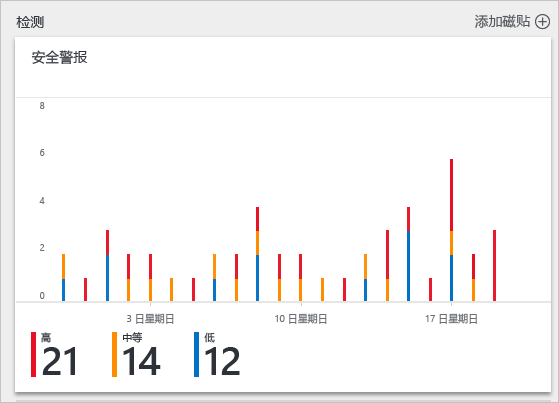
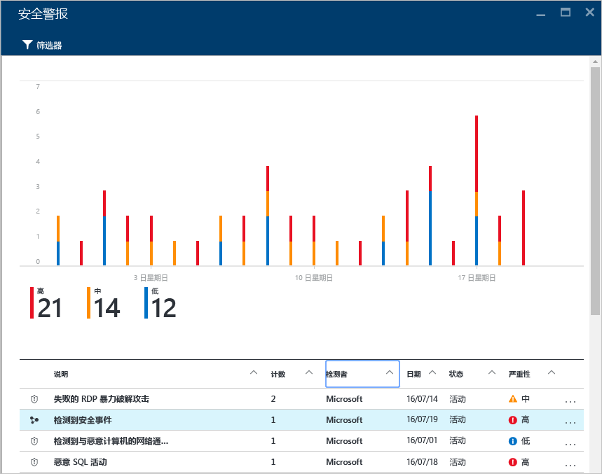
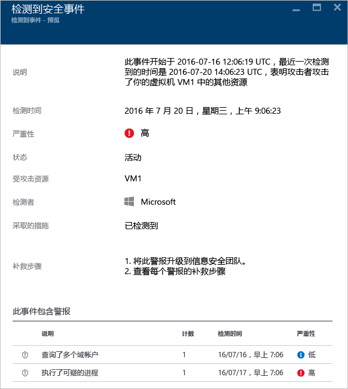
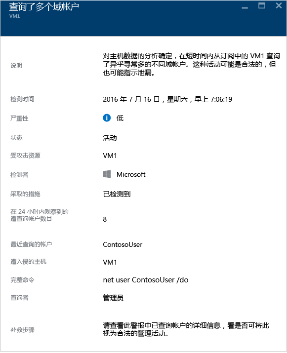

<properties
   pageTitle="处理 Azure 安全中心的安全事件 | Microsoft Azure"
   description="本文档旨在帮助你使用 Azure 安全中心功能来处理安全事件。"
   services="security-center"
   documentationCenter="na"
   authors="YuriDio"
   manager="swadhwa"
   editor=""/>

<tags
   ms.service="security-center"
   ms.topic="hero-article"
   ms.devlang="na"
   ms.tgt_pltfrm="na"
   ms.workload="na"
   ms.date="08/03/2016"
   ms.author="yurid"/>

# 处理 Azure 安全中心的安全事件 
会审和调查安全警报可能会非常耗时，即使对于技术高超的安全分析员也是如此，并且很多人不知道从何处开始。通过使用[分析](security-center-detection-capabilities.md)来连接不同的[安全警报](security-center-managing-and-responding-alerts.md)之间的信息，安全中心可以提供攻击活动及其所有相关警报的单一视图，让你快速了解攻击者所采取的操作以及哪些资源受到了影响。

本文档介绍如何在安全中心使用安全警报功能，帮助你处理安全事件。

## 什么是安全事件？

在安全中心，安全事件是对资源的所有警报汇总，与[网络攻击链](https://blogs.technet.microsoft.com/office365security/addressing-your-cxos-top-five-cloud-security-concerns/)模式保持一致。事件显示在[安全警报](security-center-managing-and-responding-alerts.md)磁贴和边栏选项卡中。事件将显示相关警报列表，可使你获取有关每个匹配项的详细信息。

## 管理安全事件

可以通过查看“安全警报”磁贴查看当前安全事件。访问 Azure 门户，按照以下步骤查看每个安全事件的详细信息：

1. 在安全中心仪表板中，可以看到“**安全警报**”磁贴。

    

2.  单击此磁贴以展开查看，如果检测到安全事件，它将在安全警报图下方出现，如下所示：

    

3.	请注意，安全事件描述相比其他警报具有不同的图标。单击事件即可查看有关此事件的更多详细信息。

	

4. 	在**事件**边栏选项卡上，将看到有关此安全事件的详细信息，其中包括其完整的说明、严重程度（这种情况下严重程度较高）、当前状态（这种情况下仍然是*活跃*，这表明用户尚未执行操作*关闭*它 - 可以通过右键单击**安全警报**边栏选项卡中的事件完成）、被攻击的资源（这种情况下是 *VM1*）、事件的修正步骤，并且在底部窗格中有包含在此事件的警报。如果想要获取每个警报的详细信息，只需单击它，另一个边栏选项卡将会打开，如下所示：

	

此边栏选项卡上的信息将因警报而有所不同。请参阅[管理和响应 Azure 安全中心的安全警报](security-center-managing-and-responding-alerts.md)，了解更多有关如何管理这些警报的详细信息。有关此功能的一些重要注意事项：

- 使用新的筛选器，你可以自定义视图，以仅显示事件、仅显示警报，或两者。
- 同一个警报可以作为事件（如果适用）的一部分，也可以作为独立的警报显示。
- 关闭事件不会消除相关警报。

## 另请参阅

在本文档中，已经学习了如何在安全中心使用安全事件功能。若要了解有关安全中心的详细信息，请参阅以下内容：

- [管理和响应 Azure 安全中心的安全警报](security-center-managing-and-responding-alerts.md)
- [Azure 安全中心检测功能](security-center-detection-capabilities.md)
- [Azure 安全中心规划和操作指南](security-center-planning-and-operations-guide.md)
- [管理和响应 Azure 安全中心的安全警报](security-center-managing-and-responding-alerts.md)
- [Azure 安全中心常见问题解答](security-center-faq.md) -- 查找有关使用服务的常见问题。
- [Azure 安全性博客](http://blogs.msdn.com/b/azuresecurity/) -- 查找关于 Azure 安全性及合规性的博客文章。

<!---HONumber=AcomDC_0921_2016-->