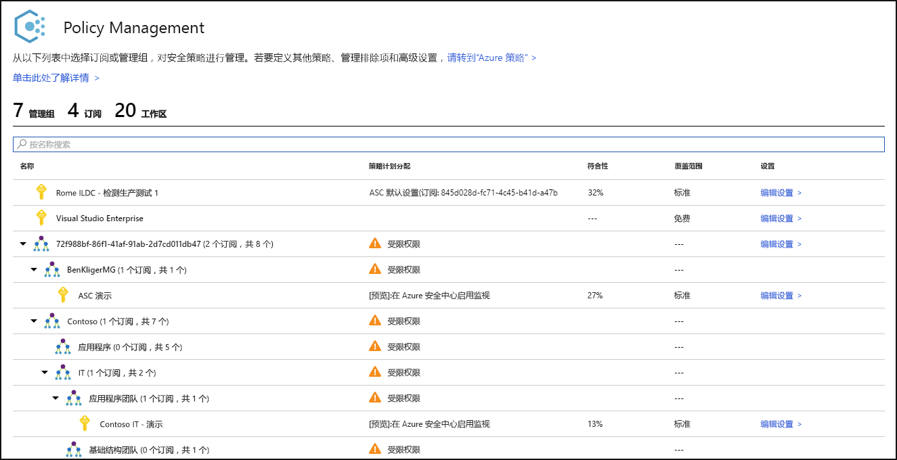
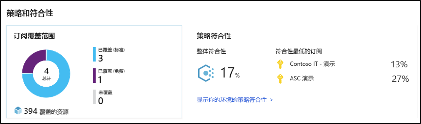
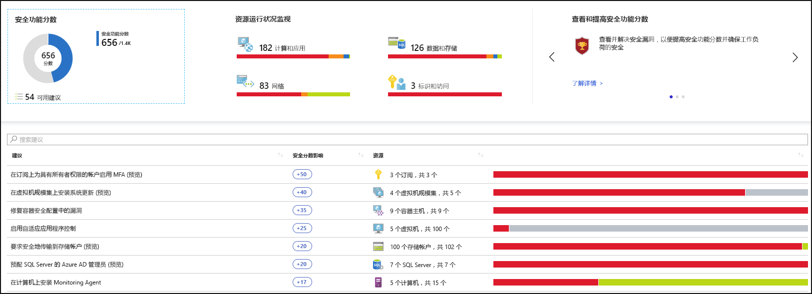
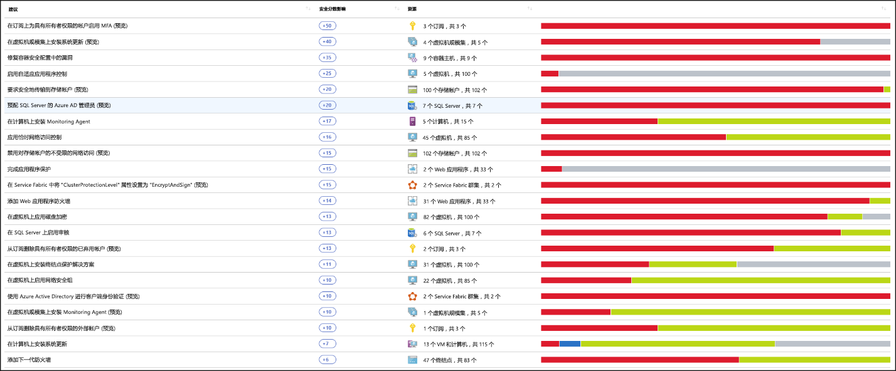
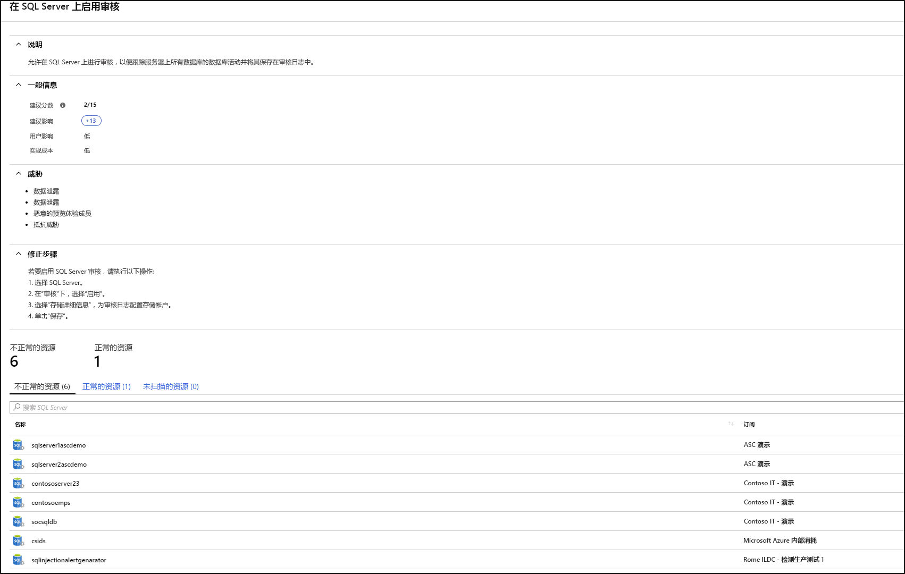
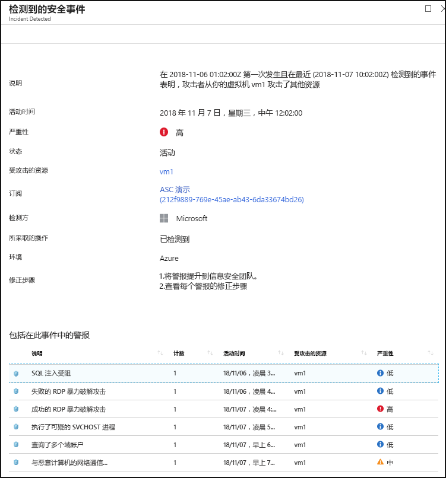

# 什么是 Azure 安全中心？

Azure 安全中心是一个统一的基础结构安全管理系统，可以增强数据中心的安全态势，以及为云中（无论是否在 Azure 中）和本地的混合工作负荷提供高级威胁防护。

保护资源安全是你的云提供商 Azure 和作为客户的你之间共同的努力。 在移动到云时必须确保工作负荷是安全的，同时，当移动到 IaaS（基础结构即服务）时，需要承担的客户责任比使用 PaaS（平台即服务）和 SaaS（软件即服务）时要更多。 Azure 安全中心提供强化网络、保护服务安全以及确保你掌控安全态势所需的工具。

Azure 安全中心解决了三个最紧急的安全性挑战：

-   **快速变化的工作负荷** - 这既是云的优势，也是云所带来的挑战。 一方面，使最终用户有权执行更多的操作。 另一方面，如何确保人们正在使用和创建的不断变化的服务符合安全标准并且遵循安全最佳做法？

-   **日益复杂的攻击**  - 无论在何处运行工作负荷，所面临的攻击都会变得越来越复杂。 必须要确保你的公有云工作负荷的安全，这些实际上是面向 Internet 的工作负荷，如果不遵循安全最佳做法，可能会使你更易受到攻击。

-   **安全技能短缺**  - 安全警报和警报系统的数量远远超过了确保你的环境受到保护所需的具有必要背景和经验的管理员数量。 及时了解最新的攻击是一项持续的挑战，因此在安全领域不断变化的情况下不可能保持现状。

为了帮助你应对这些挑战，安全中心提供了为你实现以下目的的工具：

-   **加强安全态势**：安全中心会对你的环境进行评估并使你能够了解资源的状态，它们是否安全？

-   **防范威胁**：安全中心会对你的工作负荷进行评估并提出威胁防护建议和威胁检测警报。

-   **更快地获取安全性**：在安全中心中，一切操作都以云速度完成。 由于它以本机方式集成，因此可以轻松部署安全中心，从而通过 Azure 服务为你提供自动预配和保护。

## 体系结构

由于安全中心本身是 Azure 的一部分，因此 Azure 中的 PaaS 服务（包括 Service Fabric、SQL 数据库和存储帐户）会受到安全中心的监视和保护，无需进行任何部署。

此外，安全中心通过在 Windows 和 Linux 服务器的云中或本地非 Azure 服务器和虚拟机上安装 Microsoft Monitoring Agent 来对它们进行保护。 Azure 虚拟机是在安全中心中自动预配的。

从代理和 Azure 收集的事件在安全分析引擎中相关联，从而提供定制的建议（强化任务）（应遵循这些建议以确保工作负荷是安全的）以及威胁检测警报。 应尽快调查此类警报以确保没有针对工作负荷发生的恶意攻击。

当启用安全中心时，内置到安全中心的安全策略将作为内置的计划反映在 Azure Policy 中，位于“安全中心”类别下。 内置的计划自动分配给安全中心注册的所有订阅（免费或标准层）。 内置的计划仅包含审核策略。 有关 Azure Policy 中的安全中心策略的详细信息，请参阅[使用安全策略](tutorial-security-policy.md)。

## 加强安全态势

通过 Azure 安全中心可以加强安全态势。 这意味着它可以帮助识别和执行建议作为安全最佳做法的强化任务，并跨计算机、数据服务和应用实现这些任务。 这包括管理和强制实施安全策略，以及确保 Azure 虚拟机、非 Azure 服务器和 Azure PaaS 服务的符合性。 安全中心提供了对工作负荷进行鸟瞰所需的工具，并且使你能够集中查看网络安全资产。 

### 管理组织安全策略和符合性

了解并确保工作负荷的安全性是保障安全的基础，并且要从拥有量身定制的适当安全策略开始。 由于安全中心中的所有策略都是基于 Azure 策略控制构建的，因此你将获得世界级策略解决方案的全方位服务和灵活性 ****。 在安全中心中，可以将策略设置为在管理组上、订阅中以及甚至为整个租户运行。

安全中心可以帮助识别影子 IT 订阅 ****。 通过在仪表板中查看标记为“未涵盖”的订阅，可以立即知道新订阅创建的时间并确保策略已涵盖了这些订阅以及确保它们受到 Azure 安全中心的保护。

安全中心中的高级监视功能还使你能够随着时间跟踪和管理符合性和治理 ****。 “总体符合性”可以衡量订阅与和工作负荷相关的策略的符合程度 **** 。 

### 持续评估

安全中心会持续发现部署在工作负荷中的新资源并评估它们是否已根据安全最佳做法进行了配置，如果没有，则会将它们标记出来，并且你将获得一个按优先级排列的建议列表，便于你进行修复以保护计算机。

安全中心提供用于持续监视网络安全状态的强大工具之一是网络映射 ****。 通过映射可以查看工作负荷的拓扑，从而可以查看是否已正确配置了每个节点。 可以看到节点的连接方式，这有助于阻止不必要的连接，这些连接可能使攻击者更容易沿网络爬行。

通过添加安全分数，安全中心可以更轻松地一步缓解安全警报 ****。 安全分数现在与你接收的每项建议相关联，有助于了解每项建议对总体安全状况的重要程度。 这一点在你设置安全工作的优先级时至关重要 ****。

### 通过配置建议的控制来优化和提高安全性

Azure 安全中心的值的核心在于其建议。 这些建议是针对在工作负荷上发现的特定安全问题而量身定制的，安全中心不仅可以通过查找漏洞来为你执行安全管理工作，还可以通过为你提供有关如何清除漏洞的具体说明来进行。

通过这种方式，安全中心不仅使你能够设置安全策略，还使你能够在整个资源中应用安全配置标准。

这些建议有助于降低每个资源的攻击面。 其中包括 Azure 虚拟机、非 Azure 服务器和 Azure PaaS 服务（如 SQL 和存储帐户等），其中每种类型的资源都以不同的方式被评估并且具有自己的标准。

## 防范威胁

通过安全中心的威胁防护，可以在基础结构即服务 (IaaS) 层、非 Azure 服务器以及针对 Azure 中的平台即服务 (PaaS) 进行检测和防范威胁。

安全中心的威胁防护包括融合杀伤链分析，它可以基于网络杀伤链分析自动关联环境中的警报，有助于更好地了解攻击活动的完整情况，例如它的起始位置以及它对资源造成的影响。

### 高级威胁防护

通过安全中心，可以立即与 Windows Defender 高级威胁防护进行本机集成。 这意味着，无需进行任何配置，Windows 虚拟机和服务器就可以与安全中心的建议和评估完全集成。 也为 Linux 虚拟机和服务器提供了现成的高级威胁检测。

此外，通过安全中心，还可以在服务器环境上自动执行应用程序控制策略。 安全中心中的自适应应用程序控制在 Windows 服务器之间启用端到端的应用允许列表。 无需创建规则和检查违规行为，这些都是自动完成的。

### 保护 PaaS

安全中心有助于跨 Azure PaaS 服务检测威胁。 可以检测针对 Azure 服务的威胁，包括 Azure 应用服务、Azure SQL、Azure 存储帐户和更多数据服务。 还可以利用与 Microsoft Cloud App Security 的用户和实体行为分析 (UEBA) 的本机集成来对 Azure 活动日志执行异常情况检测。

### 阻止暴力攻击

安全中心可以帮助限制暴露在暴力攻击下。 通过减少对虚拟机端口的访问，使用实时 VM 访问，可以通过阻止不必要的访问来强化网络。 可以在所选端口上设置安全访问策略，仅限授权用户、允许的源 IP 地址范围或 IP 地址，以及仅在有限的时间内。

### 保护数据服务

安全中心包含有助于在 Azure SQL 中执行对数据进行自动分类的功能。 还可以获取跨 Azure SQL 和存储服务对潜在漏洞进行的评估，以及有关如何缓解这些问题的建议。

## 更快地获取安全性

本机 Azure 集成（包括 Azure Policy 和 Log Analytics）与其他 Microsoft 安全解决方案（如 Microsoft Cloud App Security 和 Windows Defender 高级威胁防护）的无缝集成相结合，有助于确保安全解决方案的全面性，并且易于载入和推出。

此外，可以将完整的解决方案扩展到 Azure 外在其他云和本地数据中心中运行的工作负荷。

### 自动发现和载入 Azure 资源

安全中心提供与 Azure 和 Azure 资源的无缝本机集成。 这意味着可以跨所有 Azure 资源汇总涉及到 Azure Policy 和内置安全中心策略的完整安全性内容，并确保你在 Azure 中创建资源时所有内容会自动应用到新发现的资源。

广泛的日志收集 - Windows 和 Linux 中的日志都可以在安全分析引擎中得到利用，并用于创建建议和警报。

## 后续步骤

- 若要开始使用安全中心，需要具有 Microsoft Azure 订阅。 如果尚无订阅，可注册[免费试用版](https://azure.microsoft.com/free/)。
- 安全中心的“免费”定价层通过 Azure 订阅启用。 若要利用高级安全管理和威胁检测功能，必须升级到“标准”定价层。 可以免费试用标准层。 有关详细信息，请参阅[安全中心定价页](https://azure.microsoft.com/pricing/details/security-center/)。
- 如果已准备好立即启用安全中心标准版，请参阅[快速入门：将 Azure 订阅载入到安全中心标准版](security-center-get-started.md)以详细了解相关步骤。

