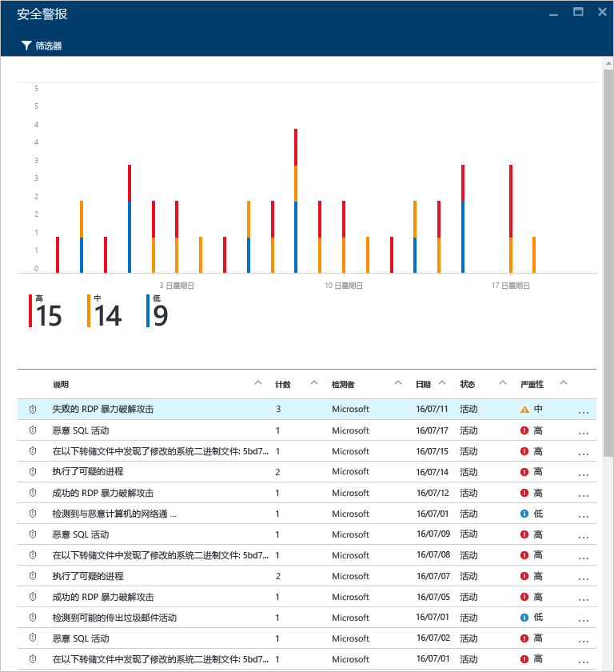
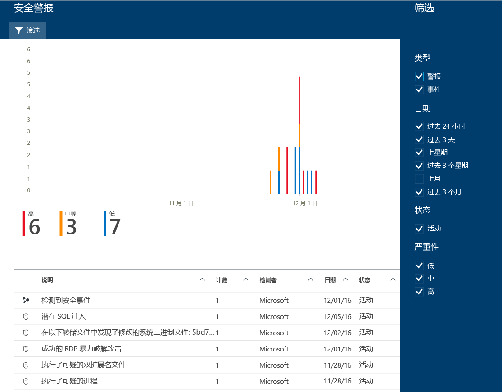
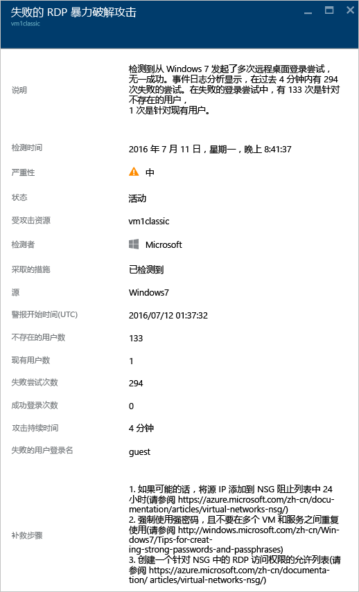

# 管理和响应 Azure 安全中心的安全警报
本文档旨在帮助使用 Azure 安全中心来管理和响应安全警报。

> [!NOTE]
> 要启用高级检测，请升级到 Azure 安全中心标准版。 它可以免费试用 90 天。 要升级，请选择 [安全策略](security-center-policies.md)中的“定价层”。 请参阅 [Azure 安全中心定价](security-center-pricing.md)，了解详细信息。
> 
> 

## 什么是安全警报？
安全中心会自动收集、分析以及整合 Azure 资源、网络和所连合作伙伴解决方案（如，防火墙和终结点保护解决方案）的日志数据，检测真正的威胁并减少误报。 安全中心显示了一系列安全警报（按严重程度排序），并显示了快速调查问题所需的信息以及修复攻击的建议。 Azure 安全中心还会将形成杀伤链模式的警报聚合成 [事件](security-center-incident.md)。 

> [!NOTE]
> 有关安全中心检测功能工作原理的详细信息，请参阅 [Azure 安全中心检测功能](security-center-detection-capabilities.md)。
> 
> 

## 管理安全警报
可以通过查看“安全警报”  磁贴查看当前警报。 打开 Azure 门户，按照以下步骤查看每个警报的更多详细信息：

1. 在安全中心仪表板中，可以看到“安全警报”  磁贴。
   
    

2. 单击该磁贴，打开“安全警报”  边栏选项卡，该边栏选项卡包含以下警报详细信息。
   
   

此边栏选项卡的底部是每个警报的详细信息。 要进行排序，请单击按其排序的列。 下面给出了每个列的定义：

* **说明**：警报的简要说明。
* **计数**：在特定日期检测到的此特定类型的所有警报的列表。
* **检测程序**：负责触发警报的服务。
* **日期**：事件发生的日期。
* **状态**：该警报的当前状态。 状态有两种：
  * **活动**：已检测到安全警报。
* **严重性**：严重性级别，分为高、中和低。

### 筛选警报
可以根据日期、状态和严重性筛选警报。 对于需要缩小安全警报显示范围的情况，筛选警报非常有用。 例如，假设正在调查系统中的潜在危害，需要处理过去 24 小时内发生的安全警报。

1. 单击“安全警报”边栏选项卡上的“筛选器”。 此时将打开“筛选器”  边栏选项卡，选择要查看的日期、状态和严重性值。
   
    

### 响应安全警报
选择某个安全警报，了解触发该警报的事件详细信息以及修复攻击所需的步骤（如有）。 安全警报按类型和日期进行分组。 单击某个安全警告会打开一个边栏选项卡，该边栏选项卡中包含一个分组警报列表。

在这种情况下，触发的警报指的是可疑的远程桌面协议 (RDP) 活动。 第一列显示受到攻击的资源；第二列显示该资源受到攻击的次数；第三列显示攻击的时间；第四列显示警报的状态；第五列显示攻击的严重性。 查看此信息后，单击受到攻击的资源会打开一个新的边栏选项卡。

在此边栏选项卡的“说明”  字段可以找到有关此事件的详细信息。 通过这些额外的详细信息，可深入了解是什么触发了该安全警报、其目标资源、源 IP 地址（如果适用）以及修复建议。  在某些情况下，源 IP 地址为空（不可用），因为并不是所有 Windows 安全事件日志都包含 IP 地址。

安全中心提供的修正建议因安全警报的不同而异。 在某些情况下，可能需要使用其他 Azure 功能来实现建议的修复操作。 例如，此攻击的修复方法是，使用[网络 ACL](../virtual-network/virtual-networks-acl.md) 或[网络安全组](../virtual-network/virtual-networks-nsg.md)规则将生成此攻击的 IP 地址加入阻止名单。

> [!NOTE]
> 有关不同类型的警报的详细信息，请参阅 [Azure 安全中心的安全警报（按类型）](security-center-alerts-type.md)。
> 
> 

## 另请参阅
本文档中已经介绍了如何在安全中心配置安全策略。 要了解有关安全中心的详细信息，请参阅以下内容：

* [处理 Azure 安全中心的安全事件](security-center-incident.md)
* [Azure 安全中心检测功能](security-center-detection-capabilities.md)
* [Azure 安全中心规划和操作指南](security-center-planning-and-operations-guide.md)
* [Azure 安全中心常见问题解答](security-center-faq.md) — 查找有关使用该服务的常见问题解答。
* [Azure 安全性博客](http://blogs.msdn.com/b/azuresecurity/) - 查找关于 Azure 安全性及合规性的博客文章。

<!--HONumber=Jan17_HO1-->

