# 在 Azure 安全中心进行安全运行状况监视
本文介绍如何通过 Azure 安全中心的监视功能监视合规性。

## 什么是安全运行状况监视？
通常可以认为，监视就是指观察并等待某个事件的发生，以便采取应对措施。 安全监视是指制定前瞻性策略对资源进行审核，确定不符合组织标准或最佳规范的系统。

## 监视安全运行状况
用户为订阅的资源启用[安全策略](security-center-policies.md)以后，安全中心将分析相关资源的安全性，确定可能的漏洞。 可立即提供有关网络配置的信息。 可能需要一小时或更长时间才能提供有关虚拟机配置的信息（例如安全更新状态和操作系统配置）。 在“资源安全运行状况”边栏选项卡中，可以查看资源的安全状态以及任何问题。 也可在“建议”边栏选项卡中查看此类问题的列表。

如需详细了解如何应用建议，请参阅[在 Azure 安全中心实施安全建议](security-center-recommendations.md)。

在“资源安全运行状况”磁贴中，可以监视资源的安全状态。 在下面的示例中，可以看到许多问题严重级别为“高”和“中”，需要引起注意。 启用的安全策略会影响受监视控件的类型。

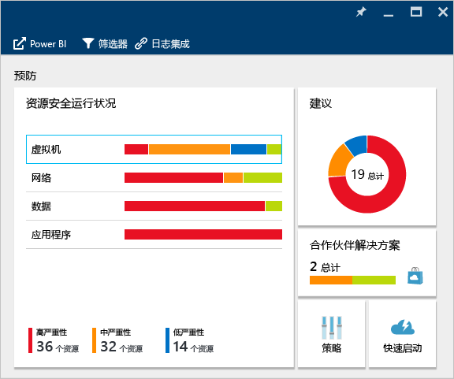

如果安全中心确定需要解决的漏洞（例如虚拟机缺少安全更新，或者子网没有[网络安全组](../virtual-network/virtual-networks-nsg.md)），会将其列在此处。

### 监视虚拟机
在“资源安全运行状况”磁贴中单击“虚拟机”时，“虚拟机”边栏选项卡随即打开，显示有关载入的更多详细信息、预防步骤以及安全中心监视的所有虚拟机的列表，如以下屏幕截图所示。

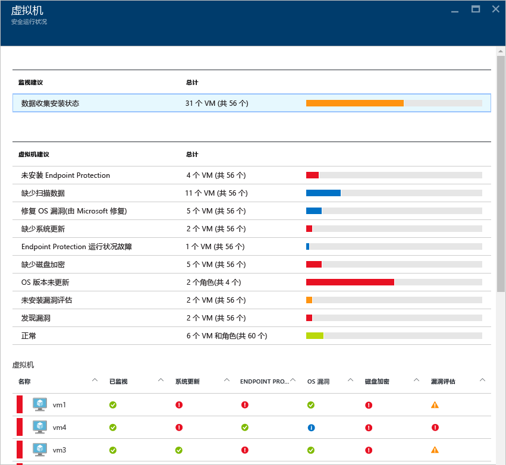

* 加载步骤
* 虚拟机建议
* 虚拟机

可以选择每一部分中的各个选项，查看可解决相关问题的建议步骤的更多相关详细信息。 以下各部分将更详细地介绍这些方面。

#### 监视建议
此部分显示已启动以进行数据收集的虚拟机的总数及其当前状态。 所有虚拟机都启动数据收集后，它们即可接收安全中心的安全策略。 单击此条目以时，“数据收集安装状态”边栏选项卡随即打开，此时可在“安装状态”列中看到虚拟机的名称及数据收集的当前状态，如以下屏幕截图所示。

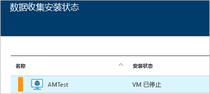

#### 虚拟机建议
此部分为受 Azure 安全中心监视的[每个虚拟机提供了一组建议](security-center-virtual-machine-recommendations.md)。 第一列列出了建议。 第二列显示受该建议的虚拟机的总数。 第三列显示问题的严重级别，如以下屏幕截图所示。

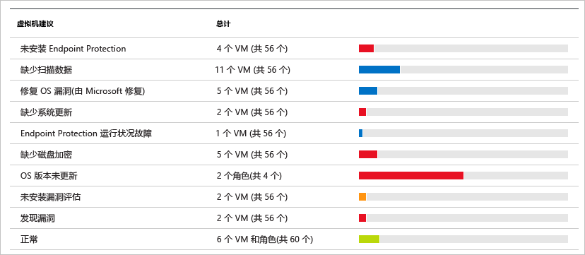

> [!NOTE]
> “网络拓扑”列表的“网络运行状况”边栏选项卡中仅显示至少具有一个公共终结点的虚拟机。
> 
> 

每个建议都有一组操作，单击即可执行。 例如，如果单击“缺少的系统更新”，则“缺少的系统更新”边栏选项卡随即打开。 其中会列出缺少修补程序的虚拟机，以及所缺少更新的严重级别，如以下屏幕截图所示。

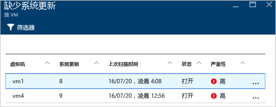

“缺少的系统更新”边栏选项卡显示包含以下信息的表： 

* **虚拟机**：缺少更新的虚拟机的名称。
* **系统更新**：缺少的系统更新的数目。
* **上次扫描时间**：安全中心上次扫描虚拟机以获取更新的时间。
* **状态**：该建议的当前状态：
  * **未解决**：建议尚未得到处理。
  * **正在进行**：目前已将建议应用到相关资源，不需用户采取行动。
  * **已解决**：已完成建议。 （解决问题后，此条目将变暗）。
* **严重性**：描述该特定建议的严重性：
  * **高**：重要资源（应用程序、虚拟机或网络安全组）存在漏洞，需要引起注意。
  * **中**：需要采取非关键步骤或额外步骤来完成某个过程或消除某个漏洞。
  * **低**：漏洞需要解决，但不需立即处理。 （默认情况下，不显示严重性低的建议，但如果用户需要查看这些建议，可以将其筛选出来。）

若要查看建议详细信息，请单击虚拟机的名称。 该虚拟机的新边栏选项卡随即打开，显示更新列表，如以下屏幕截图所示。

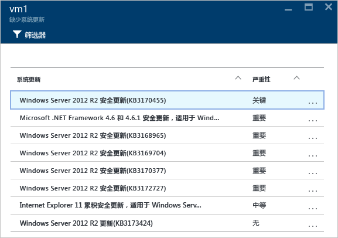

> [!NOTE]
> 此处提供的安全建议与“建议”边栏选项卡中的相同。 请参阅[在 Azure 安全中心实施安全建议](security-center-recommendations.md)，详细了解如何应用建议。 这不仅适用于虚拟机，还适用于“资源运行状况”磁贴中提供的所有资源。
> 
> 

#### 虚拟机部分
通过虚拟机部分可概览所有虚拟机和建议。 每一列代表一组建议，如以下屏幕截图所示：

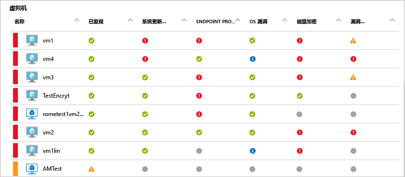

每个建议下都会显示一个图标，用于快速确定需要关注的虚拟机以及建议的类型。

在以上示例中，一个虚拟机有一条关于终结点保护的关键建议。 若要获取有关虚拟机的详细信息，请单击它。 将打开一个新边栏选项卡来表示此虚拟机，如以下屏幕截图所示。

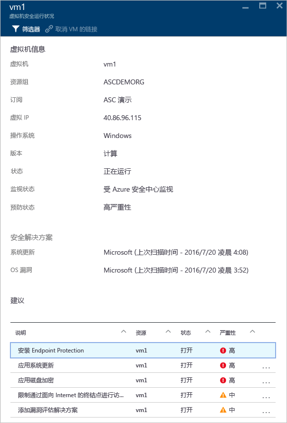

此边栏选项卡提供虚拟机的安全详细信息。 在此边栏选项卡的底部，可以看到建议的操作以及每个问题的严重级别。

#### 云服务（预览版）部分
虚拟机“安全运行状况”磁贴包含云服务的运行状况。 操作系统版本过期时创建了建议，如以下屏幕截图所示：

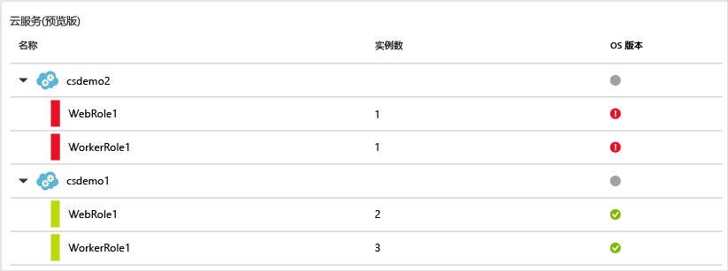

必须按建议中的步骤更新操作系统版本。 例如，如果单击 WebRole1（运行 Windows Server，将 Web 应用自动部署到 IIS）或 WorkerRole1（运行 Windows Server，将 Web 应用自动部署到 IIS）行中红色警报，将打开新的边栏选项卡，其中包含有关此建议的更多详细信息，如以下屏幕截图所示：

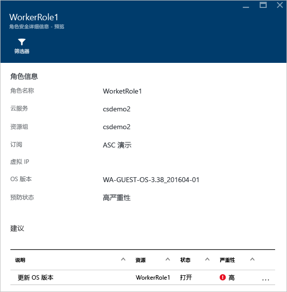

若要查看有关此建议的更全面的说明，请在“说明”栏下单击“更新 OS 版本”。 此时会打开“更新 OS 版本(预览版)”边栏选项卡，其中包含更多详细信息。

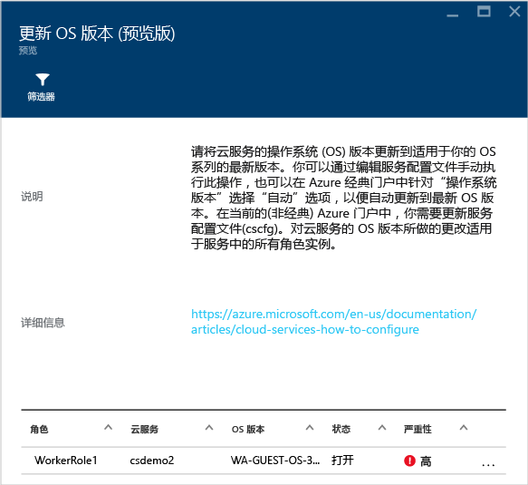  

### 监视虚拟网络
单击“资源安全运行状况”磁贴中的“网络”即可打开“网络”边栏选项卡，其中包含更多详细信息，如以下屏幕截图所示：

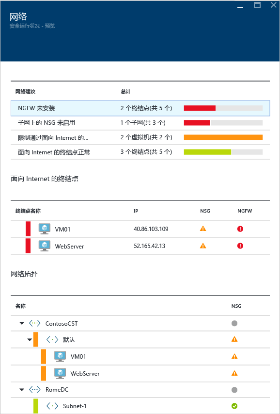

#### 网络建议
此边栏选项卡在顶部提供汇总问题列表，在底部提供所监视网络的列表，与虚拟机资源运行状况信息类似。

网络状态细分部分列出了可能的安全问题，并提供了[建议](security-center-network-recommendations.md)。 可能的问题包括：

* 未安装下一代防火墙 (NGFW)
* 子网上未启用网络安全组
* 虚拟机上未启用网络安全组
* 禁止通过公共的外部终结点进行外部访问
* 面向 Internet 的终结点运行正常

单击建议时，新的边栏选项卡随即打开，显示有关建议的更多详细信息，如以下示例所示。

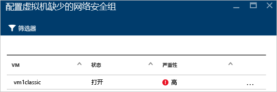

在此示例中，“为子网配置缺少的网络安全组”边栏选项卡提供了一个列表，其中的子网和虚拟机缺少网络安全组保护。 单击要应用网络安全组的子网，将打开另一个边栏选项卡。

在“选择网络安全组”边栏选项卡中，既可以选择最适合子网的网络安全组，也可以创建新的网络安全组。

#### 面向 Internet 的终结点部分
在“面向 Internet 的终结点”部分，可以看到当前配置了面向 Internet 的终结点的虚拟机及其当前状态。

此表提供代表虚拟机的终结点名称、面向 Internet 的 IP 地址，以及网络安全组和 NGFW 当前的严重性状态。 此表按严重性排序：

* 红色（顶部）：优先级高，应立即处理
* 橙色：优先级中，应尽快处理
* 绿色（最后一条）：运行状况正常

#### 网络拓扑部分
“网络拓扑”部分提供了资源的分层视图，如以下屏幕截图所示：

此表按严重性排序（虚拟机和子网）：

* 红色（顶部）：优先级高，应立即处理
* 橙色：优先级中，应尽快处理
* 绿色（最后一条）：运行状况正常

在此拓扑视图中，第一层级包括[虚拟网络](../virtual-network/virtual-networks-overview.md)、[虚拟网络网关](../vpn-gateway/vpn-gateway-site-to-site-create.md)和[虚拟网络（经典）](../virtual-network/virtual-networks-create-vnet-classic-pportal.md)。 第二层级包括子网，第三层级包括属于这些子网的虚拟机。 右侧一栏为这些资源的网络安全组的当前状态，如以下示例所示：

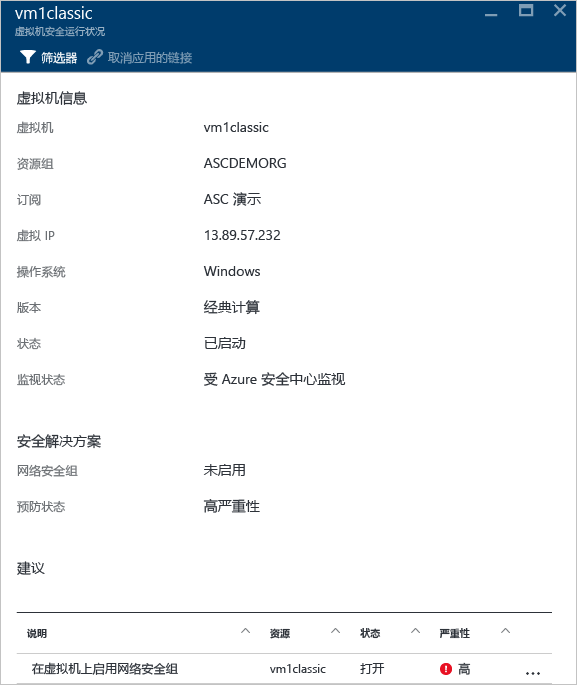

此边栏选项卡底部为对此虚拟机的建议，与前述内容类似。 单击某个建议即可了解其详细信息或应用所需的安全控制或配置。

### 监视数据
单击“资源安全运行状况”磁贴中的“SQL”即可打开“SQL”边栏选项卡，其中包含对各种问题（例如：正在进行审核，透明数据加密未启用）的建议。 此外还有针对数据库常规运行状况的[建议](security-center-sql-service-recommendations.md)。

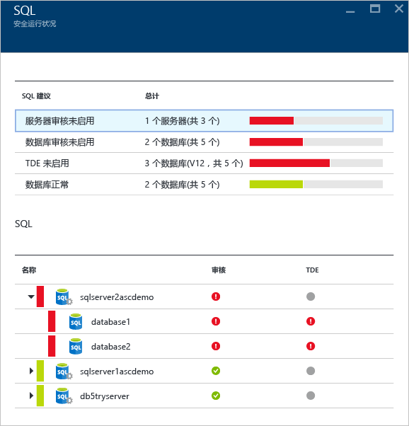

可以单击任何建议，并获取有关进一步操作的更多详细信息以解决问题。 以下示例对“数据库审核未启用”这个建议的问题进行了说明。

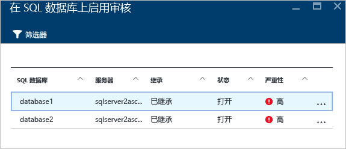

“对 SQL 数据库启用审核”边栏选项卡包含以下信息： 

* SQL 数据库列表
* 所在的服务器
* 此设置是从服务器继承的，还是此数据库独有的
* 当前状态
* 问题的严重性

单击数据库解决建议的问题时，将会打开“审核和威胁检测”边栏选项卡，如以下屏幕截图所示。

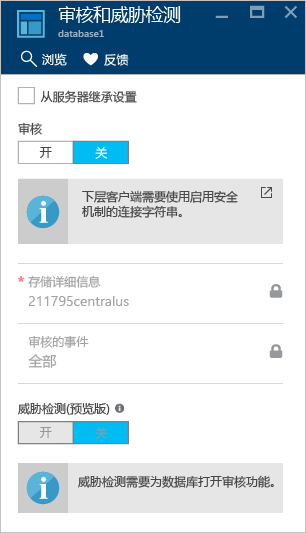

若要启用审核，请在“审核”选项下选择“启用”。

### 监视应用程序
如果 Azure 工作负荷中的应用程序位于[（通过 Azure Resource Manager 创建的）虚拟机](../azure-resource-manager/resource-manager-deployment-model.md)中，且后者使用公开的 Web 端口（TCP 端口 80 和 443），安全中心可以监视这些端口，确定潜在的安全问题并提供补救步骤方面的建议。 单击“应用程序”磁贴即可打开“应用程序”边栏选项卡，在“预防步骤”部分包含一系列建议。 此外还会根据主机/虚拟 IP 显示应用程序明细，如以下屏幕截图所示。

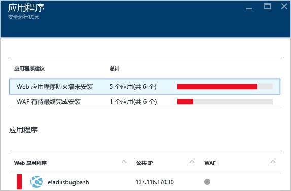

与其他建议一样，单击建议即可查看有关问题的更多详细信息以及补救方法。 下图所示示例为已被确定为不安全 Web 应用程序的应用程序。 选择被视为不安全的应用程序时，会打开另一个边栏选项卡，其中包含以下可用选项：

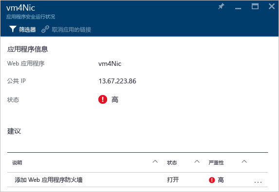

该边栏选项卡会提供一个列表，其中包含对此应用程序的所有建议。 单击“添加 Web 应用程序防火墙”建议即可打开“添加 Web 应用程序防火墙”边栏选项卡，其中包含安装合作伙伴所提供 Web 应用程序防火墙 (WAF) D 的选项，如以下屏幕截图所示。

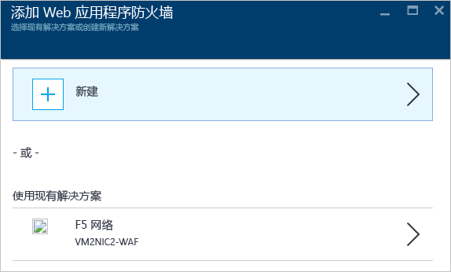

## 另请参阅
本文介绍了如何使用 Azure 安全中心的监视功能。 若要了解更多有关 Azure 安全中心的详细信息，请参阅以下内容：

* [在 Azure 安全中心设置安全策略](security-center-policies.md)：了解如何在 Azure 安全中心配置安全设置。
* [管理和响应 Azure 安全中心的安全警报](security-center-managing-and-responding-alerts.md)：了解如何管理和响应安全警报。
* [通过 Azure 安全中心监视合作伙伴解决方案](security-center-partner-solutions.md)：了解如何监视合作伙伴解决方案的运行状态。
* [Azure 安全中心常见问题](security-center-faq.md)：查找有关使用服务的常见问题。
* [Azure 安全性博客](http://blogs.msdn.com/b/azuresecurity/):.查找关于 Azure 安全性及合规性的博客文章

<!--HONumber=Nov16_HO4-->

