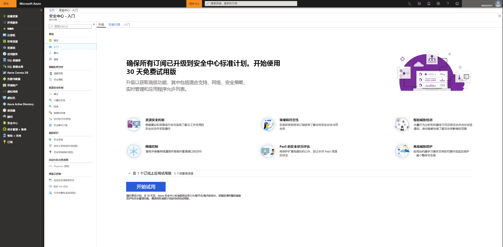
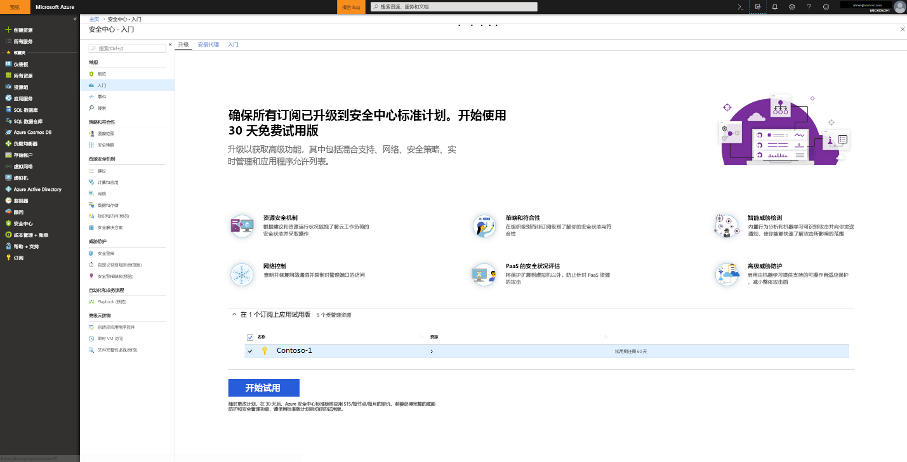

# 载入到 Azure 安全中心标准层以增强安全性
升级到安全中心标准层后，可以将增强的安全管理和威胁防护功能用于混合云工作负载。  可以免费试用标准层。 请参阅安全中心[定价页](https://azure.microsoft.com/pricing/details/security-center/)了解详细信息。

安全中心标准层包括：

- 混合安全 – 在所有本地和云工作负载上获得统一的安全视图。 应用安全策略并持续评估混合云工作负载的安全性，确保符合安全标准。 收集、搜索并分析来自各种来源（包括防火墙和其他合作伙伴解决方案）的安全数据。
- 高级威胁检测 - 使用高级分析和 Microsoft Intelligent Security Graph，获得针对不断演变的网络攻击的优势。  利用内置行为分析和机器学习来识别攻击和零时差攻击。 监视网络、计算机和云服务是否出现有即将来袭的攻击和攻破后活动。 使用交互工具和上下文威胁智能简化调查。
- 访问和应用程序控件 - 通过应用适合特定工作负载且由机器学习提供支持的允许列表建议，阻止恶意软件和其他不需要的应用程序。 通过对 Azure VM 上管理端口的实时控制访问减小网络攻击面，显著减小在暴力和其他网络攻击下的曝光面。

## 检测未受保护的资源     
安全中心将自动检测未启用安全中心标准层的所有 Azure 订阅或工作区。 其中包括使用安全中心免费层的 Azure 订阅和未启用安全解决方案的工作区。

你可以将整个 Azure 订阅升级到标准层，这会由订阅中所有受支持的资源继承。 将标准层应用到工作区适用于向工作区报告的所有资源。

> [!NOTE]
> 你可能希望管理成本，并通过将解决方案的应用范围限制为特定的一组代理来限制为解决方案收集的数据量。 [解决方案目标](../operations-management-suite/operations-management-suite-solution-targeting.md)使用户可以向解决方案应用一个范围，并可将目标设定为工作区中的一个计算机子集。  如果使用解决方案目标功能，安全中心会将工作区列为没有解决方案。
>
>

## 升级 Azure 订阅或工作区
若要将订阅或工作区升级到标准版，请执行以下操作：
1. 在“安全中心”主菜单下，选择“入门”。
  
2. 在“升级”下，安全中心将列出符合载入条件的订阅和工作区。 
   - 可以单击可展开的“申请试用”来查看所有订阅和工作区的列表及其试用资格状态。
   -    你可以升级没有资格试用的订阅和工作区。
   -    可以选择符合试用条件的工作区和订阅来开始试用。
3.  单击“开始试用”在所选订阅上开始试用。
  

   > [!NOTE]
   > 安全中心的免费功能仅适用于 Azure Vm 和 VMSS。 免费层功能不会应用到非 Azure 计算机。 如果选择 "标准"，则标准功能将应用于向工作区报告的所有 Azure Vm、VM 规模集和非 Azure 计算机。 建议应用标准层，以便为 Azure 和非 Azure 资源提供高级安全功能。
   >
   >

## 载入非 Azure 计算机
安全中心可以监视非 Azure 计算机的安全状态，但首先需要载入这些资源。 可以从“入门”边栏选项卡或“计算”边栏选项卡添加非 Azure 计算机。 我们将逐步介绍这两种方法。

### 从“入门”添加新的非 Azure 计算机

1. 返回到“入门”。   
2. 选择“入门”选项卡。

   

3. 单击“添加新的非 Azure 计算机”下的“配置”。 此时将显示 Log Analytics 工作区的列表。 该列表包含启用自动预配时由安全中心创建的默认工作区（如果适用）。 选择此工作区或要使用的其他工作区。

   ![添加非 Azure 计算机][7]

如果已有工作区，则会将它们列在“添加新的非 Azure 计算机”下。 可以将计算机添加到现有的工作区，也可以新建一个工作区。 若要新建一个工作区，请选择“添加新工作区”链接。

### 从“计算”添加新的非 Azure 计算机

**新建一个工作区并添加计算机**

1. 在“添加新的非 Azure 计算机”下，选择“添加新工作区”。

   ![添加新工作区][4]

2. 在“安全和审核”下，选择“OMS 工作区”以新建工作区。
   > [!NOTE]
   > OMS 工作区现在称为 Log Analytics 工作区。
3. 在“OMS 工作区”下，输入工作区的相关信息。
4. 在“OMS 工作区”下，选择“确定”。  选择“确定”后，将获取一个用于下载 Windows 或 Linux 代理的链接和工作区 ID 的密钥（用于配置此代理）。
5. 在“安全和审核”下，选择“确定”。

**选择现有的工作区并添加计算机**

可以按照“载入”中的工作流操作，添加计算机，如下所示。 也可以按照“计算”中的工作流来添加计算机。 本示例使用“计算”。

1. 返回到安全中心的主菜单，并转到“概述”仪表板。

   ![概述][5]

2. 选择“计算和应用”。
3. 在“计算和应用程序”下，选择“添加计算机”。

   ![“计算”边栏选项卡][6]

4. 在“添加新的非 Azure 计算机”下，选择要将计算机连接到的工作区，然后单击“添加计算机”。

   ![添加计算机][7]

   “直接代理”边栏选项卡会提供一个用于下载 Windows 或 Linux 代理的链接，以及要在配置此代理时使用的工作区 ID 和密钥。   

## 后续步骤
在本文中，你已了解如何载入 Azure 和非 Azure 资源，以便利用安全中心的高级安全功能的优势。  若要对载入资源执行更多操作，请参阅

- [启用数据收集](security-center-enable-data-collection.md)
- [威胁智能报告](security-center-threat-report.md)
- [恰时 VM 访问](security-center-just-in-time.md)

<!--Image references-->
[1]: ./media/security-center-onboarding/onboard.png
[2]: ./media/security-center-onboarding/onboard-subscription.png
[3]: ./media/security-center-onboarding/get-started.png
[4]: ./media/security-center-onboarding/create-workspace.png
[5]: ./media/security-center-onboarding/overview.png
[6]: ./media/security-center-onboarding/compute-blade.png
[7]: ./media/security-center-onboarding/add-computer.png
[8]: ./media/security-center-onboarding/onboard-workspace.png
