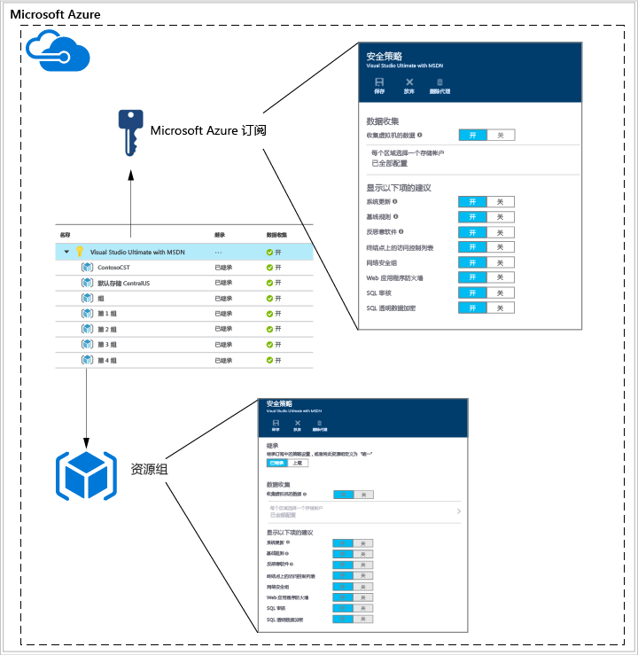
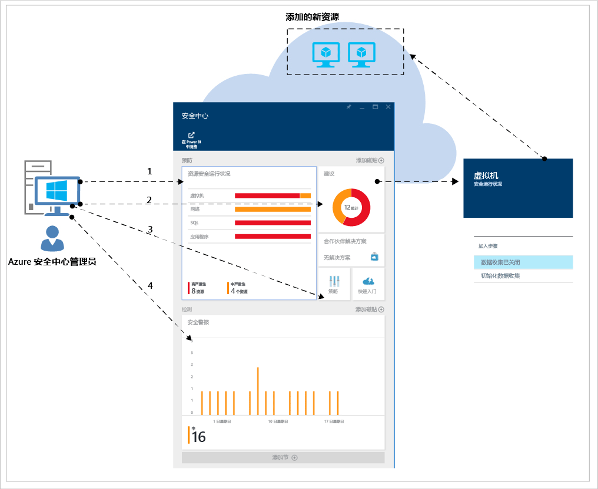
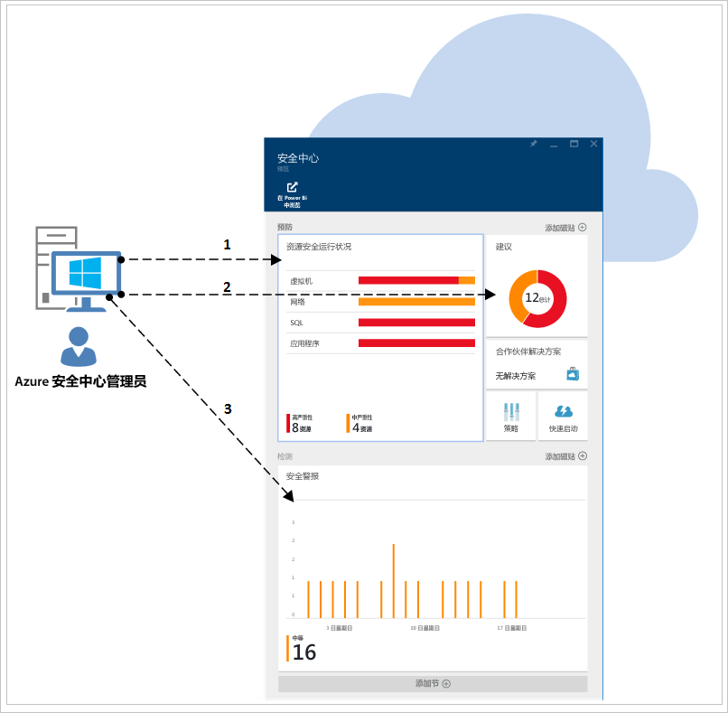
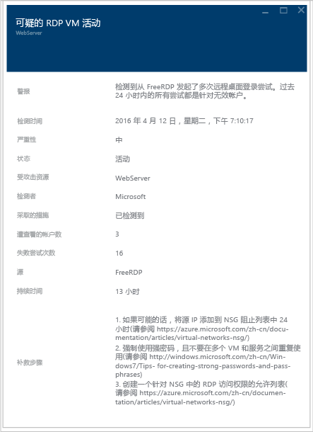

# Azure 安全中心规划和操作指南
本指南适用于其组织正计划使用 Azure 安全中心的信息技术 (IT) 专业人员、IT 架构师、信息安全分析师和云管理员。

## 规划指南
本指南介绍如何通过一系列步骤和任务，根据组织的安全要求和云管理模型优化安全中心的使用。 若要充分利用安全中心，必须了解在需要进行安全开发和操作、监视、管理和事件响应的情况下，组织中的不同个人或团队是如何使用服务的。 规划安全中心的使用时，需要考虑的重要方面包括：

* 安全角色和访问控制
* 安全策略和建议
* 数据收集和存储
* 持续安全监视
* 事件响应

下一部分介绍如何针对每个方面进行计划，并根据要求应用相关建议。

> [!NOTE]
> 阅读 [Azure Security Center frequently asked questions (FAQ)](security-center-faq.md) （Azure 安全中心常见问题 (FAQ)），了解一系列常见问题，这些问题在设计和规划阶段可能也会有用。
> 
> 

## 安全角色和访问控制
很多个人和团队可能会使用安全中心执行不同的安全相关任务，具体取决于组织的大小和结构。 下图示例性地说明了各种虚构性的人员及其相应的角色和安全责任：

这些人员通过安全中心行使不同的责任。 例如：

**Jeff（云工作负荷所有者）**

* 管理云工作负荷及其相关资源
* 负责根据公司安全策略实施和维护各种保护措施

**Ellen（首席信息安全官/首席信息官）**

* 负责公司安全的各个方面
* 需要跨云工作负荷了解公司的安全状况
* 需要了解各种主要攻击和风险

**David（IT 安全）**

* 制定公司安全策略，确保实施适当的保护措施
* 监视合规性
* 生成领导力报表或审核报表

**Judy（安全操作）**

* 全天候监视和响应安全警报
* 将案例上报到云工作负荷所有者或 IT 安全分析师

**Sam（安全分析师）**

* 调查各种攻击
* 根据警报采取补救措施，或与云工作负荷所有者协作应用补救措施 

安全中心使用[基于角色的访问控制 (RBAC)](../active-directory/role-based-access-control-configure.md) 提供可在 Azure 中分配给用户、组和服务的[内置角色](../active-directory/role-based-access-built-in-roles.md)。 用户打开安全中心时，只能看到有权访问的资源的相关信息。 这意味着，可以将资源所属的订阅或资源组的“所有者”、“参与者”或“读者”角色分配给用户。 

> [!NOTE]
> 用户需要拥有至少一个订阅，并身为资源组所有者或参与者才能在 Azure 中看到安全中心。
> 
> 

根据上图介绍的人员，需要以下 RBAC：

**Jeff（云工作负荷所有者）**

* 资源组所有者/协作者

**David（IT 安全）**

* 订阅所有者/协作者

**Judy（安全操作）**

* 查看警报的订阅读者
* 消除警报需征求其同意的订阅所有者/协作者

**Sam（安全分析师）**

* 查看警报的订阅读者
* 补救或消除警报需征求其同意的订阅所有者/协作者
* 可能需要访问存储

其他一些需要考虑的重要信息：

* 只有订阅所有者和参与者可以编辑安全策略
* 只有订阅和资源组的所有者和参与者可以应用针对某个资源的安全建议

使用安全中心的 RBAC 规划访问控制时，请确保了解组织中的哪些人员会使用安全中心。 另外还需了解这些人员所执行的任务的类型，然后才能进行相应的 RBAC 配置。

> [!NOTE]
> 对于需要完成任务的用户，建议尽可能为其分配权限最小的角色。 例如，如果用户只需查看资源的安全状况信息而不需执行操作（例如应用建议或编辑策略），则应为其分配“读者”角色。
> 
> 

## 安全策略和建议
安全策略用于定义一组控制，这些控制是针对指定订阅或资源组中的资源建议的。 在安全中心定义策略时，需考虑到公司的安全要求和应用程序类型或数据的敏感性。

在订阅级别启用的策略会自动传播到该订阅中的所有资源组，所下图所示：

如前图所示，可以从订阅级别继承资源组的安全策略。

在某些情况下，资源组中的资源可能需要其他策略集，此时可禁用继承，对指定资源组应用自定义策略。

若需在特定资源组中应用自定义策略，应在资源组中禁用继承，然后更改安全策略。 例如，如果某些工作负荷不需 SQL 透明数据加密策略，可在订阅级别关闭该策略，仅在需要 SQL TDE 的资源组中启用。

若要开始为不同资源组创建自定义策略，则应在规划策略部署时明白，在发生策略冲突的情况下（订阅策略与资源组策略冲突），以资源组策略为准。

> [!NOTE]
> 如需查看更改的策略，可使用 [Azure 审核日志](https://blogs.msdn.microsoft.com/cloud_solution_architect/2015/03/10/audit-logs-for-azure-events/)。 策略更改始终记录在 Azure 审核日志中。
> 
> 

### 安全建议
在配置安全策略之前，请查看每项 [安全建议](security-center-recommendations.md)，确定这些策略是否适合各种订阅和资源组。 此外，还要了解需执行什么操作才能解决安全建议中提到的问题。

**终结点保护**：如果虚拟机没有启用终结点保护解决方案，安全中心建议用户安装一个。 如果用户更愿意使用已在本地采用的终结点保护解决方案，则需确定是否对 Azure VM 使用相同的反恶意软件。 安全中心为用户提供多个终结点保护选项。  可以使用免费的 Microsoft Antimalware，也可以从集成合作伙伴提供的一系列终结点保护解决方案中进行选择。 如需详细了解如何通过安全中心部署反恶意软件，请阅读 [Install Endpoint Protection in Azure Security Center](security-center-install-endpoint-protection.md)（在 Azure 安全中心安装终结点保护）。

**系统更新**：安全中心可确定哪些虚拟机缺少针对 IaaS 和云服务 (PaaS) 的安全更新或关键的操作系统更新。 考虑谁负责在需要时应用更新以及如何应用这些更新。 许多组织使用 WSUS、Windows 更新或其他工具。

**基准配置**：如果虚拟机操作系统配置不符合建议的基准配置，则会显示一项建议。 在 [此处](https://gallery.technet.microsoft.com/Azure-Security-Center-a789e335) 查看一系列基准配置，考虑如何应用操作系统配置。

**磁盘加密**：如果虚拟机磁盘尚未加密，安全中心建议用户应用 Azure 磁盘加密。 此功能利用 Windows 版 BitLocker 和 Linux 版 DM-Crypt 对 OS 和数据磁盘进行卷加密。 此建议将用户重定向到 [分步指南](security-center-disk-encryption.md) ，其中提供了如何执行该加密的说明。

请注意，有几个需要解决的加密方案。 每个此类方案都有独特的要求，需针对这些要求进行规划：

* 加密已使用用户自己的加密密钥加密的 VHD 中的新 Azure 虚拟机
* 加密从 Azure 库创建的新 Azure 虚拟机
* 加密已在 Azure 中运行的 Azure 虚拟机

每一种此类方案的规划要求各不相同。 请参阅 [Azure 磁盘加密白皮书](https://gallery.technet.microsoft.com/Azure-Disk-Encryption-for-a0018eb0) ，了解每一种此类方案的详细信息。

**Web 应用程序防火墙**：安全中心会确定运行 Web 应用程序的虚拟机，并会建议用户安装 Web 应用程序防火墙 (WAF)。 评估可用的合作伙伴解决方案，确定哪种方案最适合组织，以及如何为该方案获取许可（合作伙伴可能支持自带许可和/或即用即付模型）。 若要详细了解如何通过安全中心在 Azure VM 中部署 Web 应用程序防火墙，请阅读 [Add a web application firewall in Azure Security Center](security-center-add-web-application-firewall.md)（在 Azure 安全中心添加 Web 应用程序防火墙）。

**下一代防火墙**：允许用户预配先锋供应商（包括 Check Point、Cisco 和 Fortinet）提供的虚拟设备。 这样可将网络保护扩展到内置到 Azure 中的网络安全组以外。 安全中心会发现那些需要安装下一代防火墙的部署，并允许用户预配虚拟设备。

**虚拟网络**：安全中心会评估 [Azure 虚拟网络](https://azure.microsoft.com/documentation/services/virtual-network/)基础结构和配置，确保已应用[网络安全组](../virtual-network/virtual-networks-nsg.md)并使用入站通信规则对其进行适当配置。 用户应考虑需定义何种流量规则，并将其告知负责应用相关安全建议的人员。

对于 Azure 订阅，安全中心建议用户提供安全方面的联系细节。 如果 Microsoft 安全响应中心 (MSRC) 发现用户的客户数据被某方非法访问或未经授权访问，Microsoft 会使用该信息联系用户。 若要详细了解如何启用此建议，请阅读 [Provide security contact details in Azure Security Center](security-center-provide-security-contact-details.md) （在 Azure 安全中心提供安全方面的联系细节）。

## 数据收集和存储
强烈建议为每个订阅启用数据收集功能，确保对所有 VM 进行安全监视。 可通过 Azure 监视代理 (ASMAgentLauncher.exe) 和 Azure 安全监视扩展 (ASMMonitoringAgent.exe) 启用数据收集功能。

Azure 安全监视扩展会扫描各种安全相关配置，从虚拟机中收集安全日志。 此类数据发送到指定的存储帐户。 扫描管理器 (ASMSoftwareScanner.exe) 也会安装到虚拟机中，用作修补程序扫描程序。

Azure 安全监视 (ASM) 代理具有以下占用量基线：

* 多数情况下内存需求量为 3 MB，方案每 12 小时运行一次时可能激增至 10 MB。  
* 持久性进程和扫描仪都可忽略不计的 CPU。 
* 可忽略不计的磁盘使用率。

ASM 代理具有内存总计可达约 30 MB 的进程链。  每个监视代理实例可以使用最多 3 GB 的磁盘。 每个实例的上限为 20% CPU，尽管在实践中要少得多。 

在安全策略中启用数据收集功能以后，就会自动在所有现有的和新的受支持虚拟机（在 Azure 中预配）中安装监视代理和扩展。  代理的过程设计为非入侵性，对 VM 性能的影响非常小。

> [!NOTE]
> 若要排查 Azure 安全监视代理相关问题，请阅读 [Azure Security Center Troubleshooting Guide](security-center-troubleshooting-guide.md)（Azure 安全中心故障排除指南）。
> 
> 

如需在某个时候禁用数据收集功能，可在安全策略中将其关闭。 若要删除以前部署的监视代理，请选择“删除代理”菜单选项。

> [!NOTE]
> 若要查找受支持 VM 的列表，请阅读 [Azure Security Center frequently asked questions (FAQ)](security-center-faq.md)（Azure 安全中心常见问题 (FAQ)）。
> 
> 

对于每个有虚拟机运行的区域，可选择相应的存储帐户存储从这些虚拟机收集的数据。 如果用户没有为每个区域选择一个存储帐户，系统会为用户创建一个。 可以按区域选择存储位置，也可以将所有信息存储在中心位置。 虽然可以在 Azure 订阅级别和资源组级别设置安全策略，但只能在订阅级别选择存储帐户的区域。

如果使用在不同 Azure 资源间共享的存储帐户，请务必阅读 [Azure 存储空间可伸缩性和性能目标](../storage/storage-scalability-targets.md)一文，了解有关大小限制和约束的详细信息。 订阅也有存储帐户限制。若要更好地了解这些限制，请查阅 [Azure 订阅和服务的限制、配额和约束条件](../azure-subscription-service-limits.md)。

与此存储关联的成本不包括在安全中心服务的价格中，将单独按常规的 [Azure 存储费率](https://azure.microsoft.com/pricing/details/storage/)计费。 从规划角度来看，应注意安全中心将向 Azure 存储添加数据，每年可能增加 1 到 3 美元的成本。

也应根据 Azure 环境规模和资源（占用存储帐户空间）对性能和可伸缩性事项进行规划。 有关详细信息，请参阅 [Microsoft Azure Storage Performance and Scalability Checklist](../storage/storage-performance-checklist.md) （Microsoft Azure 存储性能和可伸缩性清单）。

> [!NOTE]
> Microsoft 坚决承诺保护此类数据的隐私和安全性。 从服务的编码到运营，Microsoft 都严格遵守相关法规与安全准则。 有关数据处理和隐私的详细信息，请参阅 [Azure 安全中心数据安全](security-center-data-security.md)。
> 
> 

## 持续安全监视
对安全中心建议进行初始配置和应用以后，下一步是考虑安全中心的操作过程。

若要从 Azure 门户访问安全中心，可单击“浏览”，然后在“筛选器”字段中键入“安全中心”。 用户获得的视图取决于这些已应用的筛选器。

安全中心不会干扰正常的操作过程，而是被动监视部署，根据启用的安全策略提供建议。

“安全中心”仪表板分为两个主要部分：

* 预防
* 检测

首次在安全中心为当前的 Azure 环境启用数据收集功能时，请确保查看所有建议，此操作可在“建议”边栏选项卡中进行，也可按资源（**虚拟机**、**网络**、**SQL** 和**应用程序**）进行。

解决所有建议的问题以后，所有已解决问题的资源的“预防”部分应显示为绿色。 此时进行持续监视会变得更容易，因为用户只需根据“资源安全运行状况和建议”磁贴中的变化进行操作。

“检测”部分更具响应性。这些是与问题相关的警报，这些问题可能发生在现在，也可能发生在过去，并且被安全中心控件和第三方系统检测到过。 “安全警报”磁贴所显示的条形图代表检测到威胁的警报数，这些警报每天都会出现，分布在不同的严重性类别（低、中、高）。 有关安全警报的详细信息，请参阅[管理和响应 Azure 安全中心的安全警报](security-center-managing-and-responding-alerts.md)。

> [!NOTE]
> 也可利用 Microsoft Power BI 实现安全中心数据的可视化。 阅读 [Get insights from Azure Security Center data with Power BI](security-center-powerbi.md)（使用 Power BI 从 Azure 安全中心数据获得见解）。
> 
> 

### 监视新的或更改的资源
大多数 Azure 环境是动态的，新资源会定期出现和消失，也会出现新配置或新变化等。安全中心可确保用户能够查看这些新资源的安全状态。

将新资源（VM、SQL 数据库）添加到 Azure 环境时，安全中心会自动发现这些资源，并开始监视其安全性。 这还包括 PaaS Web 角色和辅助角色。 如果在 [安全策略](security-center-policies.md)中启用了数据收集功能，则会自动为虚拟机启用更多监视功能。

1. 对于虚拟机，若要访问“资源安全运行状况”磁贴，请单击“虚拟机”。 如果在启用数据收集功能或相关建议时出现问题，该问题会显示在“监视建议”部分。
2. 查看“建议”，了解为新资源确定了何种安全风险（如果有）。
3. 将新的 VM 添加到环境时，只在一开始安装了操作系统，这很常见。 资源所有者可能需要一些时间来部署其他应用供这些 VM 使用。  理想情况下，用户应该知道此工作负荷的最终目的。 它将用作应用程序服务器？ 根据这个新的工作负荷的用途，可以启用相应的 **安全策略**，这在此工作流中是第三步。
4. 随着新的资源添加到 Azure 环境，新警报可能会显示在“安全警报”磁贴中。 应始终验证此磁贴中是否有新警报，并根据安全中心的建议采取措施。

此外还需定期监视现有资源的状态，确定造成安全风险、建议基线漂移和安全警报的配置更改。 从“安全中心”仪表板开始。 在这里需采取一致措施查看三大方面。

1. 可以通过“资源安全运行状况”面板快速访问关键资源。 可以通过此选项监视虚拟机、网络、SQL 和应用程序。
2. 可以通过“建议”面板查看安全中心的建议。 在持续监视过程中，用户可能会发现并不是每天都有建议出现，这是正常的，因为在一开始设置安全中心时，所有建议的问题都已解决了。 因此，此部分可能不是每天都有新信息，只需根据需要进行访问即可。
3. “检测”面板可能会特别频繁地或特别不频繁地发生更改。 请始终查看安全警报，根据安全中心建议采取行动。

## 事件响应
安全中心会检测威胁并在威胁出现时向用户发出警报。 组织应监视是否有新的安全警报，并根据需要采取行动，进一步进行调查，或采取应对攻击的补救措施。 有关安全中心威胁检测机制的详细信息，请阅读 [Azure Security Center detection capabilities](security-center-detection-capabilities.md)（Azure 安全中心检测功能）。

虽然本文不会协助用户创建自己的事件响应计划，但仍会在云的生命周期中使用 Microsoft Azure 安全响应作为事件响应阶段的基础。 下图显示了这些阶段：

> [!NOTE]
> 若要构建自己的事件响应计划，用户可以使用国家标准和技术协会 (NIST) 提供的 [Computer Security Incident Handling Guide](http://nvlpubs.nist.gov/nistpubs/SpecialPublications/NIST.SP.800-61r2.pdf) （计算机安全事件处理指南）作为参考。
> 
> 

可以在以下阶段使用安全中心警报：

* **检测**：确定一个或多个资源中的可疑活动。 
* **评估**：进行初始评估，了解可疑活动的详细信息。
* **诊断**：通过补救步骤采用技术过程解决问题。

每个安全警报所提供的信息都可以用来更好地了解攻击的性质，并提供可能的缓解措施建议。 某些警报还提供链接，单击这些链接即可获取更多信息或访问 Azure 中的其他信息源。 可以使用提供的信息进行进一步的研究，并开始落实缓解攻击的措施。

下面的示例演示了正在发生的可疑的 RDP 活动：

可以看到，此边栏选项卡显示的详细信息包括攻击发生的时间、源主机名、目标 VM，并提供了建议步骤。 在某些情况下，攻击的源信息可能为空。 阅读 [Missing Source Information in Azure Security Center Alerts](https://blogs.msdn.microsoft.com/azuresecurity/2016/03/25/missing-source-information-in-azure-security-center-alerts/) （Azure 安全中心警报中缺少源信息），了解此类行为的详细信息。

在 [How to Leverage the Azure Security Center & Microsoft Operations Management Suite for an Incident Response](https://channel9.msdn.com/Blogs/Taste-of-Premier/ToP1703)（如何利用 Azure 安全中心和 Microsoft Operations Management Suite 进行事件响应）视频中，用户可以看到一些演示，了解如何在每个这样的阶段发挥安全中心的作用。

> [!NOTE]
> 参阅[利用 Azure 安全中心进行事件响应](security-center-incident-response.md)，详细了解事件响应过程如何使用安全中心功能进行协助。 
> 
> 

## 另请参阅
本文档介绍如何进行规划，为采用安全中心做准备。 若要了解有关安全中心的详细信息，请参阅以下文章：

* [Managing and responding to security alerts in Azure Security Center](security-center-managing-and-responding-alerts.md)
* [Security health monitoring in Azure Security Center](security-center-monitoring.md) （Azure 安全中心的安全运行状况监视）- 了解如何监视 Azure 资源的运行状况。
* [Monitoring partner solutions with Azure Security Center](security-center-partner-solutions.md) （通过 Azure 安全中心监视合作伙伴解决方案）- 了解如何监视合作伙伴解决方案的运行状况。
* [Azure Security Center FAQ](security-center-faq.md) （Azure 安全中心常见问题）- 查找有关如何使用服务的常见问题。
* [Azure 安全性博客](http://blogs.msdn.com/b/azuresecurity/) - 查找关于 Azure 安全性及合规性的博客文章。

<!--HONumber=Dec16_HO2-->

