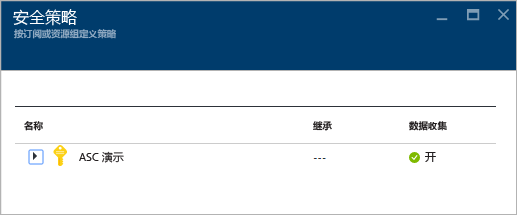
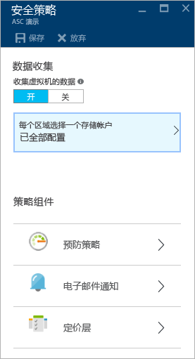
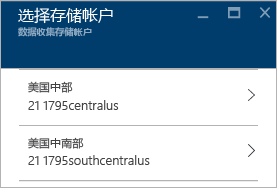
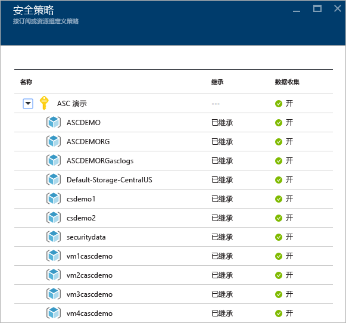
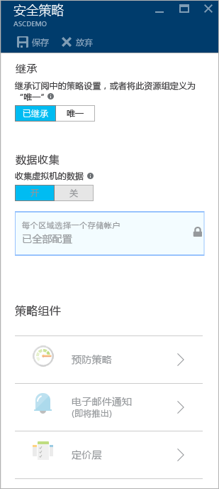

# 在 Azure 安全中心设置安全策略
本文档介绍如何在安全中心配置安全策略，指导用户完成执行此任务所必需的步骤。

## 什么是安全策略？
安全策略用于定义一组控制，这些控制是针对指定订阅或资源组中的资源建议的。 在安全中心，用户需根据公司安全需求和应用程序的类型或每个订阅中数据的敏感性，为 Azure 订阅或资源组定义策略。

例如，开发或测试用资源的安全要求可能不同于生产应用型资源。 同样，使用管控数据（例如个人身份信息）的应用程序可能需要更高级别的安全性。 在 Azure 安全中心启用的安全策略可以通过安全建议和监视帮助用户确定可能的漏洞并缓解威胁造成的危害。 阅读 [Azure Security Center Planning and Operations Guide](security-center-planning-and-operations-guide.md) （Azure 安全中心规划和操作指南），详细了解如何确定适当的选项。

## 设置订阅的安全策略
可以配置每个订阅或资源组的安全策略。 若要修改安全策略，用户必须是该订阅的所有者或参与者。 登录到 Azure 门户，按照后续步骤在安全中心配置安全策略：

1. 单击“安全中心”仪表板中的“策略”磁贴。
2. 在打开的“安全策略 - 按订阅或资源组定义策略”边栏选项卡中，选择需要启用安全策略的订阅。 若要为资源组而非整个订阅启用安全策略，请向下滚动到下一部分，了解如何为资源组设置安全策略。
   
    
3. 所选订阅的“安全策略”边栏选项卡在打开时会显示一组选项，类似于以下屏幕截图中的选项： 
   
    
   
    此边栏选项卡中的可用选项包括：
   
   * **预防策略**：使用此选项配置每个订阅或资源组的策略。  
   * **电子邮件通知**：使用此选项配置电子邮件通知，让其在每天第一次出现警报时发送，以及在警报的严重性高的情况下发送。 只能根据订阅策略配置电子邮件首选项。 请阅读 [Provide security contact details in Azure Security Center](security-center-provide-security-contact-details.md) （在 Azure 安全中心提供安全方面的联系细节），详细了解如何配置电子邮件通知。
   * **定价层**：使用此选项升级所选定价层。 请参阅 [“安全中心”页](https://azure.microsoft.com/pricing/details/security-center/) ，详细了解各种定价选项。
4. 确保“从虚拟机收集数据”选项为“启用”。 此选项允许自动为现有资源和新资源收集日志。
   
   > [!NOTE]
   > 建议为每个订阅启用数据收集功能，确保对所有现有 VM 和新 VM 进行安全监视。 启用数据收集功能需安装监视代理。 如果不希望现在从这个位置启用数据收集功能，可以以后在“运行状况”和“建议”视图中这样做。 也可仅对此订阅或选定 VM 启用数据收集功能。 请参阅 [Azure Security Center FAQ](security-center-faq.md) （Azure 安全中心常见问题），详细了解受支持的 VM。
   > 
   > 
5. 如果存储帐户尚未进行配置，则可能会在打开“安全策略”时看到一个警告，如以下屏幕截图所示： 
   
    
6. 如果看到此警告，可单击此选项，然后选择相应的区域，如以下屏幕截图所示：
   
    
7. 对于每个有虚拟机运行的区域，可选择相应的存储帐户存储从这些虚拟机收集的数据。 这样即可轻松地将数据保存在同一地理区域，确保维护隐私和数据所有权。 确定要使用的区域以后，即可选择该区域，然后选择存储帐户。
8. 在“选择存储帐户”边栏选项卡中，单击“确定”。
   
   > [!NOTE]
   > 用户可以根据自己的偏好，将不同区域中虚拟机的数据聚合到一个中心存储帐户。 有关详细信息，请参阅 [Azure Security Center FAQ](security-center-faq.md) （Azure 安全中心常见问题）。
   > 
   > 
9. 在“安全策略”边栏选项卡中，单击“启用”即可启用需要用在此订阅上的安全建议。 Click <bpt id="p1">**</bpt>Prevention policy<ept id="p1">**</ept> to see options like those in the following screenshot:
   
    

若要了解每个选项，可使用下表作为参考：

| 策略 | 当状态为“启用”时 |
| --- | --- |
| 系统更新 |从 Windows 更新或 Windows Server Update Services 检索包含可用安全更新和关键更新的每日列表。 检索的列表取决于为该虚拟机配置的服务，并且会建议用户应用缺少的更新。 对于 Linux 系统，该策略会使用发行版提供的程序包管理系统确定包含可用更新的程序包。 此外还会查看是否存在 [Azure 云服务](../cloud-services/cloud-services-how-to-configure.md) 虚拟机提供的安全更新和关键更新。 |
| OS 漏洞 |每天分析操作系统配置，确定可能导致虚拟机受攻击的问题。 此策略还建议通过配置更改解决这些漏洞。 请参阅 [建议的基准配置列表](https://gallery.technet.microsoft.com/Azure-Security-Center-a789e335) ，详细了解受监视的具体配置。 |
| 终结点保护 |建议为所有 Windows 虚拟机预配终结点保护，以便确定并删除病毒、间谍软件以及其他恶意软件。 |
| 磁盘加密 |建议在所有虚拟机中启用磁盘加密，增强静态数据保护。 |
| 网络安全组 |建议配置 [网络安全组](../virtual-network/virtual-networks-nsg.md) ，控制具有公共终结点的 VM 的入站和出站流量。 除非另行指定，否则，为子网配置的网络安全组会被所有虚拟机网络接口继承。 除了查看网络安全组是否已配置，此策略还会评估入站安全规则，确定允许传入流量的规则。 |
| Web 应用程序防火墙 |建议以下之一为 true 时在虚拟机上配置 Web 应用程序防火墙：  使用了[实例层级公共 IP](../virtual-network/virtual-networks-instance-level-public-ip.md) (ILPIP)，配置了关联网络安全组的入站安全规则以允许访问端口 80/443。  使用了负载平衡 IP，配置了关联负载平衡和入站网络地址转换 (NAT) 规则以允许访问端口 80/443。 有关详细信息，请参阅 [Azure Resource Manager 对 Load Balancer 的支持](../load-balancer/load-balancer-arm.md)。 |
| 下一代防火墙 |将网络保护扩展到内置到 Azure 中的网络安全组以外。 安全中心会发现那些需要安装下一代防火墙的部署，并允许用户预配虚拟设备。 |
| SQL 审核和威胁检测 |建议允许审核对 Azure 数据库的访问权限，确保合规性；并启用高级威胁检测以便进行调查。 |
| SQL 透明数据加密 |建议为 Azure SQL 数据库、关联的备份和事务日志文件启用静态加密。 即使数据被侵犯，入侵者也无法读取这些数据。 |
| 漏洞评估 |建议在 VM 上安装漏洞评估解决方案。 |

配置所有选项以后，在包含建议的“安全策略”边栏选项卡中单击“确定”，然后在包含初始设置的“安全策略”边栏选项卡中单击“保存”。

## 设置资源组的安全策略
若要按资源组配置安全策略，则所用步骤与设置订阅的安全策略类似。 主要区别是，用户需扩展订阅名称并选择需要配置唯一安全策略的资源组：

选择资源组后，“安全策略”边栏选项卡随即打开。 默认情况下，“继承”选项处于启用状态。 这意味着，此资源组的所有安全策略都从订阅级别继承。 若要为资源组自定义安全策略，可以更改此配置。 如果属于这种情况，则需选择“唯一”，并在“预防策略”选项下进行更改。

> [!NOTE]
> 在订阅级别策略与资源组级别策略冲突时，以资源组级别策略为准。
> 
> 

## 另请参阅
在本文档中，已经学习了如何在 Azure 安全中心中配置安全策略。 若要详细了解 Azure 安全中心，请参阅以下内容：

* [Azure Security Center planning and operations guide](security-center-planning-and-operations-guide.md)（Azure 安全中心规划和操作指南）。 了解如何规划并理解设计注意事项，以便采用 Azure 安全中心。
* [Security health monitoring in Azure Security Center](security-center-monitoring.md)（在 Azure 安全中心进行安全运行状况监视）。 了解如何监视 Azure 资源的运行状况。
* [Managing and responding to security alerts in Azure Security Center](security-center-managing-and-responding-alerts.md)（管理和响应 Azure 安全中心的安全警报）。 了解如何管理和响应安全警报。
* [Monitoring partner solutions with Azure Security Center](security-center-partner-solutions.md)（通过 Azure 安全中心监视合作伙伴解决方案）。 了解如何监视合作伙伴解决方案的运行状况。
* [Azure Security Center FAQ](security-center-faq.md)（Azure 安全中心常见问题）。 查找有关如何使用服务的常见问题。
* [Azure 安全性博客](http://blogs.msdn.com/b/azuresecurity/)。 查找关于 Azure 安全性及合规性的博客文章。

<!--HONumber=Nov16_HO2-->

