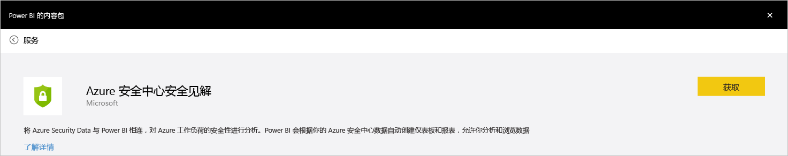
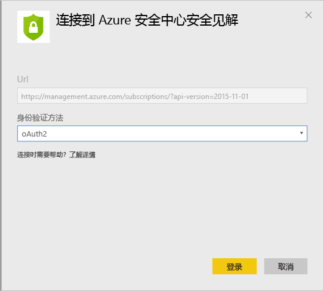
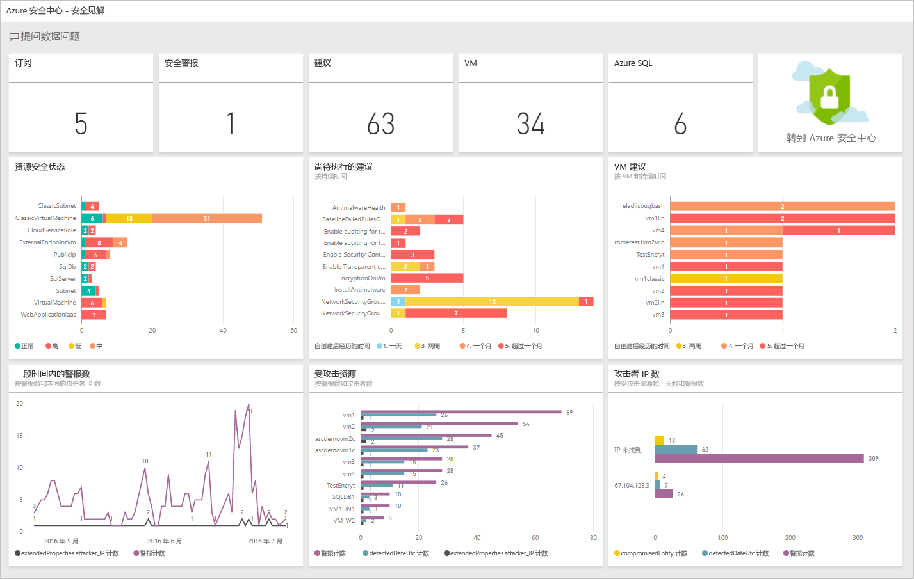
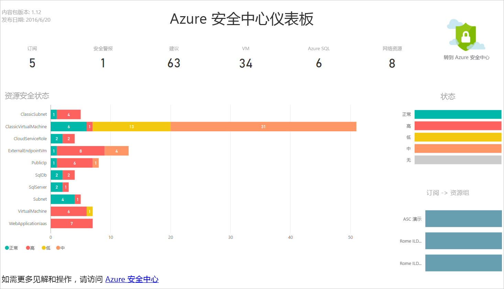
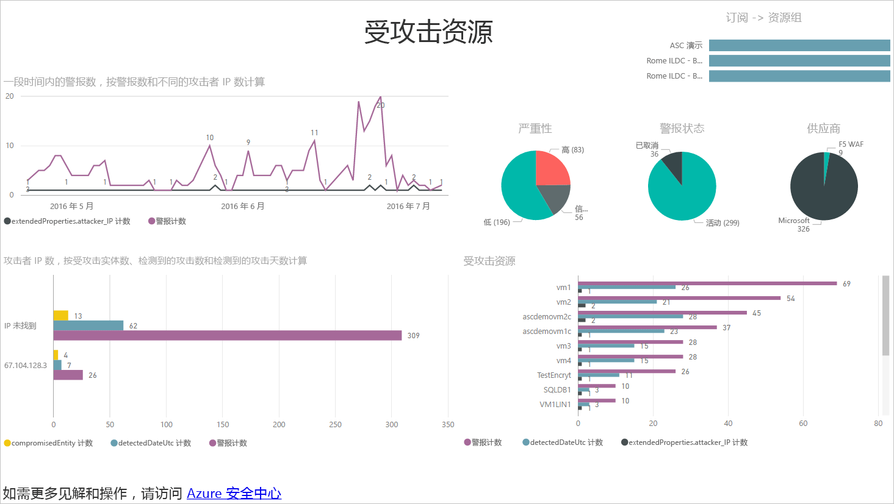
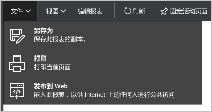
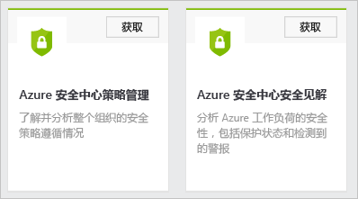
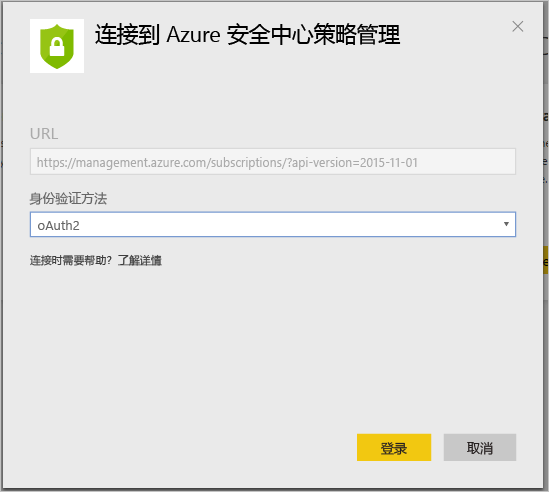
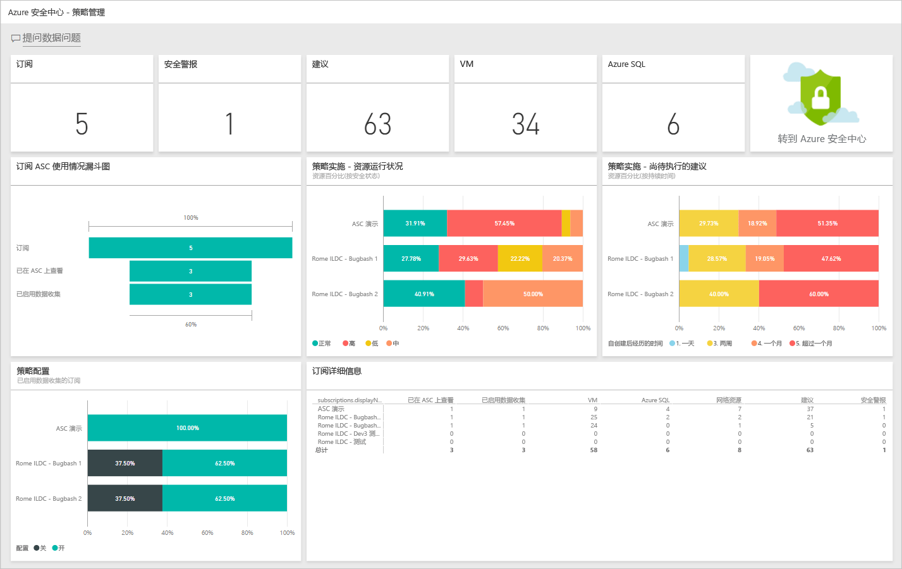

# 使用 Power BI 从 Azure 安全中心数据获得见解
Azure 安全中心的 [Power BI 仪表板](http://aka.ms/azure-security-center-power-bi) 允许用户从包括移动设备在内的任何位置查看、分析和筛选建议和安全警报。 使用 Power BI 仪表板揭示趋势和攻击模式 - 按资源或源 IP 地址查看安全警告，按资源或时间查看未处理的安全风险。

也可通过各种有趣的方式将安全中心的建议和安全警报与其他数据混合使用，例如，可以使用 [Azure 审核日志](https://powerbi.microsoft.com/blog/monitor-azure-audit-logs-with-power-bi/)和 [Azure SQL 数据库审核](https://powerbi.microsoft.com/blog/monitor-your-azure-sql-database-auditing-activity-with-power-bi/)中的数据。 这两种方式都提供 Power BI 仪表板。用户也可将此类数据导出到 Excel，轻松报告云资源的安全状况。

## 使用 Azure 安全中心仪表板访问 Power BI
Azure 安全中心仪表板还可用于访问 Power BI 报表。 按照以下步骤执行该任务：

1. 在“Azure 安全中心”仪表板中，单击“Power BI”按钮。

    
2. 此时会在右侧打开“Power BI”边栏选项卡，如以下屏幕所示： 

    
3. 如果是首次创建 Power BI 仪表板，则可在“在 Power BI 中浏览”边栏选项卡中选择以下选项之一： 

   * **安全见解仪表板**：若要创建包含安全状况、线程和检测方式在内的仪表板，则可选择此选项。 此选项更常用于 DevOps 角色，该角色负责跨订阅分析保护状况和“检测到威胁”警报。
   * **策略管理仪表板**：若要了解管理和强制策略，则可选择此选项。  此选项更常用于中心 IT 部门的人员，这些人更注重管理。 他们可以使用此仪表板了解整个组织的安全策略执行情况。
   * 如果已有 Power BI 仪表板，可单击“转到当前 Power BI 仪表板”。
4. 对于此示例，请单击“安全见解仪表板”选项。 第一次为安全中心创建 Power BI 仪表板时，系统会提示用户安装内容包。 单击“Power BI 内容包”窗口中的“获取”按钮，如以下屏幕所示：

    
5. 随即显示“连接到 Azure 安全中心安全见解”窗口。 确保“身份验证”方法为“oAuth2”（如下所示），然后单击“登录”按钮。

    
6. 系统可能会要求用户重新使用 Azure 凭据进行身份验证。 身份验证完成后就会创建仪表板。 创建仪表板以后，将会显示一个报表，其结构类似于以下屏幕中显示的结构：

    

> [!NOTE]
> 报表按计划每日刷新一次。 如果无法完成该刷新，请阅读 [Potential Refresh Issues with the Azure Security Center Power BI](https://blogs.msdn.microsoft.com/azuresecurity/2016/04/07/azure-security-center-power-bi-refresh-fails/)（Azure 安全中心 Power BI 可能出现的刷新问题），详细了解如何进行故障诊断。
>
>

在这里可以看到安全警报和建议的数目，以及受 Azure 安全中心监视的 VM、Azure SQL 数据库和网络资源的数目。

Azure 安全中心链接可将用户重定向到 Azure 门户。 可以通过图表轻松地查看安全建议和警报信息，其中包括：

* 资源安全状况
* 待处理的建议
* VM 建议
* 一段时间内的警报数
* 受攻击的资源
* 受攻击的 IP

每个图表都有潜在的含义。 选择相应的磁贴查看详细信息。 例如，“资源安全状况”磁贴会按资源显示待处理建议的更多详细信息，如以下屏幕所示： 

单击此图中的任意一行，则其他行变为灰色，焦点集中到所选行。 若要回到仪表板，请在此页左侧窗格中“仪表板”选项下单击“Azure 安全中心”。

> [!NOTE]
> 若要通过添加额外字段或更改现有视觉效果的方式自定义报表，可对报表进行编辑。 阅读 [与 Power BI 中的编辑视图中的报表进行交互](https://powerbi.microsoft.com/documentation/powerbi-service-interact-with-a-report-in-editing-view/) ，了解更多信息。
>
>

“一段时间内的警报数”、“受攻击的资源”和“攻击者 IP”磁贴对于单击操作具有类似的输出。 This happens because the report aggregates information regarding all those three variables and calls it **Resources under Attack** as shown in the following screen:

此时也可使用“文件”菜单中提供的选项保存此报表的副本、打印报表或将其发布到 Web。

## 使用 Power BI 服务了解 Azure 安全中心数据
在 Power BI 中连接到 [Power BI 内容包服务](https://msit.powerbi.com/groups/me/getdata/services) ，执行以下步骤：

1. 在“Power BI 内容包”窗口中可看到两个选项，如下所示。

    

   > [!NOTE]
   > 如果已执行本文的第一部分，则只会看到一个选项，即“Azure 安全中心策略管理”。
   >
   >
2. 就本示例来说，请单击“Azure 安全中心策略管理”磁贴中的“获取”。
3. 在“连接到 Azure 安全中心策略管理”窗口中，确保选择“身份验证方法”下拉列表中的“oAuth2”（如下所示），然后单击“登录”按钮。

    
4. 系统会将用户重定向到身份验证页，用户应在其中键入用来连接到 Azure 安全中心的凭据。 身份验证过程完成后，Power BI 就会开始导入生成报表所需的数据。 此时可能会在浏览器的右角看到以下消息：

    

   > [!NOTE]
   > 第一次创建仪表板时，可能需要比平常更多的时间，尤其是在有多个订阅的情况下。
   >
   >
5. 该过程完成以后，Azure 安全中心 Power BI 仪表板就会加载 **策略管理** 报表，与下面显示的报表类似：

    

## 另请参阅
本文档介绍了如何使用 Azure 安全中心的 Power BI。 若要详细了解 Azure 安全中心，请参阅以下内容：

* [Azure Security Center Planning and Operations Guide](security-center-planning-and-operations-guide.md) （Azure 安全中心规划和操作指南）- 了解如何在采用 Azure 安全中心之前进行规划。
* [Setting security policies in Azure Security Center](security-center-policies.md) （在 Azure 安全中心设置安全策略）- 了解如何在 Azure 安全中心配置安全设置
* [Managing and responding to security alerts in Azure Security Center](security-center-managing-and-responding-alerts.md) （管理和响应 Azure 安全中心的安全警报）- 了解如何管理和响应安全警报
* [Azure Security Center FAQ](security-center-faq.md) （Azure 安全中心常见问题）- 查找有关如何使用服务的常见问题
* [Azure 安全性博客](http://blogs.msdn.com/b/azuresecurity/) - 查找关于 Azure 安全性及合规性的博客文章

