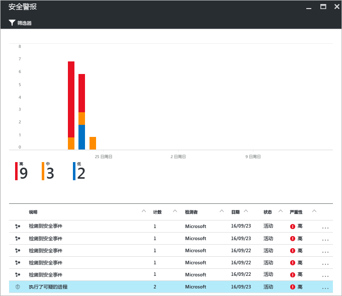
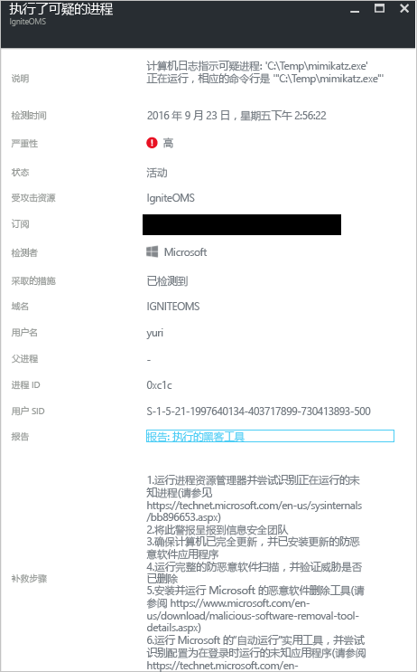

# Azure 安全中心威胁智能报告
本文档介绍 Azure 安全中心威胁智能报告如何能够帮助了解有关生成了安全警报的威胁的详细信息。

## 什么是威胁智能报告？
安全中心可以监视 Azure 资源、网络以及连接的合作伙伴解决方案中的安全信息，从而对威胁进行检测。 分析该信息（通常需将多个来源的信息关联起来）即可确定威胁。 此过程是安全中心[检测功能](security-center-detection-capabilities.md)的一部分。

当安全中心识别到威胁时，它将触发[安全警报](security-center-managing-and-responding-alerts.md)，其中包含有关特定事件的详细信息，包括修复建议。 为帮助事件响应团队调查和修复威胁，安全中心包括了威胁智能报告，其中包含有关已检测到的威胁的信息，包括如下信息：

* 攻击者的身份或关联项（如果此信息可用）
* 攻击者的目标
* 当前和历史攻击活动（如果此信息可用）
* 攻击者的策略、工具和过程
* 相关危害指标 (IoC)，例如 URL 和文件哈希
* 受害者研究，即研究行业和地理普遍性，帮助确定 Azure 资源有无风险
* 缓解计划和修复信息

> [!NOTE]
> 任何特定报表中的信息量都将有所不同；详细信息的级别基于恶意软件的活动和普遍性。
>
>

安全中心有三种类型的威胁报告，可因攻击而异。 可用报告有：

* **活动组报告**：深入分析攻击者、其目标和策略。
* **活动报告**：重点提供特定攻击活动的详细信息。
* **威胁摘要报告**：包含前两个报告中的所有项目。

在[事件响应](security-center-incident-response.md)过程中，进行调查以了解攻击来源、攻击者的动机以及将来可缓解此问题的的操作时，这种类型的信息非常有用。

## 如何访问威胁智能报告？
可以通过查看“安全警报”  磁贴查看当前警报。 打开 Azure 门户，按照以下步骤查看每个警报的更多详细信息：

1. 在安全中心仪表板中，可以看到“安全警报”  磁贴。
2. 单击磁贴打开包含有关警报的更多详细信息的“安全警报”边栏选项卡，并单击要获取更多相关详细信息的安全警报。

    
3. 在本例中，“已执行的可疑进程”边栏选项卡显示了有关警报的详细信息，如下图所示：

    
4. 每个安全警报的可用信息量因警报类型而异。 “报表”字段包含威胁智能报告的链接。 单击它，另一个浏览器窗口会显示 PDF 文件。

   

可从此处下载此报表的 PDF，阅读检测到的安全问题的详细信息，并根据提供的信息采取措施。

## 另请参阅
在本文档中，了解了 Azure 安全中心威胁智能报告在有关安全警报调查中如何能够提供帮助。 若要了解更多有关 Azure 安全中心的详细信息，请参阅以下内容：

* [Azure Security Center FAQ](security-center-faq.md)（Azure 安全中心常见问题）。 查找有关如何使用服务的常见问题。
* [利用 Azure 安全中心进行事件响应](security-center-incident-response.md)
* [Azure 安全中心检测功能](security-center-detection-capabilities.md)
* [Azure Security Center planning and operations guide](security-center-planning-and-operations-guide.md)（Azure 安全中心规划和操作指南）。 了解如何规划并理解设计注意事项，以便采用 Azure 安全中心。
* [Managing and responding to security alerts in Azure Security Center](security-center-managing-and-responding-alerts.md)（管理和响应 Azure 安全中心的安全警报）。 了解如何管理和响应安全警报。
* [处理 Azure 安全中心的安全事件](security-center-incident.md)
* [Azure 安全性博客](http://blogs.msdn.com/b/azuresecurity/)。 查找关于 Azure 安全性及合规性的博客文章。
