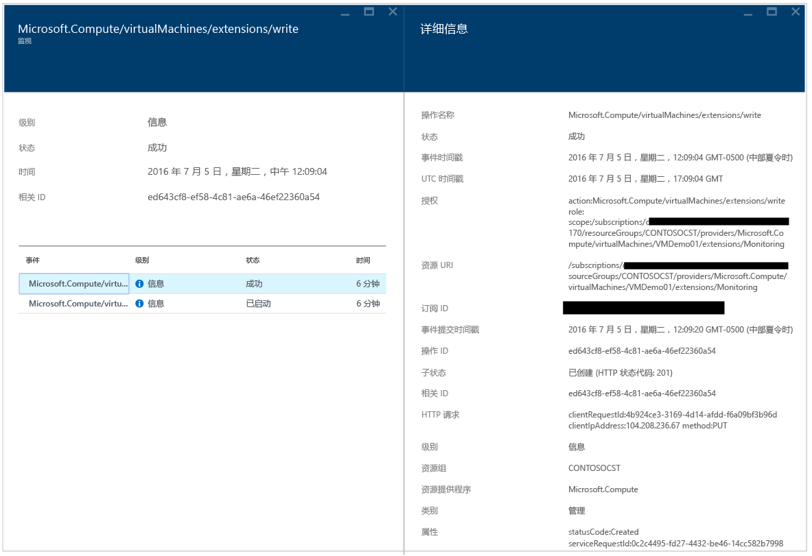
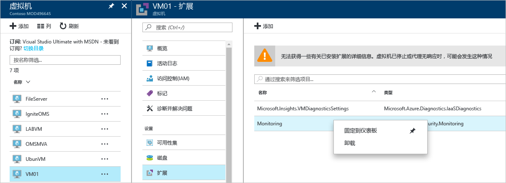
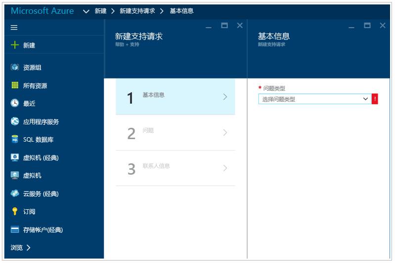

# Azure 安全中心故障排除指南
本指南适用于信息技术 (IT) 专业人员、信息安全分析人员，以及那些组织中正在使用 Azure 安全中心并需要进行排除安全中心相关问题的云管理员。

## 故障排除指南
本指南介绍如何排除安全中心的相关问题。 安全中心完成的大部分故障排除将首先通过查看失败组件的 [审核日志](https://azure.microsoft.com/updates/audit-logs-in-azure-preview-portal/) 记录展开。 通过审核日志，你可以确定：

* 哪些操作已发生
* 谁启动了该操作
* 操作何时发生
* 操作的状态
* 其他可能有助于研究操作的属性值

审核日志包含针对资源执行的所有写入操作（PUT、POST、DELETE），但它不包含读取属性 (GET)。

## Windows 中的监视代理安装故障排除
安全中心监视代理用于执行数据收集。 启用数据收集并在目标计算机中正确安装代理后，应执行以下进程：

* ASMAgentLauncher.exe - Azure 监视代理 
* ASMMonitoringAgent.exe - Azure 安全监视扩展
* ASMSoftwareScanner.exe – Azure 扫描管理器

Azure 安全监视扩展将扫描各种安全相关的配置，并从虚拟机中收集安全日志。 扫描管理器将用作修补扫描仪。

如果成功执行安装，应该会看到一个与下面目标 VM 的审核日志中类似的条目：

此外可以通过读取位于 *%systemdrive%\windowsazure\logs*（示例：C:\WindowsAzure\Logs）的代理日志，获取有关安装过程的详细信息。

> [!NOTE]
> 如果 Azure 安全中心代理产生错误行为，将需要重新启动目标 VM，因为没有命令来停止和启动代理。

如果仍有数据收集方面的问题，可按以下步骤卸载代理：

1. 在 **Azure 门户**中选择存在数据收集问题的虚拟机，然后单击“扩展”。
2. 右键单击“Microsoft.Azure.Security.Monitoring”，然后选择单击“卸载”。

Azure 安全监视扩展应该会在数分钟内自行重新安装。

## Linux 中的监视代理安装故障排除
在 Linux 系统中进行 VM 代理安装故障排除时，应确保该扩展已下载到 /var/lib/waagent/。 可以运行以下命令验证其是否已安装：

`cat /var/log/waagent.log` 

可以查看的用于故障排除的其他日志文件有： 

* /var/log/mdsd.err
* /var/log/azure/

在正常运行的系统中，应该会看到 TCP 29130 上 mdsd 进程的连接。 这是与 mdsd 进程进行通信的系统日志。 可以通过运行以下命令来验证此行为：

`netstat -plantu | grep 29130`

## 排查加载仪表板的问题

如果在加载“安全中心”仪表板时遇到问题，请确保将订阅注册到安全中心的用户（即第一个通过订阅打开安全中心的用户）以及需要启用数据收集功能的用户为订阅的*所有者* 或*参与者*。 从该时刻开始，在订阅上为*读者* 的 also user 即可查看 dashboard/alerts/recommendation/policy。

## 请联系 Microsoft 支持人员
可以使用本文中提供的指南来识别一些问题，还可以在安全中心公共 [论坛](https://social.msdn.microsoft.com/Forums/en-US/home?forum=AzureSecurityCenter)中查找记录的其他问题。 但是，如果需要进一步进行故障排除，可以使用 **Azure 门户**打开新的支持请求，如下所示： 

## 另请参阅
在本文档中，已经学习了如何在 Azure 安全中心中配置安全策略。 若要了解更多有关 Azure 安全中心的详细信息，请参阅以下内容：

* [Azure 安全中心规划和操作指南](security-center-planning-and-operations-guide.md) - 了解如何规划和了解设计注意事项，以适应 Azure 安全中心。
* [Azure 安全中心的安全性运行状况监视](security-center-monitoring.md) - 了解如何监视 Azure 资源的运行状况
* [管理和响应 Azure 安全中心的安全警报](security-center-managing-and-responding-alerts.md) - 了解如何管理和响应安全警报
* [通过 Azure 安全中心监视合作伙伴解决方案](security-center-partner-solutions.md) - 了解如何监视合作伙伴解决方案的运行状态。
* [Azure 安全中心常见问题解答](security-center-faq.md) - 查找有关使用服务的常见问题
* [Azure 安全性博客](http://blogs.msdn.com/b/azuresecurity/) - 查找关于 Azure 安全性及合规性的博客文章

<!--HONumber=Feb17_HO3-->

