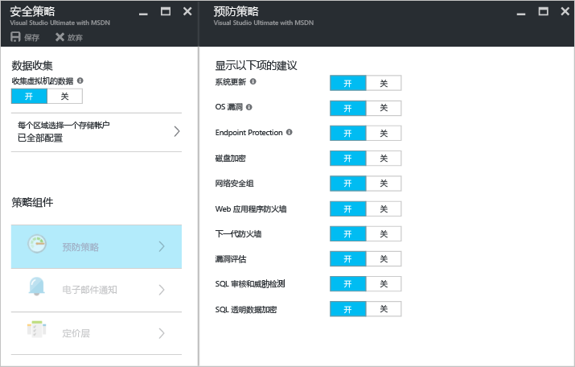
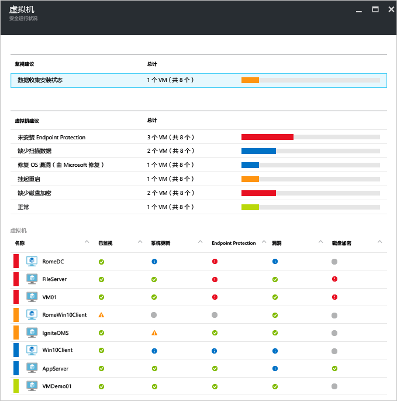
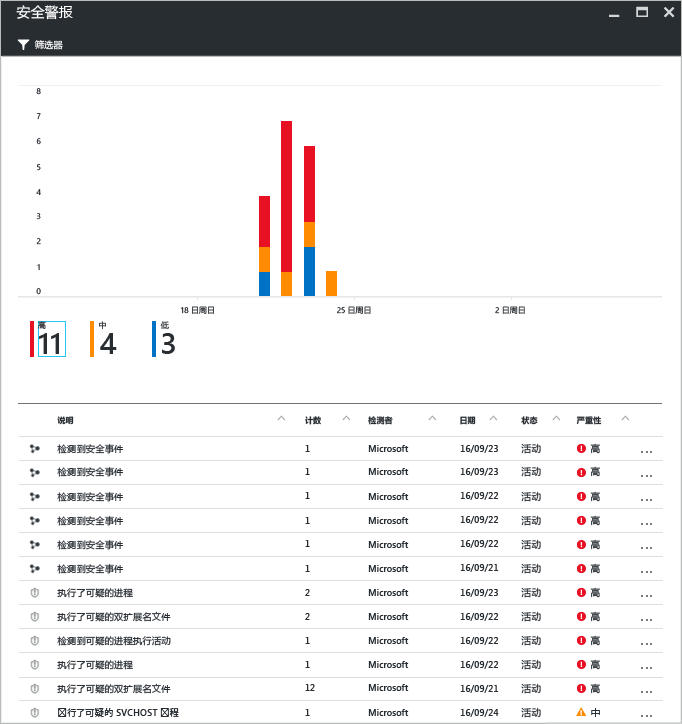

# Azure 安全中心与 Azure 虚拟机
[Azure 安全中心](https://azure.microsoft.com/services/security-center/)可帮助防范、检测和应对威胁。 它提供 Azure 订阅之间的集成安全监视和策略管理，帮助检测可能被忽略的威胁，且适用于广泛的安全解决方案生态系统。

本文演示安全中心如何能够帮助保护 Azure 虚拟机 (VM)。

## 为什么要使用安全中心？
安全中心可用于查看虚拟机的安全设置，从而帮助保护 Azure 中的虚拟机数据。 当安全中心保护 VM 时，可使用以下功能：

* 包含建议配置规则的操作系统 (OS) 安全设置
* 缺少的系统安全更新和关键更新
* 终结点保护建议
* 磁盘加密验证
* 漏洞评估和补救
* 威胁检测

除帮助保护 Azure VM 外，安全中心还可安全监视和管理云服务、应用服务、虚拟网络等。 

> [!NOTE]
> 请参阅 [Azure 安全中心简介](security-center-intro.md)，了解有关 Azure 安全中心的详细信息。
> 
> 

## 先决条件
要开始使用 Azure 安全中心，需了解并考虑以下问题：

* 必须订阅 Microsoft Azure。 请参阅[安全中心定价](https://azure.microsoft.com/pricing/details/security-center/)，了解有关安全中心免费层和标准层的详细信息。
* 若要规划安全中心采用情况，请参阅 [Azure 安全中心规划和操作指南](security-center-planning-and-operations-guide.md)，详细了解规划方式和操作注意事项。
* 有关操作系统可支持性的信息，请参阅 [Azure 安全中心常见问题 (FAQ)](security-center-faq.md)。 

## 设置安全策略
需启用数据收集，使 Azure 安全中心能够收集所需信息，以便提供基于所配置的安全策略生成的建议和警报。 在下图中可见，“数据收集”已“打开”。

安全策略用于定义一组控制，这些控制是针对指定订阅或资源组中的资源建议的。 启用安全策略之前，必须启用数据收集。安全中心从虚拟机收集数据，以评估其安全状态、提供安全建议和威胁警报。 在安全中心，根据公司的安全需求、应用程序的类型或每个订阅中数据的敏感度，为 Azure 订阅或资源组定义策略。 

> [!NOTE]
> 若要详细了解可用的每个“防护策略”，请参阅[设置安全策略](security-center-policies.md)一文。
> 
> 

## 管理安全建议
安全中心将分析 Azure 资源的安全状态。 安全中心识别到潜在的安全漏洞时，会创建建议。 此建议指导完成配置所需控件的过程。

设置安全策略之后，安全中心将分析资源的安全状态，以识别潜在的漏洞。 建议以表格形式显示，其中每一行都表示一个特定的建议。 下表提供了 Azure VM 的一些建议示例，以及每个示例在应用时会执行的操作。 选择建议时，系统将提供信息，演示如何在安全中心内实现该建议。

| 建议 | 说明 |
| --- | --- |
| [为订阅启用数据收集](security-center-enable-data-collection.md) |建议为每个订阅和订阅中的所有虚拟机 (VM) 开启安全策略中的数据收集。 |
| [修正 OS 漏洞](security-center-remediate-os-vulnerabilities.md) |建议 OS 配置匹配推荐的配置规则，例如不允许保存密码。 |
| [应用系统更新](security-center-apply-system-updates.md) |建议在 VM 上部署缺少的系统安全和重要更新。 |
| [在系统更新后重启](security-center-apply-system-updates.md#reboot-after-system-updates) |建议重启 VM 以完成应用系统更新的过程。 |
| [安装终结点保护](security-center-install-endpoint-protection.md) |建议在 VM（仅 Windows VM）上预配反恶意程序。 |
| [启用 VM 代理](security-center-enable-vm-agent.md) |使你能够查看需要 VM 代理的 VM。 若要设置修补程序扫描、基线扫描以及反恶意程序，则必须在 VM 上安装 VM 代理。 对于从 Azure Marketplace 部署的 VM，会默认安装 VM 代理。 文章 [VM 代理和扩展 - 第 2 部分](http://azure.microsoft.com/blog/2014/04/15/vm-agent-and-extensions-part-2/)提供有关如何安装 VM 代理的信息。 |
| [应用磁盘加密](security-center-apply-disk-encryption.md) |建议使用 Azure 磁盘加密（Windows 和 Linux VM）对 VM 磁盘进行加密。 对于 VM 上的 OS 和数据卷，建议使用加密。 |
| [未安装漏洞评估](security-center-vulnerability-assessment-recommendations.md) |建议在 VM 上安装漏洞评估解决方案。 |
| [修正漏洞](security-center-vulnerability-assessment-recommendations.md#review-the-recommendation) |使你可以查看由安装在 VM 上的漏洞评估解决方案检测到的系统和应用程序漏洞。 |

> [!NOTE]
> 若要详细了解各项建议，请参阅[管理安全建议](security-center-recommendations.md)一文。
> 
> 

## 监视安全运行状况
用户为订阅的资源启用[安全策略](security-center-policies.md)以后，安全中心将分析相关资源的安全性，确定可能的漏洞。  在“资源安全运行状况”边栏选项卡中，可以查看资源的安全状态以及任何问题。 在“资源安全运行状况”磁贴中单击“虚拟机”，“虚拟机”边栏选项卡随即打开，其中包含针对 VM 的建议。 

## 管理和响应安全警报
安全中心将从 Azure 资源、网络和已连接的合作伙伴解决方案（例如防火墙和终结点保护解决方案）自动收集、分析并整合日志数据，以检测真正的威胁并减少误报。 利用[检测功能](security-center-detection-capabilities.md)的各种聚合，安全中心能够生成按优先级排列的安全警报，帮助用户快速调查问题并提供有关如何减少潜在攻击的建议。

选择某个安全警报，了解触发该警报的事件详细信息以及修复攻击所需的步骤（如有）。 安全警报按[类型](security-center-alerts-type.md)和日期分组。

## 另请参阅
若要了解有关安全中心的详细信息，请参阅以下文章：

* [在 Azure 安全中心中设置安全策略](security-center-policies.md) - 了解如何配置 Azure 订阅和资源组的安全策略。
* [管理和响应 Azure 安全中心的安全警报](security-center-managing-and-responding-alerts.md) -- 了解如何管理和响应安全警报。
* [Azure 安全中心常见问题](security-center-faq.md) - 查找有关使用服务的常见问题。

