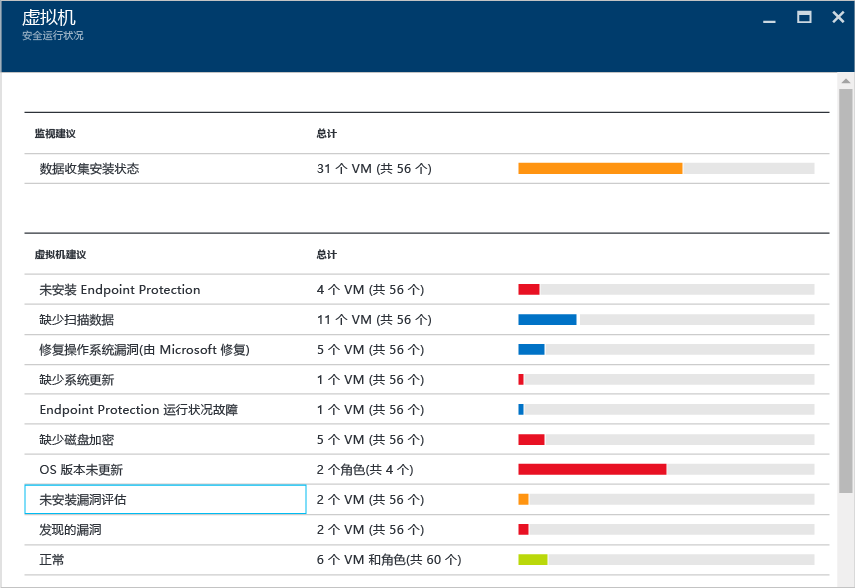
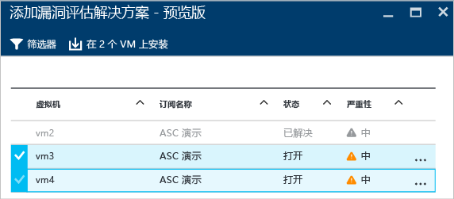
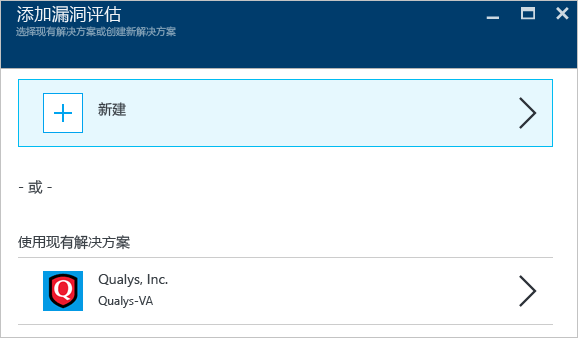
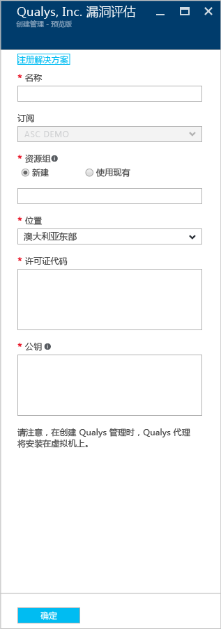
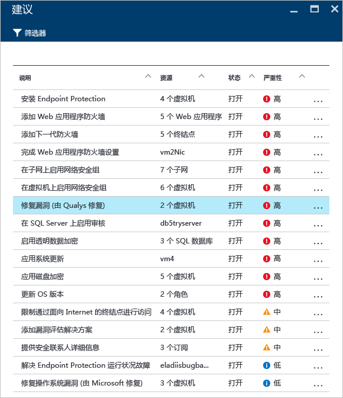
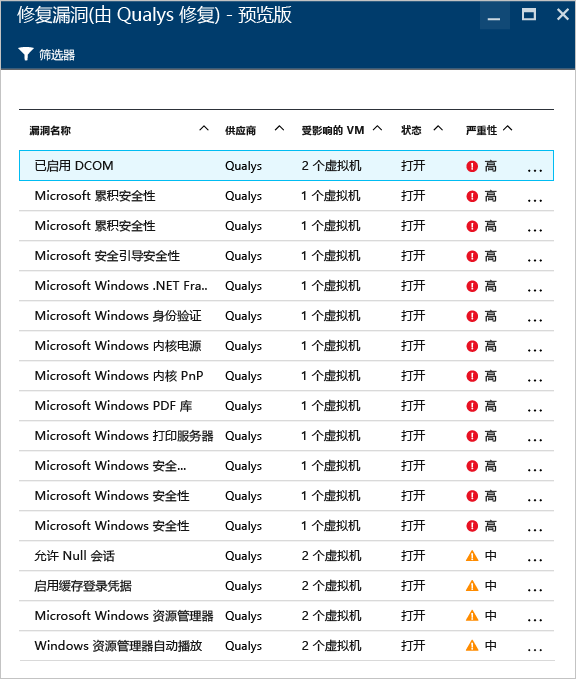
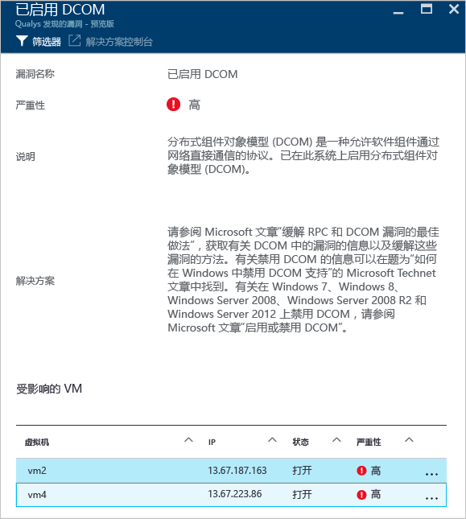

# Azure 安全中心的漏洞评估
本文档介绍漏洞评估建议，它们适用于在 Azure 中运行的虚拟机。

## 什么是漏洞评估？
Azure 安全中心中的漏洞评估是虚拟机 (VM) 建议的一部分。 如果安全中心无法找到安装在 VM 上的漏洞评估解决方案，它将建议你安装一个解决方案。 部署完成后，合作伙伴代理开始向合作伙伴的管理平台报告漏洞，该平台会将漏洞和运行状况数据返回安全中心。 用户可以从安全中心仪表板快速确定易受攻击的 VM，还可通过从安全中心直接切换到合作伙伴管理控制台，获取更多的报告和信息。

> [!NOTE]
> 本文档通过使用示例部署介绍该服务。 这并非一份循序渐进的指南。
> 
> 

## 公共预览版限制
以下限制适用于当前的漏洞评估公共预览版：

* 仅 [Qualys](https://www.qualys.com/lp/azure) 提供合作伙伴漏洞评估解决方案。 将来会增加更多。
* 只要 VM 属于同一订阅，便可以在多个 VM 中安装漏洞评估解决方案。
* 仅支持 Windows VM，正式版 (GA) 中将添加 Linux VM。

## 实现虚拟机建议
当安全中心识别一个或多个受支持但缺少漏洞评估解决方案的 VM 时，它将触发 VM 建议。 以下步骤演示如何访问此建议并向属于同一订阅的多个 VM 应用：

1. 在“资源安全运行状况”磁贴中，单击“虚拟机”
2. 在“虚拟机”边栏选项卡中，选择“未安装漏洞评估”，如以下屏幕中所示：
   
    
3. 在“添加预览版漏洞评估解决方案”边栏选项卡中，选择想要安装漏洞评估解决方案的 VM，如以下屏幕中所示：
   
    
4. 在“添加漏洞评估解决方案 - 预览版”边栏选项卡中，单击“在 2 个 VM 上安装”（名称会因选择的 VM 数目而异）选项，随即出现“添加漏洞评估”边栏选项卡，如以下屏幕中所示：
   
    
5. 可在此边栏选项卡中选择创建新的安全漏洞评估，从而允许用户从“Azure 应用商店”选择合作伙伴解决方案，或者可在使用现有的解决方案下选择现有合作伙伴解决方案（此示例中为 **Qualys**）。

## 创建新的漏洞评估解决方案
如果有多个订阅，可以为每个订阅创建一个漏洞评估解决方案。 主要步骤相同（如上一节中枚举的步骤），唯一的不同在于：在步骤 4 中需单击“新建”选项。 选择此选项后，执行以下步骤继续。

> [!NOTE]
> 下面的示例使用 Qualys。 若要从安全中心部署 Qualys 云代理，需要 Qualys 的许可证代码和公钥。 有关如何检索许可证代码和公钥，请参阅 [Qualys 文档](https://community.qualys.com/docs/DOC-5823-deploying-qualys-cloud-agents-from-microsoft-azure-security-center)。
> 
> 

1. 在“创建新的安全漏洞评估”边栏选项卡中，单击合作伙伴的名称（此示例中为 **Qualys**）。
2. 合作伙伴的边栏选项卡将会打开。 边栏选项卡中显示的字段因合作伙伴而异，此示例使用 **Qualys**：
   
    
3. 在“名称”字段中，键入此解决方案的名称。 可以使用与正尝试绑定到的资源组或订阅相关联的名称。
4. 在“订阅”字段中，请选择要用于解决方案的 Azure 订阅。
5. 在“资源组”字段中，选择现有资源组或创建新的资源组。
6. 在“位置”段中，选择此解决方案的所在位置。
7. 在“许可证代码”字段（特定于 Qualys）中，键入合作伙伴提供的许可证号。
8. 在“公钥”（特定于 Qualys）字段中，键入合作伙伴提供的公钥信息，然后单击“确定”。

## 查看建议
在目标 VM 上安装漏洞评估解决方案后，它将扫描 VM，以便检测、标识系统和应用程序的漏洞。

> [!NOTE]
> 第一次扫描可能需要几个小时才能完成，之后每小时执行一次扫描。
> 
> 

这些问题显示在“虚拟机建议”选项下。 下面的示例演示“建议”边栏选项卡下建议的显示方式：

在此示例中，选中的的建议演示 Qualys 已执行的检测。 如果单击此建议，会出现带有漏洞列表的新边栏选项卡，如以下屏幕中所示：

此列表按严重性级别显示所有的漏洞，以及受漏洞影响的虚拟机数量。 此示例中，选择 Enable DCOM，出现的新边栏选项卡中附有解决该漏洞的建议步骤：

## 另请参阅
在本文档中，学习如何在 Azure 安全中心应用漏洞评估建议。 若要了解更多有关 Azure 安全中心的详细信息，请参阅以下内容：

* [Azure Security Center planning and operations guide](security-center-planning-and-operations-guide.md)（Azure 安全中心规划和操作指南）。 了解如何规划并理解设计注意事项，以便采用 Azure 安全中心。
* [Security health monitoring in Azure Security Center](security-center-monitoring.md)（在 Azure 安全中心进行安全运行状况监视）。 了解如何监视 Azure 资源的运行状况。
* [Managing and responding to security alerts in Azure Security Center](security-center-managing-and-responding-alerts.md)（管理和响应 Azure 安全中心的安全警报）。 了解如何管理和响应安全警报。
* [Monitoring partner solutions with Azure Security Center](security-center-partner-solutions.md)（通过 Azure 安全中心监视合作伙伴解决方案）。 了解如何监视合作伙伴解决方案的运行状况。
* [Azure Security Center FAQ](security-center-faq.md)（Azure 安全中心常见问题）。 查找有关如何使用服务的常见问题。
* [Azure 安全性博客](http://blogs.msdn.com/b/azuresecurity/)。 查找关于 Azure 安全性及合规性的博客文章。

<!--HONumber=Dec16_HO2-->

