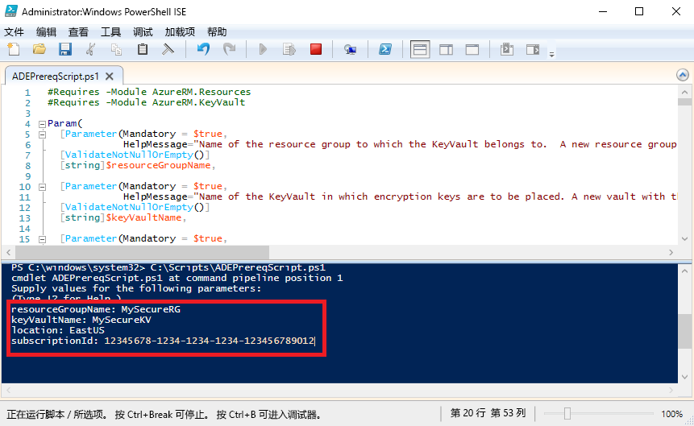

# <a name="quickstart-encrypt-a-windows-iaas-vm-with-azure-powershell"></a>快速入门：使用 Azure PowerShell 加密 Windows IaaS VM

Azure 磁盘加密用于加密 Windows 和 Linux IaaS 虚拟机磁盘。 此解决方案与 Azure Key Vault 集成，用于控制和管理磁盘加密密钥与机密。 使用 Azure 磁盘加密，可以确保使用行业标准的加密技术轻松保护 IaaS VM。 在本快速入门中，需创建一个 Windows Server 2016 VM 并加密 OS 磁盘。

如果没有 Azure 订阅，请在开始之前创建一个[免费帐户](https://azure.microsoft.com/free/?WT.mc_id=A261C142F)。

## <a name="prerequisites"></a>先决条件

- Windows PowerShell ISE
- 安装或更新到[最新版本的 AzureRM PowerShell 模块](/powershell/azure/azurerm/install-azurerm-ps?view=azurermps-6.13.0)
    - AzureRM 模块版本需要是 6.0.0 或更高版本。 `Get-Module AzureRM -ListAvailable | Select-Object -Property Name,Version,Path`
- [Azure 磁盘加密先决条件脚本](https://raw.githubusercontent.com/Azure/azure-powershell/master/src/Compute/Compute/Extension/AzureDiskEncryption/Scripts/AzureDiskEncryptionPreRequisiteSetup.ps1)的副本。
    - 如果已经有此脚本，请下载新的副本，因为它最近进行了更改。 
    - 请使用 **CTRL-A** 选择所有文本，然后使用 **CTRL-C** 将所有文本复制到记事本中。
    - 将文件另存为 **ADEPrereqScript.ps1**


## <a name="sign-in-to-azure"></a>登录 Azure

1. 右键单击“Windows PowerShell ISE”，然后单击“以管理员身份运行”。
1. 在“管理员:Windows PowerShell ISE”窗口中，单击“视图”，然后单击“显示脚本窗格”。
1. 在脚本窗格中，键入以下 cmdlet： 

     ```azurepowershell
      Connect-AzureRMAccount
     ```

1. 单击“运行脚本”所对应的绿色箭头，或者使用 F5。 
2. 使用交互式登录完成到 Azure 帐户的连接。
3. 复制返回的**订阅 ID**，该 ID 可以在运行下一 PowerShell 脚本时使用。 

## <a name="bkmk_PrereqScript"></a> 运行 Azure 磁盘加密先决条件脚本
 **ADEPrereqScript.ps1** 会创建资源组和密钥保管库，并会设置密钥保管库访问策略。 此脚本还会在密钥保管库上创建资源锁，目的是防止它被意外删除。  

1. 在“管理员:Windows PowerShell ISE”窗口中，单击“文件”，然后单击“打开”。 导航到 **ADEPrereqScript.ps1** 文件，然后双击它。 此脚本会在脚本窗格中打开。
2. 单击“运行脚本”所对应的绿色箭头，或者使用 F5 来运行脚本。 
3. 键入新**资源组**和新**密钥保管库**的名称。 请勿在本快速入门中使用现有的资源组或密钥保管库，因为我们会在稍后删除资源组。 
4. 键入要在其中创建资源的位置，例如 **EastUS**。 使用 `Get-AzureRMLocation` 获取位置列表。
5. 将**订阅 ID** 复制进去。 可以使用 `Get-AzureRMSubscription` 获取订阅 ID。  
6. 单击“运行脚本”所对应的绿色箭头。 
7. 复制返回的将要在以后使用的 **DiskEncryptionKeyVaultUrl** 和 **DiskEncryptionKeyVaultId**。




## <a name="create-a-virtual-machine"></a>创建虚拟机 
现在需创建一个虚拟机，以便加密其磁盘。 将要使用的脚本会创建一个 RAM 为 8 GB 且 OS 磁盘为 30 GB 的 Windows Server 2016 VM。 

1. 将脚本复制到“管理员:Windows PowerShell ISE”脚本窗格中，然后更改前三个变量。 资源组和位置需要与用于[先决条件脚本](#bkmk_PrereqScript)的资源组和位置相同。  

   ```azurepowershell
    # Variables for common values
    $resourceGroup = "MySecureRG"
    $location = "EastUS"
    $vmName = "MySecureVM"
    
    # Create user object
    $cred = Get-Credential -Message "Enter a username and password for the virtual machine."
    
    # Create a resource group
    #New-AzureRmResourceGroup -Name $resourceGroup -Location $location
    
    # Create a subnet configuration
    $subnetConfig = New-AzureRmVirtualNetworkSubnetConfig -Name mySubnet -AddressPrefix 192.168.1.0/24
    
    # Create a virtual network
    $vnet = New-AzureRmVirtualNetwork -ResourceGroupName $resourceGroup -Location $location `
      -Name MYvNET -AddressPrefix 192.168.0.0/16 -Subnet $subnetConfig
    
    # Create a public IP address and specify a DNS name
    $pip = New-AzureRmPublicIpAddress -ResourceGroupName $resourceGroup -Location $location `
      -Name "mypublicdns$(Get-Random)" -AllocationMethod Static -IdleTimeoutInMinutes 4
    
    # Create an inbound network security group rule for port 3389
    $nsgRuleRDP = New-AzureRmNetworkSecurityRuleConfig -Name myNetworkSecurityGroupRuleRDP  -Protocol Tcp `
      -Direction Inbound -Priority 1000 -SourceAddressPrefix * -SourcePortRange * -DestinationAddressPrefix * `
      -DestinationPortRange 3389 -Access Allow
    
    # Create a network security group
    $nsg = New-AzureRmNetworkSecurityGroup -ResourceGroupName $resourceGroup -Location $location `
      -Name myNetworkSecurityGroup -SecurityRules $nsgRuleRDP
    
    # Create a virtual network card and associate with public IP address and NSG
    $nic = New-AzureRmNetworkInterface -Name myNic -ResourceGroupName $resourceGroup -Location $location `
      -SubnetId $vnet.Subnets[0].Id -PublicIpAddressId $pip.Id -NetworkSecurityGroupId $nsg.Id
    
    # Create a virtual machine configuration
    $vmConfig = New-AzureRmVMConfig -VMName $vmName -VMSize Standard_D2_v3 | `
    Set-AzureRmVMOperatingSystem -Windows -ComputerName $vmName -Credential $cred | `
    Set-AzureRmVMSourceImage -PublisherName MicrosoftWindowsServer -Offer WindowsServer -Skus 2016-Datacenter-smalldisk -Version latest | `
    Add-AzureRmVMNetworkInterface -Id $nic.Id
    
    # Create a virtual machine
    New-AzureRmVM -ResourceGroupName $resourceGroup -Location $location -VM $vmConfig
   ```

2. 单击“运行脚本”所对应的绿色箭头，以便生成 VM。  


## <a name="encrypt-the-disk-of-the-vm"></a>加密 VM 的磁盘
创建并配置密钥保管库和 VM 以后，即可使用 **Set-AzureRmVmDiskEncryptionExtension** cmdlet 来加密磁盘。 
 
1. 运行以下 cmdlet 以加密 VM 的磁盘：

    ```azurepowershell
     Set-AzureRmVmDiskEncryptionExtension -ResourceGroupName "MySecureRG" -VMName "MySecureVM" `
     -DiskEncryptionKeyVaultId "<Returned by the prerequisites script>" -DiskEncryptionKeyVaultUrl "<Returned by the prerequisites script>"
     ```


1. 加密完成后，即可使用以下 cmdlet 验证磁盘是否已加密： 

     ```azurepowershell
     Get-AzureRmVmDiskEncryptionStatus -ResourceGroupName "MySecureRG" -VMName "MySecureVM"
     ```
    
    
## <a name="clean-up-resources"></a>清理资源
 **ADEPrereqScript.ps1** 在密钥保管库上创建资源锁。 若要清理本快速入门中的资源，需先删除资源锁，然后删除资源组。 

1. 删除密钥保管库的资源锁

     ```azurepowershell
     $LockId =(Get-AzureRMResourceLock -ResourceGroupName "MySecureRG" -ResourceName "MySecureVault" -ResourceType "Microsoft.KeyVault/vaults").LockID 
     Remove-AzureRmResourceLock -LockID $LockId
      ```
    
2. 删除资源组。 此操作也会删除组中的所有资源。 
     ```azurepowershell
      Remove-AzureRmResourceGroup -Name "MySecureRG"
      ```

## <a name="next-steps"></a>后续步骤
请继续学习下一篇文章，详细了解 IaaS VM 的 Azure 磁盘加密先决条件。

> [!div class="nextstepaction"]
> [Azure 磁盘加密先决条件](azure-security-disk-encryption-prerequisites.md)