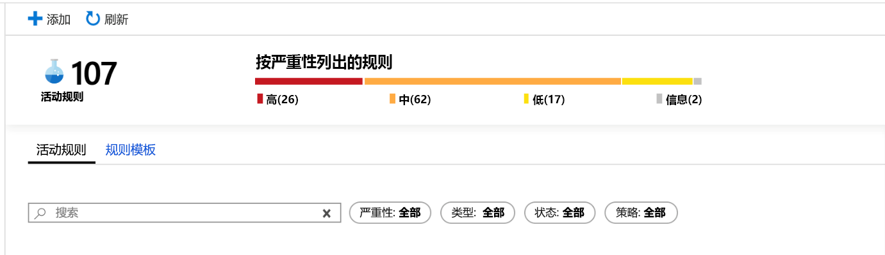
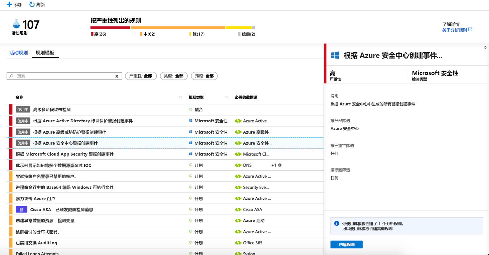
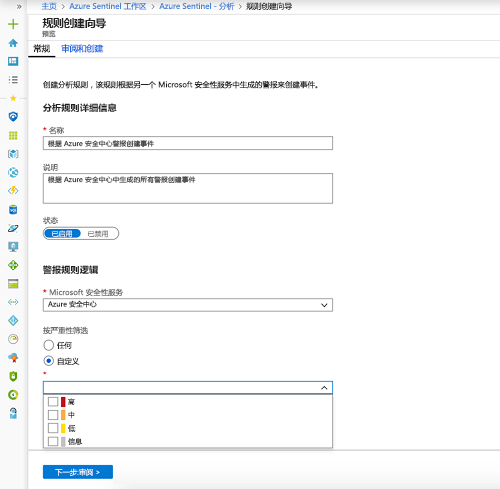
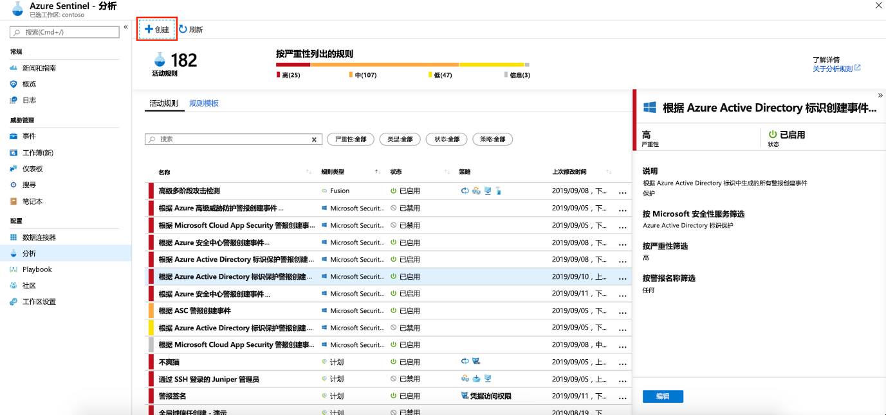
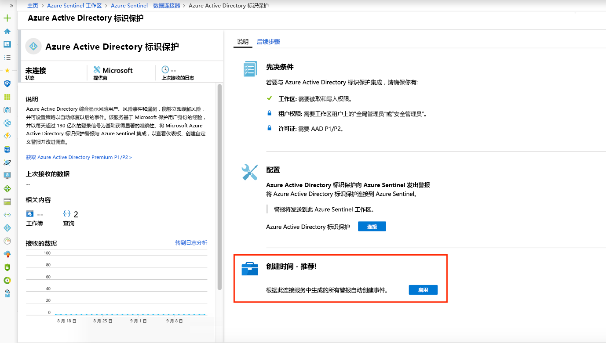

# 自动根据 Microsoft 安全警报创建事件

在连接到 Azure Sentinel 的 Microsoft 安全解决方案（例如 Microsoft Cloud App Security 和 Microsoft Defender for Identity (以前的 Azure ATP) ）触发的警报不会在 Azure Sentinel 中自动创建事件。 默认情况下，在将 Microsoft 解决方案连接到 Azure Sentinel 时，在该服务中生成的任何警报都会作为原始数据存储在 Azure Sentinel 中，即 Azure Sentinel 工作区的“安全警报”表中。 然后即可使用该数据，就像使用连接到 Sentinel 中时的任何其他原始数据一样。

可以按照本文中的说明操作，轻松地将 Azure Sentinel 配置为每次在连接的 Microsoft 安全解决方案中触发警报时自动创建事件。

## 先决条件
必须[连接 Microsoft 安全解决方案](connect-data-sources.md#data-connection-methods)，然后才能根据安全服务警报创建事件。

## 使用 Microsoft 安全事件创建分析规则

使用 Azure Sentinel 中提供的内置规则，以便选择哪些连接的 Microsoft 安全解决方案应该以自动方式实时创建 Azure Sentinel 事件。 也可编辑这些规则，以便定义更具体的选项来筛选 Microsoft 安全解决方案生成的哪些警报应该在 Azure Sentinel 中创建事件。 例如，你可以选择仅通过高严重性 Azure Defender (以前的 Azure 安全中心) 警报来自动创建 Azure Sentinel 事件。

1. 在 Azure 门户的 Azure Sentinel 下，选择“分析”。

1. 选择“规则模板”选项卡，查看所有内置的分析规则。

    

1. 选择要使用的“Microsoft 安全性”分析规则模板，单击“创建规则”。

    

1. 可以修改规则详细信息，选择按警报严重性或警报名称中包含的文本来筛选将要创建事件的警报。  
      
    例如，如果选择 " **Azure defender** (仍称为 Azure 安全中心") 在 " **Microsoft security service** " 字段中，然后在 "**按严重性筛选**" 字段中选择 "**高**"，则只有高严重性 azure Defender 警报会在 azure Sentinel 中自动创建事件。  

    

1. 也可创建新的 Microsoft 安全规则来筛选不同的 Microsoft 安全服务提供的警报，方法是：单击“+创建”，然后选择“Microsoft 事件创建规则”。  

    

  可以按“Microsoft 安全服务”类型创建多条 Microsoft 安全分析规则。  这不会创建重复事件，因为每条规则都用作筛选器。 即使某个警报与多条 Microsoft 安全分析规则匹配，它也只创建一个 Azure Sentinel 事件。

## 允许在连接期间自动生成事件
 连接 Microsoft 安全解决方案时，可以选择是否希望安全解决方案中的警报自动在 Azure Sentinel 中生成事件。

1. 连接 Microsoft 安全解决方案数据源。 

   

1. 在“创建事件”下选择“启用”， 以便启用默认的分析规则，这样，当连接的安全服务中生成警报时，就会自动创建事件。 然后，可以在“分析”下的“活动规则”中编辑此规则。 

## 后续步骤

- 若要开始使用 Azure Sentinel，需要订阅 Microsoft Azure。 如果尚无订阅，可注册[免费试用版](https://azure.microsoft.com/free/)。
- 了解如何[将数据载入到 Azure Sentinel](quickstart-onboard.md)，以及[获取数据和潜在威胁的见解](quickstart-get-visibility.md)。
