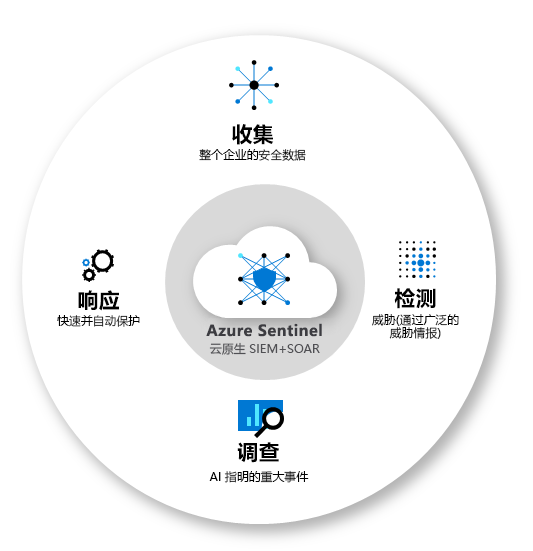
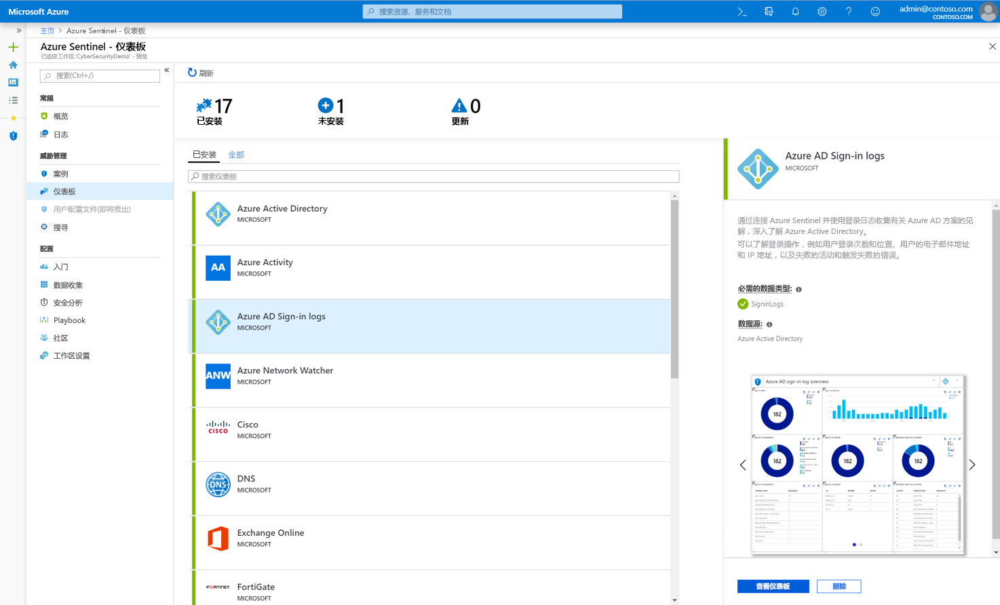
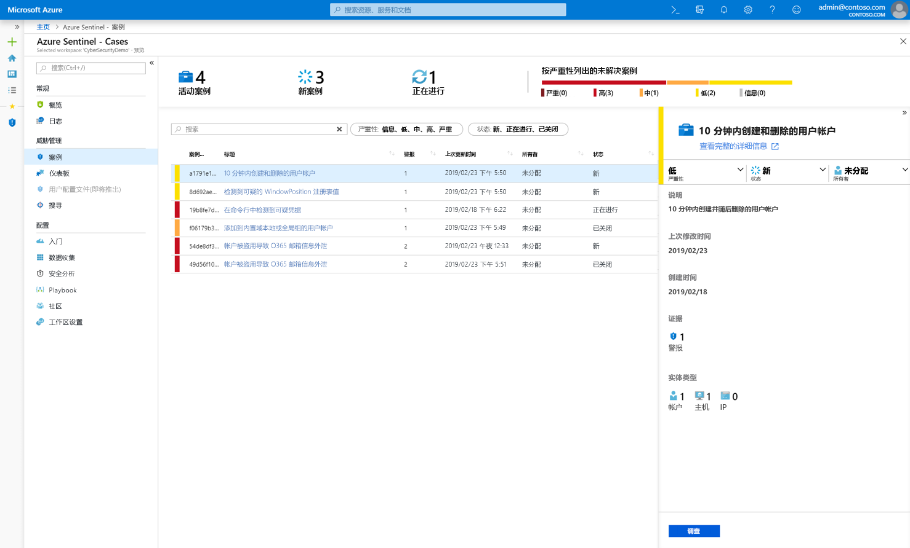
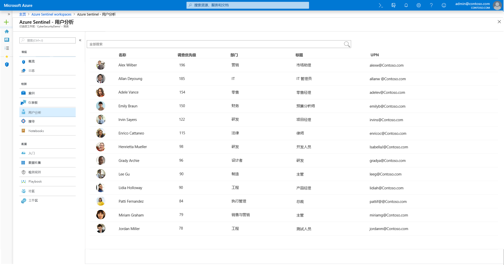
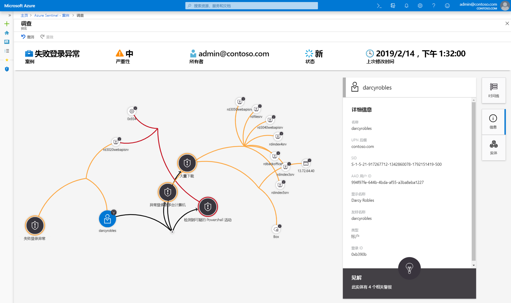
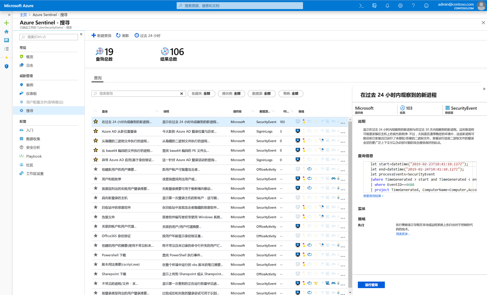
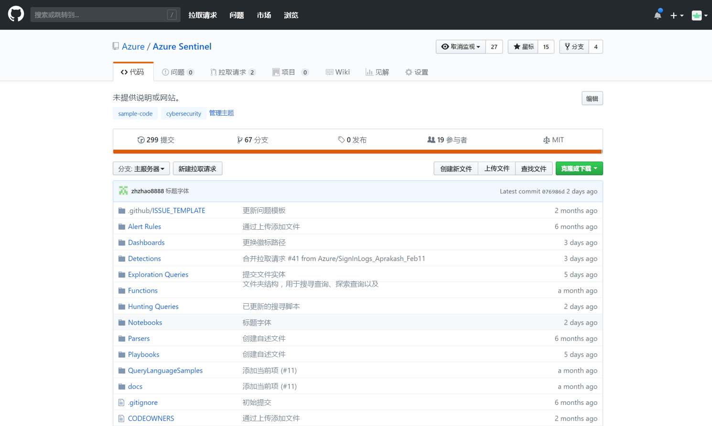

# 什么是 Azure Sentinel 预览版？

> [!IMPORTANT]
> Azure Sentinel 目前为公共预览版。
> 此预览版在提供时没有附带服务级别协议，不建议将其用于生产工作负荷。 某些功能可能不受支持或者受限。 有关详细信息，请参阅 [Microsoft Azure 预览版补充使用条款](https://azure.microsoft.com/support/legal/preview-supplemental-terms/)。

Microsoft Azure Sentinel 是可缩放的云原生**安全信息事件管理 (SIEM)** 和**安全业务流程自动响应 (SOAR)** 解决方案。 Azure Sentinel 在整个企业范围内提供智能安全分析和威胁智能，为警报检测、威胁可见性、主动搜寻和威胁响应提供单一解决方案。 

Azure Sentinel 提供整个企业安全局势的鸟瞰图，可以缓解日益复杂的攻击和不断增加的警报量，并可以缩短解决问题所需的时间。

- 跨所有用户、设备、应用程序和基础结构（包括本地和多个云）以**云规模收集数据**。 

- **检测以前未检测到的威胁**，并使用 Microsoft 的分析和无与伦比的威胁智能，最大限度地减少误报。 

- **借助人工智能调查威胁**，结合 Microsoft 多年以来的网络安全工作经验大规模搜寻可疑活动。 

- 通过内置的业务流程和常见任务自动化**快速响应事件**。

Azure Sentinel 基于现有的各种 Azure 服务，原生集成了经过证实的基础服务，例如 Log Analytics 和逻辑应用。 Azure Sentinel 可以借助人工智能丰富调查和检测工作，并提供 Microsoft 的威胁智能流，使你能够运用自己的威胁智能。 

 
## 连接到所有数据

若要载入 Azure Sentinel，首先需要[连接到安全源](connect-data-sources.md)。 Azure Sentinel 随附许多适用于 Microsoft 解决方案的现成可用的连接器，提供实时集成（包括 Microsoft 威胁防护解决方案）和 Microsoft 365 源（包括 Office 365、Azure AD、Azure ATP 和 Microsoft Cloud App Security，等等）。 此外，内置的连接器可以拓宽非 Microsoft 解决方案的安全生态系统。 也可以使用常用事件格式 Syslog 或 REST-API 将数据源与 Azure Sentinel 相连接。  

## 仪表板

连接数据源后，可以选择[创建的专业仪表板](quickstart-get-visibility.md#dashboards)库，从数据源中获取见解。 每个仪表板完全可自定义 - 可以添加自己的逻辑或修改查询，或者从头开始创建仪表板。

仪表板使用高级分析提供交互式可视化效果，帮助安全分析师更好地了解攻击期间发生的情况。 使用调查工具可以基于任何数据深入调查任何领域，以快速推测出威胁上下文。 

## 分析

为了帮助降低干扰并尽量减少需要检查和调查的警报数目，Azure Sentinel [使用分析将警报关联到案例](tutorial-detect-threats.md)。 **案例**是相关警报的分组，它们共同创建了可以调查和解决的、可处理的可能威胁。 可以按原样使用内置的关联规则，也可以使用它们作为起点来生成自己的关联规则。 Azure Sentinel 还提供机器学习规则用于映射网络行为，然后查找不同资源中的异常。 这些分析通过将有关不同实体的低保真度警报合并成潜在的高保真度安全事件，来关联问题点。

## 用户分析

利用原生集成的机器学习 (ML) 和[用户分析](user-analytics.md)，Azure Sentinel 可帮助快速检测威胁。 Azure Sentinel 与 Azure 高级威胁防护无缝集成，可以分析用户的行为，并根据用户警报以及 Azure Sentinel 和 Microsoft 365 中的可疑活动模式，来确定用户的调查优先级。

## 安全自动化和业务流程

将常见任务自动化，并使用可与 Azure 服务和现有工具集成的 Playbook 来[简化安全业务流程](tutorial-respond-threats-playbook.md)。 Azure Sentinel 的自动化和业务流程解决方案构建在 Azure 逻辑应用的基础之上，提供高度可扩展的体系结构，当新的技术和威胁出现时，它可以实现可缩放的自动化。 若要使用 Azure 逻辑应用生成 Playbook，可以从不断扩充的内置 Playbook 库中进行选择。 这些 Playbook 包括适用于 Azure Functions 等服务的 [200 多个连接器](https://docs.microsoft.com/azure/connectors/apis-list)。 使用连接器可在代码、ServiceNow、Jira、Zendesk、HTTP 请求、Microsoft Teams、Slack、Windows Defender ATP 和 Cloud App Security 中应用任何自定义逻辑。

例如，如果使用 ServiceNow 票证系统，可以使用提供的工具通过 Azure 逻辑应用自动执行工作流，并在每次检测到特定的事件时在 ServiceNow 中开具票证。

## 调查

Azure Sentinel [深入调查](tutorial-investigate-cases.md)工具可帮助你了解潜在安全威胁的范围和根本原因。 可在交互式图形中选择一个实体以提出有关特定实体的问题，然后向下钻取到该实体及其连接，以获取威胁的根本原因。 

## 搜寻

根据 MITRE 框架使用 Azure Sentinel 的[强大搜寻式搜索和查询工具](hunting.md)，可以在触发警报之前，主动搜寻组织的不同数据源中的安全威胁。 发现哪个搜寻式查询可以提供有关潜在攻击的宝贵见解后，还可以基于该查询创建自定义检测规则，并将这些见解作为警报传达给安全事件响应者。 搜寻时可为相关事件创建书签，以便将来可以回头调查这些事件、将其与他人共享，并将其与其他相关事件分组到一起，以创建典型案例供调查之用。

## 社区

Azure Sentinel 社区提供有关威胁检测和自动化的强有力资源。 Microsoft 安全分析师会不断创建和添加新的仪表板、Playbook、搜寻式查询及其他资源，并将其发布到社区，供你在环境中使用。 可以从 GitHub [存储库](https://aka.ms/asicommunity)个人社区下载示例内容，以创建适用于 Azure Sentinel 的自定义仪表板、搜寻式查询、Notebook 和 Playbook。 

## 后续步骤

- 若要开始使用 Azure Sentinel，需要订阅 Microsoft Azure。 如果尚无订阅，可注册[免费试用版](https://azure.microsoft.com/free/)。
- 了解如何[将数据载入到 Azure Sentinel](quickstart-onboard.md)，以及[获取数据和潜在威胁的见解](quickstart-get-visibility.md)。
