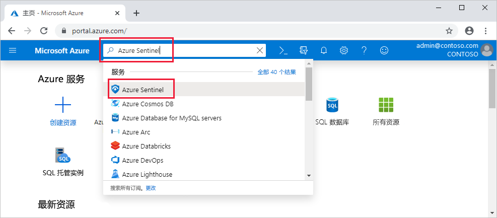

# 快速入门：载入 Azure Sentinel

在本快速入门中，了解如何载入 Azure Sentinel。 

若要载入 Azure Sentinel，首先需要启用 Azure Sentinel，然后再连接到数据源。 Azure Sentinel 随附许多适用于 Microsoft 解决方案的现成可用的连接器，提供实时集成（包括 Microsoft 威胁防护解决方案）和 Microsoft 365 源（包括 Office 365、Azure AD、Azure ATP 和 Microsoft Cloud App Security，等等）。 此外，内置的连接器可以拓宽非 Microsoft 解决方案的安全生态系统。 也可以使用常用事件格式 Syslog 或 REST-API 将数据源与 Azure Sentinel 相连接。  

连接数据源后，从熟练地创建的工作簿的库中进行选择，这些工作簿基于你的数据呈现见解。 可以根据需要轻松地自定义这些工作簿。

>[!IMPORTANT] 
> 有关使用 Azure Sentinel 时产生的费用的信息，请参阅 [Azure Sentinel 定价](https://azure.microsoft.com/pricing/details/azure-sentinel/)。
  

## 全局先决条件

- 如果没有可用的 Azure 订阅，可以在开始前创建一个[免费帐户](https://azure.microsoft.com/free/?WT.mc_id=A261C142F)。

- Log Analytics 工作区。 了解如何[创建 Log Analytics 工作区](../log-analytics/log-analytics-quick-create-workspace.md)。 有关 Log Analytics 工作区的详细信息，请参阅[设计 Azure 监视日志部署](../azure-monitor/platform/design-logs-deployment.md)。

- 若要启用 Azure Sentinel，需要获取 Azure Sentinel 工作区所在订阅的参与者权限。 
- 若要使用 Azure Sentinel，需要获取工作区所属资源组的“参与者”或“读取者”权限。
- 连接特定数据源可能需要其他权限。
- Azure Sentinel 是付费服务。 有关定价信息，请参阅[关于 Azure Sentinel](https://go.microsoft.com/fwlink/?linkid=2104058)。
 
## 启用 Azure Sentinel 

1. 登录到 Azure 门户。   确保已选中在其中创建 Azure Sentinel 的订阅。

1. 搜索“Azure Sentinel”并将其选中。  。

   

1. 选择 **添加** 。

1. 选择要使用的工作区，或创建新工作区。 可以在多个工作区上运行 Azure Sentinel，但将数据隔离到单个工作区。

   

   >[!NOTE] 
   > - Azure 安全中心创建的默认工作区将不会显示在列表中；无法在其上安装 Azure Sentinel。
   > - Azure Sentinel 可在 [Log Analytics 的任何 GA 区域](https://azure.microsoft.com/global-infrastructure/services/?products=monitor)的工作区中运行，但中国和德国（主权）区域除外。 Azure Sentinel 生成的数据（如事件、书签和警报规则，其中可能包含源自这些工作区的某些客户数据）将保存在欧洲（适用于位于欧洲的工作区）、澳大利亚（适用于位于澳大利亚的工作区）或美国东部（适用于位于其他区域的工作区）。

1. 选择“添加 Azure Sentinel”  。
  

## 连接数据源

Azure Sentinel 通过连接到服务并将事件和日志转发到 Azure Sentinel 来创建与服务和应用的连接。 对于计算机和虚拟机，可以安装用于收集日志并将其转发到 Azure Sentinel 的 Azure Sentinel 代理。 对于防火墙和代理，Azure Sentinel 利用 Linux Syslog 服务器。 代理安装在服务器上，并从中收集日志文件，然后将其转发到 Azure Sentinel。 
 
1. 单击“数据连接器”  。
2. 可以连接的每个数据源都有一个磁贴。 
例如，单击“Azure Active Directory”  。 如果连接此数据源，则会将 Azure AD 中的所有日志流式传输到 Azure Sentinel。 你可以选择用于获取登录日志和/或审核日志的日志类型。  
在底部，Azure Sentinel 为应为每个连接器安装的工作簿提供建议，以便你可以立即获得数据中的有趣见解。   有关详细信息，请按照安装说明或[参阅相关的连接指南](connect-data-sources.md)。 有关数据连接器的信息，请参阅[连接 Microsoft 服务](connect-data-sources.md)。

连接数据源后，数据开始流式传输到 Azure Sentinel，并准备好供你开始使用。 可以在[内置仪表板](quickstart-get-visibility.md)中查看日志并开始在 Log Analytics 中构建查询以[调查数据](tutorial-investigate-cases.md)。

## 后续步骤
本文档介绍了如何将数据源连接到 Azure Sentinel。 要详细了解 Azure Sentinel，请参阅以下文章：
- 了解如何[洞悉数据和潜在威胁](quickstart-get-visibility.md)。
- 开始[使用 Azure Sentinel 检测威胁](tutorial-detect-threats-built-in.md)。
- 将数据从[通用事件格式设备](connect-common-event-format.md)流式传输到 Azure Sentinel。
