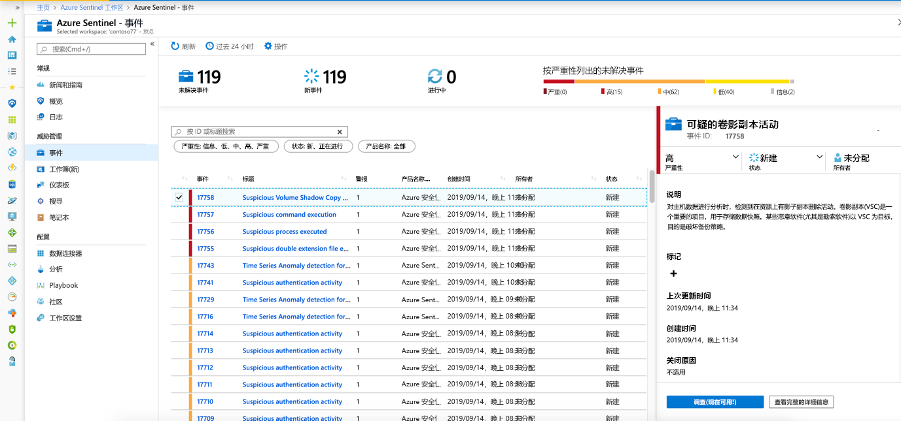
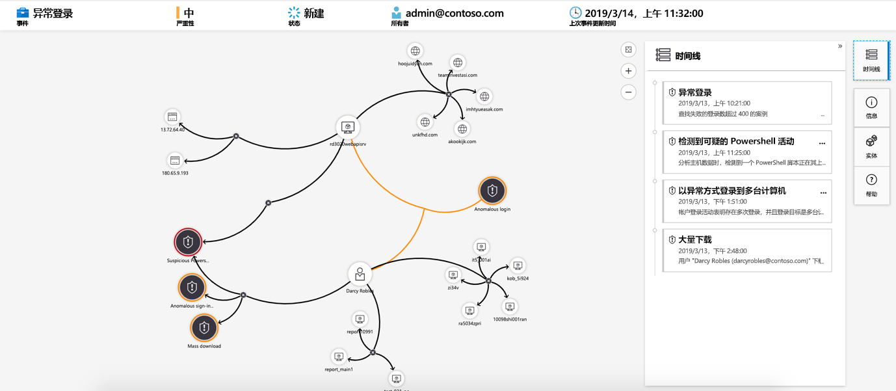

# 教程：用 Azure Sentinel 调查事件

> [!IMPORTANT]
> 调查关系图目前为公共预览版。
> 此功能在提供时没有服务级别协议，不建议用于生产工作负荷。
> 有关详细信息，请参阅 [Microsoft Azure 预览版补充使用条款](https://azure.microsoft.com/support/legal/preview-supplemental-terms/)。

本教程帮助你通过 Azure Sentinel 调查事件。 将数据源连接到 Azure Sentinel 后，需要在出现可疑情况时收到通知。 为了使你能够执行此操作，Azure Sentinel 允许你创建高级警报规则，以生成可分配和调查的事件。

本文包含以下内容：
> [!div class="checklist"]
> * 调查事件
> * 使用调查图
> * 响应威胁

事件可包含多个警报。 它是用于特定调查的所有相关证据的聚合。 事件是根据你在 "**分析**" 页中创建的分析规则创建的。 与警报相关的属性，例如严重性和状态，在事件级别设置。 让 Azure Sentinel 知道要查找的威胁种类以及如何找到它们后，可以通过调查事件来监视检测到的威胁。

## 先决条件
如果在设置分析规则时使用了实体映射字段，则只能调查事件。 调查图要求您的原始事件包含实体。

## 如何调查事件

1. 选择 " **事件**"。 使用 " **事件** " 页，您可以了解有多少事件、打开的事件数、已设置为 **正在进行**的事件数以及已关闭的事件数。 对于每个事件，可以查看其发生时间以及事件的状态。 查看严重性，决定要首先处理哪些事件。

    

1. 你可以根据需要筛选事件，例如按状态或严重性。

1. 要开始调查，请选择特定的事件。 在右侧，可以查看事件的详细信息，包括其严重性、涉及的实体数、触发此事件的原始事件以及事件的唯一 ID。

1. 若要查看有关事件中的警报和实体的更多详细信息，请在 "事件" 页中选择 "**查看完整详细信息**"，并查看汇总事件信息的相关选项卡。 在 "**警报**" 选项卡中，查看警报本身。 您可以查看有关警报的所有相关信息-触发警报的查询、每个查询返回的结果数，以及对警报运行行动手册的能力。 若要深入了解事件，请选择**事件**数。 这会打开生成结果的查询以及触发警报的事件 Log Analytics。 在 "**实体**" 选项卡中，可以看到作为警报规则定义的一部分映射的所有实体。

    

1. 如果正在积极调查事件，最好将事件的状态设置为 **"正在进行**"，直到将其关闭。

1. 可以将事件分配给特定用户。 对于每个事件，可以通过设置 "**事件所有者**" 字段来分配一个所有者。 所有事件都作为 "未分配" 启动。 您还可以添加注释，以便其他分析师能够理解您调查的内容以及您对事件的关注。

    

1. 选择 "**调查**" 查看调查地图。

## 使用调查图深入探讨

调查关系图可让分析人员提出有关每个调查的正确问题。 调查关系图通过将相关数据与任何涉及的实体相关联，帮助你了解范围并确定潜在安全威胁的根本原因。 您可以通过选择关系图并在不同的扩展选项之间进行选择，深入了解并调查关系图中显示的任何实体。  
  
调查图为您提供了：

- **原始数据的可视化上下文**：实时可视化关系图显示自动从原始数据中提取的实体关系。 这使你可以轻松地查看跨不同数据源的连接。

- **完全调查范围发现**：使用内置的浏览查询展开调查范围，以显示破坏的全部范围。

- **内置调查步骤**：使用预定义的浏览选项，以确保在面临威胁时询问正确的问题。

使用调查图：

1. 选择一个事件，然后选择 " **调查**"。 这会转到调查关系图。 Graph 提供直接连接到警报的实体的图示，以及每个关联的资源。

   > [!IMPORTANT] 
   > 如果在设置分析规则时使用了实体映射字段，则只能调查事件。 调查图要求您的原始事件包含实体。

   

1. 选择一个实体以打开 " **实体** " 窗格，以便您可以查看有关该实体的信息。

    
  
1. 通过将鼠标悬停在每个实体上来展开调查，以显示由我们的安全专家和分析师设计的问题列表，以加深调查。 我们将这些选项称为**浏览查询**。

    

   例如，你可以在计算机上请求相关警报。 如果选择探索查询，则会将生成的证明添加回关系图。 在此示例中，选择 "**相关警报**" 会将以下警报返回到图形中：

    

1. 对于每个浏览查询，可以通过选择 "**事件\>** " 来选择用于打开原始事件结果和 Log Analytics 中所使用的查询的选项。

1. 为了理解事件，图形提供了一个并行时间线。

    

1. 将鼠标悬停在时间线上，以查看关系图上发生了哪些操作。

    

## 后续步骤
在本教程中，已学习如何使用 Azure Sentinel 来调查事件。 继续学习有关[如何使用自动行动手册来响应威胁](tutorial-respond-threats-playbook.md)的教程。
> [!div class="nextstepaction"]
> [应对威胁](tutorial-respond-threats-playbook.md)以自动应对威胁。

