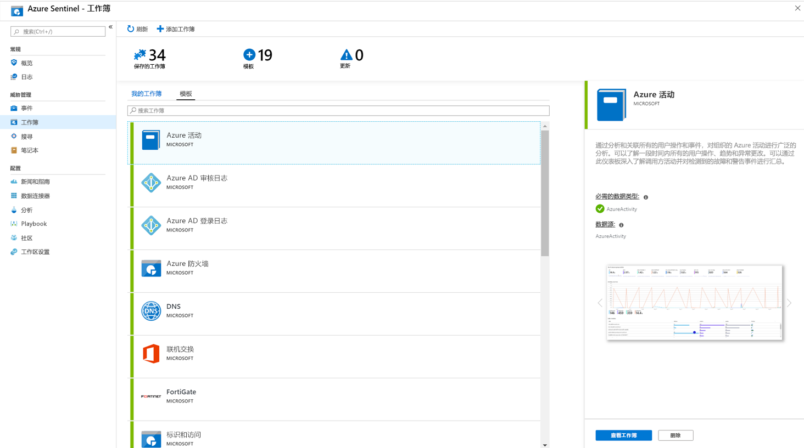

# 教程：可视化和监视你的数据

将[数据源](quickstart-onboard.md) 连接到 azure sentinel 后，可以使用 Azure sentinel 采用 Azure Monitor 工作簿来可视化和监视数据，这在创建自定义仪表板中提供了丰富的用途。 尽管工作簿在 Azure Sentinel 中以不同的方式显示，但你可以查看如何[通过 Azure Monitor 工作簿创建交互式报表](../azure-monitor/app/usage-workbooks.md)。 Azure Sentinel 可让你跨数据创建自定义工作簿，并且还附带了内置的工作簿模板，使你可以在连接数据源后快速获得对数据的见解。

本教程可帮助你在 Azure Sentinel 中直观显示数据。
> [!div class="checklist"]
> * 使用内置工作簿
> * 创建新工作簿

## 先决条件

- 对于 Azure Sentinel 工作区的资源组，您必须至少具有工作簿读取器或工作簿参与者权限。

> [!NOTE]
> 可在 azure sentinel 工作区的资源组中查看的工作簿保存在 Azure Sentinel 工作区的资源组中，并由创建它们的工作区进行标记。

## 使用内置工作簿

1. 中转到**工作簿**，然后选择 "**模板**" 以查看 Azure Sentinel 内置工作簿的完整列表。 若要查看与您连接的数据类型相关的数据类型，每个工作簿中的**所需数据类型**字段将在绿色复选标记旁边列出数据类型，如果已将相关数据流式传输到 Azure Sentinel。
  
1. 单击 "**查看工作簿**"，查看用你的数据填充的模板。
  
1. 若要编辑工作簿，请选择 "**保存**"，然后选择要为模板保存 json 文件的位置。 

   > [!NOTE]
   > 这会基于相关模板创建 Azure 资源，并保存模板 Json 文件本身，而不是数据。

1. 选择 "**查看工作簿**"。 然后，单击顶部的 "**编辑**" 按钮。 你现在可以编辑工作簿，并根据需要对其进行自定义。 有关如何自定义工作簿的详细信息，请参阅如何[创建具有 Azure Monitor 工作簿的交互式报表](../azure-monitor/app/usage-workbooks.md)。

1. 进行更改后，可以保存工作簿。 

1. 你还可以克隆工作簿：选择 "**编辑**"，然后单击 "**另存为**"，确保在同一订阅和资源组下将其另存为其他名称。 这些工作簿显示在 "**我的工作簿**" 选项卡下。

## 创建新的工作簿

1. 中转到**工作簿**，然后选择 "**添加工作簿**"，从头开始创建新的工作簿。
  

1. 若要编辑工作簿，请选择 "**编辑**"，然后根据需要添加文本、查询和参数。 有关如何自定义工作簿的详细信息，请参阅如何[创建具有 Azure Monitor 工作簿的交互式报表](../azure-monitor/app/usage-workbooks.md)。 

1. 生成查询时，将 "**数据源**" 设置为 "**日志**"，**资源类型**设置为 " **Log Analytics** "，然后选择相关工作区。 

1. 创建工作簿后，保存工作簿以确保将其保存在 Azure Sentinel 工作区的订阅和资源组下。

1. 如果希望让组织中的其他人使用该工作簿，请在 "**保存**" 下选择 "**共享报表**"。 如果希望此工作簿仅供用户使用，请选择 **"我的报表**"。

1. 若要在工作区中切换工作簿，可以在任何工作](./media/tutorial-monitor-data/switch.png)簿的顶部窗格中选择 "**打开** 

## 如何删除工作簿

可以删除从 Azure Sentinel 模板创建的工作簿。 

若要删除自定义工作簿，请在 "工作簿" 页中选择要删除的已保存工作簿，然后选择 "**删除**"。 这将删除已保存的工作簿。

> [!NOTE]
> 这会删除资源以及对模板所做的任何更改。 原始模板仍可用。

## 后续步骤

在本教程中，已学习如何在 Azure Sentinel 中查看数据。

若要了解如何自动响应威胁，请参阅[在 Azure Sentinel 中设置自动威胁响应](tutorial-respond-threats-playbook.md)。
