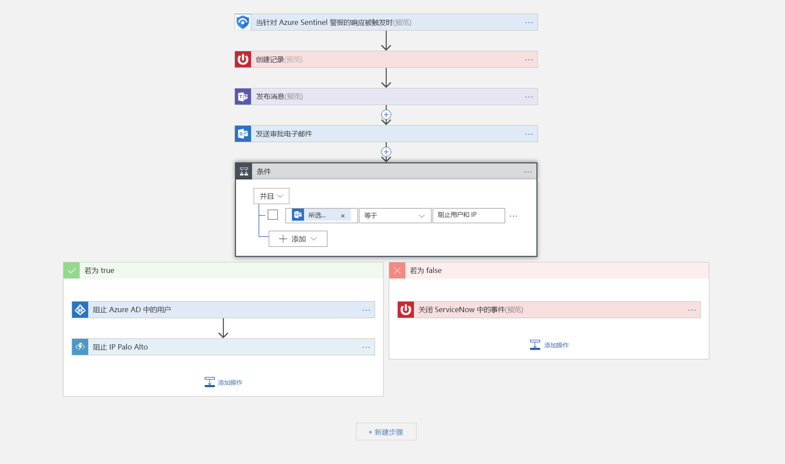

# 教程：在 Azure Sentinel 预览版中设置自动威胁响应

> [!IMPORTANT]
> Azure Sentinel 当前为公共预览版。
> 此预览版在提供时没有附带服务级别协议，不建议将其用于生产工作负荷。 某些功能可能不受支持或者受限。 有关详细信息，请参阅 [Microsoft Azure 预览版补充使用条款](https://azure.microsoft.com/support/legal/preview-supplemental-terms/)。

本教程可帮助你在 Azure Sentinel 中使用安全性 playbook 来对 Azure Sentinel 检测到的安全相关问题设置自动威胁响应。

> [!div class="checklist"]
> * 了解 playbook
> * 创建 playbook
> * 运行 playbook
> * 自动响应威胁

## Azure Sentinel 中的安全性 playbook 是指什么？

安全性 playbook 是在 Azure Sentinel 中运行以响应警报的一个流程集合。 安全性 playbook 可帮助自动处理和编排响应，它可手动运行，也可设置为在触发特定警报时自动运行。 Azure Sentinel 中的安全性 playbook 基于 [Azure 逻辑应用](https://docs.microsoft.com/azure/logic-apps/logic-apps-what-are-logic-apps)，这意味着你可获得逻辑应用的所有功能、自定义能力和内置模板。 每个 playbook 都是针对所选的特定订阅创建的，但当你查看 Playbook 页面时，你将看到所有选定订阅中的全部 playbook。

> [!NOTE]
> Playbook 使用 Azure 逻辑应用，因此要收费。 有关更多详细信息，请访问 [Azure 逻辑应用](https://azure.microsoft.com/pricing/details/logic-apps/)定价页。

例如，如果担心恶意攻击者会访问你的网络资源，则可设置一条警报来监视访问你的网络的恶意 IP 地址。 然后，可创建一个执行以下操作的 playbook：
1. 触发警报时，在 ServiceNow 或任意其他 IT 票证系统中的打开一个票证。
2. 向 Microsoft Teams 或 Slack 中的安全操作频道发送一条消息，确保你的安全分析师注册到此事件。
3. 将警报中的所有信息发送给高级网络管理员和安全管理员。该电子邮件中还包含“阻止”和“忽略”这两个用户选项按钮   。
4. 在收到来自管理员的答复后，playbook 继续运行。
5. 如果管理员选择“阻止”，则在防火墙中阻止该 IP 地址并在 Azure AD 中禁用该用户  。
6. 如果管理员选择“忽略”，则在 Azure Sentinel 中关闭此警报并在 ServiceNow 中关闭此事件  。

安全性 playbook 既可手动运行，也可自动运行。 手动运行是指在收到警报后，可选择按需运行 playbook 作为所选警报的响应。 自动运行是指在创建相关性规则时，将其设置为在触发警报时自动运行一个或多个 playbook。

## 创建安全性 playbook

按照以下步骤在 Azure Sentinel 中创建新的安全性 playbook：

1. 打开“Azure Sentinel”仪表板  。
2. 在“管理”下，选择“Playbooks”   。

   

3. 在“Azure Sentinel - Playbook (预览版)”页面中，单击“添加”按钮   。

    

4. 在“创建逻辑应用”页面上，键入所请求的信息以创建新的逻辑应用，然后单击“创建”   。 

5. 在[**逻辑应用设计器中，选择要使用的模板**](../logic-apps/logic-apps-overview.md)。 如果选择必须使用凭据的模板，则必须提供凭据。 或者，可从头开始创建新的空白 playbook。 选择“空白逻辑应用”  。 

   

6. 你将转到逻辑应用设计器，可在此处构建新的模板或编辑模板。 详细了解如何使用[逻辑应用](../logic-apps/logic-apps-create-logic-apps-from-templates.md)创建 playbook。

7. 若要创建空白 playbook，请在“搜索所有连接器和触发器”字段中，键入 Azure Sentinel，再选择“当触发对 Azure Sentinel 警报的响应时”    。  创建后，新的 playbook 显示在“Playbook”列表中  。 如果未显示，请单击“刷新”  。 

7. 现在可以定义触发攻略时的响应。 可添加操作、逻辑条件、switch case 条件或循环。

   

## 如何运行安全性 playbook

可按需运行 playbook。

要按需运行 playbook：

1. 在“案例”页面中，选择一个案例并单击“查看完整详细信息”   。

2. 在“警报”选项卡中，单击要对其运行 playbook 的警报，然后一直滚动到右侧，单击“查看 playbook”，再选择要从订阅上可用 playbook 列表运行的 playbook    。 

## 自动响应威胁

SIEM/SOC 团队可能会定期收到海量的安全警报。 生成的警报量如此之大，以致于现有的安全管理员不堪重负。 这往往会导致以下情况：无法调查很多警报，使得组织易于在未注意到的情况下遭受攻击。 

这些警报中的许多（如果不是大多数）警报都符合定期模式，可通过特定的修正操作和定义的修正操作进行处理。 Azure Sentinel 已允许在 Playbook 中定义修正操作。 此外，还可以将实时自动化设置为 Playbook 定义的一部分，以便能够完全自动化对特定安全警报的定义响应。 使用实时自动化，响应团队可以大幅减少其工作量，因为他们可以完全自动化对重复出现的警报类型的常规响应，从而让你可以更专注于处理独特警报，分析模式和搜寻威胁等活动。

若要实现自动响应，请执行以下操作：

1. 选择要对其实现自动响应的警报。
1. 从 Azure Sentinel 工作区导航菜单中，选择“分析”  。
1. 选择要自动响应的警报。 
1. 在“编辑警报规则”  页的“实时自动化”  下，选择要在匹配此警报规则时运行的“触发的 Playbook”  。
1. 选择“保存”。 

   

## 后续步骤

在本教程中，你学习了如何在 Azure Sentinel 中运行 playbook。 继续学习[如何使用 Azure Sentinel 来搜寻威胁](hunting.md)。

