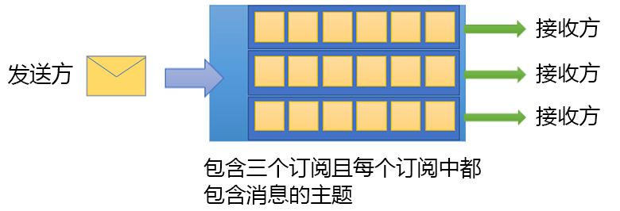

# 什么是 Azure 服务总线？

Microsoft Azure 服务总线是一种完全托管的企业集成消息中转站。 服务总线可以分离应用程序和服务。 服务总线为异步传输数据和状态提供可靠且安全的平台。

数据通过消息在不同的应用程序和服务之间传输。  消息采用二进制格式，可能包含 JSON、XML 或纯文本。 有关详细信息，请参阅[集成服务](https://azure.com/integration)。

一些常见的消息传送方案包括：

* *消息*。 传输业务数据，例如销售或采购订单、日志或库存变动。
* *分离应用程序*。 提高应用程序和服务的可靠性和可伸缩性。 客户端和服务不必同时处于联机状态。
* *主题和订阅*。 启用发布者和订阅者之间的 1:n 关系  。
* *消息会话*。 实现要求消息排序或消息延迟的工作流。

## 命名空间

命名空间是一个适用于所有消息传送组件的容器。 多个队列和主题可以位于一个命名空间中，命名空间通常用作应用程序容器。

## 队列

消息可以发送到队列，也可以从其接收。  在能够使用接收应用程序接收并处理消息之前，可以通过队列来存储消息。

队列中的消息会排队，并在到达时加盖时间戳。 获得接受后，消息会安全地存储在冗余存储中。 消息以拉取模式传送，即仅按请求传送消息。 

## 主题

也可通过主题发送和接收消息。  队列通常用于点到点通信，而主题则用于发布/订阅方案。

主题可以有多个独立的订阅。 主题的订阅者可以收到发送到该主题的每个消息的副本。 订阅是命名实体。 订阅可以保留，但会过期或自动删除。

你可能不希望单个订阅接收发送给某个主题的所有消息。 如果是这样，则可以使用“规则”和“筛选器”来定义触发可选操作的条件    。 可以筛选指定的消息并设置或修改消息属性。 有关详细信息，请参阅[主题筛选器和操作](topic-filters.md)。

## 高级功能

服务总线包括用于解决更复杂消息传送问题的高级功能。 以下部分说明了这几个功能。

### 消息会话

若要在服务总线中创建先进先出 (FIFO) 保证，请使用会话。 使用消息会话，可以连贯有序的方式处理一系列无限多的相关消息。 有关详细信息，请参阅[消息会话：先进先出 (FIFO)](message-sessions.md)。

### 自动转发

自动转发功能可将队列或订阅链接到另一个队列或主题。 它们必须都属于相同的命名空间。 使用自动转发，服务总线会自动从队列或订阅中删除消息，并将其放入其他队列或主题中。 有关详细信息，请参阅[使用自动转发链接服务总线实体](service-bus-auto-forwarding.md)。

### 死信队列

服务总线支持死信队列 (DLQ)。 DLQ 保留无法传递给任何接收方的消息。 它保留无法处理的消息。 使用服务总线可以从 DLQ 中删除这些消息并对其进行检查。 有关详细信息，请参阅[服务总线死信队列概述](service-bus-dead-letter-queues.md)。

### 计划的传递

可以将消息提交到队列或主题，以便进行延迟处理。 可以计划作业，以便在特定时间可供系统处理。 有关详细信息，请参阅[计划的消息](message-sequencing.md#scheduled-messages)。

### 消息延迟

队列或订阅客户端可以延迟一段时间检索消息。 此延迟可能是由于应用程序中的特殊情况。 该消息将保留在队列或订阅中，但会搁置处理。 有关详细信息，请参阅[消息延迟](message-deferral.md)。

### 批处理

客户端批处理允许队列或主题客户端延迟一段时间发送消息。 如果客户端在这段时间内发送其他消息，则会将这些消息以单个批次传送。 有关详细信息，请参阅[客户端批处理](service-bus-performance-improvements.md#client-side-batching)。

### 事务

一个事务将两个或更多操作组合成执行作用域  。 服务总线支持对单个事务作用域内的消息传送实体执行分组操作。 消息实体可以是队列、主题或订阅。 有关详细信息，请参阅[服务总线事务处理概述](service-bus-transactions.md)。

### 筛选和操作

订阅者可以定义他们希望从主题接收的消息。 这些消息采用一个或多个命名订阅规则的形式指定。 对于每个匹配规则条件，订阅会生成消息的副本，这对于每个匹配规则可能会以不同方式进行批注。 有关详细信息，请参阅[主题筛选器和操作](topic-filters.md)。

### 出现空闲队列时自动删除

可以使用“出现空闲队列时自动删除”功能指定一个空闲时间间隔，该时间间隔过后系统会自动删除队列。 最短持续时间为 5 分钟。 有关详细信息，请参阅 [QueueDescription.AutoDeleteOnIdle 属性](/dotnet/api/microsoft.servicebus.messaging.queuedescription.autodeleteonidle)。

### 重复检测

错误可能会导致客户端对发送操作结果产生怀疑。 通过重复检测可以重新发送相同的消息。 另一种做法是让队列或主题丢弃任何重复副本。 有关详细信息，请参阅[重复检测](duplicate-detection.md)。

### 安全协议

服务总线支持多种安全协议，例如[共享访问签名](service-bus-sas.md) (SAS)、[基于角色的访问控制](authenticate-application.md) (RBAC)、[适用于 Azure 资源的托管标识](service-bus-managed-service-identity.md)。

### 异地灾难恢复

在 Azure 区域数据中心遭遇停机的情况下，可以使用异地灾难恢复在其他区域或数据中心进行数据处理，以实现连续运行。 有关详细信息，请参阅 [Azure 服务总线异地灾难恢复](service-bus-geo-dr.md)。

### 安全性

服务总线支持标准的 [AMQP 1.0](service-bus-amqp-overview.md) 和 [HTTP/REST](/rest/api/servicebus/) 协议。

## 客户端库

服务总线支持用于 [.NET](https://github.com/Azure/azure-service-bus-dotnet/tree/master)、[Java](https://github.com/Azure/azure-service-bus-java/tree/master) 和 [JMS](https://github.com/Azure/azure-service-bus/tree/master/samples/Java/qpid-jms-client) 的客户端库。

## 集成

服务总线与以下 Azure 服务完全集成：

* [事件网格](https://azure.microsoft.com/services/event-grid/)
* [逻辑应用](https://azure.microsoft.com/services/logic-apps/)
* [Azure Functions](https://azure.microsoft.com/services/functions/)
* [Dynamics 365](https://dynamics.microsoft.com)
* [Azure 流分析](https://azure.microsoft.com/services/stream-analytics/)

## 后续步骤

有关服务总线消息传送入门的内容，请参阅以下文章：

* 若要比较 Azure 消息服务，请参阅服务[服务对比](../event-grid/compare-messaging-services.md?toc=%2fazure%2fservice-bus-messaging%2ftoc.json&bc=%2fazure%2fservice-bus-messaging%2fbreadcrumb%2ftoc.json)。
* 尝试 [.NET](service-bus-dotnet-get-started-with-queues.md)、[Java](service-bus-java-how-to-use-queues.md) 或 [JMS](service-bus-java-how-to-use-jms-api-amqp.md) 的快速入门。
* 若要管理服务总线资源，请参阅[服务总线资源管理器](https://github.com/paolosalvatori/ServiceBusExplorer/releases)。
* 若要详细了解标准和高级层及其定价，请参阅[服务总线定价](https://azure.microsoft.com/pricing/details/service-bus/)。
* 若要了解高级层的性能和延迟，请参阅[高级消息传送](https://techcommunity.microsoft.com/t5/Service-Bus-blog/Premium-Messaging-How-fast-is-it/ba-p/370722)。
