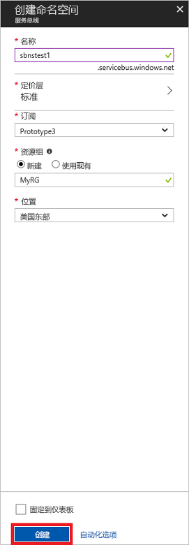

# <a name="quickstart-send-and-receive-messages-using-the-azure-portal-and-net"></a>快速入门：使用 Azure 门户和 .NET 发送和接收消息

Microsoft Azure 服务总线是一种提供安全消息传送和绝对可靠性的企业集成消息中转站。 典型的服务总线方案通常涉及将两个或更多应用程序、服务或进程彼此解耦以及传输状态或数据更改。 此类方案可能涉及在其他应用程序或服务中计划多个批处理作业，或触发订单履行。 例如，零售公司可能会将其销售点数据发送到后端办公系统或区域配送中心，以便进行补货和库存更新。 在这种情况下，客户端应用会将消息发送到服务总线队列并从中接收消息。  


本快速入门介绍如何使用 [Azure 门户][Azure portal]创建消息命名空间并在该命名空间中创建队列，以及如何获取该命名空间上的授权凭据，以便将消息发送到服务总线队列以及从中接收消息。 然后该过程展示了如何使用 [.NET Standard 库](https://www.nuget.org/packages/Microsoft.Azure.ServiceBus)从此队列发送和接收消息。

如果还没有 Azure 订阅，可以在开始前创建一个[免费帐户][]。

## <a name="prerequisites"></a>先决条件

若要完成本教程，请确保已安装：

- [Visual Studio 2017 Update 3（版本 15.3 (26730.01)）](http://www.visualstudio.com/vs)或更高版本。
- [NET Core SDK](https://www.microsoft.com/net/download/windows) 2.0 或更高版本。

## <a name="log-on-to-the-azure-portal"></a>登录到 Azure 门户。

首先转到 [Azure 门户][Azure portal]，使用 Azure 订阅登录。 第一步是创建类型为“消息传送”的服务总线命名空间。

## <a name="create-a-service-bus-namespace"></a>创建服务总线命名空间

服务总线消息传送命名空间提供唯一的作用域容器，可以通过其[完全限定域名][]进行引用，而在该域名中，可以创建一个或多个队列、主题和订阅。 以下示例在新的或现有的[资源组](/azure/azure-resource-manager/resource-group-portal)中创建一个服务总线消息传送命名空间：

1. 在门户的左侧导航窗格中，依次单击“+ 创建资源”、“企业集成”和“服务总线”。
2. 在“创建命名空间”  对话框中，输入命名空间名称。 系统会立即检查该名称是否可用。
3. 在确保命名空间名称可用后，请选择定价层（标准或高级）。
4. 在“订阅”  字段中，选择要创建命名空间的 Azure 订阅。
5. 在“资源组”字段中，选择将保留命名空间的现有资源组，或者创建一个新资源组。      
6. 在“位置” 中，选择应托管命名空间的国家或地区。
7. 单击“创建”。 系统现已创建命名空间并已将其启用。 可能需要等待几分钟，因为系统将为帐户配置资源。



### <a name="obtain-the-management-credentials"></a>获取管理凭据

创建新的命名空间时，会自动生成一项初始的共享访问签名 (SAS) 规则，将一对主密钥和辅助密钥关联到一起，向每个密钥授予对命名空间的所有资产的完全控制权限。 若要复制初始规则，请执行以下步骤： 

1.  单击“所有资源”，然后单击新创建的命名空间名称。
2. 在命名空间窗口中，单击“共享访问策略”。
3. 在“共享访问策略”屏幕中，单击“RootManageSharedAccessKey”。
4. 在“策略: RootManageSharedAccessKey”窗口中，单击“主连接字符串”旁边的“复制”按钮，将连接字符串复制到剪贴板供以后使用。 将此值粘贴到记事本或其他某个临时位置。 

    ![connection-string][connection-string]
5. 重复上述步骤，将**主键**的值复制和粘贴到临时位置，供以后使用。

## <a name="create-a-queue"></a>创建队列

若要创建服务总线队列，请指定要在其中创建该队列的命名空间。 以下示例演示如何在门户中创建队列：

1. 在门户的左侧的导航窗格中，单击“服务总线”（如果未看到“服务总线”，请单击“更多服务”）。
2. 单击要在其中创建队列的命名空间。
3. 在命名空间窗口中单击“队列”，然后在“队列”窗口中单击“+ 队列”。
4. 输入队列**名称**，其他值则保留默认值。
5. 在窗口底部，单击“创建”。
6. 记下队列名称。

## <a name="send-and-receive-messages"></a>发送和接收消息

预配命名空间和队列并且拥有所需的凭据后，便可以发送和接收消息。 可以在[此 GitHub 示例文件夹](https://github.com/Azure/azure-service-bus/tree/master/samples/Java/quickstarts-and-tutorials/quickstart-jms)中检查代码。

若要运行此代码，请执行以下操作：

1. 通过发出以下命令克隆[服务总线 GitHub 存储库](https://github.com/Azure/azure-service-bus/)：

   ```shell
   git clone https://github.com/Azure/azure-service-bus.git
   ```

3. 导航到示例文件夹 `azure-service-bus\samples\DotNet\GettingStarted\BasicSendReceiveQuickStart\BasicSendReceiveQuickStart`。

4. 复制在[获取管理凭据](#obtain-the-management-credentials)部分获得的连接字符串和队列名称。

5.  在命令提示符窗口中键入以下命令：

   ```shell
   dotnet build
   ```

6.  导航到 `bin\Debug\netcoreapp2.0` 文件夹。

7.  键入以下命令以运行程序。 请务必将 `myConnectionString` 替换为先前获取的值，将 `myQueueName` 替换为所创建队列的名称：

   ```shell
   dotnet BasicSendReceiveQuickStart.dll -ConnectionString "myConnectionString" -QueueName "myQueueName"
   ``` 

8. 观察发送到队列并随后从队列中接收的 10 条消息：

   

## <a name="clean-up-resources"></a>清理资源

可以通过门户删除资源组、命名空间和队列。

## <a name="understand-the-sample-code"></a>了解示例代码

此部分包含有关示例代码功能的更多详细信息。 

### <a name="get-connection-string-and-queue"></a>获取连接字符串和队列

连接字符串和队列名称作为命令行参数传递给 `Main()` 方法。 `Main()` 声明了两个字符串变量来保存这些值：

```csharp
static void Main(string[] args)
{
    string ServiceBusConnectionString = "";
    string QueueName = "";

    for (int i = 0; i < args.Length; i++)
    {
        var p = new Program();
        if (args[i] == "-ConnectionString")
        {
            Console.WriteLine($"ConnectionString: {args[i+1]}");
            ServiceBusConnectionString = args[i + 1]; 
        }
        else if(args[i] == "-QueueName")
        {
            Console.WriteLine($"QueueName: {args[i+1]}");
            QueueName = args[i + 1];
        }                
    }

    if (ServiceBusConnectionString != "" && QueueName != "")
        MainAsync(ServiceBusConnectionString, QueueName).GetAwaiter().GetResult();
    else
    {
        Console.WriteLine("Specify -Connectionstring and -QueueName to execute the example.");
        Console.ReadKey();
    }                            
}
```
 
然后，`Main()` 方法启动异步消息循环 `MainAsync()`。

### <a name="message-loop"></a>消息循环

MainAsync() 方法使用命令行参数创建队列客户端，调用名为 `RegisterOnMessageHandlerAndReceiveMessages()` 的接收消息处理程序，并发送消息集：

```csharp
static async Task MainAsync(string ServiceBusConnectionString, string QueueName)
{
    const int numberOfMessages = 10;
    queueClient = new QueueClient(ServiceBusConnectionString, QueueName);

    Console.WriteLine("======================================================");
    Console.WriteLine("Press any key to exit after receiving all the messages.");
    Console.WriteLine("======================================================");

    // Register QueueClient's MessageHandler and receive messages in a loop
    RegisterOnMessageHandlerAndReceiveMessages();

    // Send Messages
    await SendMessagesAsync(numberOfMessages);

    Console.ReadKey();

    await queueClient.CloseAsync();
}
```

`RegisterOnMessageHandlerAndReceiveMessages()` 方法只是设置一些消息处理程序选项，然后调用队列客户端的 `RegisterMessageHandler()` 方法，该方法开始接收消息：

```csharp
static void RegisterOnMessageHandlerAndReceiveMessages()
{
    // Configure the MessageHandler Options in terms of exception handling, number of concurrent messages to deliver etc.
    var messageHandlerOptions = new MessageHandlerOptions(ExceptionReceivedHandler)
    {
        // Maximum number of Concurrent calls to the callback `ProcessMessagesAsync`, set to 1 for simplicity.
        // Set it according to how many messages the application wants to process in parallel.
        MaxConcurrentCalls = 1,

        // Indicates whether MessagePump should automatically complete the messages after returning from User Callback.
        // False below indicates the Complete will be handled by the User Callback as in `ProcessMessagesAsync` below.
        AutoComplete = false
    };

    // Register the function that will process messages
    queueClient.RegisterMessageHandler(ProcessMessagesAsync, messageHandlerOptions);
} 
```

### <a name="send-messages"></a>发送消息

消息创建和发送操作发生在 `SendMessagesAsync()` 方法中：

```csharp
static async Task SendMessagesAsync(int numberOfMessagesToSend)
{
    try
    {
        for (var i = 0; i < numberOfMessagesToSend; i++)
        {
            // Create a new message to send to the queue
            string messageBody = $"Message {i}";
            var message = new Message(Encoding.UTF8.GetBytes(messageBody));

            // Write the body of the message to the console
            Console.WriteLine($"Sending message: {messageBody}");

            // Send the message to the queue
            await queueClient.SendAsync(message);
        }
    }
    catch (Exception exception)
    {
        Console.WriteLine($"{DateTime.Now} :: Exception: {exception.Message}");
    }
}
```

### <a name="process-messages"></a>处理消息

`ProcessMessagesAsync()` 方法确认、处理并完成消息的接收：

```csharp
static async Task ProcessMessagesAsync(Message message, CancellationToken token)
{
    // Process the message
    Console.WriteLine($"Received message: SequenceNumber:{message.SystemProperties.SequenceNumber} Body:{Encoding.UTF8.GetString(message.Body)}");

    // Complete the message so that it is not received again.
    await queueClient.CompleteAsync(message.SystemProperties.LockToken);
}
```

## <a name="next-steps"></a>后续步骤

本文介绍了如何创建一个服务总线命名空间并从队列发送和接收消息所需的其他资源。 若要详细了解如何编写收发消息的代码，请继续阅读下面的服务总线教程：

> [!div class="nextstepaction"]
> [使用 Azure 门户更新库存](./service-bus-tutorial-topics-subscriptions-portal.md)


[免费帐户]: https://azure.microsoft.com/free/?ref=microsoft.com&utm_source=microsoft.com&utm_medium=docs&utm_campaign=visualstudio
[完全限定域名]: https://wikipedia.org/wiki/Fully_qualified_domain_name
[Azure portal]: https://portal.azure.com/

[connection-string]: ./media/service-bus-quickstart-portal/connection-string.png
[service-bus-flow]: ./media/service-bus-quickstart-portal/service-bus-flow.png
