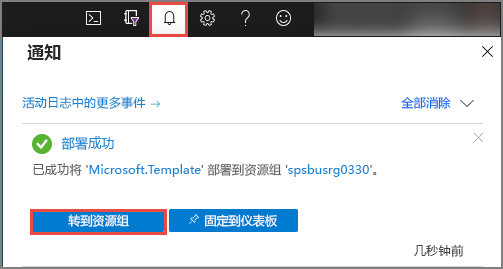
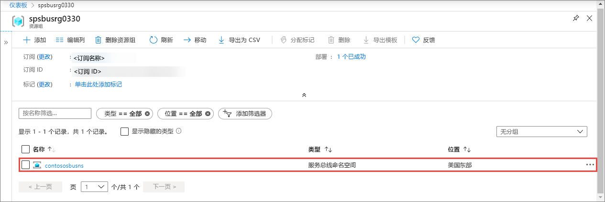
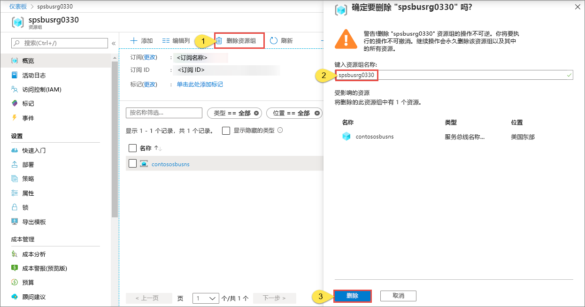

# 快速入门：使用 Azure 资源管理器模板创建服务总线命名空间和队列

本文介绍如何使用创建服务总线命名空间和命名空间中队列的 Azure 资源管理器模板。 本文介绍如何指定要部署的资源以及如何定义执行部署时指定的参数。 可将此模板用于自己的部署，或自定义此模板以满足要求。

[!INCLUDE [About Azure Resource Manager](../../includes/resource-manager-quickstart-introduction.md)]

如果还没有 Azure 订阅，可以在开始前[创建一个免费帐户](https://azure.microsoft.com/free/)。

## 先决条件

无

## 创建服务总线命名空间和队列

### 查看模板

本快速入门中使用的模板来自 [Azure 快速入门模板](https://azure.microsoft.com/resources/templates/201-servicebus-create-queue)。

:::code language="json" source="~/quickstart-templates/201-servicebus-create-queue/azuredeploy.json" range="1-75" highlight="31-63":::

该模板中定义的资源包括：

- [**Microsoft.ServiceBus/namespaces**](/azure/templates/microsoft.servicebus/namespaces)
- [**Microsoft.ServiceBus/namespaces/queues**](/azure/templates/microsoft.servicebus/namespaces/queues)

> [!NOTE]
> 以下 Azure 资源管理器模板可供下载和部署。
>
> * [创建包含队列和授权规则的服务总线命名空间](service-bus-resource-manager-namespace-auth-rule.md)
> * [创建包含主题和订阅的服务总线命名空间](service-bus-resource-manager-namespace-topic.md)
> * [创建服务总线命名空间](service-bus-resource-manager-namespace.md)
> * [创建包含主题、订阅和规则的服务总线命名空间](service-bus-resource-manager-namespace-topic-with-rule.md)

可以从 [Azure 快速入门模板](https://azure.microsoft.com/resources/templates/?resourceType=Microsoft.Servicebus&pageNumber=1&sort=Popular)中找到更多模板

### 部署模板

使用此模板，将部署包含队列的服务总线命名空间。

[服务总线队列](service-bus-queues-topics-subscriptions.md#queues)为一个或多个竞争使用方提供先入先出 (FIFO) 消息传送方式。

若要自动运行部署，请单击以下按钮：为部署创建新的资源组，以便稍后可以轻松进行清理。

## 验证部署

1. 选择顶部的“通知”，查看部署状态。  等待部署成功。 然后，在通知消息中选择“转到资源组”  ，导航到包含服务总线命名空间的资源组的页面。 

    
2. 确认在资源列表中看到了服务总线命名空间。 

    
3. 从列表中选择命名空间以查看“服务总线命名空间”页。  

## 清理资源

1. 在 Azure 门户中，导航到资源组的“资源组”页。 
2. 从工具栏选择**删除资源组**。 
3. 键入资源组的名称，然后选择“删除”  。 

    

## 后续步骤

请参阅以下主题，其中介绍了如何创建命名空间/队列的授权规则：

[使用 Azure 资源管理器模板为命名空间和队列创建服务总线授权规则](service-bus-resource-manager-namespace-auth-rule.md)

查看以下文章了解如何管理这些资源：

* [使用 PowerShell 管理服务总线](service-bus-manage-with-ps.md)
* [使用服务总线 Explorer 管理服务总线资源](https://github.com/paolosalvatori/ServiceBusExplorer/releases)

[Authoring Azure Resource Manager templates]: ../azure-resource-manager/templates/template-syntax.md
[Service Bus namespace and queue template]: https://github.com/Azure/azure-quickstart-templates/blob/master/201-servicebus-create-queue/
[Azure Quickstart Templates]: https://azure.microsoft.com/documentation/templates/?term=service+bus
[Learn more about Service Bus queues]: service-bus-queues-topics-subscriptions.md
[Using Azure PowerShell with Azure Resource Manager]: ../azure-resource-manager/powershell-azure-resource-manager.md
[Using the Azure CLI for Mac, Linux, and Windows with Azure Resource Management]: ../azure-resource-manager/xplat-cli-azure-resource-manager.md
