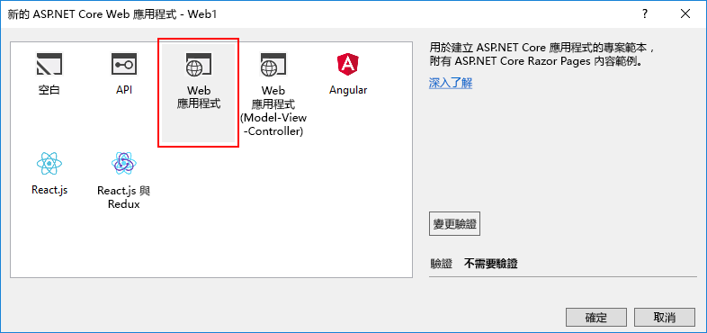
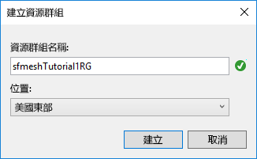

# <a name="quickstart-create-and-deploy-a-web-app-to-azure-service-fabric-mesh"></a>快速入门：创建 Web 应用并将其部署到 Azure Service Fabric 网格

Azure Service Fabric 网格是一个完全托管的服务，由此开发者可部署微服务应用程序，而无需管理虚拟机、存储或网络。

在本快速入门中，将创建一个由 ASP.NET Core Web 应用组成的新 Service Fabric 网格应用程序，并在本地开发集群上运行，然后将其发布以在 Azure 上运行。

将需要 Azure 订阅。 如果还没有，可轻松创建一个免费的 Azure 帐户，在开始前[创建免费帐户](https://azure.microsoft.com/free/)。 还需要[设置开发者环境](service-fabric-mesh-howto-setup-developer-environment-sdk.md)

[!INCLUDE [preview note](./includes/include-preview-note.md)]

## <a name="create-a-service-fabric-mesh-project"></a>创建 Service Fabric 网格项目

打开 Visual Studio，并选择“文件” > “新建” > “项目...”

在“新建项目”对话框顶部的“搜索”框中键入 `mesh`。 选择“Service Fabric 网格应用程序”模板  。 （如果未看到该模板，请确保已根据[设置开发环境](service-fabric-mesh-howto-setup-developer-environment-sdk.md)中所述安装了网格 SDK 和 VS Tools 预览版。） 

在“名称”框中键入 ServiceFabricMesh1，并在“位置”框中，将文件夹路径设置为要将项目文件存储到的位置    。

确保已选中“创建解决方案的目录”，然后单击“确定”创建 Service Fabric 网格项目。  


### <a name="create-a-service"></a>创建服务

单击“确定”后，会出现“新建 Service Fabric 服务”对话框   。 选择“ASP.NET Core”项目类型，确保“容器 OS”设置为“Windows”，然后单击“确定”以创建 ASP.NET Core 项目     。 


随后会出现“新建 ASP.NET Core Web 应用”对话框  。 选择“Web 应用”，然后单击“确定”   。



Visual Studio 创建 Service Fabric 网格应用程序项目和 ASP.NET Core 项目。

## <a name="build-and-publish-to-your-local-cluster"></a>生成并发布到本地群集

加载项目时，会自动生成一个 Docker 映像并将其发布到本地群集。 此过程可能需要一段时间才能完成。 如果需要，可在“输出”窗口下拉列表中选择“Service Fabric 工具”项，以便在“输出”窗口中监视 Service Fabric 工具的进度    。 你可以在部署 Docker 映像时继续工作。

创建项目后，单击 F5，在本地调试服务  。 完成本地部署并且 Visual Studio 运行项目后，浏览器窗口将打开示例网页。

浏览完已部署的服务后，在 Visual Studio 中按 Shift+F5 停止调试项目  。

## <a name="publish-to-azure"></a>发布到 Azure

若要将 Service Fabric 网格项目发布到 Azure，请在 Visual Studio 中右键单击“Service Fabric 网格项目”，然后选择“发布...”  


随后看到“发布 Service Fabric 应用程序”对话框  。


选择自己的 Azure 帐户和订阅。 选择“位置”  。 本文使用“美国东部”  。

在“资源组”下，选择“\<创建新资源组...>”。 此时会显示“创建资源组”对话框  。 设置“资源组名称”和“位置”   。  本快速入门使用“美国东部”位置并将组命名为“sfmeshTutorial1RG”（如果组织有多个人使用同一订阅，请选择唯一的资源组名称）   。  单击“创建”以创建资源组，并返回发布对话框  。



返回“发布 Service Fabric 应用程序”对话框，在“Azure 容器注册表”下选择“\<创建新容器注册表...>”。 在“创建容器注册表”对话框中，为“容器注册表名称”使用唯一的名称   。 指定“位置”（本教程使用“美国东部”）   。 在下拉列表中选择在上一步骤创建的“资源组”，例如 sfmeshTutorial1RG   。 将“SKU”设置为“基本”，然后单击“创建”返回发布对话框    。


在发布对话框中，单击“发布”按钮将 Service Fabric 网格应用程序部署到 Azure  。

首次发布到 Azure 时，会将 Docker 映像推送到 Azure 容器注册表 (ACR)，此过程需要一段时间，具体时间取决于映像的大小。 后续发布同一项目会更快。 可通过在 Visual Studio 的“输出”窗口下来列表中选择“Service Fabric 工具”来监视部署的进度   。 完成部署后，“Service Fabric 工具”输出将以 URL 的形式显示应用程序的 IP 地址和端口  。

```
Packaging Application...
Building Images...
Web1 -> C:\Code\ServiceFabricMesh1\Web1\bin\Any CPU\Release\netcoreapp2.0\Web1.dll
Uploading the images to Azure Container Registry...
Deploying application to remote endpoint...
The application was deployed successfully and it can be accessed at http://...
```

打开 Web 浏览器并导航到该 URL，以查看 Azure 中运行的网站：


## <a name="clean-up-resources"></a>清理资源

如果不再需要，请删除为该快速入门创建的所有资源。 由于已创建一个新资源组来托管 ACR 和 Service Fabric 网格服务资源，因此可安全删除此资源组，这是删除所有与此关联的资源的简单方法。

```azurecli
az group delete --resource-group sfmeshTutorial1RG
```

```powershell
Connect-AzureRmAccount
Remove-AzureRmResourceGroup -Name sfmeshTutorial1RG
```

或者，可[从 Azure 门户](https://portal.azure.com)删除资源组。

## <a name="next-steps"></a>后续步骤

若要了解有关创建和部署 Service Fabric 网格应用程序的详细信息，请继续学习教程。
> [!div class="nextstepaction"]
> [创建、调试多服务 Web 应用并将其部署到 Service Fabric 网格](service-fabric-mesh-tutorial-create-dotnetcore.md)
