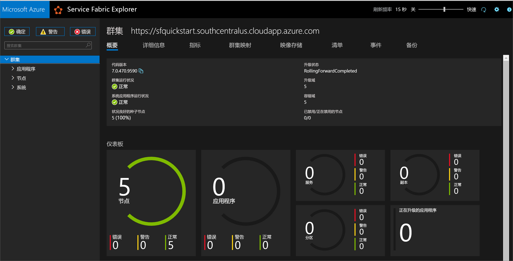
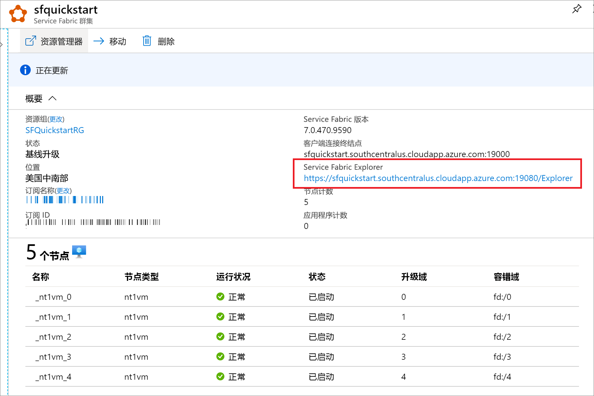

# <a name="quickstart-create-a-service-fabric-cluster-using-resource-manager-template"></a>快速入门：使用资源管理器模板创建 Service Fabric 群集

Azure Service Fabric 是一款分布式系统平台，可方便用户轻松打包、部署和管理可缩放的可靠微服务和容器。 Service Fabric 群集  是一组联网的虚拟机，可在其中部署和管理微服务。

[!INCLUDE [About Azure Resource Manager](../../includes/resource-manager-quickstart-introduction.md)]

本文介绍如何使用资源管理器在 Azure 中部署 Service Fabric 测试群集。 此五节点 Windows 群集由一个自签名证书提供保护，因此仅适用于教学（不能用于生产工作负载）。

我们将使用 Azure PowerShell 来部署模板。 除了 Azure PowerShell，还可以使用 Azure 门户、Azure CLI 和 REST API。 若要了解其他部署方法，请参阅[部署模板](../azure-resource-manager/templates/deploy-portal.md)。

如果没有 Azure 订阅，请在开始之前创建一个[免费](https://azure.microsoft.com/free/)帐户。

## <a name="prerequisites"></a>先决条件

### <a name="install-service-fabric-sdk-and-powershell-modules"></a>安装 Service Fabric SDK 和 PowerShell 模块

若要完成本快速入门，需执行以下操作：

* 安装 [Service Fabric SDK 和 PowerShell 模块](service-fabric-get-started.md)。

* 安装 [Azure PowerShell](https://docs.microsoft.com/powershell/azure/install-Az-ps)。

### <a name="download-the-sample-template-and-certificate-helper-script"></a>下载示例模板和证书帮助程序脚本

克隆或下载 [Azure 资源管理器快速入门模板](https://github.com/Azure/azure-quickstart-templates)存储库。 或者，在本地从 service-fabric-secure-cluster-5-node-1-nodetype  文件夹复制要使用的以下文件：

* [New-ServiceFabricClusterCertificate.ps1](https://raw.githubusercontent.com/Azure/azure-quickstart-templates/master/service-fabric-secure-cluster-5-node-1-nodetype/New-ServiceFabricClusterCertificate.ps1)
* [azuredeploy.json](https://raw.githubusercontent.com/Azure/azure-quickstart-templates/master/service-fabric-secure-cluster-5-node-1-nodetype/azuredeploy.json)
* [azuredeploy.parameters.json](https://raw.githubusercontent.com/Azure/azure-quickstart-templates/master/service-fabric-secure-cluster-5-node-1-nodetype/azuredeploy.parameters.json)

### <a name="sign-in-to-azure"></a>登录 Azure

登录到 Azure，指定要用于创建 Service Fabric 群集的订阅。

```powershell
# Sign in to your Azure account
Login-AzAccount -SubscriptionId "<subscription ID>"
```

### <a name="create-a-self-signed-certificate-stored-in-key-vault"></a>创建一个存储在 Key Vault 中的自签名证书

Service Fabric 使用 X.509 证书来[保护群集](./service-fabric-cluster-security.md)并提供应用程序安全功能，它使用 [Key Vault](../key-vault/general/overview.md) 来管理那些证书。 若要成功创建群集，需要使用群集证书来实现节点到节点通信。 为了创建此快速入门测试群集，我们将创建一个用于群集身份验证的自签名证书。 生产工作负载需要多个使用正确配置的 Windows Server 证书服务创建的证书，或由已批准的证书颁发机构 (CA) 提供的证书。

```powershell
# Designate unique (within cloudapp.azure.com) names for your resources
$resourceGroupName = "SFQuickstartRG"
$keyVaultName = "SFQuickstartKV"

# Create a new resource group for your Key Vault and Service Fabric cluster
New-AzResourceGroup -Name $resourceGroupName -Location SouthCentralUS

# Create a Key Vault enabled for deployment
New-AzKeyVault -VaultName $KeyVaultName -ResourceGroupName $resourceGroupName -Location SouthCentralUS -EnabledForDeployment

# Generate a certificate and upload it to Key Vault
.\New-ServiceFabricClusterCertificate.ps1
```

此脚本会提示你输入以下内容（请务必修改下面的示例值中的 CertDNSName  和 KeyVaultName  ）：

* **密码：** Password!1
* **CertDNSName：**  sfquickstart.southcentralus.cloudapp.azure.com
* **KeyVaultName：** *SFQuickstartKV*
* **KeyVaultSecretName：** clustercert

完成后，该脚本会提供模板部署所需的参数值。 请确保将它们存储在以下变量中，因为部署群集模板需要它们：

```powershell
$sourceVaultId = "<Source Vault Resource Id>"
$certUrlValue = "<Certificate URL>"
$certThumbprint = "<Certificate Thumbprint>"
```

## <a name="create-a-service-fabric-cluster"></a>创建 Service Fabric 群集

### <a name="review-the-template"></a>查看模板

本快速入门中使用的模板来自 [Azure 快速入门模板](https://github.com/Azure/azure-quickstart-templates/blob/master/service-fabric-secure-cluster-5-node-1-nodetype)。 本文的模板太长，无法在此处显示。 若要查看该模板，请参阅 https://github.com/Azure/azure-quickstart-templates/blob/master/service-fabric-secure-cluster-5-node-1-nodetype/azuredeploy.json 。

该模板中已定义了多个 Azure 资源：

* [Microsoft.Storage/storageAccounts](/azure/templates/microsoft.storage/storageaccounts)
* [Microsoft.Network/virtualNetworks](/azure/templates/microsoft.network/virtualnetworks)
* [Microsoft.Network/publicIPAddresses](/azure/templates/microsoft.network/publicipaddresses)
* [Microsoft.Network/loadBalancers](/azure/templates/microsoft.network/loadbalancers)
* [Microsoft.Compute/virtualMachineScaleSets](/azure/templates/microsoft.compute/virtualmachinescalesets)
* [Microsoft.ServiceFabric/clusters](/azure/templates/microsoft.servicefabric/clusters)

若要查找与 Azure Service Fabric 相关的更多模板，请参阅 [Azure 快速入门模板](https://azure.microsoft.com/resources/templates/?sort=Popular&term=service+fabric)。

### <a name="customize-the-parameters-file"></a>自定义参数文件

打开 azuredeploy.parameters.json  并编辑参数值，以实现以下目的：

* clusterName  与你在创建群集证书时为 CertDNSName  提供的值匹配
* adminUserName  是不同于默认的 GEN-UNIQUE  令牌的某个值
* adminPassword  是不同于默认的 GEN-PASSWORD  令牌的某个值
* certificateThumbprint  、sourceVaultResourceId  和 certificateUrlValue  都是空字符串 (`""`)

例如：

```json
{
  "$schema": "https://schema.management.azure.com/schemas/2019-04-01/deploymentParameters.json#",
  "contentVersion": "1.0.0.0",
  "parameters": {
    "clusterName": {
      "value": "sfquickstart"
    },
    "adminUsername": {
      "value": "testadm"
    },
    "adminPassword": {
      "value": "Password#1234"
    },
    "certificateThumbprint": {
      "value": ""
    },
    "sourceVaultResourceId": {
      "value": ""
    },
    "certificateUrlValue": {
      "value": ""
    }
  }
}
```

## <a name="deploy-the-template"></a>部署模板

将资源管理器模板和参数文件的路径存储在变量中，然后部署模板。

```powershell
$templateFilePath = "<full path to azuredeploy.json>"
$parameterFilePath = "<full path to azuredeploy.parameters.json>"

New-AzResourceGroupDeployment `
    -ResourceGroupName $resourceGroupName `
    -TemplateFile $templateFilePath `
    -TemplateParameterFile $parameterFilePath `
    -CertificateThumbprint $certThumbprint `
    -CertificateUrlValue $certUrlValue `
    -SourceVaultResourceId $sourceVaultId `
    -Verbose
```

## <a name="review-deployed-resources"></a>查看已部署的资源

部署完成后，在输出中找到 `managementEndpoint` 值，然后在 Web 浏览器中打开该地址，以便在 [Service Fabric Explorer](./service-fabric-visualizing-your-cluster.md) 中查看群集。



在 Azure 门户中，还可以通过 Service Fabric 资源边栏选项卡找到 Service Fabric Explorer 终结点。



## <a name="clean-up-resources"></a>清理资源

如果不再需要资源组，可以将其删除，这将删除资源组中的资源。

```powershell
$resourceGroupName = Read-Host -Prompt "Enter the Resource Group name"
Remove-AzResourceGroup -Name $resourceGroupName
Write-Host "Press [ENTER] to continue..."
```

## <a name="next-steps"></a>后续步骤

若要了解如何创建自定义 Azure Service Fabric 群集模板，请参阅：

> [!div class="nextstepaction"]
> [创建 Service Fabric 群集资源管理器模板](service-fabric-cluster-creation-create-template.md)
