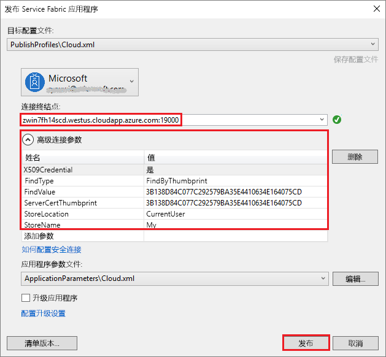

# <a name="quickstart-deploy-windows-containers-to-service-fabric"></a>快速入门：将 Windows 容器部署到 Service Fabric

Azure Service Fabric 是一款分布式系统平台，可用于部署和管理可缩放的可靠微服务和容器。

在 Service Fabric 群集上运行 Windows 容器中的现有应用程序不需要对应用程序进行任何更改。 本快速入门介绍如何在 Service Fabric 应用程序中部署预建的 Docker 容器映像。 完成后，你会有一个正在运行的 Windows Server Core 2016 Server 和 IIS 容器。 本快速入门介绍如何部署 Windows 容器。 阅读[此快速入门](service-fabric-quickstart-containers-linux.md)以部署 Linux 容器。

![IIS 默认网页][iis-default]

此快速入门介绍如何：

* 打包 Docker 映像容器
* 配置通信
* 生成并打包 Service Fabric 应用程序
* 将容器应用程序部署到 Azure


[!INCLUDE [updated-for-az](../../includes/updated-for-az.md)]

## <a name="prerequisites"></a>必备条件

* 一个 Azure 订阅（可以创建[免费帐户](https://azure.microsoft.com/free/?WT.mc_id=A261C142F)）。
* 一台运行以下软件的开发计算机：
  * Visual Studio 2019 或 Windows 2019。
  * [Service Fabric SDK 和工具](service-fabric-get-started.md)。

## <a name="package-a-docker-image-container-with-visual-studio"></a>使用 Visual Studio 打包 Docker 映像容器

Service Fabric SDK 和工具提供服务模板，用于将容器部署到 Service Fabric 群集。

以“管理员”身份启动 Visual Studio。  选择“文件” > “新建” > “项目”。

选择“Service Fabric 应用程序”，将其命名为“MyFirstContainer”，并单击“创建”   。

从“托管的容器和应用程序”模板中选择“容器”。  

在“映像名称”中  输入“mcr.microsoft.com/windows/servercore/iis:windowsservercore-ltsc2016”（[Windows Server Core Server 和 IIS 基础映像](https://hub.docker.com/_/microsoft-windows-servercore-iis)）。

配置容器的“端口到主机”端口映射，使端口 80 上针对服务的传入请求映射到容器上的端口 80。  将“容器端口”设置为“80”并将“主机端口”设置为“80”   。  

将服务命名为“MyContainerService”，然后单击“确定”。 

![新服务对话框][new-service]

## <a name="specify-the-os-build-for-your-container-image"></a>为容器映像指定 OS 版本

使用特定 Windows Server 版本生成的容器可能无法在运行不同 Windows Server 版本的主机上运行。 例如，使用 Windows Server 版本 1709 生成的容器不会在运行 Windows Server 2016 的主机上运行。 若要了解更多信息，请参阅 [Windows Server 容器 OS 与主机 OS 的兼容性](service-fabric-get-started-containers.md#windows-server-container-os-and-host-os-compatibility)。 

使用 Service Fabric 运行时版本 6.1 及更新版本，可以为每个容器指定多个 OS 映像，并使用它应该部署到的 OS 的内部版本来标记每个 OS 映像。 这有助于确保应用程序能够在运行不同版本 Windows 操作系统的主机上运行。 若要了解详细信息，请参阅[指定特定于 OS 内部版本的容器映像](service-fabric-get-started-containers.md#specify-os-build-specific-container-images)。 

Microsoft 为不同版本的 Windows Server 上生成的 IIS 版本发布不同的映像。 若要确保 Service Fabric 部署的容器与在部署应用程序的群集节点上运行的 Windows Server 版本兼容，请将以下行添加到 *ApplicationManifest.xml* 文件。 Windows Server 2016 的内部版本为 14393，Windows Server 版本 1709 的内部版本为 16299。

```xml
    <ContainerHostPolicies CodePackageRef="Code"> 
      <ImageOverrides> 
        ...
          <Image Name="mcr.microsoft.com/windows/servercore/iis:windowsservercore-1803" /> 
          <Image Name= "mcr.microsoft.com/windows/servercore/iis:windowsservercore-ltsc2016" Os="14393" /> 
          <Image Name="mcr.microsoft.com/windows/servercore/iis:windowsservercore-1709" Os="16299" /> 
      </ImageOverrides> 
    </ContainerHostPolicies> 
```

服务清单继续为 nanoserver (`mcr.microsoft.com/windows/servercore/iis:windowsservercore-ltsc2016`) 只指定一个映像。

另外，请在 *ApplicationManifest.xml* 文件中，将 **PasswordEncrypted** 更改为 **false**。 对于位于 Docker 中心的公共容器映像，帐户和密码是空的，因此，我们禁用了加密，因为加密空密码会导致生成错误。

```xml
<RepositoryCredentials AccountName="" Password="" PasswordEncrypted="false" />
```

## <a name="create-a-cluster"></a>创建群集

以下示例脚本创建一个由五个节点组成的 Service Fabric 群集（使用 X.509 证书保护的群集）。 该命令将创建一个自签名证书，并将其上传到新的 Key Vault。 该证书也会复制到本地目录。 可在[创建 Service Fabric 群集](scripts/service-fabric-powershell-create-secure-cluster-cert.md)中详细了解如何使用此脚本创建群集。

必要时，请使用 [Azure PowerShell 指南](/powershell/azure/overview)中的说明安装 Azure PowerShell。

在运行以下脚本之前，请在 PowerShell 中运行 `Connect-AzAccount` 来与 Azure 建立连接。

将以下脚本复制到剪贴板，并打开 **Windows PowerShell ISE**。  将内容粘贴到空的 Untitled1.ps1 窗口。 然后，为脚本中的变量提供值：`subscriptionId`、`certpwd`、`certfolder`、`adminuser`、`adminpwd` 等等。  运行该脚本之前，为 `certfolder` 指定的目录必须存在。

[!code-powershell[main](../../powershell_scripts/service-fabric/create-secure-cluster/create-secure-cluster.ps1 "Create a Service Fabric cluster")]

为变量提供值后，按 **F5** 运行该脚本。

运行脚本并创建群集后，在输出中查找 `ClusterEndpoint`。 例如：

```powershell
...
ClusterEndpoint : https://southcentralus.servicefabric.azure.com/runtime/clusters/b76e757d-0b97-4037-a184-9046a7c818c0
```

### <a name="install-the-certificate-for-the-cluster"></a>安装群集的证书

现在，我们将在 *CurrentUser\My* 证书存储中安装 PFX。 PFX 文件位于在上述 PowerShell 脚本中使用 `certfolder` 环境变量指定的目录中。

请切换到该目录并运行以下 PowerShell 命令（请替换为 `certfolder` 目录中 PFX 文件的名称，以及在 `certpwd` 变量中指定的密码）。 在此示例中，当前目录设置为 PowerShell 脚本中 `certfolder` 变量指定的目录。 从该位置运行 `Import-PfxCertificate` 命令：

```powershell
PS C:\mycertificates> Import-PfxCertificate -FilePath .\mysfclustergroup20190130193456.pfx -CertStoreLocation Cert:\CurrentUser\My -Password (ConvertTo-SecureString Password#1234 -AsPlainText -Force)
```

该命令返回指纹：

```powershell
  ...
  PSParentPath: Microsoft.PowerShell.Security\Certificate::CurrentUser\My

Thumbprint                                Subject
----------                                -------
0AC30A2FA770BEF566226CFCF75A6515D73FC686  CN=mysfcluster.SouthCentralUS.cloudapp.azure.com
```

请记下指纹，以便在后续步骤中使用。

## <a name="deploy-the-application-to-azure-using-visual-studio"></a>使用 Visual Studio 将应用程序部署到 Azure

至此，应用程序已准备就绪，可以直接通过 Visual Studio 将它部署到群集了。

在解决方案资源管理器中右键单击“MyFirstContainer”，选择“发布”。   此时，“发布”对话框显示。

运行上述 `Import-PfxCertificate` 命令时，请复制 PowerShell 窗口中 **CN =** 后面的内容，并将端口 `19000` 添加到其中。 例如，`mysfcluster.SouthCentralUS.cloudapp.azure.com:19000` 。 复制到“连接终结点”  字段。 请记下此值，因为在后面的步骤中需要用到。

单击“高级连接参数”，验证连接参数信息。   *FindValue* 和 *ServerCertThumbprint* 值必须与在前一步骤中运行 `Import-PfxCertificate` 时安装的证书的指纹匹配。



单击“发布”  。

群集中的每个应用程序都必须具有唯一名称。 如果存在名称冲突，请重命名 Visual Studio 项目并重新部署。

打开浏览器，并导航到在前一步骤中输入“连接终结点”字段的地址  。 可以选择性地在 URL 的前面添加方案标识符 `http://`，并在后面追加端口 `:80`。 例如，http:\//mysfcluster.SouthCentralUS.cloudapp.azure.com:80。

 此时会看到 IIS 默认网页：![IIS 默认网页][iis-default]

## <a name="clean-up"></a>清除

只要群集处于运行状态，就会产生费用。 请考虑[删除群集](service-fabric-cluster-delete.md)。

## <a name="next-steps"></a>后续步骤

在此快速入门中，读者学习了如何：

* 打包 Docker 映像容器
* 配置通信
* 生成并打包 Service Fabric 应用程序
* 将容器应用程序部署到 Azure

若要详细了解如何在 Service Fabric 中使用 Windows 容器，请继续学习适用于 Windows 容器应用的教程。

> [!div class="nextstepaction"]
> [创建 Windows 容器应用](./service-fabric-host-app-in-a-container.md)

[iis-default]: ./media/service-fabric-quickstart-containers/iis-default.png
[publish-dialog]: ./media/service-fabric-quickstart-containers/publish-dialog.png
[new-service]: ./media/service-fabric-quickstart-containers/NewService.png
