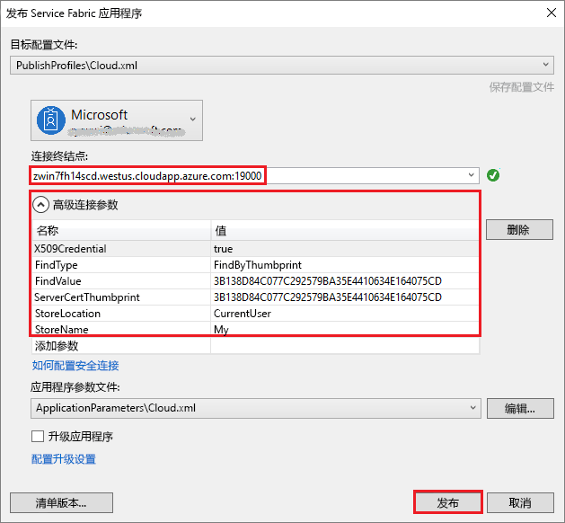

# <a name="deploy-a-service-fabric-windows-container-application-on-azure"></a>在 Azure 上部署 Service Fabric Windows 容器应用程序
Azure Service Fabric 是一款分布式系统平台，可用于部署和管理可缩放的可靠微服务和容器。 

在 Service Fabric 群集上运行 Windows 容器中的现有应用程序不需要对应用程序进行任何更改。 本快速入门介绍如何在 Service Fabric 应用程序中部署预建的 Docker 容器映像。 完成后，你会有一个正在运行的 Windows Server 2016 Nano Server 和 IIS 容器。 本快速入门介绍如何部署 Windows 容器。若要部署 Linux 容器，请阅读[此快速入门](service-fabric-quickstart-containers-linux.md)。

![IIS 默认网页][iis-default]

可以通过此快速入门了解如何：
> [!div class="checklist"]
> * 打包 Docker 映像容器
> * 配置通信
> * 生成并打包 Service Fabric 应用程序
> * 将容器应用程序部署到 Azure

## <a name="prerequisites"></a>先决条件
* 一个 Azure 订阅（可以创建[免费帐户](https://azure.microsoft.com/free/?WT.mc_id=A261C142F)）。
* 一台运行以下软件的开发计算机：
  * Visual Studio 2015 或 Visual Studio 2017。
  * [Service Fabric SDK 和工具](service-fabric-get-started.md)。

## <a name="package-a-docker-image-container-with-visual-studio"></a>使用 Visual Studio 打包 Docker 映像容器
Service Fabric SDK 和工具提供服务模板，用于将容器部署到 Service Fabric 群集。

以“管理员”身份启动 Visual Studio。  选择“文件” > “新建” > “项目”。

选择“Service Fabric 应用程序”，将其命名为“MyFirstContainer”，并单击“确定”。

从“服务模板”列表中选择“容器”。

在“映像名称”中输入“microsoft/iis:nanoserver”，即 [Windows Server Nano Server 和 IIS 基映像](https://hub.docker.com/r/microsoft/iis/)。 

将服务命名为“MyContainerService”，然后单击“确定”。

## <a name="configure-communication-and-container-port-to-host-port-mapping"></a>配置通信和容器端口到主机端口映射
此服务需要使用终结点进行通信。  现在，可以将协议、端口和类型添加到 ServiceManifest.xml 文件中的 `Endpoint`。 就本快速入门来说，容器化服务会在端口 80 上进行侦听： 

```xml
<Endpoint Name="MyContainerServiceTypeEndpoint" UriScheme="http" Port="80" Protocol="http"/>
```
提供 `UriScheme` 即可向 Service Fabric 命名服务自动注册容器终结点，确保其可以被发现。 本文末尾提供完整的 ServiceManifest.xml 示例文件。 

在 ApplicationManifest.xml 文件的 `ContainerHostPolicies` 中指定 `PortBinding` 策略，以便配置容器端口到主机端口的映射。  就本快速入门来说，`ContainerPort` 为 80，`EndpointRef` 为“MyContainerServiceTypeEndpoint”（在服务清单中定义的终结点）。  传入到端口 80 上的服务的请求映射到容器上的端口 80。  

```xml
<ServiceManifestImport>
...
  <ConfigOverrides />
  <Policies>
    <ContainerHostPolicies CodePackageRef="Code">
      <PortBinding ContainerPort="80" EndpointRef="MyContainerServiceTypeEndpoint"/>
    </ContainerHostPolicies>
  </Policies>
</ServiceManifestImport>
```

本文末尾提供完整的 ApplicationManifest.xml 示例文件。

## <a name="create-a-cluster"></a>创建群集
若要将应用程序部署到 Azure 群集，可以创建自己的群集，也可以使用合作群集。

合作群集是在 Azure 上托管的、由 Service Fabric 团队运行的免费限时 Service Fabric 群集，任何人都可以在其中部署应用程序及了解平台的情况。 若要使用合作群集，请[按照说明操作](http://aka.ms/tryservicefabric)。  

若要了解如何创建自己的群集，请参阅[在 Azure 上创建 Service Fabric 群集](service-fabric-tutorial-create-vnet-and-windows-cluster.md)。

请记下连接终结点，下面的步骤会使用该终结点。  

## <a name="deploy-the-application-to-azure-using-visual-studio"></a>使用 Visual Studio 将应用程序部署到 Azure
至此，应用程序已准备就绪，可以直接通过 Visual Studio 将它部署到群集了。

在解决方案资源管理器中右键单击“MyFirstContainer”，选择“发布”。 此时，“发布”对话框显示。



在“连接终结点”字段中，键入群集的连接终结点。 注册合作群集时，浏览器中会提供连接终结点，例如 `winh1x87d1d.westus.cloudapp.azure.com:19000`。  单击“发布”，应用程序进行部署。

打开浏览器并导航到 http://winh1x87d1d.westus.cloudapp.azure.com:80 。 此时会看到 IIS 默认网页：![IIS 默认网页][iis-default]

## <a name="complete-example-service-fabric-application-and-service-manifests"></a>Service Fabric 应用程序和服务清单的完整示例
以下是用在本快速入门中的完整服务和应用程序清单。

### <a name="servicemanifestxml"></a>ServiceManifest.xml
```xml
<?xml version="1.0" encoding="utf-8"?>
<ServiceManifest Name="MyContainerServicePkg"
                 Version="1.0.0"
                 xmlns="http://schemas.microsoft.com/2011/01/fabric"
                 xmlns:xsd="http://www.w3.org/2001/XMLSchema"
                 xmlns:xsi="http://www.w3.org/2001/XMLSchema-instance">
  <ServiceTypes>
    <!-- This is the name of your ServiceType.
         The UseImplicitHost attribute indicates this is a guest service. -->
    <StatelessServiceType ServiceTypeName="MyContainerServiceType" UseImplicitHost="true" />
  </ServiceTypes>

  <!-- Code package is your service executable. -->
  <CodePackage Name="Code" Version="1.0.0">
    <EntryPoint>
      <!-- Follow this link for more information about deploying Windows containers to Service Fabric: https://aka.ms/sfguestcontainers -->
      <ContainerHost>
        <ImageName>microsoft/iis:nanoserver</ImageName>
      </ContainerHost>
    </EntryPoint>
    <!-- Pass environment variables to your container: -->
    <!--
    <EnvironmentVariables>
      <EnvironmentVariable Name="VariableName" Value="VariableValue"/>
    </EnvironmentVariables>
    -->
  </CodePackage>

  <!-- Config package is the contents of the Config directoy under PackageRoot that contains an 
       independently-updateable and versioned set of custom configuration settings for your service. -->
  <ConfigPackage Name="Config" Version="1.0.0" />

  <Resources>
    <Endpoints>
      <!-- This endpoint is used by the communication listener to obtain the port on which to 
           listen. Please note that if your service is partitioned, this port is shared with 
           replicas of different partitions that are placed in your code. -->
      <Endpoint Name="MyContainerServiceTypeEndpoint" UriScheme="http" Port="80" Protocol="http"/>
    </Endpoints>
  </Resources>
</ServiceManifest>
```
### <a name="applicationmanifestxml"></a>ApplicationManifest.xml
```xml
<?xml version="1.0" encoding="utf-8"?>
<ApplicationManifest ApplicationTypeName="MyFirstContainerType"
                     ApplicationTypeVersion="1.0.0"
                     xmlns="http://schemas.microsoft.com/2011/01/fabric"
                     xmlns:xsd="http://www.w3.org/2001/XMLSchema"
                     xmlns:xsi="http://www.w3.org/2001/XMLSchema-instance">
  <Parameters>
    <Parameter Name="MyContainerService_InstanceCount" DefaultValue="-1" />
  </Parameters>
  <!-- Import the ServiceManifest from the ServicePackage. The ServiceManifestName and ServiceManifestVersion 
       should match the Name and Version attributes of the ServiceManifest element defined in the 
       ServiceManifest.xml file. -->
  <ServiceManifestImport>
    <ServiceManifestRef ServiceManifestName="MyContainerServicePkg" ServiceManifestVersion="1.0.0" />
    <ConfigOverrides />
    <Policies>
      <ContainerHostPolicies CodePackageRef="Code">
        <PortBinding ContainerPort="80" EndpointRef="MyContainerServiceTypeEndpoint"/>
      </ContainerHostPolicies>
    </Policies>
  </ServiceManifestImport>
  <DefaultServices>
    <!-- The section below creates instances of service types, when an instance of this 
         application type is created. You can also create one or more instances of service type using the 
         ServiceFabric PowerShell module.
         
         The attribute ServiceTypeName below must match the name defined in the imported ServiceManifest.xml file. -->
    <Service Name="MyContainerService" ServicePackageActivationMode="ExclusiveProcess">
      <StatelessService ServiceTypeName="MyContainerServiceType" InstanceCount="[MyContainerService_InstanceCount]">
        <SingletonPartition />
      </StatelessService>
    </Service>
  </DefaultServices>
</ApplicationManifest>
```

## <a name="next-steps"></a>后续步骤
在此快速入门中，读者学习了如何：
> [!div class="checklist"]
> * 打包 Docker 映像容器
> * 配置通信
> * 生成并打包 Service Fabric 应用程序
> * 将容器应用程序部署到 Azure

* 详细了解如何运行 [Service Fabric 上的容器](service-fabric-containers-overview.md)。
* 阅读[在容器中部署 .NET 应用程序](service-fabric-host-app-in-a-container.md)教程。
* 了解 Service Fabric [应用程序生命周期](service-fabric-application-lifecycle.md)。
* 查看 GitHub 上的 [Service Fabric 容器代码示例](https://github.com/Azure-Samples/service-fabric-containers)。

[iis-default]: ./media/service-fabric-quickstart-containers/iis-default.png
[publish-dialog]: ./media/service-fabric-quickstart-containers/publish-dialog.png
