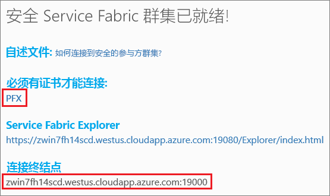
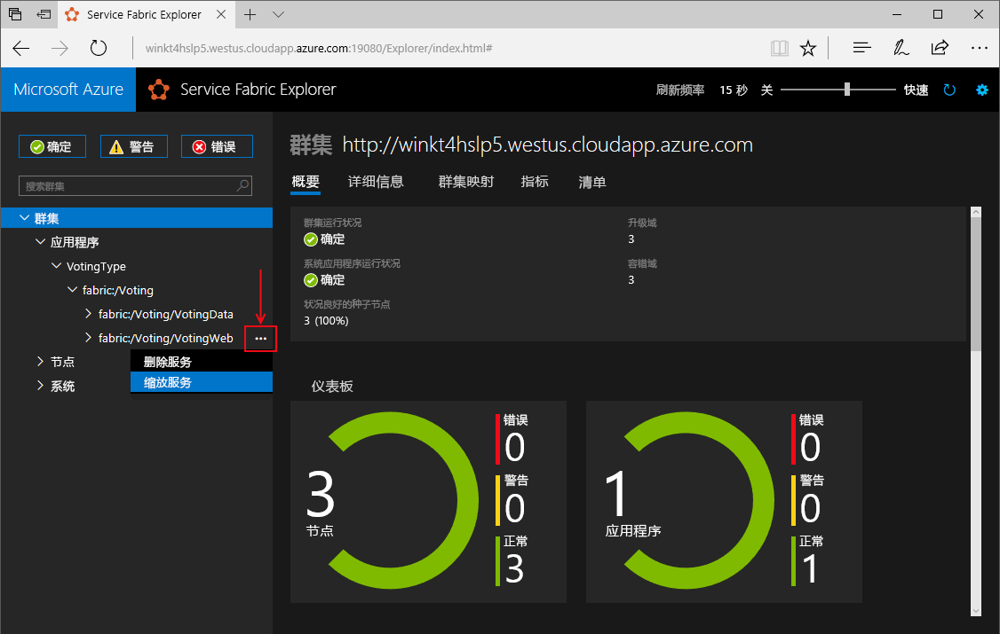
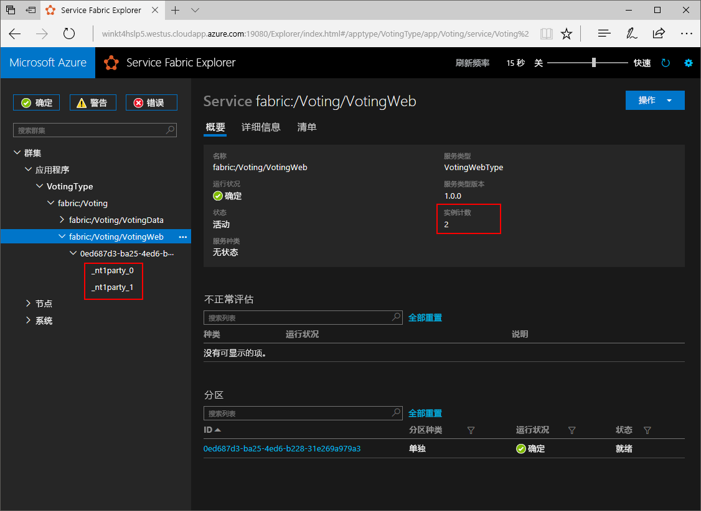

# <a name="create-a-net-service-fabric-application-in-azure"></a>在 Azure 中创建 .NET Service Fabric 应用程序
Azure Service Fabric 是一款分布式系统平台，可用于部署和管理可缩放的可靠微服务和容器。 

此快速入门展示了如何将首个 .NET 应用程序部署到 Service Fabric。 完成后，将生成一个投票应用程序，其中包含 ASP.NET Core Web 前端，用于将投票结果保存到群集的有状态后端服务中。


通过此应用程序，将了解如何：
> [!div class="checklist"]
> * 使用 .NET 和 Service Fabric 创建应用程序
> * 将 ASP.NET Core 用作 Web 前端
> * 将应用程序数据存储到有状态服务中
> * 在本地调试应用程序
> * 将应用程序部署到 Azure 中的群集
> * 跨多个节点横向扩展应用程序
> * 执行应用程序滚动升级

## <a name="prerequisites"></a>先决条件
完成本快速入门教程：
1. [安装 Visual Studio 2017](https://www.visualstudio.com/)，其中包含 Azure 开发以及 ASP.NET 和 Web 开发工作负载。
2. [安装 Git](https://git-scm.com/)
3. [安装 Microsoft Azure Service Fabric SDK](http://www.microsoft.com/web/handlers/webpi.ashx?command=getinstallerredirect&appid=MicrosoftAzure-ServiceFabric-CoreSDK)
4. 运行以下命令，将 Visual Studio 启用为把应用程序部署到本地 Service Fabric 群集：
    ```powershell
    Set-ExecutionPolicy -ExecutionPolicy Unrestricted -Force -Scope CurrentUser
    ```

>[!NOTE]
> 本快速入门中示例应用程序使用的功能在 Windows 7 中不提供。
>

## <a name="download-the-sample"></a>下载示例
在命令窗口中，运行以下命令，将示例应用程序存储库克隆到本地计算机。
```
git clone https://github.com/Azure-Samples/service-fabric-dotnet-quickstart
```

## <a name="run-the-application-locally"></a>在本地运行应用程序
右键单击“开始”菜单中的 Visual Studio 图标，再选择“以管理员身份运行”。 若要将调试程序附加到服务，需要以管理员身份运行 Visual Studio。

从克隆的存储库中打开 Voting.sln Visual Studio 解决方案。  

默认情况下，Voting 应用程序被设置为在端口 8080 上侦听。  应用程序端口在 */VotingWeb/PackageRoot/ServiceManifest.xml* 文件中进行设置。  可以通过更新**终结点**元素的 **Port** 属性来更改应用程序端口。  若要在本地部署和运行应用程序，应用程序端口必须为打开状态且在你的计算机上可用。  如果更改应用程序端口，在整篇文章中为“8080”替换新的应用程序端口值。

若要部署应用程序，请按 F5。

> [!NOTE]
> 首次运行和部署应用程序时，Visual Studio 会创建用于调试的本地群集。 此操作可能需要一段时间才能生效。 群集创建状态显示在 Visual Studio 输出窗口中。  在输出中，将看到消息“应用程序 URL 不是集或 HTTP/HTTPS URL，因此将不会对应用程序打开浏览器。”  此消息不指示错误，但该浏览器将不会自动启动。

部署完成后，启动浏览器并打开网页 `http://localhost:8080`（应用程序的 Web 前端）。


现在可以添加一组投票选项，并开始进行投票。 此应用程序可以运行，并将所有数据存储到 Service Fabric 群集中，而无需单独提供数据库。

## <a name="walk-through-the-voting-sample-application"></a>大致了解投票示例应用程序
投票应用程序由以下两个服务组成：
- Web 前端服务 (VotingWeb) - ASP.NET Core Web 前端服务，可提供网页服务，并公开用于与后端服务进行通信的 Web API。
- 后端服务 (VotingData) - ASP.NET Core Web 服务，可公开用于将投票结果存储到磁盘上保留的可靠字典中的 API。


在应用程序中投票时，将会发生以下事件：
1. JavaScript 将投票请求作为 HTTP PUT 请求发送给 Web 前端服务中的 Web API。

2. Web 前端服务使用代理定位并将 HTTP PUT 请求转发给后端服务。

3. 后端服务接收传入请求，并将更新后的结果存储在可靠字典中（结果复制到群集内的多个节点，并保留在磁盘上）。 应用程序的所有数据都存储在群集中，因此无需使用数据库。

## <a name="debug-in-visual-studio"></a>在 Visual Studio 中进行调试
在 Visual Studio 中调试应用程序时，使用的是本地 Service Fabric 开发群集。 可以根据需要针对自己的方案调整调试体验。 在此应用程序中，数据将使用可靠的字典存储到后端服务中。 停止调试程序时，Visual Studio 会默认删除应用程序。 删除应用程序后，后端服务中的数据也会随之一起删除。 若要跨调试会话保留数据，可以将“应用程序调试模式”作为 Visual Studio 中“投票”项目的属性进行更改。

若要查看代码，请完成以下步骤：
1. 打开 /VotingWeb/Controllers/VotesController.cs 文件，并在 Web API 的 Put 方法（第 47 行）中设置一个断点。你可以在 Visual Studio 的解决方案资源管理器中搜索此文件。

2. 打开 **/VotingData/Controllers/VoteDataController.cs** 文件，并在此 Web API 的 Put 方法（第 50 行）中设置一个断点。

3. 返回到浏览器，再单击投票选项或添加新的投票选项。 点击 Web 前端 API 控制器中的第一个断点。
    - 此时，浏览器中的 JavaScript 将请求发送到前端服务中的 Web API 控制器。
    
    

    - 首先，为后端服务构建 ReverseProxy 的 URL (1)。
    - 然后，向 ReverseProxy 发送 HTTP PUT 请求 (2)。
    - 最后，将后端服务的响应返回到客户端 (3)。

4. 按 F5 以继续操作
    - 此时，到达后端服务中的断点。
    
    

    - 在方法 (1) 的第一行，`StateManager` 获取或添加一个可靠字典 `counts`。
    - 与可靠字典中的值进行的所有交互都需要使用事务，这个 using 语句（图中标识为2）负责创建此事务。
    - 在事务中更新投票选项的相关键值，并提交操作 (3)。 提交方法返回后，便会更新字典中的数据，并将数据复制到群集中的其他节点。 数据现在安全地存储在群集中，并且后端服务可以故障转移到其他节点，同时数据仍可用。
5. 按 F5 以继续操作

若要停止调试会话，请按 Shift+F5。

## <a name="deploy-the-application-to-azure"></a>将应用程序部署到 Azure
若要将应用程序部署到 Azure，需要运行该应用程序的 Service Fabric 群集。 

### <a name="join-a-party-cluster"></a>加入 Party 群集
合作群集是在 Azure 上托管的、由 Service Fabric 团队运行的免费限时 Service Fabric 群集，任何人都可以在其中部署应用程序及了解平台的情况。 该群集使用单个自签名证书来确保节点到节点和客户端到节点的安全。 

登录并[加入 Windows 群集](http://aka.ms/tryservicefabric)。 通过单击 **PFX** 链接，将 PFX 证书下载到计算机。 证书和**连接终结点**值在以下步骤中使用。



在 Windows 计算机上，将 PFX 安装到 *CurrentUser\My* 证书存储中。

```powershell
PS C:\mycertificates> Import-PfxCertificate -FilePath .\party-cluster-873689604-client-cert.pfx -CertStoreLocation Cert:
\CurrentUser\My


   PSParentPath: Microsoft.PowerShell.Security\Certificate::CurrentUser\My

Thumbprint                                Subject
----------                                -------
3B138D84C077C292579BA35E4410634E164075CD  CN=zwin7fh14scd.westus.cloudapp.azure.com
```

请记住一个后续步骤的指纹。

> [!Note]
> 默认情况下，Web 前端服务被配置为侦听端口 8080 上是否有传入流量。 端口 8080 在 Party 群集中打开。  如果需要更改应用程序端口，将其更改为在 Party 群集中打开的端口之一。
>

### <a name="deploy-the-application-using-visual-studio"></a>使用 Visual Studio 部署应用程序
至此，应用程序已准备就绪，可以直接通过 Visual Studio 将它部署到群集了。

1. 在解决方案资源管理器中，右键单击“投票”，再选择“发布”。 此时，“发布”对话框显示。


2. 将 Party 群集页面中的“连接终结点”复制到“连接终结点”字段。 例如，`zwin7fh14scd.westus.cloudapp.azure.com:19000`。 单击“高级连接参数”并填写以下信息。  *FindValue* 和 *ServerCertThumbprint* 值必须与前一步骤中安装的证书的指纹匹配。 

    

    群集中的每个应用程序都必须具有唯一名称。  Party 群集是一个公共、共享的环境，但是可能与现有应用程序存在冲突。  如果存在名称冲突，请重命名 Visual Studio 项目并重新部署。

3. 单击“发布” 。

4. 打开浏览器，键入群集地址（后跟“:8080”），转到群集中的应用程序，例如，`http://zwin7fh14scd.westus.cloudapp.azure.com:8080`。 此时，应该能够看到应用程序在 Azure 群集中运行。


## <a name="scale-applications-and-services-in-a-cluster"></a>在群集中缩放应用程序和服务
可以跨群集轻松缩放 Service Fabric 服务，以便适应服务负载变化。 可以通过更改群集中运行的实例数量来缩放服务。 服务缩放方式有多种，可以使用 PowerShell 或 Service Fabric CLI (sfctl) 脚本/命令。 在此示例中，使用 Service Fabric Explorer。

Service Fabric Explorer 在所有 Service Fabric 群集中运行，并能通过浏览器进行访问，访问方法是转到群集 HTTP 管理端口 19080（例如，`http://zwin7fh14scd.westus.cloudapp.azure.com:19080`）。 

可能会收到浏览器警告，指出该位置不可信。 这是因为证书是自签名的。 可以选择忽略该警告并继续。 出现浏览器提示时，请选择要连接的已安装证书。 

若要缩放 Web 前端服务，请按照以下步骤操作：

1. 在群集中打开 Service Fabric Explorer（例如，`http://zwin7fh14scd.westus.cloudapp.azure.com:19080`）。
2. 单击树视图中 fabric:/Voting/VotingWeb 节点旁边的省略号（三个点），再选择“缩放服务”。

    

    现在可以缩放 Web 前端服务的实例数量。

3. 将数字更改为 2，再单击“缩放服务”。
4. 单击树视图中的 fabric:/Voting/VotingWeb 节点，再展开分区节点（由 GUID 表示）。

    

    一段时间后，可以看到该服务有两个实例。  在树视图中，会看到实例运行的节点。

通过这一简单的管理任务，用于前端服务处理用户负载的资源数量翻了一番。 有必要了解的是，服务无需有多个实例，便能可靠运行。 如果服务出现故障，Service Fabric 可确保在群集中运行新的服务实例。

## <a name="perform-a-rolling-application-upgrade"></a>执行应用程序滚动升级
将新更新部署到应用程序时，Service Fabric 会安全地分阶段发布更新。 借助滚动升级，可以杜绝升级时的故障时间，并在出错时自动回滚。

若要升级应用程序，请执行以下操作：

1. 在 Visual Studio 中打开 /VotingWeb/Views/Home/Index.cshtml 文件。
2. 通过添加或更新文本，对页面中的标题进行更改。 例如，将标题更改为“Service Fabric 投票示例 v2”。
3. 保存文件。
4. 在解决方案资源管理器中，右键单击“投票”，再选择“发布”。 此时，“发布”对话框显示。
5. 单击“清单版本”按钮，更改服务和应用程序的版本。
6. 将 VotingWebPkg 下 Code 元素的版本更改为“2.0.0”（举个例子），再单击“保存”。

    
7. 在“发布 Service Fabric 应用程序”对话框中，选中“升级应用程序”复选框，再单击“发布”。

    
8. 打开浏览器，并转到端口 19080 上的群集地址（例如，`http://zwin7fh14scd.westus.cloudapp.azure.com:19080`）。
9. 单击树视图中的“应用程序”节点，再单击右侧窗格中的“进行中的升级”。 可以了解如何通过群集中的升级域滚动升级，同时确保在继续执行下一步之前每个域都能够正常运行。 在验证域运行状况后，进度栏中的升级域将显示为绿色。
    

    Service Fabric 在升级群集中每个节点上的服务后等待两分钟，从而确保升级安全性。 预计整个更新大约需要 8 分钟的时间。

10. 运行升级期间，仍可以使用应用程序。 由于在群集中运行的服务有两个实例，因此一些请求可能会获取升级版应用程序，另一些请求可能仍获取旧版应用程序。

## <a name="next-steps"></a>后续步骤
在此快速入门中，读者学习了如何：

> [!div class="checklist"]
> * 使用 .NET 和 Service Fabric 创建应用程序
> * 将 ASP.NET Core 用作 Web 前端
> * 将应用程序数据存储到有状态服务中
> * 在本地调试应用程序
> * 将应用程序部署到 Azure 中的群集
> * 跨多个节点横向扩展应用程序
> * 执行应用程序滚动升级

若要详细了解 Service Fabric 和 .NET，请查看以下教程：
> [!div class="nextstepaction"]
> [Service Fabric 上的 .NET 应用程序](service-fabric-tutorial-create-dotnet-app.md)
