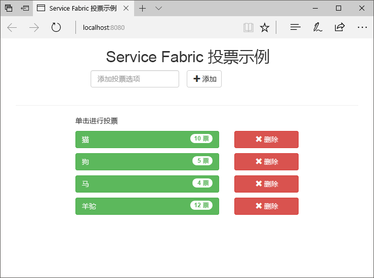
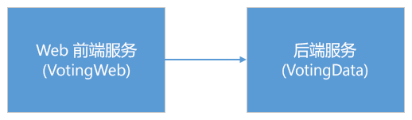
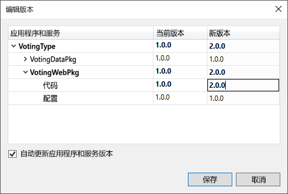
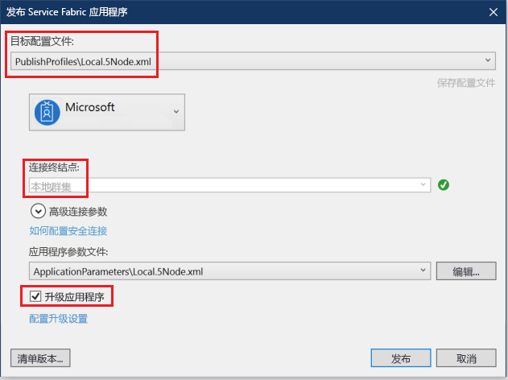
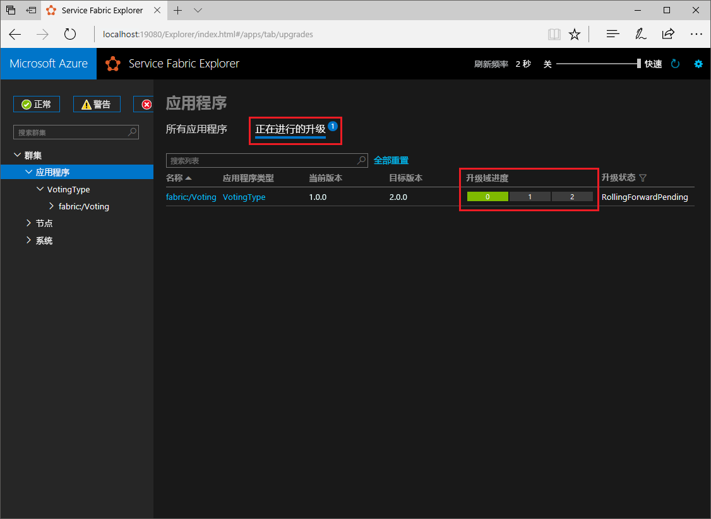

# <a name="quickstart-deploy-a-net-reliable-services-application-to-service-fabric"></a>快速入门：将 .NET Reliable Services 应用程序部署到 Service Fabric

Azure Service Fabric 是一款分布式系统平台，可用于部署和管理可缩放的可靠微服务和容器。

此快速入门展示了如何将首个 .NET 应用程序部署到 Service Fabric。 完成后，将生成一个投票应用程序，其中包含 ASP.NET Core Web 前端，用于将投票结果保存到群集的有状态后端服务中。



通过此应用程序，将了解如何：

* 使用 .NET 和 Service Fabric 创建应用程序
* 将 ASP.NET Core 用作 Web 前端
* 将应用程序数据存储到有状态服务中
* 在本地调试应用程序
* 跨多个节点横向扩展应用程序
* 执行应用程序滚动升级

## <a name="prerequisites"></a>必备条件

完成本快速入门教程需要：

1. [安装 Visual Studio 2019](https://www.visualstudio.com/)，其中包含“Azure 开发”  以及“ASP.NET 和 Web 开发”  工作负荷。
2. [安装 Git](https://git-scm.com/)
3. [安装 Microsoft Azure Service Fabric SDK](https://www.microsoft.com/web/handlers/webpi.ashx?command=getinstallerredirect&appid=MicrosoftAzure-ServiceFabric-CoreSDK)
4. 运行以下命令，将 Visual Studio 启用为把应用程序部署到本地 Service Fabric 群集：

   ```powershell
   Set-ExecutionPolicy -ExecutionPolicy Unrestricted -Force -Scope CurrentUser
   ```
    
## <a name="build-a-cluster"></a>生成群集

安装运行时、SDK、Visual Studio 工具、Docker 并运行 Docker 之后，创建一个五节点本地开发群集。

> [!Note]
> 在创建群集时运行 Docker 是为了创建启用了容器功能的群集。 如果未运行 Docker，则需要重新创建群集以启用容器功能。
> 尽管这在此特定快速入门中并非必要，但在创建群集时运行 Docker 是一种最佳做法。
> 若要测试 Docker 是否正在运行，请打开一个终端窗口，运行 `docker ps` 并查看是否出错。 如果响应中未指示错误，则表示 Docker 正在运行，可以生成群集。
>
> [设置 Windows 10 或 Windows Server 用以运行容器](https://docs.microsoft.com/virtualization/windowscontainers/quick-start/set-up-environment?tabs=Windows-10-Client)

1. 以管理员身份打开权限提升的新 PowerShell 窗口。
2. 运行以下 PowerShell 命令创建开发群集：

   ```powershell
   . "C:\Program Files\Microsoft SDKs\Service Fabric\ClusterSetup\DevClusterSetup.ps1"
   ```
3. 运行以下命令来启动本地群集管理器工具：

   ```powershell
   . "C:\Program Files\Microsoft SDKs\Service Fabric\Tools\ServiceFabricLocalClusterManager\ServiceFabricLocalClusterManager.exe"
   ```

>[!NOTE]
> 本快速入门中示例应用程序使用的功能在 Windows 7 中不提供。
>

## <a name="download-the-sample"></a>下载示例

在命令窗口中，运行以下命令，将示例应用程序存储库克隆到本地计算机。

```git
git clone https://github.com/Azure-Samples/service-fabric-dotnet-quickstart
```

## <a name="run-the-application-locally"></a>在本地运行应用程序

右键单击“开始”菜单中的 Visual Studio 图标，再选择“以管理员身份运行”  。 若要将调试程序附加到服务，需要以管理员身份运行 Visual Studio。

从克隆的存储库中打开“Voting.sln” Visual Studio 解决方案。 

默认情况下，Voting 应用程序在端口 8080 上侦听。  应用程序端口在 */VotingWeb/PackageRoot/ServiceManifest.xml* 文件中进行设置。  可以通过更新**终结点**元素的 **Port** 属性来更改应用程序端口。  若要在本地部署和运行应用程序，应用程序端口必须为打开状态且在你的计算机上可用。  如果更改应用程序端口，请通篇将本文中的“8080”替换为新的应用程序端口值。

若要部署应用程序，请按 F5  。

> [!NOTE]
> 在 Visual Studio 输出窗口中，将看到消息“应用程序 URL 未进行设置或不是 HTTP/HTTPS URL，因此浏览器不会对应用程序打开。”  此消息不指示错误，但该浏览器将不会自动启动。

部署完成后，启动浏览器并打开 `http://localhost:8080` 来查看应用程序的 Web 前端。


现在可以添加一组投票选项，并开始进行投票。 此应用程序可以运行，并将所有数据存储到 Service Fabric 群集中，而无需单独提供数据库。

## <a name="walk-through-the-voting-sample-application"></a>大致了解投票示例应用程序

投票应用程序由以下两个服务组成：

* Web 前端服务 (VotingWeb) - ASP.NET Core Web 前端服务，可提供网页服务，并公开用于与后端服务进行通信的 Web API。
* 后端服务 (VotingData) - ASP.NET Core Web 服务，可公开用于将投票结果存储在可靠字典中并保留在磁盘上的API。



在应用程序中投票时，将会发生以下事件：

1. JavaScript 将投票请求作为 HTTP PUT 请求发送给 Web 前端服务中的 Web API。

2. Web 前端服务使用代理定位并将 HTTP PUT 请求转发给后端服务。

3. 后端服务接收传入请求，并将更新后的结果存储在可靠字典中（结果复制到群集内的多个节点，并保留在磁盘上）。 应用程序的所有数据都存储在群集中，因此无需使用数据库。

## <a name="debug-in-visual-studio"></a>在 Visual Studio 中进行调试

此应用程序应该正常运行，不过，你可以使用调试程序来了解应用程序关键部分的运行情况。 在 Visual Studio 中调试应用程序时，使用的是本地 Service Fabric 开发群集。 可以根据自己的方案调整调试体验。 在此应用程序中，数据将使用可靠的字典存储到后端服务中。 停止调试程序时，Visual Studio 会默认删除应用程序。 删除应用程序后，后端服务中的数据也会随之一起删除。 若要跨调试会话保留数据，可以在 Visual Studio 中更改“应用程序调试模式” （“Voting” 项目属性）。  

若要查看代码，请完成以下步骤：

1. 打开 /VotingWeb/Controllers/VotesController.cs  文件，并在 Web API 的 Put  方法（第 69 行）中设置一个断点。可以在 Visual Studio 的解决方案资源管理器中搜索此文件。

2. 打开 **/VotingData/Controllers/VoteDataController.cs** 文件，并在此 Web API 的 Put  方法（第 54 行）中设置一个断点。

3. 返回到浏览器，再单击投票选项或添加新的投票选项。 点击 Web 前端 API 控制器中的第一个断点。
   * 在此步骤中，浏览器中的 JavaScript 将请求发送到前端服务中的 Web API 控制器。

     

   * 首先，为后端服务构建 ReverseProxy 的 URL  (1)。
   * 然后，向 ReverseProxy 发送 HTTP PUT 请求  (2)。
   * 最后，将后端服务的响应返回到客户端  (3)。

4. 按 F5  以继续操作
   - 在浏览器提示时，授予 ServiceFabricAllowedUsers 组读取和执行权限（适用于调试模式）。
   - 此时，到达后端服务中的断点。

     

   - 在方法 (1) 的第一行  ，`StateManager` 获取或添加一个可靠字典 `counts`。
   - 与可靠字典中的值进行的所有交互都需要使用事务，这个 using 语句 (2)  负责创建此事务。
   - 在事务中更新投票选项的相关键值，并提交操作  (3)。 提交方法返回后，便会更新字典中的数据，并将数据复制到群集中的其他节点。 数据现在安全地存储在群集中，并且后端服务可以故障转移到其他节点，同时数据仍可用。
5. 按 F5  以继续操作

若要停止调试会话，请按 Shift+F5  。

## <a name="perform-a-rolling-application-upgrade"></a>执行应用程序滚动升级

将新更新部署到应用程序时，Service Fabric 会安全地分阶段发布更新。 借助滚动升级，可以杜绝升级时的故障时间，并在出错时自动回滚。

若要升级应用程序，请执行以下操作：

1. 在 Visual Studio 中打开 /VotingWeb/Views/Home/Index.cshtml  文件。
2. 通过添加或更新文本，对页面中的标题进行更改。 例如，将标题更改为“Service Fabric 投票示例 v2”。
3. 保存文件。
4. 在解决方案资源管理器中，右键单击“投票”  ，再选择“发布”  。 此时，“发布”对话框显示。
5. 单击“清单版本”  按钮，更改服务和应用程序的版本。
6. 将 VotingWebPkg 下 Code 元素的版本更改为“2.0.0”（举个例子），再单击“保存”。

    
7. 在“发布 Service Fabric 应用程序”  对话框中，选中“升级应用程序”复选框  。
8.  将“目标配置文件”  更改为 **PublishProfiles\Local.5Node.xml** 并确保将“连接终结点”  设置为“本地群集”  。 
9. 选择“升级应用程序”。 

    

10. 单击“发布”  。

    运行升级期间，仍可以使用应用程序。 由于在群集中运行的服务有两个实例，因此一些请求可能会获取升级版应用程序，另一些请求可能仍获取旧版应用程序。

11. 打开浏览器，并在端口 19080 上转到群集地址。 例如，`http://localhost:19080/` 。
12. 单击树视图中的“应用程序”  节点，再单击右侧窗格中的“进行中的升级”  。 可以了解如何通过群集中的升级域滚动升级，同时确保在继续执行下一步之前每个域都能够正常运行。 在验证域运行状况后，进度栏中的升级域将显示为绿色。
    

    Service Fabric 在升级群集中每个节点上的服务后等待两分钟，从而确保升级安全性。 预计整个更新大约需要 8 分钟的时间。

## <a name="next-steps"></a>后续步骤

在此快速入门中，读者学习了如何：

* 使用 .NET 和 Service Fabric 创建应用程序
* 将 ASP.NET Core 用作 Web 前端
* 将应用程序数据存储到有状态服务中
* 在本地调试应用程序
* 跨多个节点横向扩展应用程序
* 执行应用程序滚动升级

若要详细了解 Service Fabric 和 .NET，请查看以下教程：
> [!div class="nextstepaction"]
> [Service Fabric 上的 .NET 应用程序](service-fabric-tutorial-create-dotnet-app.md)
