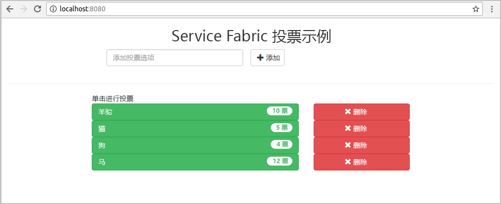
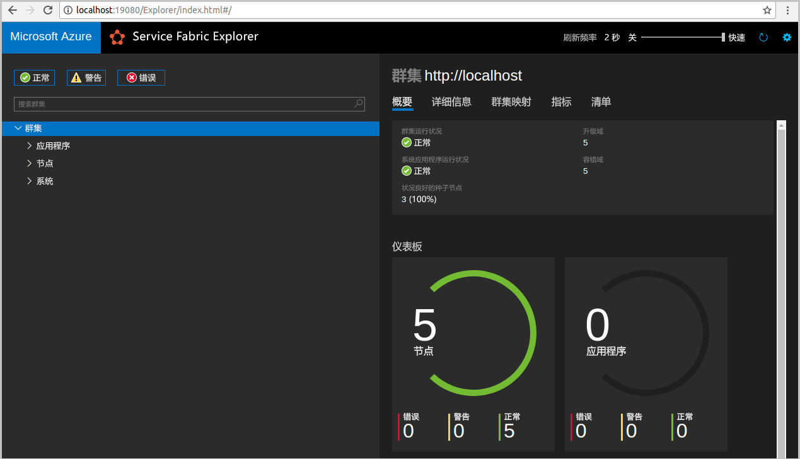
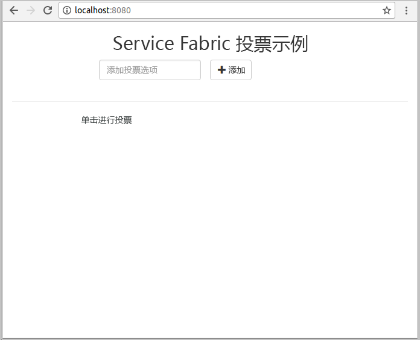
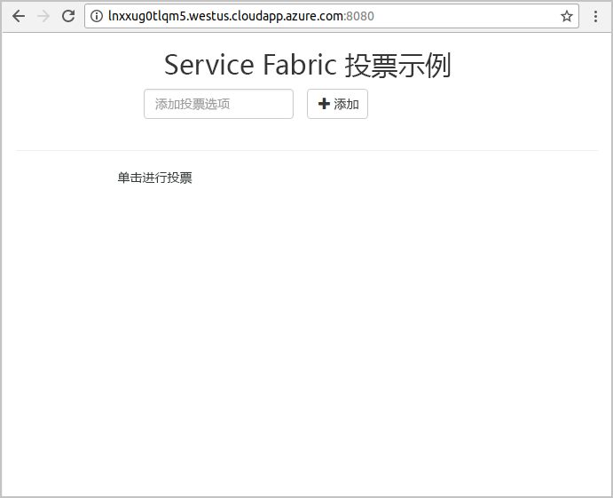
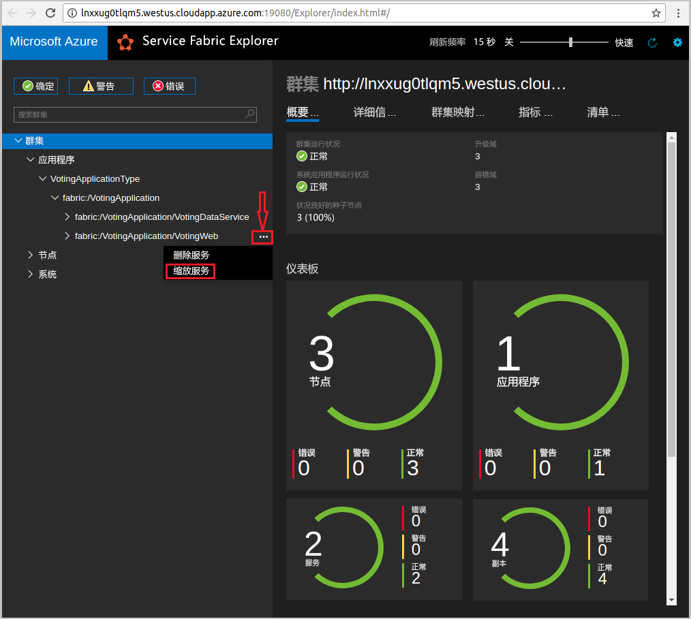
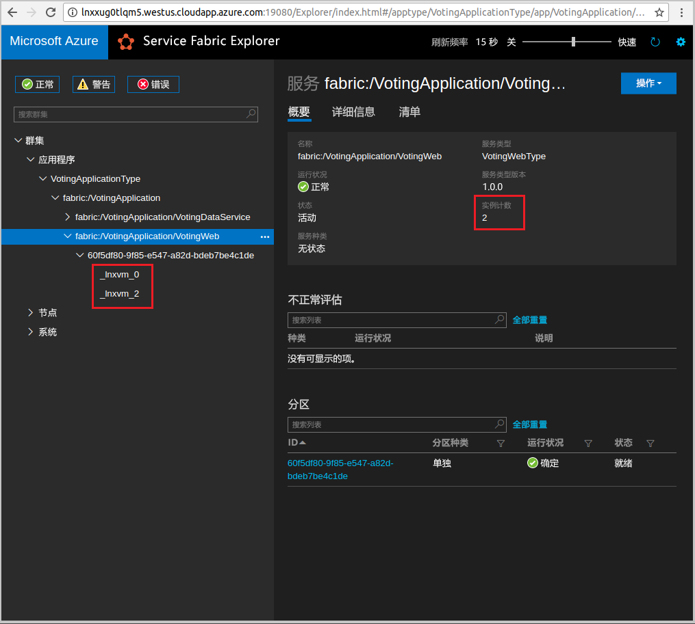

# <a name="quickstart-deploy-a-java-service-fabric-reliable-services-application-to-azure"></a>快速入门：将 Java Service Fabric Reliable Services 应用程序部署到 Azure
Azure Service Fabric 是一款分布式系统平台，可用于部署和管理微服务和容器。 

此快速入门演示如何在 Linux 开发人员计算机上使用 Eclipse IDE 将首个 Java 应用程序部署到 Service Fabric。 完成后，将生成一个带 Java Web 前端的投票应用程序，用于将投票结果保存到群集的有状态后端服务中。



此快速入门介绍如何：

> [!div class="checklist"]
> * 使用 Eclipse 处理 Service Fabric Java 应用程序
> * 将应用程序部署到本地群集 
> * 将应用程序部署到 Azure 中的群集
> * 跨多个节点横向扩展应用程序

## <a name="prerequisites"></a>先决条件
完成本快速入门教程：
1. [安装 Service Fabric SDK 和 Service Fabric 命令行接口 (CLI)](https://docs.microsoft.com/azure/service-fabric/service-fabric-get-started-linux#installation-methods)
2. [安装 Git](https://git-scm.com/)
3. [安装 Eclipse](https://www.eclipse.org/downloads/)
4. [设置 Java 环境](https://docs.microsoft.com/azure/service-fabric/service-fabric-get-started-linux#set-up-java-development)，确保遵循可选步骤安装 Eclipse 插件 

## <a name="download-the-sample"></a>下载示例
在命令窗口中，运行以下命令，将示例应用程序存储库克隆到本地计算机。
```
git clone https://github.com/Azure-Samples/service-fabric-java-quickstart.git
```

## <a name="run-the-application-locally"></a>在本地运行应用程序
1. 通过运行以下命令来启动本地群集：

    ```bash
    sudo /opt/microsoft/sdk/servicefabric/common/clustersetup/devclustersetup.sh
    ```
    启动本地群集需要一些时间。 若要确认群集是否完全正常，请访问 Service Fabric Explorer（网址：http://localhost:19080）。 5 个节点均正常即表示本地群集运行正常。 
    
    

2. 打开 Eclipse。
3. 单击“文件”->“从文件系统打开项目...” 
4. 单击“目录”，然后在从 Github 克隆的 `service-fabric-java-quickstart` 文件夹中选择 `Voting` 目录。 单击“完成”。 

    
    
5. Eclipse 的包资源管理器中现拥有 `Voting` 项目。 
6. 右键单击该项目并选择“Service Fabric”下拉列表中的“发布应用程序...”。 选择“PublishProfiles/Local.json”为目标配置文件，然后单击“发布”。 

    
    
7. 打开喜欢的 Web 浏览器并访问应用程序（网址：http://localhost:8080）。 

    
    
现在可以添加一组投票选项，并开始进行投票。 此应用程序可以运行，并将所有数据存储到 Service Fabric 群集中，而无需单独提供数据库。

## <a name="deploy-the-application-to-azure"></a>将应用程序部署到 Azure

### <a name="set-up-your-azure-service-fabric-cluster"></a>设置 Azure Service Fabric 群集
若要将应用程序部署到 Azure 中的群集，可创建自己的群集。

合作群集是 Azure 上托管的免费限时 Service Fabric 群集。 这些群集由 Service Fabric 团队运行，任何人均可在其中部署应用程序和了解平台。 若要使用合作群集，请[按照说明操作](http://aka.ms/tryservicefabric)。 

若要在安全合作群集上执行管理操作，可以使用 Service Fabric Explorer、CLI 或 Powershell。 若要使用 Service Fabric Explorer，需从合作群集网站下载 PFX 文件并将证书导入到证书存储（Windows 或 Mac）中，或者导入到浏览器 (Ubuntu) 中。 合作群集提供的自签名证书没有密码。 

若要使用 Powershell 或 CLI 执行管理操作，需要 PFX (Powershell) 或 PEM (CLI)。 若要将 PFX 转换为 PEM 文件，请运行以下命令：  

```bash
openssl pkcs12 -in party-cluster-1277863181-client-cert.pfx -out party-cluster-1277863181-client-cert.pem -nodes -passin pass:
```

若要了解如何创建自己的群集，请参阅[在 Azure 上创建 Service Fabric 群集](service-fabric-tutorial-create-vnet-and-linux-cluster.md)。

> [!Note]
> Spring Boot 服务配置为侦听端口 8080 上的传入流量。 请确保此端口在群集中处于打开状态。 如果使用的是合作群集，此端口已处于打开状态。
>

### <a name="add-certificate-information-to-your-application"></a>向应用程序添加证书信息

需将证书指纹添加到应用程序，因为它使用 Service Fabric 编程模型。 

1. 在安全群集上运行时，需要 ```Voting/VotingApplication/ApplicationManiest.xml``` 文件中的证书的指纹。 运行以下命令，提取证书指纹。

    ```bash
    openssl x509 -in [CERTIFICATE_FILE] -fingerprint -noout
    ```

2. 在 ```Voting/VotingApplication/ApplicationManiest.xml``` 中的 **ApplicationManifest** 标记下添加以下代码片段。 **X509FindValue** 应该是上一步的指纹（无分号）。 

    ```xml
    <Certificates>
        <SecretsCertificate X509FindType="FindByThumbprint" X509FindValue="0A00AA0AAAA0AAA00A000000A0AA00A0AAAA00" />
    </Certificates>   
    ```
    
### <a name="deploy-the-application-using-eclipse"></a>使用 Eclipse 部署应用程序
应用程序和群集现已准备就绪，可直接通过 Eclipse 部署到群集。

1. 打开“PublishProfiles”目录下的“Cloud.json”文件，并适当填写 `ConnectionIPOrURL` 和 `ConnectionPort` 字段。 示例如下： 

    ```bash
    {
         "ClusterConnectionParameters": 
         {
            "ConnectionIPOrURL": "lnxxug0tlqm5.westus.cloudapp.azure.com",
            "ConnectionPort": "19080",
            "ClientKey": "[path_to_your_pem_file_on_local_machine]",
            "ClientCert": "[path_to_your_pem_file_on_local_machine]"
         }
    }
    ```

2. 右键单击该项目并选择“Service Fabric”下拉列表中的“发布应用程序...”。 选择“PublishProfiles/Cloud.json”为目标配置文件，然后单击“发布”。 

    

3. 打开喜欢的 Web 浏览器并访问应用程序（网址：http://\<ConnectionIPOrURL>:8080）。 

    
    
## <a name="scale-applications-and-services-in-a-cluster"></a>在群集中缩放应用程序和服务
可跨群集缩放服务来适应服务负载的变化。 可以通过更改群集中运行的实例数量来缩放服务。 存在多种服务缩放方式，可使用 Service Fabric CLI (sfctl) 脚本/命令。 本例中使用的是 Service Fabric Explorer。

Service Fabric Explorer 在所有 Service Fabric 群集中运行，并能通过浏览器进行访问，访问方法是转到群集 HTTP 管理端口 19080（例如，`http://lnxxug0tlqm5.westus.cloudapp.azure.com:19080`）。

若要缩放 Web 前端服务，请按照以下步骤操作：

1. 在群集中打开 Service Fabric Explorer - 例如 `https://lnxxug0tlqm5.westus.cloudapp.azure.com:19080`。
2. 单击树视图中 fabric:/Voting/VotingWeb 节点旁边的省略号（三个点），再选择“缩放服务”。

    

    现在可以缩放 Web 前端服务的实例数量。

3. 将数字更改为 2，再单击“缩放服务”。
4. 单击树视图中的 fabric:/Voting/VotingWeb 节点，再展开分区节点（由 GUID 表示）。

    

    现在可以看到，服务有两个实例。在树视图中可以查看实例的运行节点。

通过这一简单的管理任务，我们让前端服务用来处理用户负载的资源数量翻了一番。 有必要了解的是，服务无需有多个实例，便能可靠运行。 如果服务出现故障，Service Fabric 可确保在群集中运行新的服务实例。

## <a name="next-steps"></a>后续步骤
在此快速入门中，读者学习了如何：

> [!div class="checklist"]
> * 使用 Eclipse 处理 Service Fabric Java 应用程序
> * 将 Java 应用程序部署到本地群集 
> * 将 Java 应用程序部署到 Azure 中的群集
> * 跨多个节点横向扩展应用程序

* 详细了解如何[在 Java 上使用 Eclipse 调试服务](service-fabric-debugging-your-application-java.md)
* 了解如何[使用 Jenkins 设置连续集成和部署](service-fabric-cicd-your-linux-applications-with-jenkins.md)
* 查看其他 [Java 示例](https://github.com/Azure-Samples/service-fabric-java-getting-started)