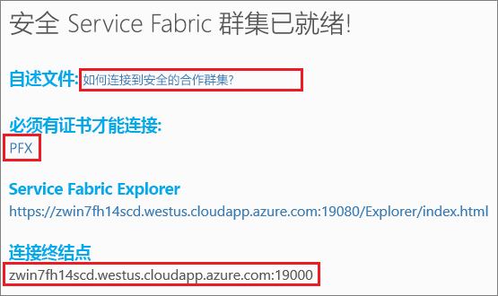

# <a name="tutorial-deploy-an-application-to-a-service-fabric-cluster-in-azure"></a>教程：将应用程序部署到 Azure 中的 Service Fabric 群集
本教程是一个系列的第二部分，介绍如何将 Azure Service Fabric 应用程序部署到在 Azure 中运行的群集。

在该系列教程的第二部分中，你会学习如何：
> [!div class="checklist"]
> * [构建 .NET Service Fabric 应用程序](service-fabric-tutorial-create-dotnet-app.md)
> * 将应用程序部署到远程群集
> * [使用 Visual Studio Team Services 配置 CI/CD](service-fabric-tutorial-deploy-app-with-cicd-vsts.md)
> * [设置监视和诊断应用程序](service-fabric-tutorial-monitoring-aspnet.md)

在此系列教程中，你会学习如何：
> [!div class="checklist"]
> * 使用 Visual Studio 将应用程序部署到远程群集
> * 使用 Service Fabric Explorer 从群集中删除应用程序

## <a name="prerequisites"></a>先决条件
在开始学习本教程之前：
- 如果没有 Azure 订阅，请创建一个[免费帐户](https://azure.microsoft.com/free/?WT.mc_id=A261C142F)
- [安装 Visual Studio 2017](https://www.visualstudio.com/)，并安装 **Azure 开发**以及 **ASP.NET 和 Web 开发**工作负荷。
- [安装 Service Fabric SDK](service-fabric-get-started.md)

## <a name="download-the-voting-sample-application"></a>下载投票示例应用程序
如果未生成[本教程系列的第一部分](service-fabric-tutorial-create-dotnet-app.md)中的投票示例应用程序，还可以下载它。 在命令窗口中，运行以下命令，将示例应用程序存储库克隆到本地计算机。

```
git clone https://github.com/Azure-Samples/service-fabric-dotnet-quickstart
```

## <a name="set-up-a-party-cluster"></a>设置合作群集
合作群集是在 Azure 上托管的、由 Service Fabric 团队运行的免费限时 Service Fabric 群集，任何人都可以在其中部署应用程序及了解平台的情况。 免费！

若要获取合作群集的访问权限，请浏览到此站点：http://aka.ms/tryservicefabric，并遵照说明获取群集访问权限。 需要一个 Facebook 或 GitHub 帐户才能获取合作群集的访问权限。

如果需要，可以使用自己的群集而不是参与方群集。  ASP.NET Core Web 前端使用反向代理与有状态服务后端通信。  参与方群集和本地开发群集默认启用反向代理。  如果将投票示例应用程序部署到自己的群集，则必须[在群集中启用反向代理](service-fabric-reverseproxy.md#setup-and-configuration)。

> [!NOTE]
> 合作群集不受保护，因此，在其中放置的应用程序和任何数据可能会被其他人看到。 请勿部署不希望其他人看到的任何内容。 请务必仔细阅读我们的使用条款，了解所有详细信息。

登录并[加入 Windows 群集](http://aka.ms/tryservicefabric)。 通过单击 **PFX** 链接，将 PFX 证书下载到计算机。 证书和**连接终结点**值在以下步骤中使用。



在 Windows 计算机上，将 PFX 安装到 *CurrentUser\My* 证书存储中。

```powershell
PS C:\mycertificates> Import-PfxCertificate -FilePath .\party-cluster-873689604-client-cert.pfx -CertStoreLocation Cert:
\CurrentUser\My


  PSParentPath: Microsoft.PowerShell.Security\Certificate::CurrentUser\My

Thumbprint                                Subject
----------                                -------
3B138D84C077C292579BA35E4410634E164075CD  CN=zwin7fh14scd.westus.cloudapp.azure.com
```


## <a name="deploy-the-app-to-the-azure"></a>将应用部署到 Azure
应用程序准备就绪后，可以直接从 Visual Studio 将其部署到合作群集。

1. 在解决方案资源管理器中，右键单击“投票”，再选择“发布”。 

    

2. 将 Party 群集页面中的“连接终结点”复制到“连接终结点”字段。 例如，`zwin7fh14scd.westus.cloudapp.azure.com:19000`。 单击“高级连接参数”并填写以下信息。  *FindValue* 和 *ServerCertThumbprint* 值必须与前一步骤中安装的证书的指纹匹配。 单击“发布” 。 

    完成发布后，应该可以通过浏览器向应用程序发送请求。

3. 打开首选的浏览器，键入群集地址（不含端口信息的连接终结点 - 例如 win1kw5649s.westus.cloudapp.azure.com）。

    现在，应会看到在本地运行该应用程序时所看到的相同结果。

    

## <a name="remove-the-application-from-a-cluster-using-service-fabric-explorer"></a>使用 Service Fabric Explorer 从群集中删除应用程序
Service Fabric Explorer 是用于浏览和管理 Service Fabric 群集中的应用程序的图形用户界面。

若要从合作群集删除应用程序，请执行以下操作：

1. 使用合作群集注册页提供的链接浏览到 Service Fabric Explorer。 例如，https://win1kw5649s.westus.cloudapp.azure.com:19080/Explorer/index.html。

2. 在 Service Fabric Explorer 中，导航到左侧树视图中的 **fabric:/Voting** 节点。

3. 在右侧的“概要”窗格中单击“操作”按钮，选择“删除应用程序”。 确认删除该应用程序实例，随即会删除群集中运行的应用程序实例。


## <a name="remove-the-application-type-from-a-cluster-using-service-fabric-explorer"></a>使用 Service Fabric Explorer 从群集中删除应用程序类型
应用程序在 Service Fabric 群集中部署为应用程序类型，因此，我们可以在群集中运行该应用程序的多个实例和版本。 删除正在运行的应用程序实例后，还可以删除类型，以完成部署的清理。

有关 Service Fabric 中的应用程序模型的详细信息，请参阅[在 Service Fabric 中为应用程序建模](service-fabric-application-model.md)。

1. 在树视图中导航到“VotingType”节点。

2. 在右侧的“概要”窗格中单击“操作”按钮，选择“取消预配类型”。 确认取消预配应用程序类型。


本教程到此结束。

## <a name="next-steps"></a>后续步骤
本教程介绍了如何：

> [!div class="checklist"]
> * 使用 Visual Studio 将应用程序部署到远程群集
> * 使用 Service Fabric Explorer 从群集中删除应用程序

转到下一教程：
> [!div class="nextstepaction"]
> [使用 Visual Studio Team Services 设置持续集成](service-fabric-tutorial-deploy-app-with-cicd-vsts.md)
