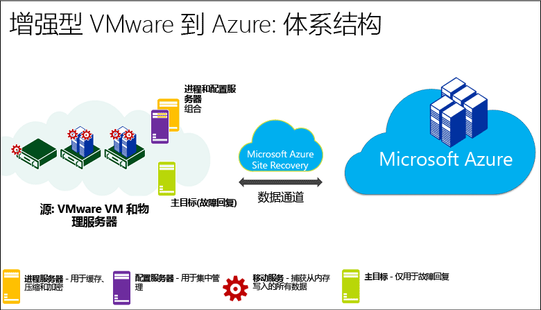
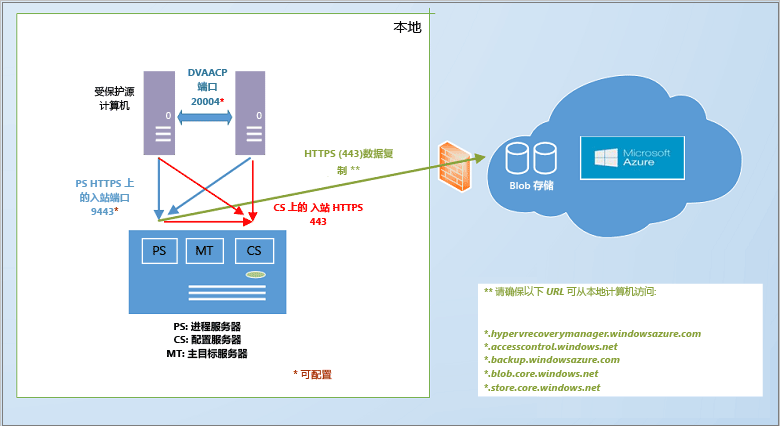
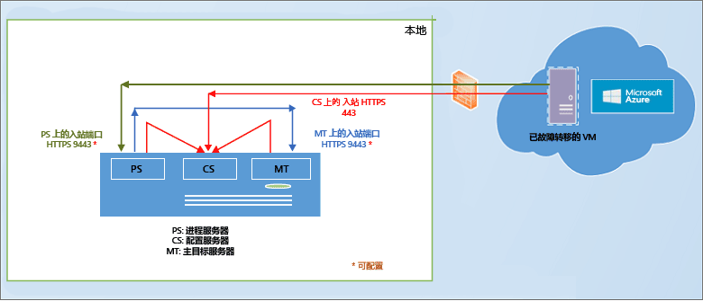
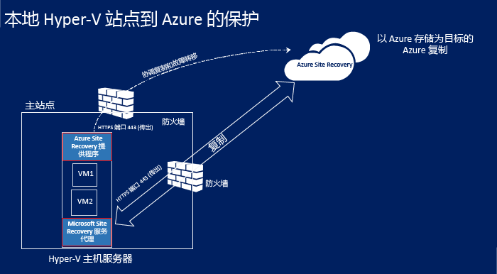
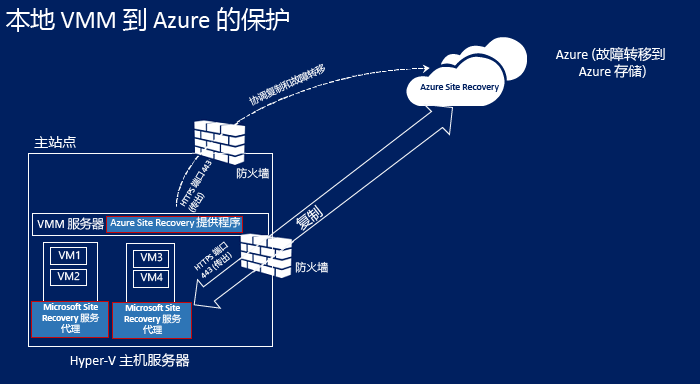
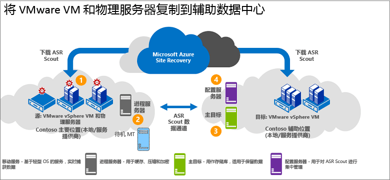
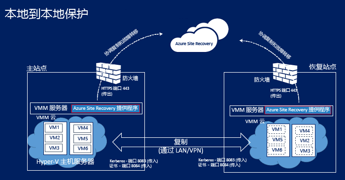
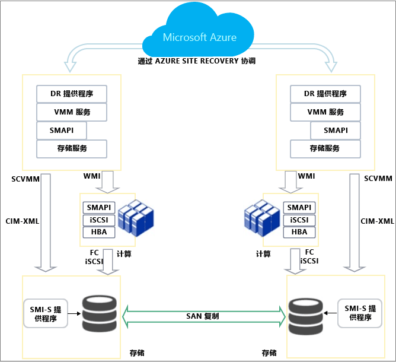
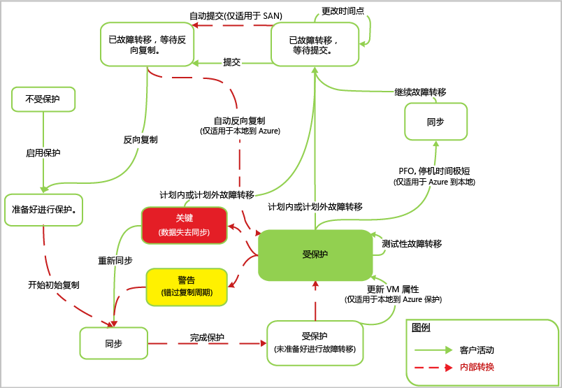

# Azure Site Recovery 的工作原理
阅读本文，了解 Azure Site Recovery 服务的基础架构以及它运行时使用的组件。

请将任何评论或问题发布到本文底部，或者发布到 [Azure 恢复服务论坛](https://social.msdn.microsoft.com/forums/azure/home?forum=hypervrecovmgr)。

## 概述
组织需要制定 BCDR 策略来确定应用、工作负荷和数据如何在计划和非计划停机期间保持运行和可用，并尽快恢复正常运行情况。 BCDR 策略应保持业务数据的安全性和可恢复性，并确保在发生灾难时工作负荷持续可用。

站点恢复是一项 Azure 服务，可以通过协调从本地物理服务器和虚拟机到云 (Azure) 或辅助数据中心的的复制，来为 BCDR 策略提供辅助。 当主要位置发生故障时，你可以故障转移到辅助位置，使应用和工作负荷保持可用。 当主要位置恢复正常时，你可以故障转移回到主要位置。 有关详细信息，请参阅 [什么是 Site Recovery？](site-recovery-overview.md)

## Azure 门户中的 Site Recovery
Azure 使用两种不同的 [部署模型](../resource-manager-deployment-model.md) 创建和处理资源：Azure Resource Manager 模型和经典服务管理模型。 Azure 还有两个门户 – 支持经典部署模型的 [Azure 经典门户](https://manage.windowsazure.com/)，以及支持两种部署模型的 [Azure 门户](https://portal.azure.com)。

经典门户和 Azure 门户中都提供 Site Recovery。 在 Azure 经典门户中，可以使用经典服务管理模型支持 Site Recovery。 在 Azure 门户中，可以支持经典模型或资源模型部署。 [阅读更多](site-recovery-overview.md#site-recovery-in-the-azure-portal) 有关使用 Azure 门户进行部署的内容。

本文中的信息同时适用于经典部署和 Azure 门户部署。 将对差异进行说明（如果适用）。

## 部署方案
部署站点恢复可在许多方案中协调复制：

* **复制 VMware 虚拟机**：可将本地 VMware 虚拟机复制到 Azure 或辅助数据中心。
* * **复制物理计算机**：可将运行 Windows 或 Linux 的物理计算机复制到 Azure 或辅助数据中心。 复制物理计算机的过程几乎与复制 VMware VM 的过程相同
* **复制 Hyper-V VM（不包括 VMM）**：可将不由 VMM 管理的 Hyper-V VM 复制到 Azure。
* **复制在 System Center VMM 云中托管的 Hyper-V VM**：可将在 VMM 云中的 Hyper-V 主机服务器上运行的本地 Hyper-V 虚拟机复制到 Azure 或辅助数据中心。 可以使用标准 Hyper-V 副本或使用 SAN 复制进行复制。
* **迁移 VM**：可使用站点恢复在区域之间[迁移 Azure IaaS VM](site-recovery-migrate-azure-to-azure.md)，或者[将 AWS Windows 实例迁移](site-recovery-migrate-aws-to-azure.md)到 Azure IaaS VM。 目前仅支持迁移，这意味着你可以故障转移这些 VM，但无法故障回复。

Site Recovery 可以复制这些 VM 和物理服务器上运行的大多数应用。 有关受支持应用的完整摘要，请参阅 [Azure Site Recovery 可以保护哪些工作负荷？](site-recovery-workload.md)

## 复制到 Azure：VMware 虚拟机或物理 Windows/Linux 服务器
可通过多种方式使用 Site Recovery 复制 VMware VM。

* **使用 Azure 门户**- 在 Azure 门户中部署 Site Recovery 时，可以将 VM 故障转移到经典服务管理器存储或 Resource Manager。 在 Azure 门户中复制 VMware VM 有很多优点，包括可以复制到 Azure 中的经典存储或 Resource Manager 存储。 [了解详细信息](site-recovery-vmware-to-azure.md)。
* **使用经典门户**- 可以使用增强体验在经典门户中部署 Site Recovery。 这应该用于经典门户中的所有新部署。 在此部署中，可以仅将 VM 故障转移到 Azure 中的经典存储，而不故障转移到 Resource Manager 存储。 [了解详细信息](site-recovery-vmware-to-azure-classic.md)。 另外，还有在经典门户中设置 VMware 复制的 [传统体验](site-recovery-vmware-to-azure-classic-legacy.md) 。 这不应该用于新部署。  如果已使用传统体验进行部署，请 [了解如何迁移](site-recovery-vmware-to-azure-classic-legacy.md#migrate-to-the-enhanced-deployment) 到增强型部署。

为了复制 Azure 门户或 Azure 经典门户（增强型）中的 VMware VM/物理服务器而部署 Site Recovery 的体系结构要求很相似，仅有几个差异：

* 如果在 Azure 门户中部署，故障转移后，可以复制到基于 Resource Manager 的存储并使用 Resource Manager 网络连接 Azure VM。
* 在 Azure 门户中部署时，同时支持 LRS 和 GRS 存储。 在经典门户中，需要 GRS。
* 在 Azure 门户中，部署过程已简化并且更加用户友好。

以下是你需要做好的准备：

* **Azure 帐户**：需要 Microsoft Azure 帐户。
* **Azure 存储**：需要使用 Azure 存储帐户来存储复制的数据。 可以使用经典帐户或 Resource Manager 存储帐户。 在 Azure 门户部署时，帐户可以是 LRS 或 GRS。 复制的数据存储在 Azure 空间，Azure VM 在发生故障转移时启动。
* **Azure 网络**：需要在创建后，发生故障转移时 Azure VM 能够连接的 Azure 虚拟网络。 在 Azure 门户中，它们可以是在经典服务管理器模型或 Resource Manager 模型中创建的网络。
* **本地配置服务器**：需要运行配置服务器和其他 Site Recovery 组件的本地 Windows Server 2012 R2 计算机。 如果要复制 VMware VM，这应该是高度可用的 VMware VM。 如果要复制物理服务器，计算机可以是物理计算机。 这些 Site Recovery 组件将安装在计算机上：
  * **配置服务器**：在本地环境和 Azure 之间协调通信并管理数据复制和恢复。
  * **进程服务器**：充当复制网关。 此服务器接收受保护源计算机提供的复制数据，通过缓存、压缩和加密对其进行优化，然后将数据发送到 Azure 存储空间。 它还处理用于保护计算机的移动服务的推送安装，并执行 VMware VM 的自动发现。 随着部署扩大，可以添加作为进程服务器运行的独立专用进程服务器，目的仅在于处理更大的复制流量。
  * **主目标服务器**：处理从 Azure 进行故障回复期间产生的复制数据。
* **要复制的 VMware VM 或物理服务器**：要复制到 Azure 的每台计算机都需要安装移动服务组件。 此服务可以捕获计算机上的数据写入，并将其转发到进程服务器。 可以手动安装此组件，也可以在启用计算机复制后由进程服务器自动推送并安装。
* **vSPhere 主机/vCenter 服务器**：需要一个或多个运行 VMware VM 的 vSphere 主机服务器。 我们建议你部署 vCenter 服务器来管理这些主机。
* **故障回复**：下面是需要的项：
  * **不支持物理到物理故障回复**：这意味着，如果将物理服务器故障转移到 Azure ，然后想要故障回复，必须故障回复到 VMware VM。 不能故障回复到物理服务器。 需要要故障回复到的 Azure VM，如果未将配置服务器部署为 VMware VM，则需要将单独的主目标服务器设置为 VMware VM。 需要此项，因为主目标服务器进行交互，并连接到 VMware 存储，将磁盘还原到 VMware VM。
  * * **Azure 中的临时进程服务器**：如果要在故障转移后从 Azure 故障回复，必须将 Azure VM 设置为进程服务器，以处理来自 Azure 的复制。 故障回复完成后，可以删除此 VM。
  * **VPN 连接**：若要进行故障回复，需要设置从 Azure 网络到本地站点的 VPN 连接（或 Azure ExpressRoute）。
  * **单独的本地主目标服务器**：本地主目标服务器用于处理故障回复。 主目标服务器默认安装在管理服务器上，但如果要故障回复大量数据，应该设置独立的本地主目标服务器。

**一般体系结构**

**部署组件**

**故障回复**

* [详细了解](site-recovery-vmware-to-azure.md#azure-prerequisites) Azure 门户部署要求。
* [详细了解](site-recovery-vmware-to-azure-classic.md#before-you-start-deployment) 经典门户中的增强型部署要求。
* [详细了解](site-recovery-failback-azure-to-vmware.md) Azure 门户中的故障回复。
* [详细了解](site-recovery-failback-azure-to-vmware-classic.md)经典门户中的故障回复。

## 复制到 Azure：不由 VMM 管理的 Hyper-V VM
可以使用 Site Recovery 将不由 System Center VMM 管理的 Hyper-V VM 复制到 Azure，如下所示：

* **使用 Azure 门户**- 在 Azure 门户中部署 Site Recovery 时，可以将 VM 故障转移到经典存储或 Resource Manager。 [了解详细信息](site-recovery-hyper-v-site-to-azure.md)。
* **使用经典门户**- 可以在经典门户中部署 Site Recovery。 在此部署中，可以仅将 VM 故障转移到 Azure 中的经典存储，而不故障转移到 Resource Manager 存储。 [了解详细信息](site-recovery-hyper-v-site-to-azure-classic.md)。

这两种部署的体系结构很相似，只有以下不同：

* 如果在 Azure 门户中部署，故障转移后，可以复制到 Resource Manager 存储并使用 Resource Manager 网络连接 Azure VM。
* 在 Azure 门户中，部署过程已简化并且更加用户友好。

以下是你需要做好的准备：

* **Azure 帐户**：需要 Microsoft Azure 帐户。
* **Azure 存储**：需要使用 Azure 存储帐户来存储复制的数据。 在 Azure 门户中，可以使用经典帐户或 Resource Manager 存储帐户。 在经典门户中，只能使用经典帐户。 复制的数据存储在 Azure 空间，Azure VM 在发生故障转移时创建。
* **Azure 网络**：需要在创建后，发生故障转移后 Azure VM 能够连接的 Azure 网络。
* **Hyper-v 主机**：需要一个或多个 Windows Server 2012 R2 Hyper-V 主机服务器。 在部署站点恢复的过程中，将在该主机上安装 Azure Site Recovery 提供程序和 Microsoft Azure 恢复服务代理。
* **Hyper-V VM**：需要 Hyper-V 主机服务器上的一个或多个 VM。 在 Site Recovery 部署期间，将在 Hyper-V 主机上安装 Azure Site Recovery 提供程序和 Azure 恢复服务代理。 提供程序通过 Internet 使用 Site Recovery 服务协调和安排复制。 代理通过 HTTPS 443 处理数据复制。 来自提供程序和代理的通信都是安全且经过加密的。 Azure 存储空间中的复制数据也已加密。

**一般体系结构**

* [详细了解](site-recovery-hyper-v-site-to-azure.md#azure-prerequisites) Azure 门户部署要求。
* [详细了解](site-recovery-hyper-v-site-to-azure-classic.md#azure-prerequisites) 经典门户部署要求。

## 复制到 Azure：由 VMM 管理的 Hyper-V VM
可以使用 Site Recovery 将 VMM 云中的 Hyper-V VM 复制到 Azure，如下所示：

* **使用 Azure 门户**- 在 Azure 门户中部署 Site Recovery 时，可以将 VM 故障转移到经典存储或 Resource Manager。 [了解详细信息](site-recovery-vmm-to-azure.md)。
* **使用经典门户**- 可以在经典门户中部署 Site Recovery。 在此部署中，可以仅将 VM 故障转移到 Azure 中的经典存储，而不故障转移到 Resource Manager 存储。 [了解详细信息](site-recovery-vmm-to-azure-classic.md)。

这两种部署的体系结构很相似，只有以下不同：

* 如果在 Azure 门户中部署，故障转移后，可以复制到基于 Resource Manager 的存储并使用 Resource Manager 网络连接 Azure VM。
* 在 Azure 门户中，部署过程已简化并且更加用户友好。

以下是你需要做好的准备：

* **Azure 帐户**：需要 Microsoft Azure 帐户。
* **Azure 存储**：需要使用 Azure 存储帐户来存储复制的数据。 在 Azure 门户中，可以使用经典帐户或 Resource Manager 存储帐户。 在经典门户中，只能使用经典帐户。 复制的数据存储在 Azure 空间，Azure VM 在发生故障转移时创建。
* **Azure 网络**：需要设置网络映射，以便在故障转移后将 Azure VM 连接到相应网络（如果已创建）。
* **VMM 服务器**：需要一个或多个在 System Center 2012 R2 上运行且设置了一个或多个私有云的本地 VMM 服务器。 如果要在 Azure 门户中部署，需要逻辑和 VM 网络设置，以便可以配置网络映射。 在经典门户中，这是可选项。  VM 网络应链接到与云关联的逻辑网络。
* **Hyper-v 主机**：需要 VMM 云中的一个或多个 Windows Server 2012 R2 Hyper-V 主机服务器。
* **Hyper-V VM**：需要 Hyper-V 主机服务器上的一个或多个 VM。

**一般体系结构**

* [详细了解](site-recovery-vmm-to-azure.md#azure-requirements) Azure 门户部署要求。
* [详细了解](site-recovery-vmm-to-azure-classic.md#before-you-start) 经典门户部署要求。

## 复制到辅助站点：VMware 虚拟机或物理服务器
下载 Azure Site Recovery 订阅中包含的 InMage Scout 时，将 VMware VM 或物理服务器复制到辅助站点。 可从 Azure 门户或 Azure 经典门户下载它。

在每个站点（配置、进程、主目标）中设置组件服务器，并在要复制的计算机上安装统一代理。 初始复制之后，每台计算机上的代理将增量复制更改发送到进程服务器。 进程服务器将优化这些数据，并将其传输到辅助站点上的主目标服务器。 配置服务器将管理复制进程。

下面是需要的项：

**Azure 帐户**：使用 InMage Scout 部署此方案。 若要获取它，需要 Azure 订阅。 创建站点恢复保管库之后，可以下载 InMage Scout 并安装最新的更新，以设置部署。
**进程服务器（主站点）**：设置主站点中的进程服务器组件，以处理缓存、压缩和数据优化。 它还可以将安装的统一代理推送到你要保护的计算机。
**VMware ESX/ESXi 和 vCenter 服务器（主站点）**：如果要保护 VMware VM，则需要 VMware EXS/ESXi 虚拟机监控程序以及（可选）用于管理虚拟机监控程序的 VMware vCenter 服务器。

* **VM/物理服务器（主站点）**：要保护的 VMware VM 或 Windows/Linux 物理服务器需要安装统一代理。 充当主目标服务器的计算机上也安装了统一代理。 该代理充当所有组件之间的通信提供程序。
* * **配置服务器（辅助站点）**：配置服务器是安装的第一个组件，需将它安装在辅助站点上，以便使用管理网站或 vContinuum 控制台来管理、配置和监视部署。 部署中仅有一个配置服务器，并且它必须安装在运行 Windows Server 2012 R2 的计算机上。
* **vContinuum 服务器（辅助站点）**：它的安装位置与配置服务器相同（辅助站点）。 它提供一个控制台用于管理和监视受保护的环境。 在默认安装中，vContinuum 服务器是第一个主目标服务器，并且已安装统一代理。
* **主目标服务器（辅助站点）**：主目标服务器保存复制的数据。 它从进程服务器接收数据，在辅助站点中创建副本地器，并保存数据保留点。 需要的主目标服务器数目取决于要保护的计算机数目。 如果你想要故障转移到主站点，则也需要一个主目标服务器。

**一般体系结构**

## 复制到辅助站点：由 VMM 管理的 Hyper-V VM
可以使用 Site Recovery 将由 System Center VMM 管理的 Hyper-V VM 复制到辅助数据中心，如下所示：

* **使用 Azure 门户**- 在 Azure 门户中部署 Site Recovery 时。 [了解详细信息](site-recovery-hyper-v-site-to-azure.md)。
* **使用经典门户**- 可以在经典门户中部署 Site Recovery。 [了解详细信息](site-recovery-hyper-v-site-to-azure-classic.md)。

这两种部署的体系结构很相似，只有以下不同：

* 如果在 Azure 门户部署，必须设置网络映射。 在经典门户中，此操作是可选的。
* 在 Azure 门户中，部署过程已简化并且更加用户友好。
* * 如果在 Azure 经典门户中部署，则 [存储映射](site-recovery-storage-mapping.md) 可用。

以下是你需要做好的准备：

* **Azure 帐户**：需要 Microsoft Azure 帐户。
* **VMM 服务器**：建议在主站点和辅助站点上都设置一个 VMM 服务器，各自包含至少一个 VMM 私有云。 服务器至少应运行装有最新更新的 System Center 2012 SP1，并已连接到 Internet。 云应该设置了 Hyper-V 容量配置文件。 在 VMM 服务器上安装 Azure Site Recovery 提供程序。 提供程序通过 Internet 使用 Site Recovery 服务协调和安排复制。 提供程序与 Azure 之间的通信是安全的且经过加密的。
* **Hyper-V 服务器**：Hyper-V 主机服务器应位于主要和辅助 VMM 云中。 主机服务器至少应运行已安装最新更新的 Windows Server 2012，并已连接到 Internet。 使用 Kerberos 或证书身份验证通过 LAN 或 VPN 在主要和辅助 Hyper-V 主机服务器之间复制数据。  
* **受保护的计算机**：源 Hyper-V 主机服务器应具有至少一个要保护的 VM。

**一般体系结构**

* [详细了解](site-recovery-vmm-to-vmm.md#azure-prerequisites) Azure 门户中的部署要求。
* * [详细了解](site-recovery-vmm-to-vmm-classic.md#before-you-start) Azure 经典门户中的部署要求。

## 使用 SAN 复制复制到辅助站点：由 VMM 管理的 Hyper-V VM
可以使用 Azure 经典门户通过 SAN 复制将 VMM 云中托管的 Hyper-V VM 复制到辅助站点。 目前，新的 Azure 门户不支持此方案。

对于此方案，在站点恢复部署期间，需要在 VMM 服务器上安装 Azure Site Recovery 提供程序。 提供程序通过 Internet 使用 Site Recovery 服务协调和安排复制。 使用同步的 SAN 复制在主要和辅助存储阵列之间复制数据。

以下是你需要做好的准备：

**Azure 帐户**：需要 Azure 订阅

* **SAN 阵列**：主 VMM 服务器托管的 [受支持 SAN 阵列](http://social.technet.microsoft.com/wiki/contents/articles/28317.deploying-azure-site-recovery-with-vmm-and-san-supported-storage-arrays.aspx) 。 SAN 与辅助站点中的另一个 SAN 阵列共享网络基础结构。
* **VMM 服务器**：建议在主站点和辅助站点上都设置一个 VMM 服务器，各自包含至少一个 VMM 私有云。 服务器至少应运行装有最新更新的 System Center 2012 SP1，并已连接到 Internet。 云应该设置了 Hyper-V 容量配置文件。
* **Hyper-V 服务器**：Hyper-V 主机服务器位于主要和辅助 VMM 云中。 主机服务器至少应运行已安装最新更新的 Windows Server 2012，并已连接到 Internet。
* **受保护的计算机**：源 Hyper-V 主机服务器应具有至少一个要保护的 VM。

**SAN 复制体系结构**

[详细了解](site-recovery-vmm-san.md#before-you-start) 部署要求。

### 本地
## Hyper-V 保护生命周期
此工作流显示保护、复制和故障转移 Hyper-V 虚拟机的过程。

1. **启用保护**：设置 Site Recovery 保管库、配置 VMM 云或 Hyper-V 站点的复制设置，并启用 VM 的保护。 名为“启用保护”的作业将会启动，并可以在“作业”选项卡中监视。 该作业将检查计算机是否符合先决条件，然后调用 [CreateReplicationRelationship](https://msdn.microsoft.com/library/hh850036.aspx) 方法，以使用配置的设置来设置到 Azure 的复制。 “启用保护”作业还调用 [StartReplication](https://msdn.microsoft.com/library/hh850303.aspx) 方法来初始化完整的 VM 复制。
2. **初始复制**：生成虚拟机快照，并逐个复制虚拟硬盘，直到它们已全部复制到 Azure 或辅助数据中心。 完成复制所需的时间取决于 VM 大小和网络带宽以及初始复制方法。 如果在初始复制期间发生磁盘更改，Hyper-V 副本复制跟踪器将跟踪这些更改，并将其记录在 Hyper-V 复制日志 (.hrl) 中，该文件位于与磁盘相同的文件夹中。 每个磁盘都有一个关联的 .hrl 文件，该文件将发送到辅助存储。 请注意，当初始复制正在进行时，快照和日志将占用磁盘资源。 初始复制完成后，将删除 VM 快照，并同步和合并日志中的差异磁盘更改。
3. **完成保护**：初始复制完成后，“完成保护”作业将配置网络和其他复制后设置，使虚拟机受到保护。 如果要复制到 Azure，你可能需要调整虚拟机的设置，使其随时可进行故障转移。 此时，你可以运行测试故障转移以检查一切是否按预期工作。
4. **复制**：在初始复制之后，将根据复制设置开始增量同步。
   * **复制失败**：如果增量复制失败且完整复制因为带宽或时间限制而需要大量开销，将会发生重新同步。 例如，如果 .hrl 文件达到磁盘大小的 50%，系统会将 VM 标记为重新同步。 重新同步通过计算源虚拟机磁盘和目标虚拟机的校验和并只发送差异来最大程度地减小发送的数据量。 重新同步完成后，将会恢复增量复制。 默认情况下，重新同步安排为在非工作时间自动运行，但你可以手动重新同步虚拟机。
   * **复制错误**：如果发生复制错误，将会进行内置重试。 如果是无法恢复的错误，例如身份验证或授权错误，或者副本计算机处于无效状态，则不会重试。 如果是可恢复的错误，例如网络错误，或磁盘空间/内存不足，则会发生重试。重试的间隔将会递增（依次为 1、2、4、8、10、30 分钟）。
5. **计划/非计划故障转移**：如果需要，可以运行计划或非计划故障转移。 如果运行计划的故障转移，源 VM 将关闭以确保不会丢失数据。 副本 VM 在创建后处于待提交状态。 你需要提交它们以完成故障转移，除非使用 SAN 复制，在此情况下提交是自动的。 主站点已启动并运行之后，可以发生故障转移。 如果已复制到 Azure，则反向复制是自动的。 否则你需要手动开始反向复制。

## 后续步骤
[准备部署](site-recovery-best-practices.md)

<!--HONumber=Nov16_HO2-->

