#Azure Site Recovery Deployment Planner
本文为适用于 VMware 到 Azure 生产部署的 Azure Site Recovery Deployment Planner 用户指南。

##概述

在使用 Azure Site Recovery 保护任何 VMware 虚拟机之前，需要根据每日数据更改率分配足够的带宽以满足所需的 RPO。 需要在本地部署适当数量的配置服务器和进程服务器。 还需要创建适当类型和数量的目标 Azure 存储帐户 - 考虑到源生产服务器的不断使用而发生的数据增长，使用标准或高级存储帐户。 根据每个虚拟机的工作负荷特征（读/写 IOPS、数据变动量）以及 Azure Site Recovery 的限制确定存储类型。  

Azure Site Recovery Deployment Planner 公共预览版是一个命令行工具，目前仅适用于 VMware 到 Azure 的方案。 可以使用此工具远程分析 VMware 虚拟机（不会给生产造成任何影响），了解成功进行复制和测试故障转移所要满足的带宽和 Azure 存储要求。  无需在本地安装任何 Azure Site Recovery 组件即可运行该工具。不过，为了获得准确的吞吐量结果，建议在满足最终需要部署的 Azure Site Recovery 配置服务器（生产部署的前几个步骤之一）的最低要求的 Windows Server 上运行 Planner。

该工具提供以下详细信息：

**兼容性评估** 
* 根据磁盘数量、磁盘大小、IOPS 和变动量评估虚拟机的合格性

**网络带宽需求与RPO 评估** 
* 增量复制所需的估计网络带宽 
* Azure Site Recovery 可以获得的从本地到 Azure 的吞吐量 
* 要在给定的时间内根据估计的带宽完成初始复制而需要批处理的虚拟机数 

**Microsoft Azure 基础结构要求** 
* 每个虚拟机的存储类型（标准或高级存储）要求 
* 要为复制预配的标准和高级存储帐户总数 
* 基于 Azure 存储指南的存储帐户命名建议 
* 每个虚拟机的存储帐户位置 
* 针对订阅执行测试故障转移/故障转移之前要预配的 Microsoft Azure 核心数 
* 为每个本地虚拟机建议的 Microsoft Azure 虚拟机大小 

**本地基础结构要求** 
* 需在本地部署的配置服务器和进程服务器数量 

>[!IMPORTANT]
>
>工具中的所有这些计算是根据以下假设完成的：由于不断使用，工作负荷特征的增长系数为 30%，取所有分析指标（读/写 IOPS、变动量等等）的第 95 百分位数这两个参数（增长系数和百分位数计算）均可配置。 详细了解[增长系数](site-recovery-deployment-planner.md#growth-factor)和[用于计算的百分位数值](site-recovery-deployment-planner.md#percentile-value-used-for-the-calculation)。
>

## 要求
该工具执行两个主要阶段 – 分析和报告生成。 此外，还有第三个选项，即仅计算吞吐量。 下面是从中启动分析/吞吐量测量的服务器所要满足的要求。

| 要求 | 说明|
|---|---|
|分析和吞吐量测量|  操作系统：Microsoft Windows Server 2012 R2  最好是至少符合以下配置服务器[大小](https://aka.ms/asr-v2a-on-prem-components) 计算机配置：8 个 vCPU，16 GB RAM，300 GB HDD [VMware vSphere PowerCLI 6.0 R3](https://developercenter.vmware.com/tool/vsphere_powercli/6.0) [Microsoft Visual C++ Redistributable for Visual Studio 2012](https://aka.ms/vcplusplus-redistributable)  可在此服务器中通过 Internet 访问 Microsoft Azure  Microsoft Azure 存储帐户 服务器上的管理员访问权限 最少有 100 GB 可用磁盘空间（假设有 1000 个虚拟机，每个虚拟机平均有 3 块磁盘，分析 30 天的活动）|
| 报告生成| 装有 Microsoft Excel 2013 或更高版本的任何 Windows 电脑/Windows Server |
| 用户权限 | 用于在分析期间访问 VMware vCenter/vSphere 服务器的用户帐户的只读权限|

> [!NOTE]
>
> 该工具只能分析使用 VMDK 和 RDM 磁盘的虚拟机。 无法分析使用 iSCSI 或 NFS 磁盘的虚拟机。 尽管 Azure Site Recovery 支持 VMware 服务器的 iSCSI 和 NFS 磁盘，但如果 Deployment Planner 不在来宾计算机中并且只使用 vCenter 性能计数器进行分析，则该工具无法洞察这些磁盘类型。
>

##下载
[下载](https://aka.ms/asr-deployment-planner)最新版本的 Azure Site Recovery Deployment Planner 公共预览版。  该工具以 zip 格式打包。  该工具的当前版本仅支持 VMware 到 Azure 的方案。

将 zip 文件复制到要从中运行该工具的 Windows Server。 尽管也可以从要分析的虚拟机所在的 VMware vCenter 服务器或 VMware vSphere ESXi 主机建立了网络连接的任何 Windows Server 2012 R2 运行该工具，但我们建议在硬件配置符合[配置服务器大小准则](https://aka.ms/asr-v2a-on-prem-components)的服务器上运行该工具。  如果已在本地部署 Azure Site Recovery 组件，应从配置服务器运行该工具。 建议在运行该工具的服务器上使用与配置服务器（包含内置进程服务器）相同的硬件配置，使工具报告的实现吞吐量符合 Azure Site Recovery 在复制期间可实现的实际吞吐量 – 吞吐量计算取决于服务器上的可用网络带宽，以及服务器的硬件配置（CPU、存储等）。 如果从其他任何服务器运行该工具，将根据从该服务器到 Microsoft Azure 的网络带宽计算吞吐量，加上服务器的硬件配置可能与配置服务器不同，因此，工具报告的实现吞吐量将不准确。

解压缩 zip 文件夹。 可以看到其中包含多个文件和子文件夹。 可执行文件是父文件夹中的 ASRDeploymentPlanner.exe。

示例：将 .zip 文件复制到 E:\ 驱动器并将它解压缩。
E:\ASR Deployment Planner-Preview_v1.0.zip

E:\ASR Deployment Planner-Preview_v1.0\ ASR Deployment Planner-Preview_v1.0\ ASRDeploymentPlanner.exe

##功能
可使用以下三种模式之一运行该命令行工具 (ASRDeploymentPlanner.exe)：

1.    分析  
2.    报告生成
3.    获取吞吐量

首先，需要在分析模式下运行该工具以收集虚拟机数据变动量和 IOPS。  然后，运行该工具生成报告，确定网络带宽和存储要求。

##分析
在分析模式下，Deployment Planner 工具将连接到 vCenter 服务器或 vSphere ESXi 主机来收集有关虚拟机的性能数据。

* 分析不会影响生产虚拟机的性能，因为不会与生产虚拟机建立直接连接。 所有性能数据是从 vCenter 服务器/vSphere ESXi 主机收集的。
* 将每隔 15 分钟查询一次 vCenter 服务器/vSphere EXSi 主机，确保分析对服务器造成的影响可忽略不计。 但是，这不会降低分析的准确性，因为该工具会存储每一分钟的性能计数器数据。

####创建要分析的虚拟机列表。
首先，需要创建想要分析的虚拟机列表。 使用以下 VMware vSphere PowerCLI 命令可以获取 VMware vCenter 或 VMware vSphere ESXi 主机上的所有虚拟机名称。 此外，也可以在某个文件中手动列出所要分析的虚拟机的友好名称/IP 地址。

1.    登录到安装 VMware vSphere PowerCLI 的虚拟机
2.    打开 VMware vSphere PowerCLI 控制台
3.    确保未禁用脚本的执行策略。 如果已禁用，请以管理员模式启动 VMware vSphere PowerCLI 控制台，然后运行以下命令将它启用：

            Set-ExecutionPolicy –ExecutionPolicy AllSigned

4.    运行以下两条命令获取 VMware vCenter 或 VMware vSphere ESXi 上的所有虚拟机名称，并将其存储在 .txt 文件中。
将 &lsaquo;server name&rsaquo;、&lsaquo;user name&rsaquo;、&lsaquo;password&rsaquo; 和 &lsaquo;outputfile.txt&rsaquo; 替换为你的输入。

            Connect-VIServer -Server <server name> -User <user name> -Password <password>

            Get-VM |  Select Name | Sort-Object -Property Name >  <outputfile.txt>

5.    在记事本中打开输出文件。 将所要分析的所有虚拟机的名称复制到另一个文件（例如 ProfileVMList.txt），每行列出一个虚拟机名称。 此文件将用作命令行工具的 -VMListFile 参数的输入

    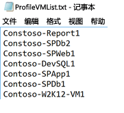

####开始分析
创建要分析的 VM 列表后，可在分析模式下运行该工具。 下面是在分析模式下运行该工具所要提供的必需和可选参数列表。 [] 中的参数是可选的。

ASRDeploymentPlanner.exe -Operation StartProfiling /?

| 参数名称 | 说明 |
|---|---|
| -Operation |      StartProfiling |
| -Server | 要分析其虚拟机的 vCenter 服务器/ESXi 主机的完全限定域名或 IP 地址。|
| -User | 用于连接到 vCenter 服务器/ESXi 主机的用户名。 该用户至少需要拥有只读访问权限。|
| -VMListFile |    包含要分析的虚拟机列表的文件。 文件路径可以是绝对或相对路径。 此文件应该每行包含一个虚拟机名称/IP 地址。 该文件中指定的虚拟机名称应与 vCenter 服务器或 ESXi 主机上的 VM 名称相同。   例如：文件“VMList.txt”包含以下虚拟机： virtual_machine_A  10.150.29.110 virtual_machine_B |
| -NoOfDaysToProfile | 运行分析的天数。 建议运行分析 15 天以上，确保观察环境中在指定时间段内的工作负荷模式，并使用这些结果来提供准确的建议 |
| [-Directory] |    用于存储在分析期间生成的分析数据的 UNC 或本地目录路径。 如果未指定，将使用当前路径下名为“ProfiledData”的目录作为默认目录。 |
| [-Password ] | 用于连接到 vCenter 服务器/ESXi 主机的密码。 如果暂时未指定，则在执行命令时，系统会提示你指定。|
|  [-StorageAccountName]  | Azure 存储帐户名称，用于确定在将数据从本地复制到 Azure 时可实现的吞吐量。 该工具会将测试数据上载到此存储帐户来计算吞吐量。|
| [-StorageAccountKey] | 用于访问存储帐户的 Azure 存储帐户密钥。 转到 Azure 门户 >“存储帐户”> [存储帐户名称] >“设置”>“访问密钥”>“密钥&1; (或经典存储帐户的主访问密钥)”。 |

建议至少分析虚拟机 15 到 30 天。 在分析过程中，ASRDeploymentPlanner.exe 将保持运行。 该工具将取以天为单位的分析时间输入。 如果想要分析几小时或几分钟以便快速测试该工具，在公共预览版中，需要将时间转换为等效的天数。  例如，若要分析 30 分钟，输入需是 30 / (60*24) = 0.021 天。  允许的最短分析时间为 30 分钟。

在分析期间，可以选择性地传递 Azure 存储帐户名称和密钥，确定在从配置服务器/进程服务器复制到 Azure 时，Azure Site Recovery 可实现的吞吐量。 如果在分析期间不传递 Azure 存储帐户名称和密钥，该工具不会计算可实现的吞吐量。

可以针对不同的虚拟机集运行该工具的多个实例。 确保不要在任何分析集中重复使用虚拟机名称。 例如，你已分析&10; 个虚拟机 (VM1-VM10)，过几天后，你又想要分析另外&5; 个虚拟机 (VM11-VM15)，那么，可以通过另一个命令行控制台针对第二组虚拟机 (VM11-VM15) 运行该工具。 但是，请确保第二组虚拟机不包含第一个分析实例中的任何虚拟机名称，或者，请为第二次运行使用不同的输出目录。 如果使用该工具的两个实例分析相同的虚拟机并使用相同的输出目录，生成的报告将不准确。

虚拟机配置将在分析操作开始时捕获一次，存储在名为 VMDetailList.xml 的文件中。 生成报告时将使用此信息。 不会捕获从分析开始到分析结束期间 VM 配置发生的任何更改（例如，增加的核心、磁盘、NIC 等的数目）。 如果在分析过程中，分析的任何虚拟机发生配置更改，在公共预览版中生成报告时，可通过一种解决方法来获取最新的虚拟机详细信息。   

* 备份“VMdetailList.xml”并从其当前位置删除该文件。
* 生成报告时传递 -User 和 -Password 参数。

分析命令将在分析目录中生成多个文件 - 请不要删除这些文件，否则会影响报告生成。

#####示例 1：分析虚拟机 30 天，确定从本地到 Azure 的吞吐量
ASRDeploymentPlanner.exe **-Operation** StartProfiling -Directory “E:\vCenter1_ProfiledData” **-Server** vCenter1.contoso.com **-VMListFile** “E:\vCenter1_ProfiledData\ProfileVMList1.txt”  **-NoOfDaysToProfile**  30  **-User** vCenterUser1 **-StorageAccountName**  asrspfarm1 **-StorageAccountKey** Eby8vdM02xNOcqFlqUwJPLlmEtlCDXJ1OUzFT50uSRZ6IFsuFq2UVErCz4I6tq/K1SZFPTOtr/KBHBeksoGMGw==

#####示例 2：分析虚拟机 15 天
ASRDeploymentPlanner.exe **-Operation** StartProfiling **-Directory** “E:\vCenter1_ProfiledData” **-Server** vCenter1.contoso.com **-VMListFile** “E:\vCenter1_ProfiledData\ProfileVMList1.txt”  **-NoOfDaysToProfile**  15  -User vCenterUser1

#####示例 3：分析虚拟机 1 小时以快速测试工具
ASRDeploymentPlanner.exe **-Operation** StartProfiling **-Directory** “E:\vCenter1_ProfiledData” **-Server** vCenter1.contoso.com **-VMListFile** “E:\vCenter1_ProfiledData\ProfileVMList1.txt”  **-NoOfDaysToProfile**  0.04  **-User** vCenterUser1

>[!NOTE]
>
> * 如果运行该工具的服务器重启或崩溃，或者你使用 Ctrl + C 退出该工具，分析的数据将会保存。 在这种情况下，过去 15 分钟的分析数据可能会丢失。 服务器开始备份后，你需要以分析模式重新运行该工具。
>
> * 如果传递了 Azure 存储帐户名称和密钥，该工具将在执行最后一个分析步骤时测量吞吐量。 如果在分析正常完成之前终止该工具，则不会计算吞吐量。 始终可以通过命令行控制台运行 GetThroughput 操作，在生成报告之前确定吞吐量，否则，生成的报告不包含实现的吞吐量信息。
>

##生成报告
该工具以报告输出的形式生成 XLSM（启用宏的 Microsoft Excel 文件），其中汇总了所有的部署建议 – 报告名为 DeploymentPlannerReport_<Unique Numeric Identifier>.xlsm，放置在指定的目录中。

完成分析后，可在报告生成模式下运行该工具。 下面是在报告生成模式下运行该工具所要提供的必需和可选参数列表。 [] 中的参数是可选的。

ASRDeploymentPlanner.exe -Operation GenerateReport /?

|参数名称 | 说明 |
|-|-|
| -Operation | GenerateReport |
| -Server |  要生成其报告的已分析虚拟机所在的 vCenter/vSphere 服务器完全限定域名或 IP 地址（使用分析时所用的完全相同的名称或 IP 地址）。 请注意，如果在分析时使用了 vCenter 服务器，则不能使用 vSphere 服务器来生成报告，反之亦然。|
| -VMListFile | 包含要为其生成报告的已分析虚拟机列表的文件。 文件路径可以是绝对或相对路径。 此文件应该每行包含一个虚拟机名称/IP 地址。 该文件中指定的虚拟机名称应与 vCenter 服务器或 ESXi 主机上的虚拟机名称相同，并与分析时使用的名称匹配。|
| [-Directory] | 分析的数据（在分析期间生成的文件）存储到的 UNC 或本地目录路径。 需要使用此数据来生成报告。 如果未指定，将使用“ProfiledData”目录。 |
| [-GoalToCompleteIR] |    小时数，需在此时间段内完成已分析虚拟机的初始复制。 生成的报告将提供在指定的时间内可完成初始复制的虚拟机数。 默认值为 72 小时。 |
| [-User] | 用于连接到 vCenter/vSphere 服务器的用户名。 用于获取要在报告中使用的最新虚拟机配置信息，例如磁盘数、核心数、NIC 数，等等。 如果未提供，将使用开始分析时收集的配置信息。 |
| [-Password] | 用于连接到 vCenter 服务器/ESXi 主机的密码。 如果未作为参数指定，则稍后在执行命令时，系统会提示你指定。 |
| [-DesiredRPO] | 以分钟为单位的所需恢复点目标 (RPO)。 默认值为 15 分钟。|
| [-Bandwidth] | 以 Mbps 为单位的带宽。 用于计算指定的带宽可实现的 RPO。 |
| [-StartDate]  | 采用 MM-DD-YYYY:HH:MM（24 小时制）格式的开始日期和时间。 “StartDate”需与“EndDate”一起指定。 如果指定，将会根据从 StartDate 到 EndDate 收集的分析数据生成报告。 |
| [-EndDate] | 采用 MM-DD-YYYY:HH:MM（24 小时制）格式的结束日期和时间。 “EndDate”需与“StartDate”一起指定。 如果指定，将会根据从 StartDate 到 EndDate 收集的分析数据生成报告。 |
| [-GrowthFactor] |以百分比表示的增长系数。 默认值为 30%。  |

##### 示例 1：当分析的数据位于本地驱动器上时，使用默认值生成报告
ASRDeploymentPlanner.exe **-Operation** GenerateReport **-Server** vCenter1.contoso.com **-Directory** “E:\vCenter1_ProfiledData” **-VMListFile** “E:\vCenter1_ProfiledData\ProfileVMList1.txt”

##### 示例 2：当分析的数据位于远程服务器上时生成报告。 用户应该对远程目录拥有读/写访问权限。
ASRDeploymentPlanner.exe **-Operation** GenerateReport **-Server** vCenter1.contoso.com **-Directory** “\\PS1-W2K12R2\vCenter1_ProfiledData” **-VMListFile** “\\PS1-W2K12R2\vCenter1_ProfiledData\ProfileVMList1.txt”

##### 示例 3：生成报告来列出在指定时间内完成 IR 所需的特定带宽以及需要实现的目标
ASRDeploymentPlanner.exe **-Operation** GenerateReport **-Server** vCenter1.contoso.com **-Directory** “E:\vCenter1_ProfiledData” **-VMListFile** “E:\vCenter1_ProfiledData\ProfileVMList1.txt” **-Bandwidth** 100 **-GoalToCompleteIR** 24

##### 示例 4：使用 5% 的增长系数而不是默认值 30% 来生成报告
ASRDeploymentPlanner.exe **-Operation** GenerateReport **-Server** vCenter1.contoso.com **-Directory** “E:\vCenter1_ProfiledData” **-VMListFile** “E:\vCenter1_ProfiledData\ProfileVMList1.txt” **-GrowthFactor** 5

##### 示例 5：使用分析数据的子集生成报告。 假设有 30 天的分析数据，但只想要生成 20 天的报告。
ASRDeploymentPlanner.exe **-Operation** GenerateReport **-Server** vCenter1.contoso.com **-Directory** “E:\vCenter1_ProfiledData” **-VMListFile** “E:\vCenter1_ProfiledData\ProfileVMList1.txt” **-StartDate**  01-10-2017:12:30 -**EndDate** 01-19-2017:12:30

##### 示例 6：生成 5 分钟 RPO 报告。
ASRDeploymentPlanner.exe **-Operation** GenerateReport **-Server** vCenter1.contoso.com **-Directory** “E:\vCenter1_ProfiledData” **-VMListFile** “E:\vCenter1_ProfiledData\ProfileVMList1.txt”  **-DesiredRPO** 5

### 用于计算的百分位值
**在生成报告时，将使用分析期间收集的性能指标的哪个默认百分位值？**

该工具默认使用分析所有 VM 期间收集的读/写 IOPS、写入 IOPS 和数据变动量的第 95 百分位值。 这可以确保不要使用由于暂时性事件（例如，每天运行备份作业一次、定期数据库索引或分析报告生成活动，或者在分析期间发生的其他类似时间点短期生存事件）而在 VM 上出现的第 100 百分位峰值来确定目标 Azure 存储和源带宽要求。 使用第 95 百分位值可以反映真实的工作负荷特征，使这些工作负荷在 Microsoft Azure 中运行时提供最佳性能。 我们不希望经常更改此数字，但是，若要选择更低的值（例如第 90 百分位），可在默认文件夹中更新并保存此配置文件“ASRDeploymentPlanner.exe.config”，针对现有的分析数据生成新报告。

        &lsaquo;add key="WriteIOPSPercentile" value="95" /&rsaquo;>      
        &lsaquo;add key="ReadWriteIOPSPercentile" value="95" /&rsaquo;>      
        &lsaquo;add key="DataChurnPercentile" value="95" /&rsaquo;

### 增长系数
**在规划部署时为何要考虑增长系数？**

假设使用量在一段时间内可能会增多，则考虑工作负荷特征的增长就至关重要。 这是因为，如果受保护的工作负荷特征发生更改，目前在不禁用再重新启用保护的情况下，无法切换到不同的 Azure 存储帐户来提供保护。 例如 如果虚拟机目前（例如在三个月时间内）适合标准存储复制帐户，但由于虚拟机上运行的应用程序的用户数增加（例如，由于 VM 变动率增大），需要将它转移到高级存储，使 Azure Site Recovery 复制能够跟上更高的新变动率，那么，就必须为高级存储帐户禁用再重新启用保护。 因此，我们强烈建议在规划部署时针对增长率（默认值为 30%）做好计划。 你对自己的应用程序使用模式和增长预测了解得最充分，生成报告时可以相应地更改此数字。 事实上，可以使用相同的分析数据根据不同的增长系数生成多份报告，确定哪些目标 Azure 存储和源带宽建议最适合自己。

生成的 Microsoft Excel 报告包含以下工作表

* [输入](site-recovery-deployment-planner.md#input)
* [建议](site-recovery-deployment-planner.md#recommendations-with-desired-rpo-as-input)
* [建议 - 带宽输入](site-recovery-deployment-planner.md#recommendations-with-available-bandwidth-as-input)
* [VM<->存储位置](site-recovery-deployment-planner.md#vm-storage-placement)
* [兼容的 VM](site-recovery-deployment-planner.md#compatible-vms)
* [不兼容的 VM](site-recovery-deployment-planner.md#incompatible-vms)

##获取吞吐量
若要估算从本地复制到 Azure 期间 Azure Site Recovery 可实现的吞吐量，请在 GetThroughput 模式下运行该工具。 该工具将计算其运行所在的服务器（最好是根据配置服务器大小指南配置的服务器）的吞吐量。  如果已在本地部署 Azure Site Recovery 基础结构组件，请在配置服务器上运行该工具。

打开命令行控制台，转到 ASR 部署规划工具文件夹。  结合以下参数运行 ASRDeploymentPlanner.exe。 [] 中的参数是可选的。

ASRDeploymentPlanner.exe -Operation GetThroughput /?

|参数名称 | 说明 |
|-|-|
| -operation | GetThroughput |
| [-Directory] | 分析的数据（在分析期间生成的文件）存储到的 UNC 或本地目录路径。 需要使用此数据来生成报告。 如果未指定，将使用“ProfiledData”目录。  |
| -StorageAccountName | Azure 存储帐户名称，用于确定在将数据从本地复制到 Azure 时消耗的带宽。 该工具会将测试数据上载到此存储帐户来确定消耗的带宽。 |
| -StorageAccountKey | 用于访问存储帐户的 Azure 存储帐户密钥。 转到 Azure 门户 >“存储帐户”> [存储帐户名称] >“设置”>“访问密钥”>“密钥&1; (或经典存储帐户的主访问密钥)”。 |
| -VMListFile | 包含计算消耗带宽时要分析的虚拟机列表的文件。 文件路径可以是绝对或相对路径。 此文件应该每行包含一个虚拟机名称/IP 地址。 该文件中指定的虚拟机名称应与 vCenter 服务器或 ESXi 主机上的虚拟机名称相同。 例如 文件“VMList.txt”包含以下虚拟机： virtual machine_A  10.150.29.110 virtual machine_B|

该工具将在指定的目录中创建多个 64 MB 的“asrvhdfile<#>.vhd”文件（其中的 # 是编写）。  它会将这些文件上载到 Azure 存储帐户来确定吞吐量。 测出吞吐量后，它会从 Azure 存储帐户和本地服务器中删除所有这些文件。 如果在计算吞吐量时出于任何原因中途终止该工具，它不会从 Azure 存储或本地服务器中删除这些文件，你需要手动删除它们。

吞吐量是根据给定时间点测量的，也是在其他所有系数保持相同的前提下，Azure Site Recovery 可实现的最大吞吐量。 例如，如果任何应用程序在相同的网络中开始消耗更多的带宽，则在复制期间实际吞吐量会有所变化。 如果从配置服务器运行 GetThroughput 命令，该工具无法识别任何受保护的虚拟机和正在进行的复制。 当受保护虚拟机的数据变动量较高或较低时，如果同时运行 GetThroughput 操作，测得的吞吐量结果将会不同。  建议在分析期间的不同时间点运行该工具，了解在不同的时间可实现的吞吐量。 在报告中，该工具将显示最后一个测得的吞吐量。

##### 示例
ASRDeploymentPlanner.exe **-Operation** GetThroughput **-Directory**  E:\vCenter1_ProfiledData **-VMListFile** E:\vCenter1_ProfiledData\ProfileVMList1.txt  **-StorageAccountName**  asrspfarm1 **-StorageAccountKey** by8vdM02xNOcqFlqUwJPLlmEtlCDXJ1OUzFT50uSRZ6IFsuFq2UVErCz4I6tq/K1SZFPTOtr/KBHBeksoGMGw==

>[!NOTE]
>
> * 在与配置服务器具有相同存储和 CPU 特征的服务器上运行该工具
>
> * 对于复制，请预配建议的带宽来满足 100% 时间 RPO。 如果即使预配了适当的带宽，工具报告的实现吞吐量也没有任何增长，请检查以下信息：
>
> a. 检查是否有任何网络服务质量 (QoS) 了限制 Azure Site Recovery 吞吐量
>
> b. 检查 Azure Site Recovery 保管库是否在最靠近受支持 Microsoft Azure 区域的物理位置，以尽量降低网络延迟
>
> c. 检查本地存储特征，尽力改进硬件（例如，将 HDD 更换为 SSD，等等。）
>
> d.单击“下一步”。 更改进程服务器中的 Azure Site Recovery 设置，[增大用于复制的网络带宽量](./site-recovery-plan-capacity-vmware.md#control-network-bandwidth)。
>

##用作输入的所需 RPO 建议

###分析的数据

**分析的数据时间段**是分析的运行持续时间。 默认情况下，该工具使用所有分析数据进行计算，除非在生成报告期间使用 StartDate 和 EndDate 选项生成特定时间段的报告。

**服务器名称**是要为其生成虚拟机报告的 VMware vCenter 或 ESXi 主机的名称或 IP 地址。

**所需 RPO** 是部署的恢复点目标 (RPO)。 默认情况下，所需网络带宽是根据 RPO 值 15、30 和 60 分钟计算的。 根据所做的选择，受影响的值将在工作表中更新。 如果生成报告时使用了 DesiredRPOinMin 参数，该值将显示在此“所需 RPO”下拉列表中。

###分析概述

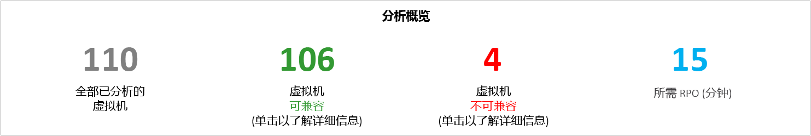

**分析的虚拟机总数**是提供了其分析数据的虚拟机总数。 如果 VMListFile 中包含未分析的任何虚拟机的名称，则生成报告时不会考虑这些虚拟机，并且会将其从分析的虚拟机总数中排除。

**兼容的虚拟机**是可以使用 Azure Site Recovery 在 Azure 中保护的虚拟机数。 它是计算了所需网络带宽、Azure 存储帐户数、Microsoft Azure 核心数和配置服务器与其他进程服务器数的兼容虚拟机总数。 报告的“兼容的 VM”工作表提供了每个兼容虚拟机的详细信息。

**不兼容的虚拟机**是与 Azure Site Recovery 保护不兼容的已分析虚拟机数。 以下“不兼容的 VM”部分中说明了不兼容性的原因。 如果 VMListFile 中包含未分析的任何虚拟机的名称，将从不兼容的虚拟机计数中排除这些虚拟机。 在“不兼容的 VM”工作表的末尾，这些虚拟机列为“找不到数据”。

**所需 RPO** 是以分钟为单位的所需 RPO。 将会根据三个 RPO 值（15、30 和 60 分钟）生成报告，默认值为 15 分钟。 将会根据在工作表右上方“所需 RPO”下拉列表中所做的选择来更改报告中的带宽建议。 如果结合某个自定义值使用“-DesiredRPO”参数生成了报告，此自定义值将在“所需 RPO”下拉列表中显示为默认值。

###所需的网络带宽 (Mbps)

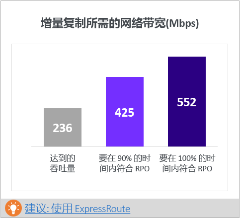

**为了满足 100% 时间 RPO：**建议分配以 Mbps 为单位的带宽来满足 100% 时间所需 RPO。 这种带宽量必须专门用于以稳定状态执行所有兼容虚拟机的增量复制，避免任何 RPO 违规。

**为了满足 90% 时间 RPO：**如果由于宽带价格或其他任何原因而无法预配所需的带宽来满足 100% 时间所需 RPO，可以选择预配更低的但可以满足 90% 时间所需 RPO 的带宽量。 为了帮助用户理解预配这种较低带宽造成的影响，报告中会根据预期发生的 RPO 违规数目和持续时间提供一项假设 (what if) 分析。

**实现的吞吐量：**从运行 GetThroughput 命令的服务器到 Azure 存储帐户所在的 Microsoft Azure 区域的吞吐量。 它表示在配置服务器/进程服务器存储和网络特征与运行该工具的服务器保持相同的前提下，使用 Azure Site Recovery 保护兼容的虚拟机时可实现的大致吞吐量。 实现的吞吐量是从运行 GetThroughput 命令的服务器到 Azure 存储帐户所在的 Microsoft Azure 区域的吞吐量。 它表示在配置服务器/进程服务器存储和网络特征与运行该工具的服务器保持相同的前提下，使用 Azure Site Recovery 保护兼容的虚拟机时可实现的大致吞吐量。

对于复制，应预配建议的带宽来满足 100% 时间 RPO。 如果即使预配了适当的带宽，工具报告的实现吞吐量也没有任何增长，请检查以下信息：

a.在“解决方案资源管理器”中，右键单击项目文件夹下的“引用”文件夹，然后单击“添加引用”。    检查是否有任何网络服务质量 (QoS) 了限制 Azure Site Recovery 吞吐量

b.保留“数据库类型”设置，即设置为“共享”。    检查 Azure Site Recovery 保管库是否在最靠近受支持 Microsoft Azure 区域的物理位置，以尽量降低网络延迟

c.    检查本地存储特征，尽力改进硬件（例如，将 HDD 更换为 SSD，等等。）

d.单击“下一步”。 更改进程服务器中的 Azure Site Recovery 设置，[增大用于复制的网络带宽量](./site-recovery-plan-capacity-vmware.md#control-network-bandwidth)。

如果在已包含受保护虚拟机的配置服务器/进程服务器运行该工具，请多运行几次，因为实现的吞吐量数字会根据该特定时间点处理的改动数据量发生变化。

对于所有 Azure Site Recovery 企业部署，建议使用 [ExpressRoute](https://aka.ms/expressroute)。

###所需的 Azure 存储帐户
此图显示了保护所有兼容虚拟机所需的 Azure 存储帐户（标准和高级）总数。  单击“建议的 VM 放置计划”了解应该对每个虚拟机使用哪个存储帐户。  

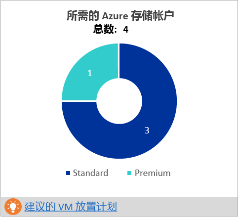

###所需的 Azure 核心数
这是在故障转移或测试故障转移所有兼容的虚拟机之前需要预配的核心总数。 如果订阅中没有足够的核心，在执行测试故障转移或故障转移时，Azure Site Recovery 将无法创建虚拟机。

###所需的本地基础结构
这是配置用于保护所有兼容虚拟机的配置服务器和附加进程服务器总数。 根据最大型配置支持的[限制](https://aka.ms/asr-v2a-on-prem-components) - 每天变动量或者受保护虚拟机的最大数目（假设每个虚拟机平均有三个磁盘），以配置服务器上或附加进程服务器上最先达到的数字为准，该工具将建议配置其他服务器。 在[输入](site-recovery-deployment-planner.md#input)表中可以找到每天总变动量和受保护磁盘总数的详细信息。

###假设分析
此项分析概述如果为所需 RPO 预配较低的带宽来仅满足 90% 的时间，在分析期间可能会发生多少项违规。 在任意给定的日期可能会发生一项或多项违规 - 图中显示了一天的 RPO 峰值。
基于此分析，可以确定在使用指定的较低带宽的条件下，是否可以接受所有日期的 RPO 违规数以及每天的峰值 RPO。 如果可以接受，则可为复制分配较低的带宽，否则，应根据建议分配更高的带宽来满足 100% 时间的所需 RPO。

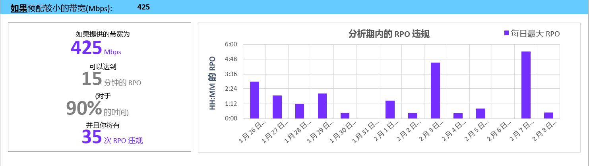

###用于初始复制的建议 VM 批大小
本部分推荐为了使用建议的带宽在 72 小时内（可配置的值 - 在生成报告时使用 GoalToCompleteIR 参数可更改此值）完成初始复制，以满足所预配的 100% 时间所需 RPO 而可以同时保护的虚拟机数。  图中显示了用于根据所有兼容虚拟机上检测到的平均虚拟机大小，在 72 小时内完成初始复制的一系列带宽值和计算出的虚拟机批大小计数。  

在公共预览版中，报告不会指定要在批中包含哪些虚拟机。 可以使用“兼容的 VM”工作表中显示的磁盘大小找出每个虚拟机的大小，为批选择虚拟机，或者根据已知的工作负荷特征选择虚拟机。  初始复制完成时间根据实际虚拟机磁盘大小、已用磁盘空间和可用的网络吞吐量按比例变化。

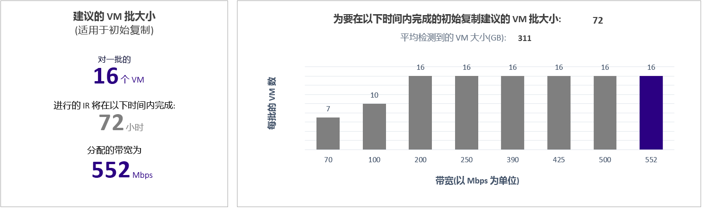

###增长系数和使用的百分位值
工作表底部的部分显示用于已分析虚拟机的所有性能计数器的百分位数（默认为第 95 百分位），以及所有计算中使用的增长系数百分比（默认为 30%）。

##有关用作输入的可用带宽建议

有时，你知道无法为 Azure Site Recovery 复制预配 x Mbps 以上的带宽。 在该工具中可以输入可用带宽（生成报告时使用 --Bandwidth 参数），在短时间内就能获得可实现的 RPO。 使用这个可实现的 RPO 值，可以确定是需要预配额外的带宽，还是可以使用某个灾难恢复解决方案来实现此 RPO。

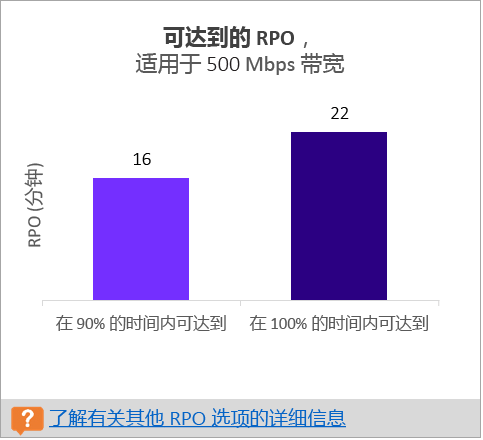

##输入
“输入”页提供分析的 VMware 环境的概述。

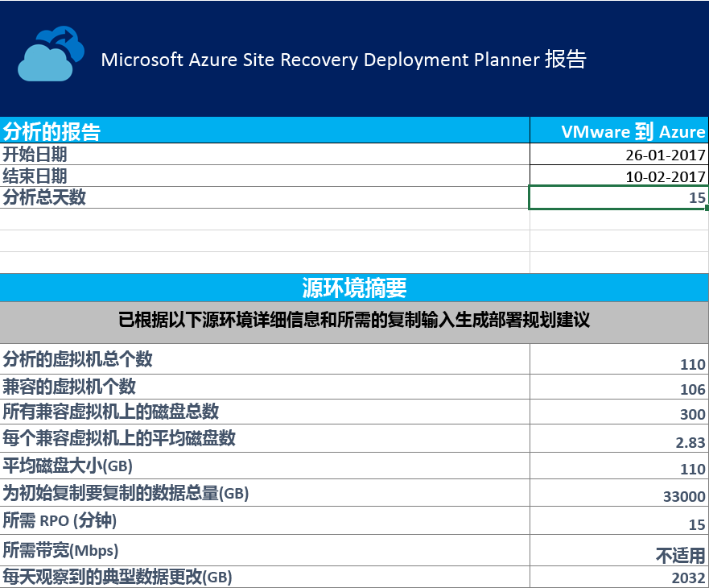

**开始日期和结束日期**是生成报告时要考虑的分析数据的开始和结束日期。 默认情况下，开始日期是开始分析的日期，结束日期是停止分析的日期。  如果结合这些参数生成报告，可以使用“StartDate”和“EndDate”值。 开始日期和结束日期：生成报告时要考虑的分析数据的开始和结束日期。 默认情况下，开始日期是开始分析的日期，结束日期是停止分析的日期。  如果结合这些参数生成报告，可以使用“StartDate”和“EndDate”值。

**分析总天数**是要生成报告的开始和结束日期之间的分析总天数。 分析总天数是要生成报告的开始和结束日期之间的分析总天数。

**兼容的虚拟机数**是计算了所需网络带宽、所需 Azure 存储帐户数、Microsoft Azure 核心数、配置服务器与其他进程服务器数的兼容虚拟机总数。
所有兼容虚拟机上的磁盘总数即为所有兼容虚拟机的磁盘总数。 此数字用作输入之一，确定要在部署中使用的配置服务器和其他进程服务器数目。

**每个兼容虚拟机的平均磁盘数**是根据所有兼容虚拟机计算出的平均磁盘数。

**平均磁盘大小 (GB)** 是根据所有兼容虚拟机计算出的平均磁盘大小。

**所需 RPO (分钟)** 是默认 RPO，或者在生成报告时为了估算所需带宽为“DesiredRPO”参数传递的值。

**所需带宽 (Mbps)** 是在生成报告时为了估算可实现 RPO 为“Bandwidth”参数传递的值。

**每日观察到的典型数据变动量 (GB)** 是在所有分析日期观察到的平均数据变动量。 此数字用作输入之一，确定要在部署中使用的配置服务器和其他进程服务器数目。

##VM-存储位置

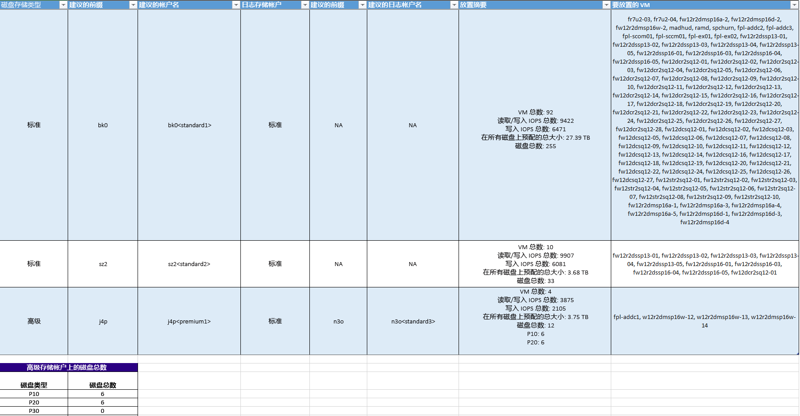

**磁盘存储类型**是用于复制“要放置的 VM”列中所述的所有相应虚拟机的“标准”或“高级”Azure 存储帐户。

**建议的前缀**是建议的三字符前缀，可用于命名 Azure 存储帐户。 始终可以使用自己的前缀，但工具建议遵循 [Azure 存储帐户的分区命名约定](https://aka.ms/storage-performance-checklist)。

**建议的帐户名称**指示在包含建议的前缀后，Azure 存储帐户名称的形式。 请将 < > 中的名称替换为自定义输入。

**日志存储帐户：**所有复制日志存储在标准 Azure 存储帐户中。 对于复制到高级 Azure 存储帐户的虚拟机，需要为日志存储预配一个附加的标准 Azure 存储帐户。 单个标准日志存储帐户可由多个高级复制存储帐户使用。 复制到标准存储帐户的虚拟机为日志使用相同的存储帐户。

**建议的日志帐户名称**指示在包含建议的前缀后，日志 Azure 存储帐户名称的形式。 请将 < > 中的名称替换为自定义输入。

**位置摘要**提供执行复制和测试故障转移/故障转移时，Azure 存储帐户中虚拟机总负载的摘要。 其中包括映射到 Azure 存储帐户的虚拟机总数、放置在此 Azure 存储帐户中的所有虚拟机上发生的读/写 IOPS 总数、写入（复制）IOPS 总数、所有磁盘的总预配大小，以及磁盘总数。

**要放置的虚拟机**列出为了实现最佳性能和利用率，应放置在给定 Azure 存储帐户中的虚拟机。

##兼容的 VM
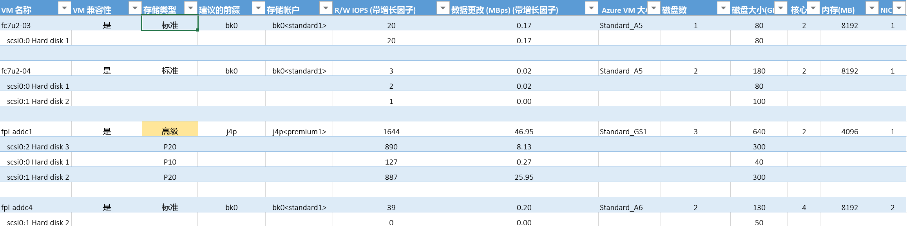

**VM 名称**是生成报告时在 VMListFile 中使用的虚拟机名称或 IP 地址。 此列还列出附加到虚拟机的磁盘 (VMDK)。

**VM 兼容性**包含两个值 - 是/是如果虚拟机适合[高级 Azure 存储](https://aka.ms/premium-storage-workload)，其分析的高变动量/IOPS 磁盘适合 P20 或 P30 类别，但磁盘大小会导致向下映射到 P10 或 P20，则值为“是”。 Azure 存储会根据高级存储磁盘类型的大小将其映射到某个磁盘 – 即，小于 128 GB 的磁盘为 P10，128 到 512 GB 的磁盘为 P20，512 到 1023 GB 的磁盘为 P30。 因此，如果磁盘的工作负荷特征确定了它是 P20 或 P30 磁盘，但其大小将其映射到更低的高级存储磁盘类型，则该工具会将该虚拟机标记为“是*”，并建议更改源磁盘大小来适应建议的适当高级存储磁盘类型，或者在故障转移后更改目标磁盘类型。
存储类型为标准或高级。

**建议的前缀**是由三个字符构成的 Azure 存储帐户前缀

**存储帐户**是使用建议前缀的名称

**读/写 IOPS (包括增长系数)** 是磁盘上的峰值工作负荷 IOPS（默认为第 95 百分位），包括将来的增长系数（默认为 30%）。 请注意，虚拟机的总读/写 IOPS 不一定总是虚拟机各个磁盘的读/写 IOPS 之和，因为虚拟机的峰值读/写 IOPS 是该虚拟机在分析期间每分钟的各个磁盘的读/写 IOPS 之和的峰值。

**以 Mbps 为单位的数据变动量(包括增长系数)** 是磁盘上的峰值变动率（默认为第 95 百分位），包括将来的增长系数（默认为 30%）。 请注意，虚拟机的总数据变动量不一定总是虚拟机各个磁盘的数据变动量之和，因为虚拟机的峰值数据变动量是该虚拟机在分析期间每分钟的各个磁盘变动量之和的峰值。

**Azure VM 大小**是此本地虚拟机的理想映射 Azure 计算虚拟机大小。 这种映射是根据本地虚拟机的内存、磁盘/核心/NIC 数目以及读/写 IOPS 执行的 - 建议是始终使用与所有这些本地虚拟机特征匹配的最小 Azure 虚拟机大小。

**磁盘数**是虚拟机上的磁盘 (VMDK) 总数

**磁盘大小 (GB)** 是虚拟机所有磁盘的总预配大小。 该工具还会显示虚拟机中各个磁盘的磁盘大小。

**核心数**是虚拟机上的 CPU 核心数。

**内存 (MB)** 是虚拟机上的 RAM。

**NIC 数**是虚拟机上的 NIC 数。

##不兼容的 VM

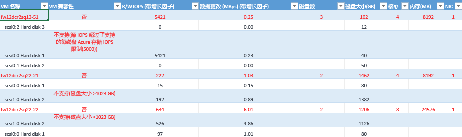

**VM 名称**是生成报告时在 VMListFile 中使用的虚拟机名称或 IP 地址。 此列还列出附加到虚拟机的磁盘 (VMDK)。

**VM 兼容性**指示给定的虚拟机为何无法与 Azure Site Recovery 兼容使用。 原因将根据虚拟机的不兼容磁盘给出，根据发布的 Azure 存储[限制](https://aka.ms/azure-storage-scalbility-performance)，原因可能是下面其中一项。

* 磁盘大小大于 1023 GB – Azure 存储目前不支持大于 1 TB 的磁盘大小
* 总 VM 大小（复制 + TFO）超出了支持的 Azure 存储帐户大小限制 (35 TB) – 如果虚拟机中的单个磁盘的某些性能特征超出了标准存储支持的最大 Microsoft Azure/Azure Site Recovery 限制，从而将虚拟机置于高级存储区域，则往往会发生这种问题。 但是，高级 Azure 存储帐户支持的最大大小为 35 TB，并且无法跨多个存储帐户保护单个受保护的虚拟机。 另请注意，如果在受保护的虚拟机上执行 TFO（测试故障转移），该操作将在正在复制的同一个存储帐户中运行 – 因此，需要预配 2 倍的磁盘大小，才能同时让复制得以进行并成功完成测试故障转移。
* 源 IOPS 超出了每个磁盘支持的 Azure 存储 IOPS 限制，即 5000
* 源 IOPS 超出了每个 VM 支持的 Azure 存储 IOPS 限制，即 80,000
* 平均数据变动量超出了磁盘支持的 Azure Site Recovery 数据变动量限制：平均 IO 大小不能超过 10 MBps
* VM 中所有磁盘的总数据变动量超出了每个 VM 支持的最大 Azure Site Recovery 数据变动量限制，即 54 MBps
* 平均有效写入 IOPS 超出了磁盘支持的 Azure Site Recovery IOPS 限制，即 840
* 计算出的快照存储超出了支持的快照存储限制，即 10 TB

**读/写 IOPS (包括增长系数)** 是磁盘上的峰值工作负荷 IOPS（默认为第 95 百分位），包括将来的增长系数（默认为 30%）。 请注意，虚拟机的总读/写 IOPS 不一定总是虚拟机各个磁盘的读/写 IOPS 之和，因为虚拟机的峰值读/写 IOPS 是该虚拟机在分析期间每分钟的各个磁盘的读/写 IOPS 之和的峰值。

**以 Mbps 为单位的数据变动量(包括增长系数)** 是磁盘上的峰值变动率（默认为第 95 百分位），包括将来的增长系数（默认为 30%）。 请注意，虚拟机的总数据变动量不一定总是虚拟机各个磁盘的数据变动量之和，因为虚拟机的峰值数据变动量是该虚拟机在分析期间每分钟的各个磁盘变动量之和的峰值。

**磁盘数**是虚拟机上的磁盘 (VMDK) 总数

**磁盘大小 (GB)** 是虚拟机所有磁盘的总预配大小。 该工具还会显示虚拟机中各个磁盘的磁盘大小。

**核心数**是虚拟机上的 CPU 核心数。

**内存 (MB)** 是虚拟机上的 RAM。

**NIC 数**是虚拟机上的 NIC 数。

##Azure Site Recovery 限制

**复制存储目标** | **平均源磁盘 I/O 大小** |**平均源磁盘数据变动量** | **每天的总源磁盘数据变动量**
---|---|---|---
标准存储 | 8 KB    | 2 MB/秒 | 每个磁盘&168; GB
高级 P10 磁盘 | 8 KB    | 2 MB/秒 | 每个磁盘&168; GB
高级 P10 磁盘 | 16 KB | 4 MB/秒 |    每个磁盘&336; GB
高级 P10 磁盘 | 32 KB 或更高 | 8 MB/秒 | 每个磁盘&672; GB
高级 P20/P30 磁盘 | 8 KB    | 5 MB/秒 | 每个磁盘&421; GB
高级 P20/P30 磁盘 | 16 KB 或更高 |10 MB/秒    | 每个磁盘&842; GB

这是在假设存在 30% 的 IO 重叠的情况下给出的平均数。 Azure Site Recovery 能够根据重叠率、较大的写入大小和实际工作负荷 I/O 行为处理更高的吞吐量。 上述数字假设典型积压大约为 5 分钟，即，上载数据后，将在 5 分钟内处理数据并创建恢复点。

上面发布的限制基于我们的测试，但无法涵盖所有可能的应用程序 I/O 组合。 实际结果根据应用程序 I/O 的混合形式而异。 为获得最佳结果，我们始终建议使用测试故障转移执行广泛的应用程序测试，获取真实的性能视图，即使在规划部署后，也应如此。

##发行说明
Azure Site Recovery Deployment Planner 公共预览版 1.0 存在以下已知问题，以后的更新将解决这些问题。

* 该工具仅适用于 VMware 到 Azure 的方案，而不适用 Hyper-V 到 Azure 的部署。 对于 Hyper-V 到 Azure 的方案，可以使用 [Hyper-V Capacity Planner 工具](./site-recovery-capacity-planning-for-hyper-v-replication.md)。
* 美国政府和 Microsoft Azure 中国区域不支持 GetThroughput 操作。
* 如果 vCenter 中有两个或更多个虚拟机跨不同的 ESXi 主机使用相同的名称/IP 地址，该工具将无法分析虚拟机。 在此版本，该工具将跳过 VMListFile 中重复虚拟机名称/IP 地址的分析。 解决方法是使用 ESXi 主机而不是 vCenter 服务器分析虚拟机。 需要针对每个 ESXi 主机运行一个实例。

