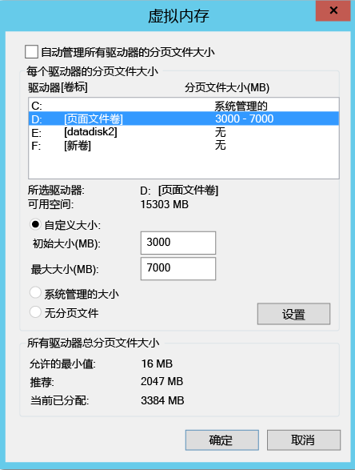
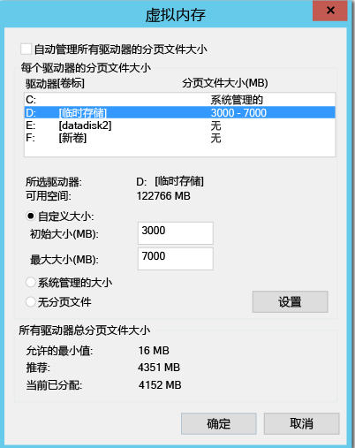
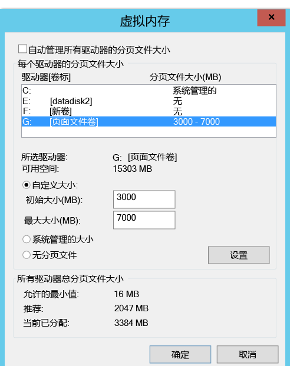
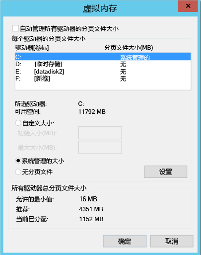

#从复制中排除磁盘
本文介绍如何从复制中排除磁盘，以优化消耗的复制带宽或优化此类磁盘利用的目标端资源。 VMware 到 Azure 方案和 Hyper-V 到 Azure 方案支持该功能。

##先决条件

默认情况下，将复制计算机上的所有磁盘。 若要从复制中排除某个磁盘，则在从 **VMware 复制到 Azure** 的情况下，必须在启用复制前，手动在计算机上安装移动服务

## 为何要从复制中排除磁盘？
从复制中排除磁盘通常因以下原因而有必要：

1. 排除的磁盘上改动的数据不重要或不需要复制。

2. 不复制此改动可节省存储和网络资源。

##有哪些典型方案？
有一些可轻松识别的特定数据改动示例，它们是绝佳的排除候选对象，例如，任何页面文件写入、Microsoft SQL Server tempdb 写入等。页面文件可登记大量改动，具体取决于工作负荷和存储子系统。 但是，从主站点将此数据复制到 Azure 会占用大量资源。 因此，对于单个虚拟磁盘上同时拥有 OS 和页面文件的 VM，可通过以下方式优化复制：

1. 将单个虚拟磁盘拆分为两个虚拟磁盘：一个用于 OS，一个用于页面文件
2. 从复制中排除页面文件磁盘

同样，对于同一磁盘上拥有 tempdb 和系统数据库文件的 Microsoft SQL Server，可通过提下方式优化复制：

1. 在两个不同的磁盘上保存系统数据库和 tempdb
2. 从复制中排除 tempdb 磁盘。

##如何从复制中排除磁盘？

###VMware 到 Azure
遵照[启用复制](site-recovery-vmware-to-azure.md#enable-replication)工作流，通过 Azure Site Recovery 门户保护 VM。 在“启用复制”的第 4 步中，有一个“要复制的磁盘”列，可用于从复制项中排除磁盘。 默认情况下，选择所有磁盘。 取消选择想要从复制项中排除的磁盘，并完成启用复制的步骤。 

    
    
>[!NOTE]
> 
> * 只能排除已安装移动服务的磁盘。 需要手动安装移动服务，因为启用复制后，只能使用推送机制安装移动服务。
> * 只能从复制中排除基本磁盘。 不能排除 OS 磁盘或动态磁盘。
> * 启用复制后，无法添加或删除要复制的磁盘。 如果想要添加或排除磁盘，需要禁用计算机保护，然后重新启用保护。
> * 如果某个应用程序需要有排除的磁盘才能正常运行，则故障转移到 Azure 后，需要在 Azure 中手动创建该磁盘，以便复制的应用程序可以运行。 或者，可以将 Azure 自动化集成到恢复计划中，以便在故障转移计算机期间创建磁盘。
> * Windows VM：在 Azure 中手动创建的磁盘不会执行故障回复。 例如，如果在 Azure VM 中故障转移三个磁盘并直接创建两个磁盘，则只会故障回复完成故障转移的三个磁盘。 不能包括在故障回复过程中或从本地到 Azure 的反向保护过程中手动创建的磁盘。
> * Linux VM：在 Azure 中手动创建的磁盘会执行故障回复。 例如，如果要故障转移三个磁盘，并直接在 Azure 中创建两个磁盘，则会故障回复所有五个磁盘。 无法从故障回复中排除手动创建的磁盘。
> 

###Hyper-V 到 Azure
按照[启用复制](site-recovery-hyper-v-site-to-azure.md#step-6-enable-replication)工作流，通过 Azure Site Recovery 门户保护 VM。 在“启用复制”的第 4 步中，有一个“要复制的磁盘”列，可用于从复制项中排除磁盘。 默认情况下，选择所有磁盘进行复制。 取消选择想要从复制项中排除的磁盘，并完成启用复制的步骤。 

    
>[!NOTE]
> 
> * 只能从复制中排除基本磁盘。 不能排除 OS 磁盘，也不建议排除动态磁盘。 ASR 无法识别来宾 VM 中哪些 VHD 磁盘是基本磁盘或动态磁盘。  如果未排除所有依赖性动态卷磁盘，则会将受保护的动态磁盘视为故障转移 VM 上的故障磁盘，该磁盘上的数据无法访问。    
> * 启用复制后，无法添加或删除要复制的磁盘。 如果想要添加或排除磁盘，需要禁用 VM 保护，然后重启保护。
> * 如果某个应用程序需要有排除的磁盘才能正常运行，则故障转移到 Azure 之后，需要在 Azure 中手动创建该磁盘，以便复制的应用程序可以运行。 或者，可以将 Azure 自动化集成到恢复计划中，以便在故障转移计算机期间创建磁盘。
> * 在 Azure 中手动创建的磁盘不会执行故障回复。 例如，如果对三个磁盘进行故障转移，并直接在 Azure VM 中创建两个磁盘，只会对那三个已故障转移的磁盘进行从 Azure 到 Hyper-V 的故障回复。 在故障回复中或从 Hyper-V 到 Azure 的反向复制中，不能包括手动创建的磁盘。
 

##排除磁盘的端到端方案
让我们假设两个方案，以便更好地了解排除磁盘功能。

1. SQL Server tempdb 磁盘
2. 页面文件磁盘

###排除 SQL Server tempdb 磁盘
假设有一台拥有可被排除的 tempdb 的 SQL Server 虚拟机。

VM 名称：源 VM 上的 SalesDB 磁盘：

**磁盘名称** | **来宾 OS 磁盘编号** | **驱动器号** | **磁盘上的数据类型**
--- | --- | --- | ---
DB-Disk0-OS | DISK0 | C:\ | 操作系统磁盘
DB-Disk1| Disk1 | D:\ | SQL 系统数据库和用户数据库&1;
DB Disk2（已从保护中排除该磁盘） | Disk2 | E:\ | 临时文件
DB-Disk3（已从保护中排除该磁盘） | Disk3 | F:\ | SQL tempdb 数据库（文件夹路径 (F:\MSSQL\Data\)）--> 在故障转移前记下该文件夹路径
DB-Disk4 | Disk4 |G:\ |用户数据库&2;

由于 VM 的两个磁盘上的数据改动是临时性的，在保护 SalesDB VM 时，从复制中排除“Disk2”和“Disk3”。 Azure Site Recovery 不会复制这些磁盘，且在故障转移时，这些磁盘不会在 Azure 上的故障转移 VM 上出现

故障转移后 Azure VM 上的磁盘：

**来宾 OS 磁盘编号** | **驱动器号** | **磁盘上的数据类型**
--- | --- | ---
DISK0 |    C:\ | 操作系统磁盘
Disk1 |    E:\ | 临时存储 [Azure 添加此磁盘并分配第一个可用的驱动器号]
Disk2 | D:\ | SQL 系统数据库和用户数据库&1;
Disk3 | G:\ | 用户数据库&2;

由于从 SalesDB VM 中排除了 Disk2 和 Disk3，E: 是可用列表中的第一个驱动器号。 Azure 将 E: 分配给临时存储卷。 对于所有复制的磁盘，驱动器号保持不变。

Disk3 是 SQL tempdb 磁盘（tempdb 文件夹路径 F:\MSSQL\Data\) 并从复制中被排除，该磁盘在故障转移 VM 上不可用。 因此，SQL 服务处于停止状态并需要 F:\MSSQL\Data 路径。

有两种方法可用于创建此路径。

1. 添加新磁盘并分配 tempdb 文件夹路径，或
2. 使用现有临时存储磁盘作为 tempdb 文件夹路径

####添加新磁盘：

1. 在故障转移前，记下 SQL tempdb.mdf 和 tempdb.ldf 路径。
2. 在 Azure 门户中，将新磁盘添加到与源 SQL tempdb 磁盘 (Disk3) 具有相同大小或具有更大大小的故障转移 VM。
3. 登录 Azure VM。 在磁盘管理 (diskmgmt.msc) 控制台中，初始化并格式化新添加的磁盘。
4. 分配与 SQL tempdb 磁盘 (F:) 所用驱动器号相同的驱动器号。
5. 在 F: 卷上创建 tempdb 文件夹 (F:\MSSQL\Data)。
6. 从服务控制台启动 SQL 服务。

####使用现有临时存储磁盘作为 SQL tempdb 文件夹路径：

1. 打开命令行控制台
2. 通过命令行控制台在恢复模式下运行 SQL Server

        Net start MSSQLSERVER /f / T3608

3. 运行以下 sqlcmd，将 tempdb 路径更改为新路径

        sqlcmd -A -S SalesDB        **Use your SQL DBname**
        USE master;        
        GO        
        ALTER DATABASE tempdb        
        MODIFY FILE (NAME = tempdev, FILENAME = 'E:\MSSQL\tempdata\tempdb.mdf');
        GO        
        ALTER DATABASE tempdb        
        MODIFY FILE (NAME = templog, FILENAME = 'E:\MSSQL\tempdata\templog.ldf');        
        GO

4. 停止 Microsoft SQL Server 服务。

        Net stop MSSQLSERVER
5. 启动 Microsoft SQL Server 服务。

        Net start MSSQLSERVER

请参阅以下有关临时存储磁盘的 Azure 指南

* 在 Azure VM 中使用 SSD 来存储 SQL Server TempDB 和缓冲池扩展
* Azure 虚拟机中 SQL Server 的性能最佳实践

###故障回复（从 Azure 到本地）
现在，让我们一起了解从 Azure 故障转移到本地 VMware 或 Hyper-V 主机时，会复制哪些磁盘。 不会复制在 Azure 中手动创建的磁盘。 例如，如果直接在 Azure VM 中故障转移三个磁盘并创建两个，则只会将进行过故障转移的三个磁盘故障回复。 不能包括在故障回复过程中或从本地到 Azure 的反向保护过程中手动创建的磁盘， 也不会将临时存储磁盘复制到本地。

####故障回复到原始位置恢复 (OLR)

在上述示例中，Azure VM 磁盘配置为：

**来宾 OS 磁盘编号** | **驱动器号** | **磁盘上的数据类型** 
--- | --- | --- 
DISK0 | C:\ | 操作系统磁盘
Disk1 |    E:\ | 临时存储 [Azure 添加此磁盘并分配第一个可用的驱动器号]
Disk2 |    D:\ | SQL 系统数据库和用户数据库&1;
Disk3 |    G:\ | 用户数据库&2;

####VMware 到 Azure
故障回复到原始位置后，故障回复 VM 磁盘配置中不包含排除的磁盘。 这意味着从 VMware 故障回复到 Azure 时排除的磁盘在故障回复 VM 中不可用。 

完成从 Azure 到本地 VMware 的计划故障转移后，VMWare VM（原始位置）上的磁盘：

**来宾 OS 磁盘编号** | **驱动器号** | **磁盘上的数据类型** 
--- | --- | --- 
DISK0 | C:\ | 操作系统磁盘
Disk1 |    D:\ | SQL 系统数据库和用户数据库&1;
Disk2 |    G:\ | 用户数据库&2;

####Hyper-V 到 Azure
故障回复到原始位置后，故障回复 VM 磁盘配置与 Hyper-V 的原始 VM 磁盘配置仍然一样。 这意味着从 Hyper-V 站点故障回复到 Azure 时排除的磁盘在故障回复 VM 中可用。

完成从 Azure 到本地 Hyper-V 的计划故障转移后，Hyper-V VM（原始位置）上的磁盘：

**磁盘名称** | **来宾 OS 磁盘编号** | **驱动器号** | **磁盘上的数据类型**
--- | --- | --- | ---
DB-Disk0-OS | DISK0 |    C:\ | 操作系统磁盘
DB-Disk1 | Disk1 | D:\ | SQL 系统数据库和用户数据库&1;
DB Disk2（排除的磁盘） | Disk2 | E:\ | 临时文件
DB-Disk3（排除的磁盘） | Disk3 | F:\ | SQL tempdb 数据库（文件夹路径 (F:\MSSQL\Data\)）
DB-Disk4 | Disk4 | G:\ | 用户数据库&2;

####排除页面文件磁盘

假设有一台拥有可被排除的页面文件磁盘的虚拟机。
存在两种情况：

####情况 1：在 D: 驱动器上配置页面文件
磁盘配置：

**磁盘名称** | **来宾 OS 磁盘编号** | **驱动器号** | **磁盘上的数据类型**
--- | --- | --- | ---
DB-Disk0-OS | DISK0 | C:\ | 操作系统磁盘
DB-Disk1（已从保护中排除该磁盘） | Disk1 | D:\ | pagefile.sys
DB-Disk2 | Disk2 | E:\ | 用户数据 1
DB-Disk3 | Disk3 | F:\ | 用户数据 2

源 VM 上的页面文件设置：

    

从 VMware 将 VM 故障转移到 Azure 后，或从 Hyper-V 将 VM 故障转移到 Azure 后，Azure VM 上的磁盘：
**磁盘名称** | **来宾 OS 磁盘编号** | **驱动器号** | **磁盘上的数据类型**
--- | --- | --- | ---
DB-Disk0-OS | DISK0 | C:\ | 操作系统磁盘
DB-Disk1 | Disk1 | D:\ | 临时存储 –> pagefile.sys
DB-Disk2 | Disk2 | E:\ | 用户数据 1
DB-Disk3 | Disk3 | F:\ | 用户数据 2

由于已排除 Disk1 (D:)，D: 是可用列表上的第一个驱动器号，Azure 将 D: 分配给临时存储卷。  由于 D: 在 Azure VM 上可用，VM 的页面文件设置保持不变。

Azure VM 上的页面文件设置：

####情况 2：在任何其他驱动器（D: 以外的驱动器）上配置页面文件

源 VM 磁盘配置：

**磁盘名称** | **来宾 OS 磁盘编号** | **驱动器号** | **磁盘上的数据类型**
--- | --- | --- | ---
DB-Disk0-OS | DISK0 | C:\ | 操作系统磁盘
DB-Disk1（已从保护中排除该磁盘） | Disk1 | G:\ | pagefile.sys
DB-Disk2 | Disk2 | E:\ | 用户数据 1
DB-Disk3 | Disk3 | F:\ | 用户数据 2

本地 VM 上的页面文件设置：

从 VMware/Hyper-V 将 VM 故障转移到 Azure 后，Azure VM 上的磁盘：

**磁盘名称**| **来宾 OS 磁盘编号**| **驱动器号** | **磁盘上的数据类型**
--- | --- | --- | ---
DB-Disk0-OS | DISK0  |C:\ |操作系统磁盘
DB-Disk1 | Disk1 | D:\ | 临时存储 –> pagefile.sys
DB-Disk2 | Disk2 | E:\ | 用户数据 1
DB-Disk3 | Disk3 | F:\ | 用户数据 2

由于 D: 是可用列表上的第一个驱动器号，Azure 将 D: 分配给临时存储卷。 对于所有复制的磁盘，驱动器号保持不变。 由于 G: 磁盘不可用，系统会为页面文件使用 C: 驱动器。

Azure VM 上的页面文件设置：

## 后续步骤
设置并运行部署后，请 [详细了解](site-recovery-failover.md) 不同类型的故障转移。

