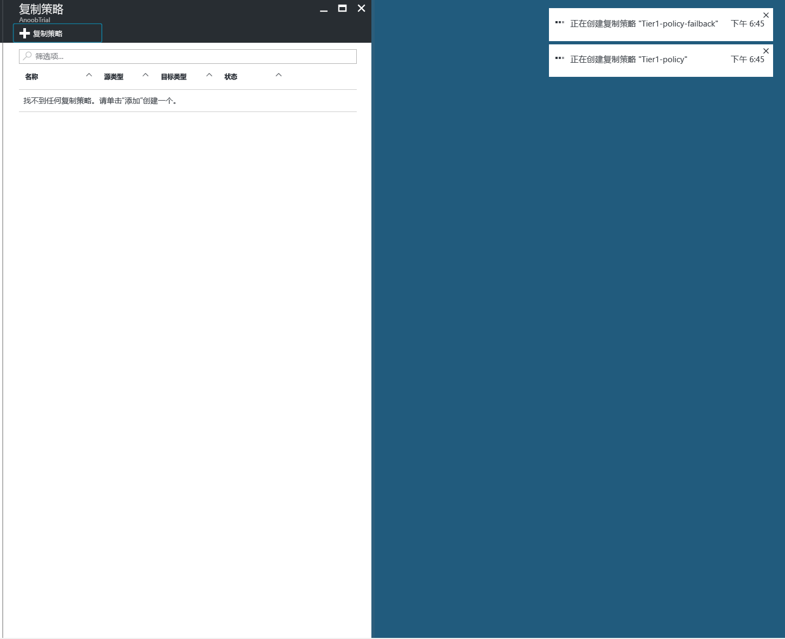
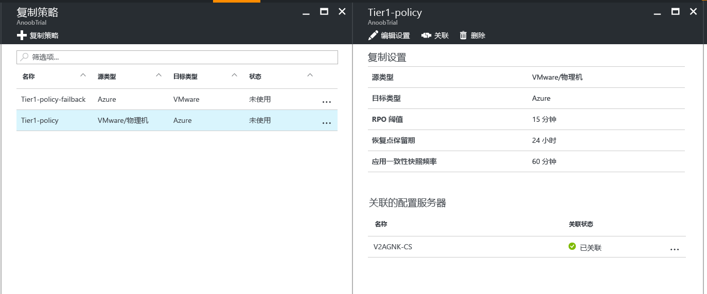
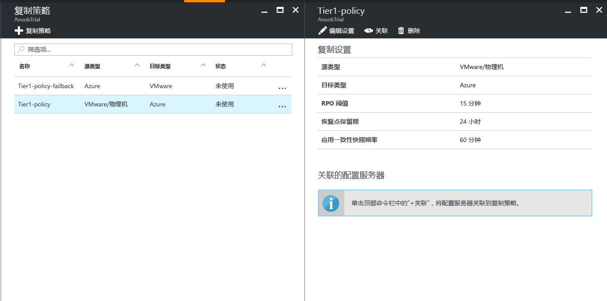
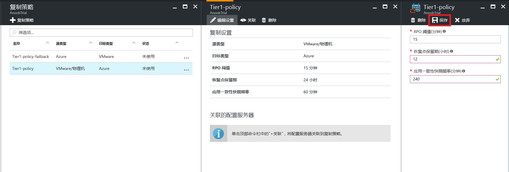

# 管理从 VMware 复制到 Azure 的复制策略

## 创建复制策略

1. 选择“管理” > “Site Recovery 基础结构”。
2. 在“适用于 VMware 和物理机”中选择“复制策略”。
3. 选择“+ 复制策略”。

    

4. 输入策略名称。

5. 在“RPO 阈值”中：指定 RPO 限制。 当连续复制超出此限制时，将生成警报。
6. 在“恢复点保留期”中，针对每个恢复点指定保留期的时长（以小时为单位）。 受保护的计算机可以恢复到某个保留期时段内的任意时间点。

    > [!NOTE]
    > 复制到高级存储的计算机最长支持 24 小时的保留期。 复制到标准存储的计算机最长支持 72 小时的保留期。

    > [!NOTE]
    > 会自动创建故障回复的复制策略。

7. 在“应用一致性快照频率”中，指定创建包含应用程序一致性快照的恢复点的频率（以分钟为单位）。

8. 单击“确定”。 应会在 30 秒到 1 分钟之内创建好策略。

## 将配置服务器与复制策略关联
1. 选择要与配置服务器关联的复制策略。
2. 单击“关联”。

3. 从服务器列表中选择配置服务器。
4. 单击“确定”。 应会在 1 到 2 分钟内关联配置服务器。

## 编辑复制策略
1. 选择要编辑其复制设置的复制策略。

2. 单击“编辑设置”。

3. 根据需要更改设置。
4. 单击“ **保存**”。 应在 2 到 5 分钟内保存策略，具体取决于正在使用该复制策略的 VM 数量。

## 从复制策略取消关联配置服务器
1. 选择要与配置服务器关联的复制策略。
2. 单击“取消关联”。
3. 从服务器列表中选择配置服务器。
4. 单击“确定”。 应会在 1 到 2 分钟内取消关联配置服务器。

    > [!NOTE]
    > 如果至少有一个复制项正在使用该策略，则无法取消关联配置服务器。 在取消关联配置服务器前，请确保没有复制项正在使用该策略。

## 删除复制策略

1. 选择要删除的复制策略。
2. 单击“删除” 。 应会在 30 秒到 1 分钟之内删除策略。

    > [!NOTE]
    > 如果至少有 1 台配置服务器与某个复制策略关联，则无法删除该策略。 在删除策略前，请确保没有复制项正在使用该策略，并删除所有关联的配置服务器。
