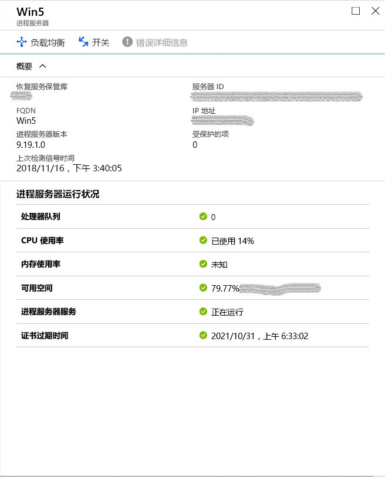
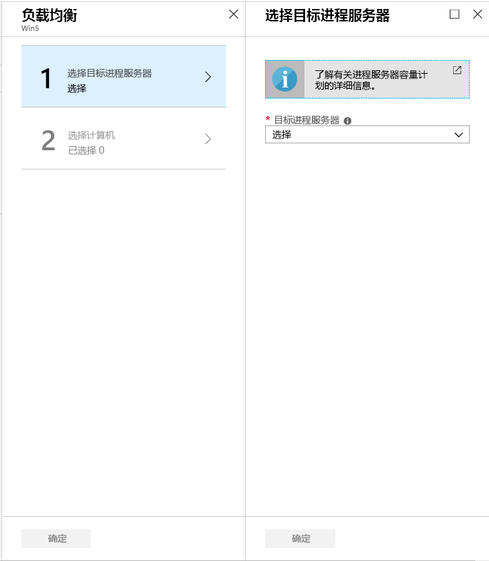
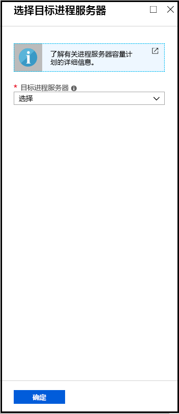

# <a name="manage-process-servers"></a>管理进程服务器

本文介绍管理 Site Recovery 进程服务器的常见任务。

进程服务器用于接收、优化复制数据并将其发送到 Azure。 它还在要复制的 VMware Vm 和物理服务器上执行移动服务的推送安装，并执行本地计算机的自动发现。 若要将本地 VMware Vm 或物理服务器复制到 Azure，则默认情况下会在配置服务器计算机上安装进程服务器。 

- 对于大型部署，可能需要使用额外的本地进程服务器来扩展容量。
- 若要从 Azure 故障回复到本地，必须在 Azure 中设置临时进程服务器。 故障回复完成后，可以删除此 VM。 

了解有关进程服务器的详细信息。


## <a name="upgrade-a-process-server"></a>升级进程服务器

当你在本地部署进程服务器，或作为 Azure VM 进行故障回复时，将安装最新版本的进程服务器。 Site Recovery 团队会定期发布修补程序和增强功能，因此我们建议你使进程服务器保持最新。 您可以按如下所示升级进程服务器：

[!INCLUDE [site-recovery-vmware-upgrade -process-server](../../includes/site-recovery-vmware-upgrade-process-server-internal.md)]


## <a name="move-vms-to-balance-the-process-server-load"></a>移动 Vm 以平衡进程服务器负载

通过在两个进程服务器之间移动 Vm 来平衡负载，如下所示：

1. 在保管库中的 "**管理**" 下，单击 " **Site Recovery 基础结构**"。 在 "**适用于 VMware & 物理计算机**" 下，单击 "**配置服务器**"。
2. 单击注册了进程服务器的配置服务器。
3. 单击要对流量进行负载平衡的进程服务器。

    

4. 单击 "**负载均衡**"，选择要将计算机移动到的目标进程服务器。 然后单击 **"确定"**

    

2. 单击 "**选择计算机**"，然后选择要从当前移动到目标进程服务器的计算机。 针对每个虚拟机显示平均数据更改的详细信息。 然后单击“确定”。 
3. 在保管库中，监视**监视** > **Site Recovery 作业**的作业进度。

需要大约15分钟的时间才能在门户中反映更改。 为了获得更快的效果，请[刷新配置服务器](vmware-azure-manage-configuration-server.md#refresh-configuration-server)。

## <a name="switch-an-entire-workload-to-another-process-server"></a>将整个工作负荷切换到另一个进程服务器

将进程服务器处理的整个工作负荷移动到不同的进程服务器，如下所示：

1. 在保管库中的 "**管理**" 下，单击 " **Site Recovery 基础结构**"。 在 "**适用于 VMware & 物理计算机**" 下，单击 "**配置服务器**"。
2. 单击注册了进程服务器的配置服务器。
3. 单击要从中切换工作负荷的进程服务器。
4. 单击 "**切换**"，选择要将工作负荷移动到的目标进程服务器。 然后单击 **"确定"**

    

5. 在保管库中，监视**监视** > **Site Recovery 作业**的作业进度。

需要大约15分钟的时间才能在门户中反映更改。 为了获得更快的效果，请[刷新配置服务器](vmware-azure-manage-configuration-server.md#refresh-configuration-server)。

## <a name="register-a-master-target-server"></a>注册主目标服务器

主目标服务器驻留在配置服务器和横向扩展进程服务器上。 它必须向配置服务器注册。 如果此注册中出现故障，则可能会影响受保护项的运行状况。 若要将主目标服务器注册到配置服务器，请登录到需要注册的特定配置服务器/横向扩展进程服务器。 导航到 " **%PROGRAMDATA%\ASR\Agent**" 文件夹，并在管理员命令提示符下运行以下命令。

   ```
   cmd
   cdpcli.exe --registermt

   net stop obengine

   net start obengine

   exit
   ```

## <a name="reregister-a-process-server"></a>重新注册进程服务器

使用配置服务器重新注册在本地或 Azure VM 上运行的进程服务器，如下所示：

[!INCLUDE [site-recovery-vmware-register-process-server](../../includes/site-recovery-vmware-register-process-server.md)]

保存设置后，请执行以下操作：

1. 在进程服务器上，打开管理员命令提示符。
2. 浏览到文件夹 **%PROGRAMDATA%\ASR\Agent**，并运行以下命令：

    ```
    cdpcli.exe --registermt
    net stop obengine
    net start obengine
    ```

## <a name="modify-proxy-settings-for-an-on-premises-process-server"></a>修改本地进程服务器的代理设置

如果本地进程服务器使用代理连接到 Azure，则可以修改代理设置，如下所示：

1. 登录到进程服务器计算机。 
2. 打开管理员 PowerShell 命令窗口并运行以下命令：
   ```powershell
   $pwd = ConvertTo-SecureString -String MyProxyUserPassword
   Set-OBMachineSetting -ProxyServer http://myproxyserver.domain.com -ProxyPort PortNumber –ProxyUserName domain\username -ProxyPassword $pwd
   net stop obengine
   net start obengine
   ```
2. 浏览到文件夹 **%PROGRAMDATA%\ASR\Agent**，并运行以下命令：
   ```
   cmd
   cdpcli.exe --registermt

   net stop obengine

   net start obengine

   exit
   ```

## <a name="remove-a-process-server"></a>删除进程服务器

[!INCLUDE [site-recovery-vmware-unregister-process-server](../../includes/site-recovery-vmware-unregister-process-server.md)]

## <a name="exclude-folders-from-anti-virus-software"></a>从防病毒软件中排除文件夹

如果防病毒软件正在横向扩展进程服务器（或主目标服务器）上运行，请从防病毒操作中排除以下文件夹：


- C:\Program Files\Microsoft Azure Recovery Services Agent
- C:\ProgramData\ASR
- C:\ProgramData\ASRLogs
- C:\ProgramData\ASRSetupLogs
- C:\ProgramData\LogUploadServiceLogs
- C:\ProgramData\Microsoft Azure Site Recovery
- 进程服务器安装目录。 例如： C:\Program Files （x86） \Microsoft Azure Site Recovery