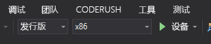

# 快速入门：在 C++/WinRT 和 DirectX 中使用 Azure 空间定位点创建 HoloLens 应用

此快速指南介绍如何在 C++/WinRT 和 DirectX 中使用 [Azure 空间定位点](../overview.md)创建 HoloLens 应用。 Azure 空间定位点是一种跨平台开发人员服务。通过该服务，可以使用能够随时间推移跨设备保存自己位置的对象创建混合的现实体验。 完成后，将获得一个 HoloLens 应用，该应用可以保存和重新调用空间定位点。

将了解如何执行以下操作：

> [!div class="checklist"]
> * 创建空间定位点帐户
> * 配置空间定位点帐户标识符和帐户密钥
> * 在 HoloLens 设备上部署和运行

[!INCLUDE [quickstarts-free-trial-note](../../../includes/quickstarts-free-trial-note.md)]

## 必备条件

若要完成本快速入门，请确保具备以下项：
- 安装了包含“通用 Windows 平台开发”  工作负荷和“Windows 10 SDK (10.0.18362.0 或更高版本)”  组件的 <a href="https://www.visualstudio.com/downloads/" target="_blank">Visual Studio 2019</a> 的 Windows 计算机。 还必须安装 <a href="https://git-scm.com/download/win" target="_blank">Git for Windows</a> 和 <a href="https://git-lfs.github.com/">Git LFS</a>。
- 适用于 Visual Studio 的 [C++/WinRT Visual Studio 扩展 (VSIX)](https://aka.ms/cppwinrt/vsix) 应从 [Visual Studio Marketplace](https://marketplace.visualstudio.com/) 安装。
- 启用了[开发人员模式](https://docs.microsoft.com/windows/mixed-reality/using-visual-studio)的 HoloLens 设备。 本文需要包含 [Windows 2018 年 10 月 10 日更新](https://docs.microsoft.com/windows/mixed-reality/release-notes-october-2018 )（也称为 RS5）的 HoloLens 设备。 要在 HoloLens 上更新为最新版本，请打开“设置”应用，转到“更新和安全”，然后选择“检查更新”按钮    。
- 应用必须在其 AppX 清单中设置 spatialPerception  功能。

[!INCLUDE [Create Spatial Anchors resource](../../../includes/spatial-anchors-get-started-create-resource.md)]

## 打开示例项目

[!INCLUDE [Clone Sample Repo](../../../includes/spatial-anchors-clone-sample-repository.md)]

在 Visual Studio 中打开 `HoloLens\DirectX\SampleHoloLens.sln`。

## 配置帐户标识符和密钥

下一步是将应用程序配置为使用帐户标识符和帐户密钥。 在[设置空间定位点资源](#create-a-spatial-anchors-resource)时，将它们复制到文本编辑器中。

打开 `HoloLens\DirectX\SampleHoloLens\ViewController.cpp`。

找到 `SpatialAnchorsAccountKey` 字段并将 `Set me` 替换为帐户密钥。

找到 `SpatialAnchorsAccountId` 字段并将 `Set me` 替换为帐户标识符。

## 将应用部署到 HoloLens

将“解决方案配置”更改为“发布”，将“解决方案平台”更改为 x86，并从部署目标选项中选择“设备”      。

如果使用 HoloLens 2，请使用“ARM64”作为“解决方案平台”，而不是“x86”    。

打开 HoloLens 设备，登录并使用 USB 电缆将其连接到电脑。

选择“调试” > “开始调试”以部署应用并开始调试   。

按照应用中的说明，放置并重新调用定位点。

在 Visual Studio 中，通过选择“停止调试”或按“Shift+F5”停止应用   。

[!INCLUDE [Clean-up section](../../../includes/clean-up-section-portal.md)]

[!INCLUDE [Next steps](../../../includes/spatial-anchors-quickstarts-nextsteps.md)]

> [!div class="nextstepaction"]
> [教程：跨设备共享空间定位点](../tutorials/tutorial-share-anchors-across-devices.md)
