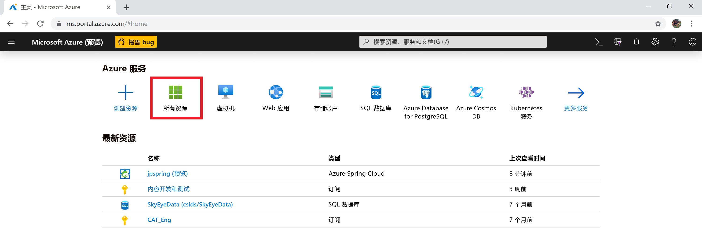
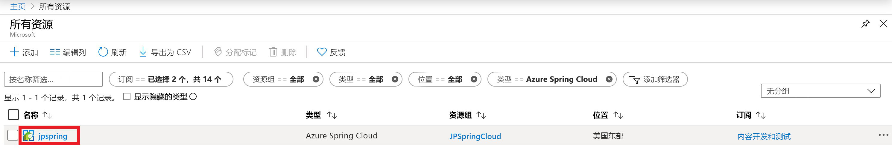
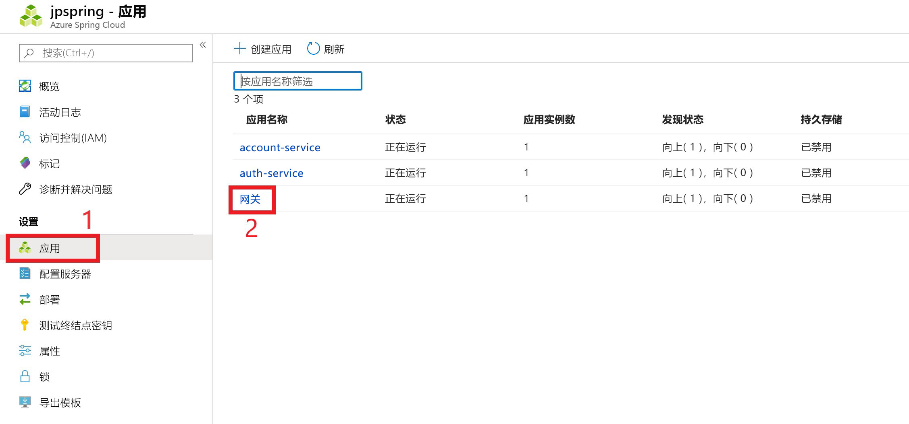
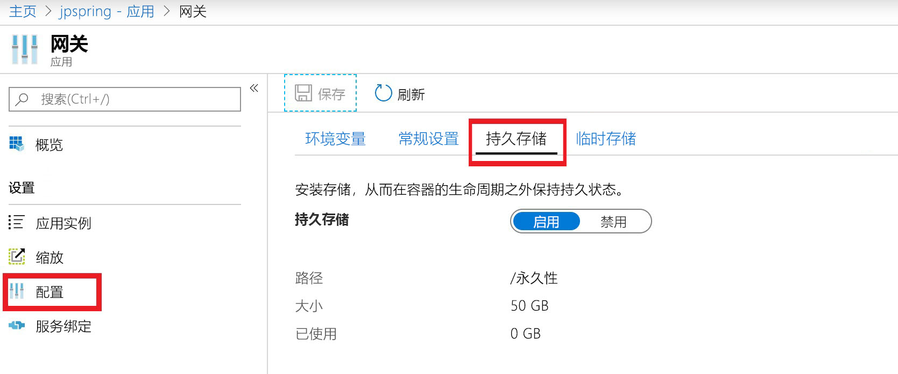

# <a name="how-to-use-persistent-storage-in-azure-spring-cloud"></a>如何在 Azure 春季云中使用永久性存储

Azure 春季云为应用程序提供了两种类型的存储：持久的和临时的。  默认情况下，Azure 春季 Cloud 为每个应用程序实例启用临时存储。 临时存储限制为5GB，默认装载路径为： `/tmp`。

> [!WARNING]
> 重新启动应用程序实例会永久删除其关联的临时存储。

持久性存储是由 Azure 分配的、每个应用程序所管理的文件共享容器。 持久存储中存储的数据在应用程序的所有实例中共享。 Azure 春季云服务实例最多可以有10个启用了持久性磁盘的应用程序。 每个应用程序都接收50GB 的持久存储。 持久存储的默认装入路径是 `/persistent`。

> [!WARNING]
> *禁用*持久性存储将释放该应用程序的存储。  该存储帐户中的所有数据都将丢失。 

## <a name="enable-persistent-storage-using-the-azure-portal"></a>使用 Azure 门户启用持久存储

1. 在 Azure 门户的主屏幕中，选择 "**所有资源**"。

     >

1. 查找并选择需要永久存储的 Azure 春季云资源。  在此示例中，应用程序名为*jpspring*。

    > 

1. 在 "**设置**" 标题下，选择 "**应用**"。

1. 春季云服务将出现在表中。  选择要将持久存储添加到的服务。  在此示例中，我们将选择我们的**网关**服务。

    > 

1. 从服务的配置边栏选项卡中选择 "**配置**"

1. 选择 "**永久存储**" 选项卡，并启用持久存储。

    > 

启用持久性存储时，此页上将显示其大小和路径。

## <a name="use-the-azure-cli-to-modify-persistent-storage"></a>使用 Azure CLI 修改持久性存储

如有必要，请为 Azure CLI 安装春季云扩展：

```azurecli
az extension add --name spring-cloud
```

创建启用了永久性磁盘的应用：
 
```azurecli
az spring-cloud app create -n <app> -g <resource-group> -s <service-name> --enable-persistent-storage true
```

在现有应用中启用持久性存储：

```azurecli
az spring-cloud app update -n <app> -g <resource-group> -s <service-name> --enable-persistent-storage true
``` 

在现有应用中禁用持久性存储：

> [!WARNING]
> 禁用持久性存储将释放该应用程序的存储，永久丢失存储在此处的所有数据。 

```azurecli
az spring-cloud app update -n <app> -g <resource-group> -s <service-name> --enable-persistent-storage false
```

## <a name="next-steps"></a>后续步骤

了解[应用程序和服务配额](spring-cloud-quotas.md)，或了解如何[手动缩放应用程序](spring-cloud-tutorial-scale-manual.md)。