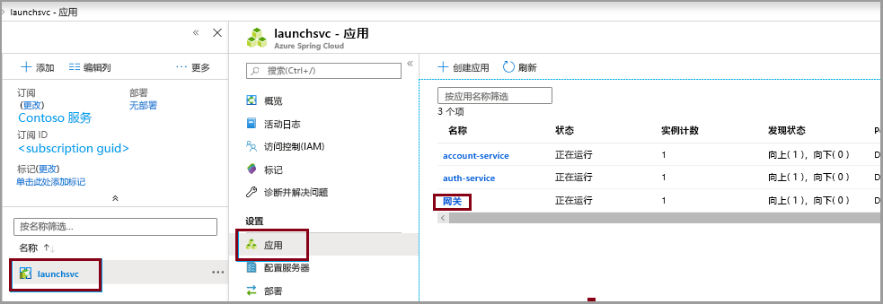
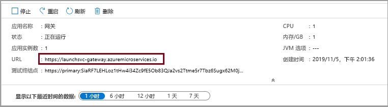

# <a name="quickstart-launch-a-java-spring-application-using-the-azure-cli"></a>快速入门：使用 Azure CLI 启动 Java Spring 应用程序

使用 Azure Spring Cloud 可以在 Azure 上轻松运行基于 Spring Boot 的微服务应用程序。

本快速入门介绍如何将现有的 Java Spring Cloud 应用程序部署到 Azure。 完成后，可以继续通过 Azure CLI 管理应用程序，或者改用 Azure 门户。

本快速入门介绍如何执行以下操作：

> [!div class="checklist"]
> * 预配服务实例
> * 为实例设置配置服务器
> * 在本地构建微服务应用程序
> * 部署每个微服务
> * 为应用程序分配公共终结点

## <a name="prerequisites"></a>必备条件

>[!Note]
> Azure Spring Cloud 目前以公共预览版的形式提供。 使用公共预览版产品/服务，客户可以在产品/服务正式发布之前体验新功能。  公共预览功能和服务并非供生产使用。  有关预览期间支持的详细信息，请参阅[常见问题解答](https://azure.microsoft.com/support/faq/)或提交[支持请求](https://docs.microsoft.com/azure/azure-portal/supportability/how-to-create-azure-support-request)。

>[!TIP]
> Azure Cloud Shell 是免费的交互式 shell，可以使用它运行本文中的步骤。  它预装有常用的 Azure 工具，其中包括最新版的 Git、JDK、Maven 和 Azure CLI。 如果你已登录到 Azure 订阅，请从 shell.azure.com 启动 [Azure Cloud Shell](https://shell.azure.com)。  若要详细了解 Azure Cloud Shell，请[阅读我们的文档](../cloud-shell/overview.md)

完成本快速入门教程需要：

1. [安装 Git](https://git-scm.com/)
2. [安装 JDK 8](https://docs.microsoft.com/java/azure/jdk/?view=azure-java-stable)
3. [安装 Maven 3.0 或更高版本](https://maven.apache.org/download.cgi)
4. [安装 Azure CLI 2.0.67 或更高版本](https://docs.microsoft.com/cli/azure/install-azure-cli?view=azure-cli-latest)
5. [注册 Azure 订阅](https://azure.microsoft.com/free/)

## <a name="install-the-azure-cli-extension"></a>安装 Azure CLI 扩展

使用以下命令安装用于 Azure CLI 的 Azure Spring Cloud 扩展

```azurecli
az extension add --name spring-cloud
```

## <a name="provision-a-service-instance-on-the-azure-cli"></a>在 Azure CLI 中预配服务实例

1. 登录到 Azure CLI 并选择你的有效订阅。 请务必选择已列入 Azure Spring Cloud 允许列表的有效订阅

    ```azurecli
        az login
        az account list -o table
        az account set --subscription
    ```

2. 准备 Azure Spring Cloud 服务的名称。  该名称必须为 4 到 32 个字符，只能包含小写字母、数字及连字符。  服务名称的第一个字符必须是字母，最后一个字符必须是字母或数字。

3. 创建用于包含 Azure Spring Cloud 服务的资源组。

    ```azurecli
        az group create --location eastus --name <resource group name>
    ```
    详细了解 [Azure 资源组](../azure-resource-manager/management/overview.md)。

4. 打开 Azure CLI 窗口，运行以下命令预配 Azure Spring Cloud 的实例。

    ```azurecli
        az spring-cloud create -n <service name> -g <resource group name>
    ```

    部署服务实例需要大约五分钟时间。

5. 使用以下命令设置默认的资源组名称和群集名称：

    ```azurecli
        az configure --defaults group=<service group name>
        az configure --defaults spring-cloud=<service instance name>
    ```

> [!div class="nextstepaction"]
> [我遇到了问题](https://www.research.net/r/javae2e?tutorial=asc-cli-quickstart&step=provision)

## <a name="setup-your-configuration-server"></a>设置配置服务器

使用项目的 git 存储库的位置更新配置服务器：

```git
az spring-cloud config-server git set -n <your-service-name> --uri https://github.com/Azure-Samples/piggymetrics --label config
```

> [!div class="nextstepaction"]
> [我遇到了问题](https://www.research.net/r/javae2e?tutorial=asc-cli-quickstart&step=config-server)

## <a name="build-the-microservices-applications-locally"></a>在本地构建微服务应用程序

1. 创建一个新文件夹，并将示例应用存储库克隆到你的 Azure 云帐户。  

    ```azurecli
        mkdir source-code
        git clone https://github.com/Azure-Samples/piggymetrics
    ```

2. 更改目录并生成项目。

    ```azurecli
        cd piggymetrics
        mvn clean package -D skipTests
    ```

编译项目大约需要 5 分钟时间。  完成后，相应的文件夹中应会包含每个服务的各个 JAR 文件。

## <a name="create-the-microservices"></a>创建微服务

使用上一步骤中生成的 JAR 文件创建 Spring Cloud 微服务。 将创建三个微服务：**gateway**、**auth-service** 和 **account-service**。

```azurecli
az spring-cloud app create --name gateway
az spring-cloud app create --name auth-service
az spring-cloud app create --name account-service
```

## <a name="deploy-applications-and-set-environment-variables"></a>部署应用程序并设置环境变量

我们需要将应用程序实际部署到 Azure。 使用以下命令部署所有三个应用程序：

```azurecli
az spring-cloud app deploy -n gateway --jar-path ./gateway/target/gateway.jar
az spring-cloud app deploy -n account-service --jar-path ./account-service/target/account-service.jar
az spring-cloud app deploy -n auth-service --jar-path ./auth-service/target/auth-service.jar
```

> [!div class="nextstepaction"]
> [我遇到了问题](https://www.research.net/r/javae2e?tutorial=asc-cli-quickstart&step=deploy)

## <a name="assign-public-endpoint-to-gateway"></a>将公共终结点分配到网关

我们需要在 Web 浏览器通过某种方式来访问该应用程序。 网关应用程序需要一个面向公众的终结点，可以使用以下命令来分配该终结点：

```azurecli
az spring-cloud app update -n gateway --is-public true
```

最后，查询 **gateway** 应用程序的公共 IP，以便可以验证该应用程序是否正在运行：

```azurecli
az spring-cloud app show --name gateway | grep url
```

导航到上一个命令提供的 URL，以运行 PiggyMetrics 应用程序。
    

还可以导航 Azure 门户以查找 URL。 
1. 导航到服务
1. 选择“应用” 
1. 选择“网关” 

    
1. 在“网关概述”  页上查找 URL 

> [!div class="nextstepaction"]
> [我遇到了问题](https://www.research.net/r/javae2e?tutorial=asc-cli-quickstart&step=public-endpoint)

## <a name="next-steps"></a>后续步骤

在本快速入门中，你已通过 Azure CLI 部署一个 Spring Cloud 应用程序。  若要详细了解 Azure Spring Cloud，请继续学习相关教程，了解如何对应用进行部署准备。

> [!div class="nextstepaction"]
> [准备好要部署的 Azure Spring Cloud 应用程序](spring-cloud-tutorial-prepare-app-deployment.md)

GitHub 中提供了更多示例：[Azure Spring Cloud 示例](https://github.com/Azure-Samples/Azure-Spring-Cloud-Samples/tree/master/service-binding-cosmosdb-sql)。
